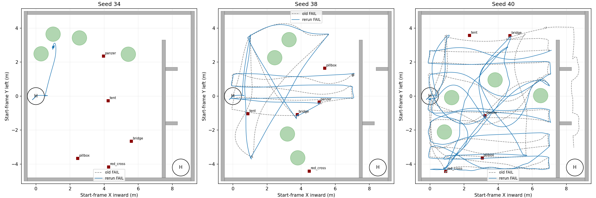
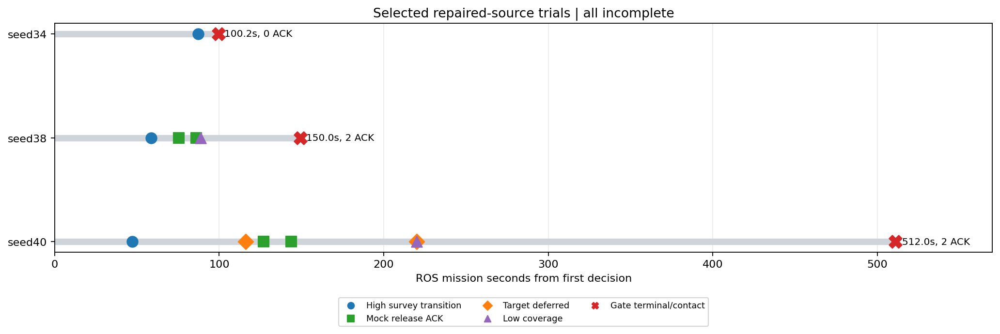
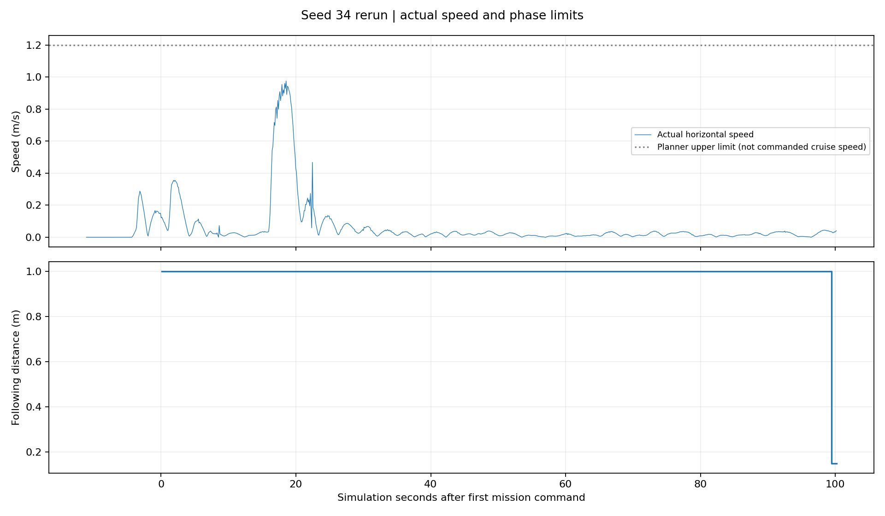
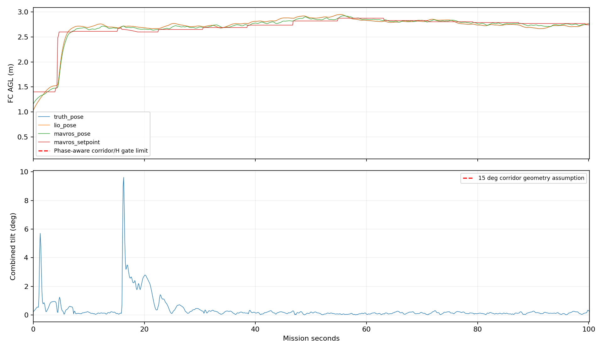
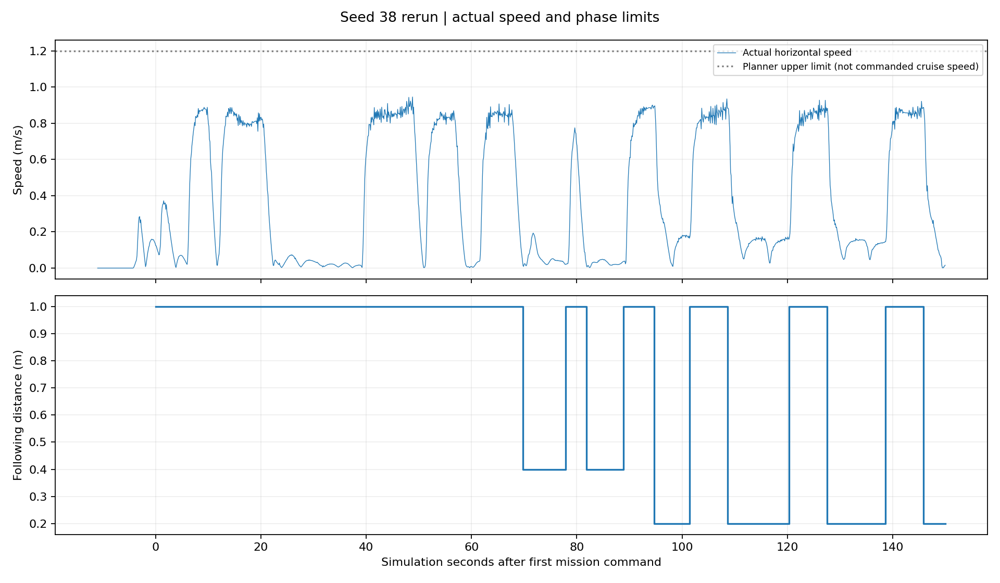
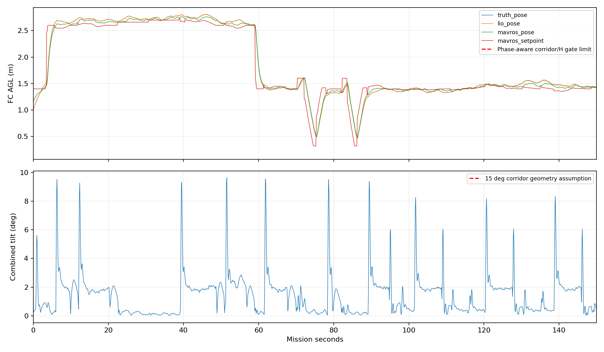
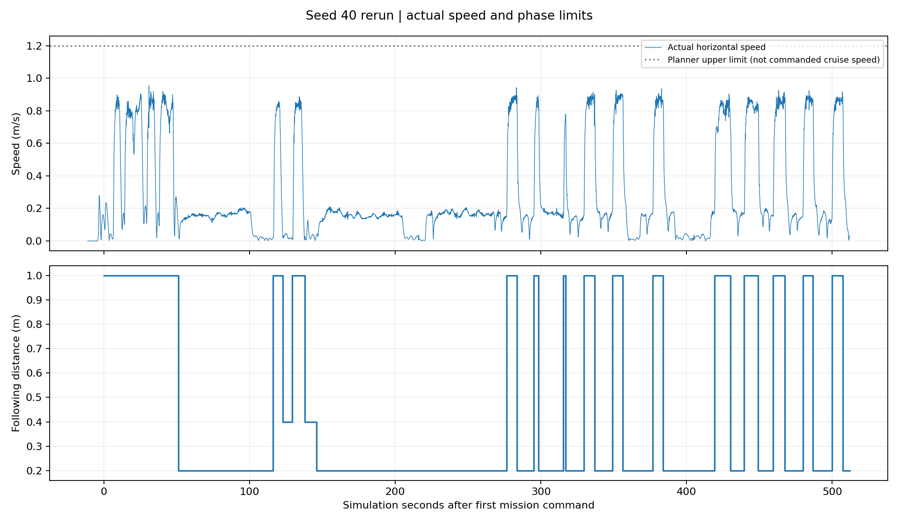
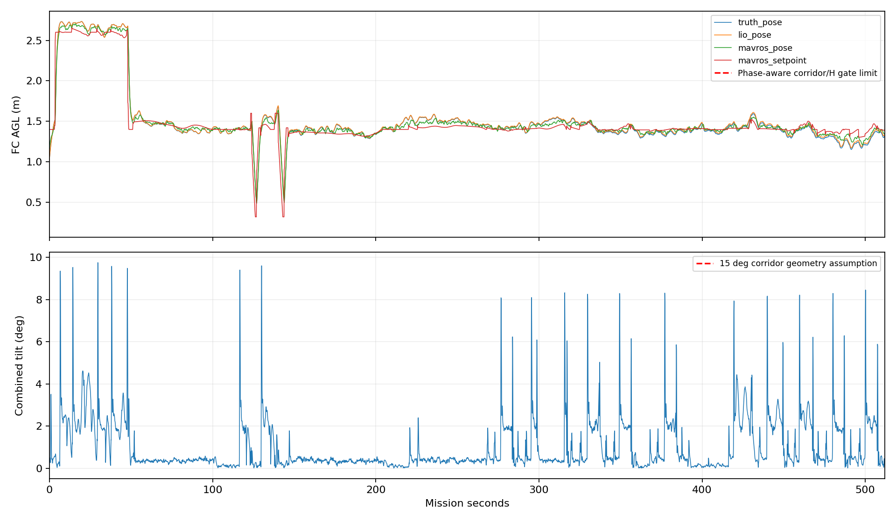

# 失败三seed修复验收统一回归报告

本批针对34、38、40做验收；seed40首次在任务启动前触及Wall_1后，按用户指示以同源码、同配置重跑并替换主表结果。主表 **0/3 PASS**；首次seed40原始失败保留在日志和initial_matrix.json，不能推算当前版本十轮成功率。

## 版本、场地和计时

统一HEAD `649dfe0442dd67ad4b51ef432af08809ba00c549`，实际导航/视觉包路径均核对为本工作树。主表三轮运行期间未调参；seed40按用户要求补跑一次并替换主表，原始结果另存。与原十轮直接比对实际生成的五类靶位，最大XY差均小于0.1mm；树/门复用同一冻结world。2.6m高位、既有快走廊和录像配置一致。宿主墙钟改为6000秒，ROS任务600秒不变，避免旧seed40墙钟截尾；因此该项属于评测环境变化。

本批是历史失败子集的可靠性复测，原三轮均未完整完赛，不计算所谓完整完赛节时百分比；只有双方确实达到的同一阶段才比较耗时。视频按ROS图像时间校正，宿主运行时长不等于飞行时间。

## 配对结果

| seed | 原结果 | 本轮 | 原投递数 | 本轮投递数 | 原三投/s | 本轮三投/s | 本轮完赛/s | 本轮原因 |
|---|---|---|---|---|---|---|---|---|
| 34 | FAIL | FAIL | 0 | 0 | — | — | — | manager_failed |
| 38 | FAIL | FAIL | 2 | 2 | — | — | — | actual_collision |
| 40 | FAIL | FAIL | 3 | 2 | 499.85 | — | — | actual_collision |

## 首因与修复验收判定

下列事件时刻为日志中的ROS绝对仿真秒；时间线图从首次任务决策归零。

- **34**：高位入场成功，目标(1,3.5)等航点连续不可规划，原点及替代点均多次被跳过。99.3秒退回当前位置柱下降；粗二维图标为未阻塞，真实三维规划仍无法生成首条下降轨迹，111.413秒以`initial_plan_timeout`终止，0条目标线索、0投。与上次六轮的109.936秒失败属于同一类，线索延期逻辑根本未触发。二维清空建议不能当成三维放行。

- **38**：高位南侧(5.5,-3.5)及替代点跳过，70.333秒只取得bridge/panzer两类；两投后100.414秒从牛耕第12点进入补搜。实际补搜航带依次Y=-0.1、0.6、1.3，未回到先前遗漏的南侧。160.819秒在X=7.4的Wall_13出现55cm工程包络接触，第一采样穿透约0.040mm；该轮Gate FAIL，不能当成裸机实碰。触墙时真值FC X≈7.123，已越过配置的硬中心X上限7.081；MAVROS X≈7.102，控制设定X≈7.047。低空补搜的目标是第3投，但此次没有走到目标处。

- **40（选用补跑）**：高位三类齐备，58.9秒提前中断。红十字线索在南墙附近，两次低位复访均未产生可通过边界许可的对准目标：127.6秒首轮延期后仍完成panzer与bridge两投，231.7秒二次延期才进入LOW_COVERAGE。由此**验证了“先处理其他有效线索”确实生效**；此前低空补搜立即绕过边界许可接收同一红十字的情况未复现。它又从第0航点跑完整场牛耕，522.776秒于Wall_13发生55cm包络接触，第一采样约0.027mm，2投、FAIL。边界拒绝累计343次；不能把高位线索质量或目标接近墙简单等同于不存在目标，也不能把包络接触当成裸机撞墙。

- **40首次启动失败（保留，不进主表）**：9.371秒起飞时触Wall_1工程包络，任务决策为0、投递0。重跑同源码正常入场，说明该起飞分支有波动；它不是本次线索延期修复的验收样本。原始目录见initial_matrix.json。

本三组无法给出完整完赛节时。38、40靠近X正侧内墙时的真值与设定差提示跟踪和边界交接仍需处理；仅降低规划器地图膨胀不能保证55cm包络不越墙。

## 本批之后的修订（尚无SITL结果）

按本轮诊断，导航权威和研究工作树已加入：高位跳过航点所在的完整低空航带优先补搜；多个跳点落在同一航带时只安排一次，之后才按剩余航带继续。三条线索已齐、仅剩近墙目标时沿安全边界内侧做两点、总计至多40秒的局部视觉复核。只有新鲜低位候选通过统一边界许可才进入原对准/释放链；复核仍不合格则明确失败，不再空耗整场牛耕。仿真入口的`sdf_map/obstacles_inflation`水平值由0.30改为0.10m；上下方向膨胀、55cm机体包络及实机入口保持原值。本报告的三组飞行仍使用0.30m。344项整机任务单元测试通过；这些后续修订尚无动态仿真验收，不能倒填为本批结果，也未替换机载部署。

## 单轮指标和材料

### Seed 34

结果FAIL，原因`manager_failed`；记录XY航程6.47m，55cm包络接触采样0，样本间隔缺口0。失败轮航程/时长只是已执行部分。

[完整指标](34_rerun/metrics.json) · [跟随+俯视视频](../../../logs/failedthree_seed34_20260923_204202/presentation.mp4)

恢复事件：`{}`。未出现事件不等于该故障分支已经动态验证。

### Seed 38

结果FAIL，原因`actual_collision`；记录XY航程61.50m，55cm包络接触采样3，样本间隔缺口0。失败轮航程/时长只是已执行部分。

[完整指标](38_rerun/metrics.json) · [跟随+俯视视频](../../../logs/failedthree_seed38_20260923_205045/presentation_review.mp4)

恢复事件：`{}`。未出现事件不等于该故障分支已经动态验证。

### Seed 40

结果FAIL，原因`actual_collision`；记录XY航程147.83m，55cm包络接触采样1，样本间隔缺口0。失败轮航程/时长只是已执行部分。

[完整指标](40_rerun/metrics.json) · [跟随+俯视视频](../../../logs/failedthree_repeat_seed40_20260923_210513/presentation_review.mp4)

恢复事件：`{}`。未出现事件不等于该故障分支已经动态验证。

## 统计边界

投递误差按mock成功ACK时真实飞控中心到靶心距离统计，不是包裹落点；真实机构耗时及释放口偏置仍未标定。原始与新Gate都保留，另有保守机体/树投影结果，不把保守包络重叠自动称为实际碰撞。失败原因和下一步处置需结合逐轮首个异常分析，不能只看最终ABORT。
