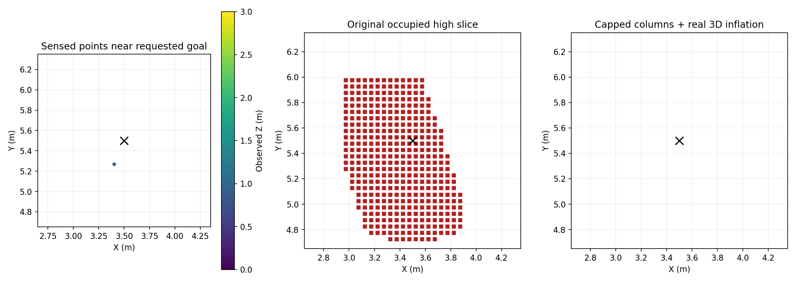

# 高位航点不可达修复

> 方案已撤回启用：用户确认规则禁止从障碍上方飞过。下文为历史试验记录，不能作为合规修复。最新高位轮三投86.080s、两门和9个投后航点完成、0碰撞，但H降落阶段触发原0.7m门槛，整场FAIL。图见[index.html](index.html)。

失败目标为地图坐标(3.5,5.5,2.38)，即FC离地2.6m。已有local_map_failure_1.json记录显示，目标平面半径0.5m内感知点仅一处Z=0.887m，但膨胀地图在高位目标附近占据。原水平避障模式将有垂直支撑的低空障碍柱一直填充到虚拟飞行顶棚；高位策略把该顶棚升至2.88m，连带延长了本应约束低空绕树的障碍柱。

修正新增可配置horizontal_avoidance/column_top_z，默认-1完全保留原模式。仅高位研究launch设为ground_z+2.0（本次1.78m），将虚拟柱限制在低空规划层。真实三维点云膨胀保持原样；独立飞行顶棚保持原样。下降后原虚拟顶棚为1.78m，走廊为0.33m，最终柱顶取两者较低值，因此低空/走廊保持原高度范围。

局部快照重建：原高位切片有398个占据格，保留真实3D膨胀后为0；低位切片248个占据格保留；注入一个高位实测障碍点后仍判占据。详见[column_cap_replay.json](column_cap_replay.json)。这是裁剪快照的离线反事实，不是完整实时ESDF复演；膨胀可视化云时间戳为0，最终仍以同场景实跑验证。

两个工作区实际编译通过；12组参数展开验证高位柱顶1.78、原覆盖默认不覆盖该参数。完整高位修复先导待实跑。未关闭障碍膨胀、碰撞检测、低位重捕和投递许可，也未部署到实机。

