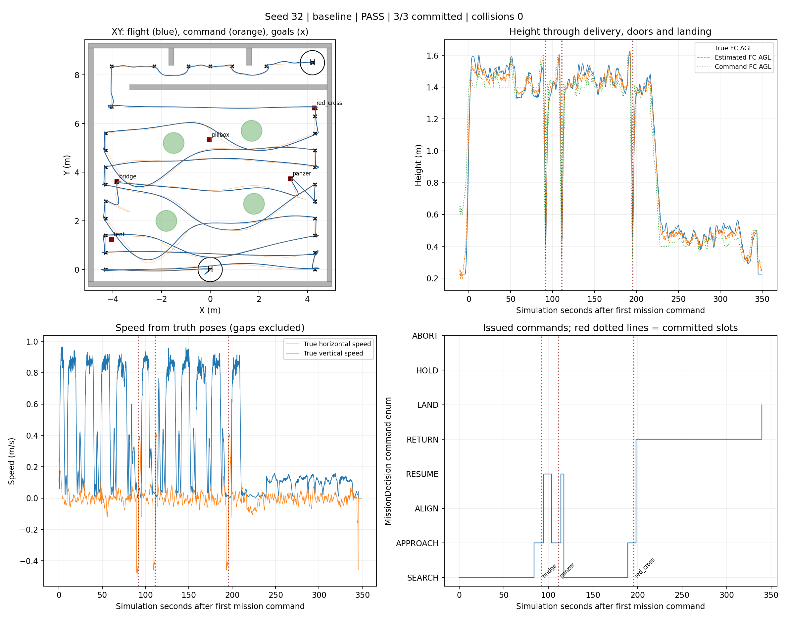
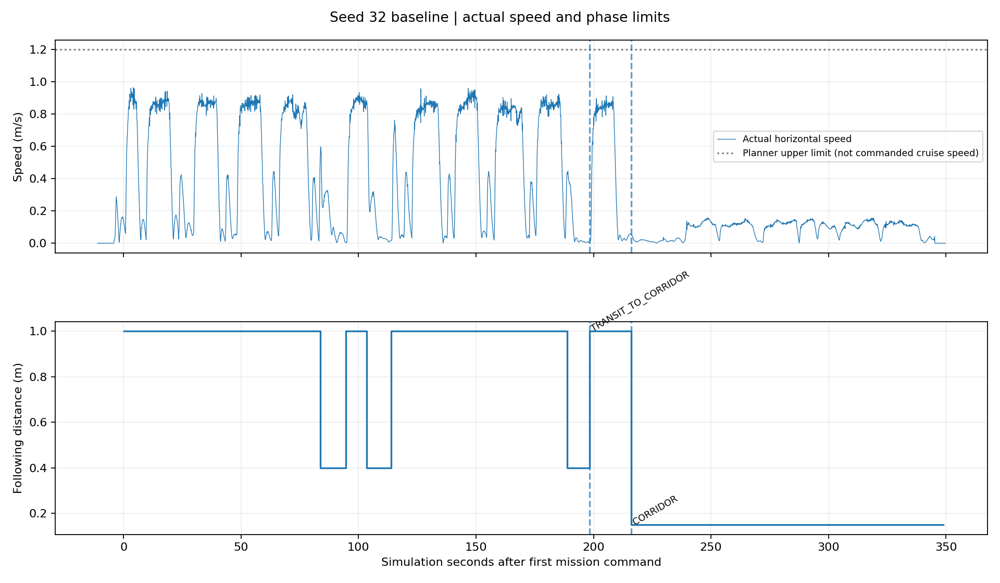
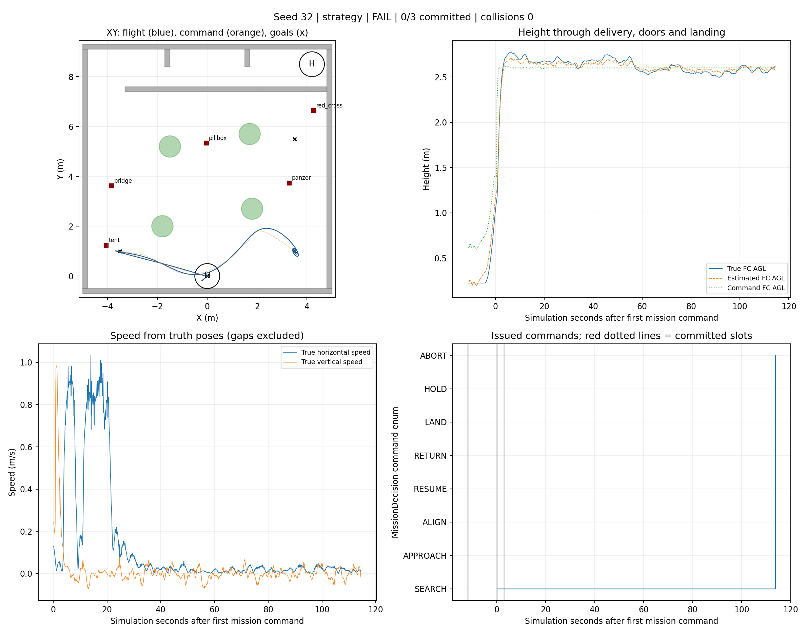

# 提速先导结果

原覆盖策略固定树seed32完整37/37 PASS，三投、两门、落地、0碰撞；高位策略同布局先导FAIL（0投、0碰撞），完整记录均保留。先导不计入正式全随机四轮。

| 指标 | 原速度 | 提速后 |
|---|---:|---:|
| 三投完成(s) | 322.135 | 195.716 |
| 第三投→走廊入口(s) | 83.695 | 20.390 |
| 整场完成(s) | 529.224 | 348.954 |

同固定布局及靶位单次比较，整场缩短34.06%。其中末投到走廊入口缩短63.305s。不能把全部整场收益只归于此段；搜索阶段也提速，并可能有检测/规划波动。

提速后CRUISE移动速度中位数0.787m/s、P95 0.901m/s；末投转场移动中位数0.815m/s。到入口第一个航点完成后才切0.15m前视；走廊移动中位数0.116m/s。移动统计阈值0.03m/s，参数上限1.2m/s不等于实测巡航。

高位先导的下一目标(3.5,5.5,2.38)被规划器持续报告邻域无无碰撞目标，90s运动超时；仅panzer形成合格线索。高位实际运动P95 0.907m/s，不能据此宣称策略提效。尚未确定目标占据的完整来源；没有关闭碰撞检查或更换有利布局。

原覆盖先导证明通用提速与延后降速链条可完整完成；后续全随机四轮继续检验高位策略本身，保留其失败，不将该高位先导写成PASS。

数据：[提速前后](before_after.json)、[逐轮指标](results/summary.json)、[原始目录](runs.json)。两组各有完整航迹、高度、速度、任务阶段与三维图。

