# 先导两轮图表

原覆盖：PASS，三投195.716s，整场348.954s。最新高位修复：三投86.080s、两门通过、0碰撞；H降落阶段触发原0.7m走廊高度门槛，整场FAIL。

高位缩短虚拟障碍柱的方案不能作为“禁止从障碍上方飞越”规则下的合规验收。本页保留实际试验图，不据此批准该方案或追改原Gate。两轮都是固定树seed32先导，不是全随机矩阵。

baseline在走廊矩形内已记录的FC最高离地高度0.563m；strategy_repaired在走廊矩形内已记录的FC最高离地高度0.762m。若改按1.5m判断，已记录区间未见越限；但本轮已在原0.7m门槛停止，不能据此推定后续落地成功或改判PASS。

原始目录：`/home/xhj/liftrace-worktrees/r2026-high-view-search/logs/fast_speed_pilot32_baseline_20260914_100040`；`/home/xhj/liftrace-worktrees/r2026-high-view-search/logs/high_speed_column_fix_seed32_20260914_103959`。

[统一图表浏览入口](index.html)

## 两轮完整航迹与叠加

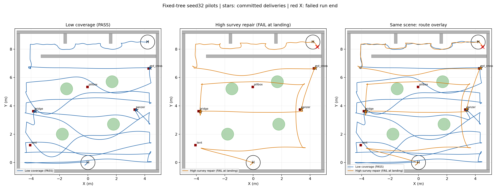

## 两轮实际高度与速度

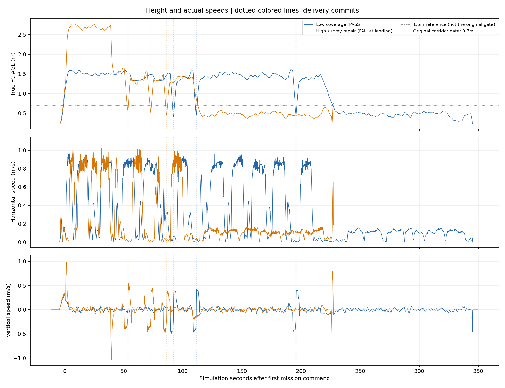

## 三投、转场和完赛耗时

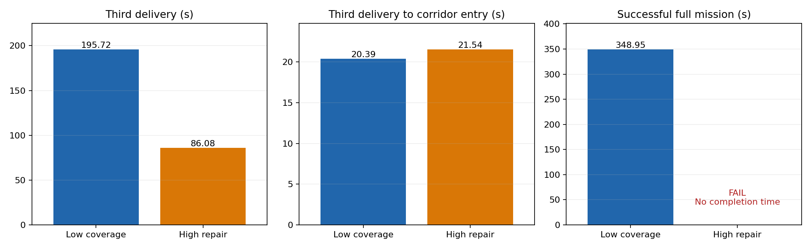

## 原覆盖提速先导：航迹／高度／速度／指令

## 原覆盖提速先导：按阶段着色的航线

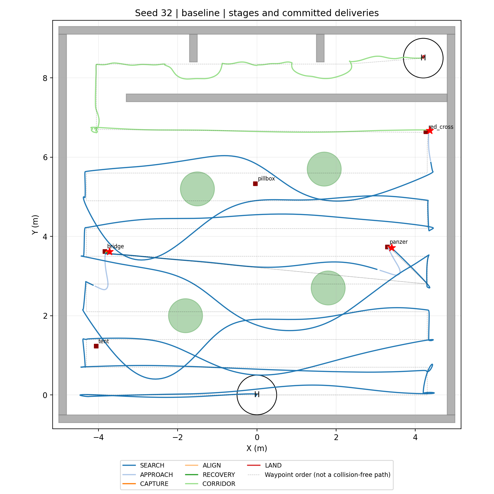

## 原覆盖提速先导：三维航迹

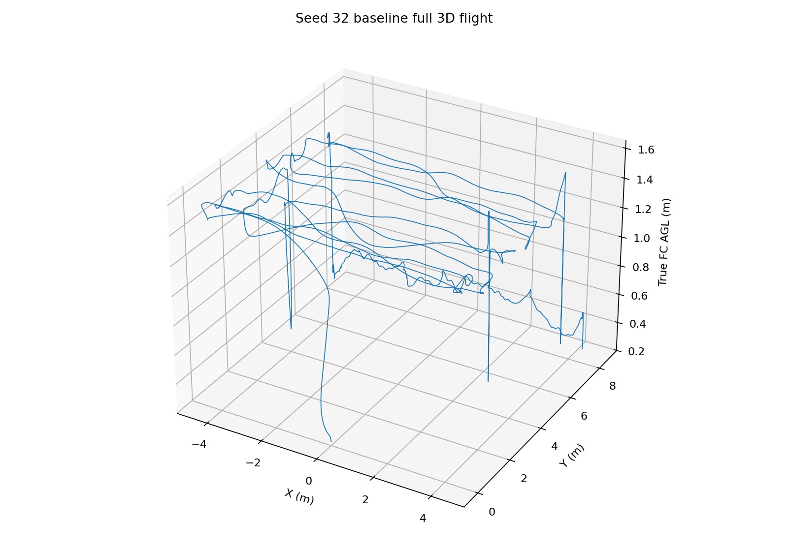

## 原覆盖提速先导：实际速度与前视参数切换

## 原覆盖提速先导：阶段耗时与投递事件

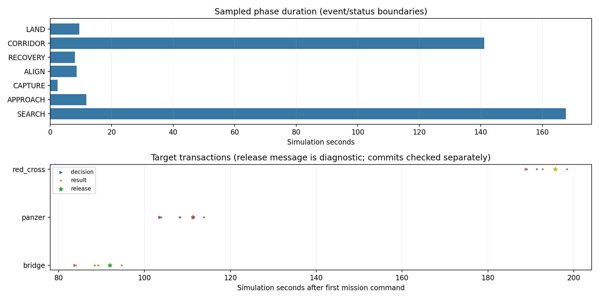

## 最新高位修复先导：航迹／高度／速度／指令

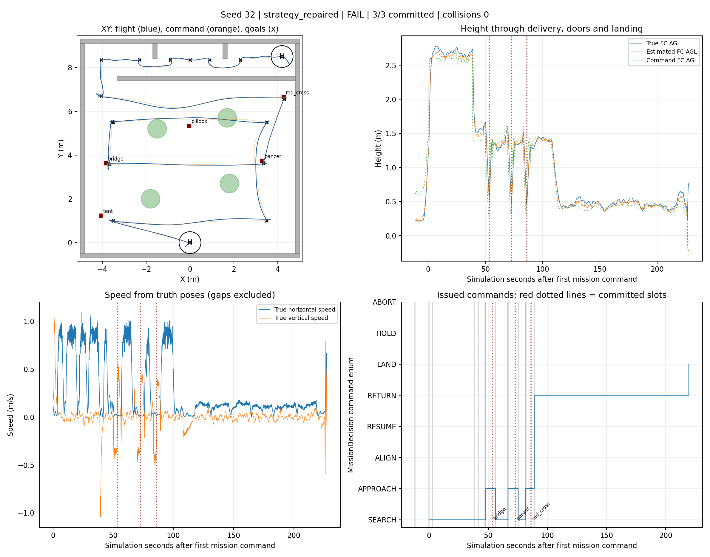

## 最新高位修复先导：按阶段着色的航线

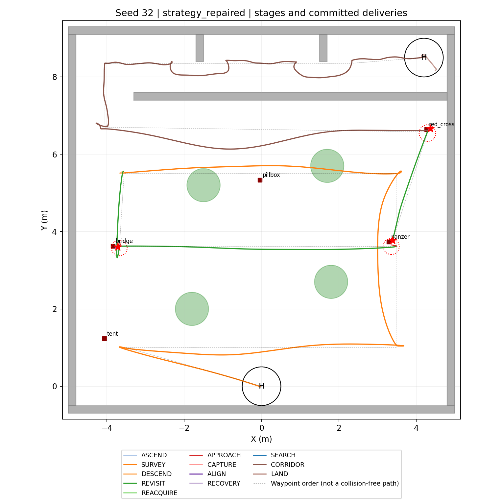

## 最新高位修复先导：三维航迹

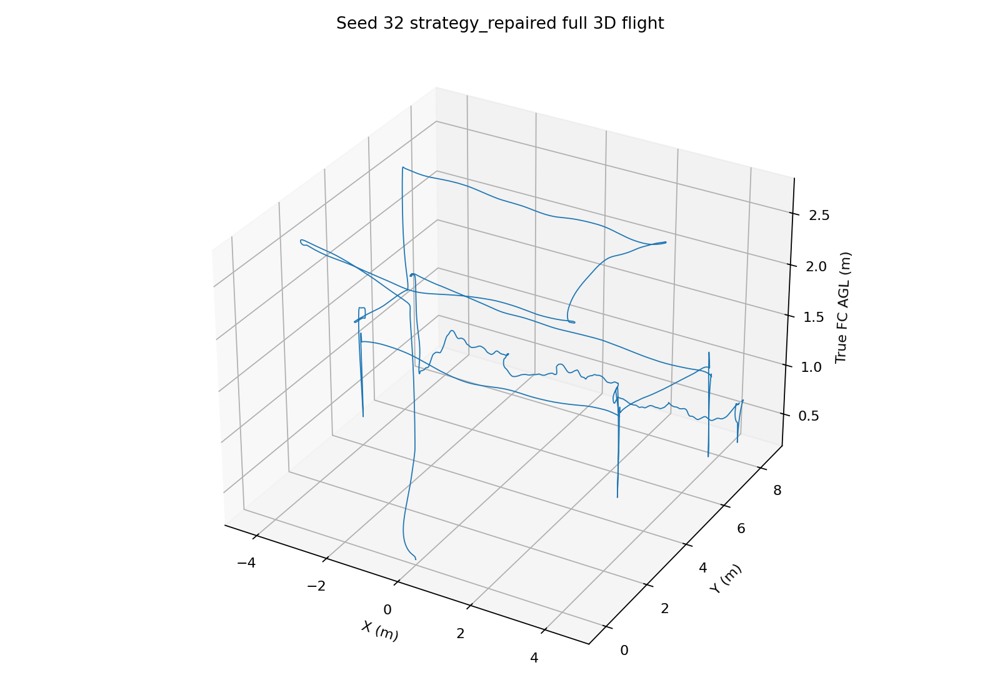

## 最新高位修复先导：实际速度与前视参数切换

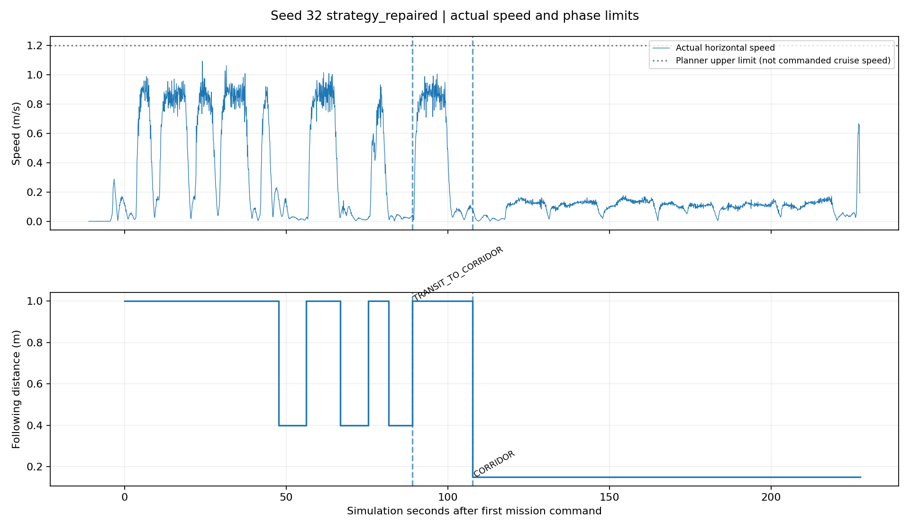

## 最新高位修复先导：阶段耗时与投递事件

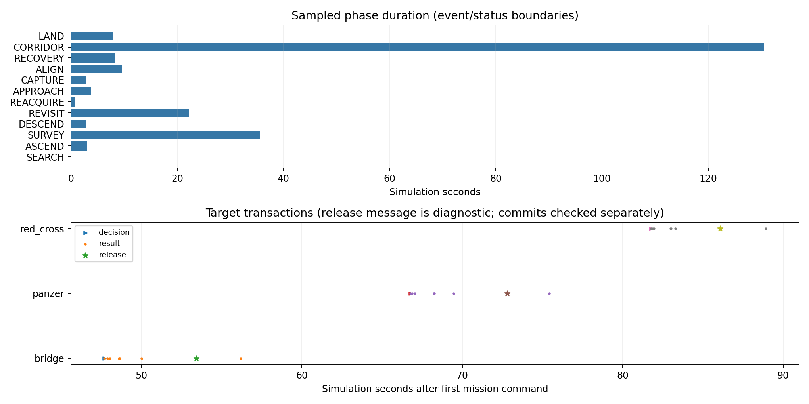

