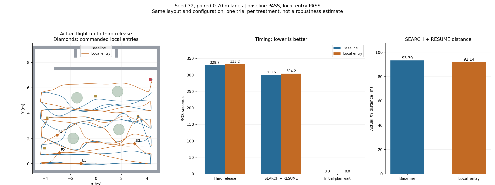
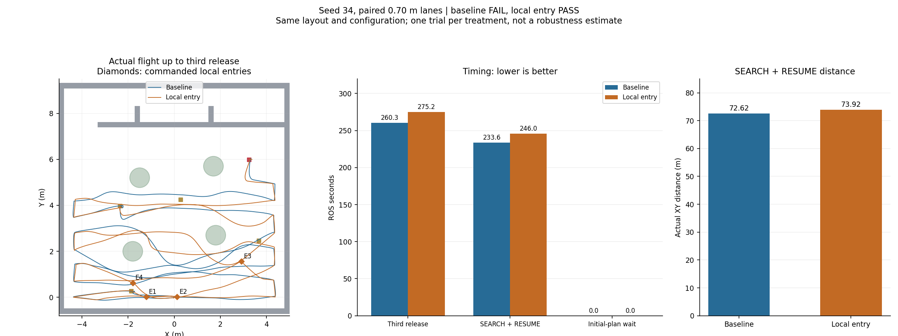
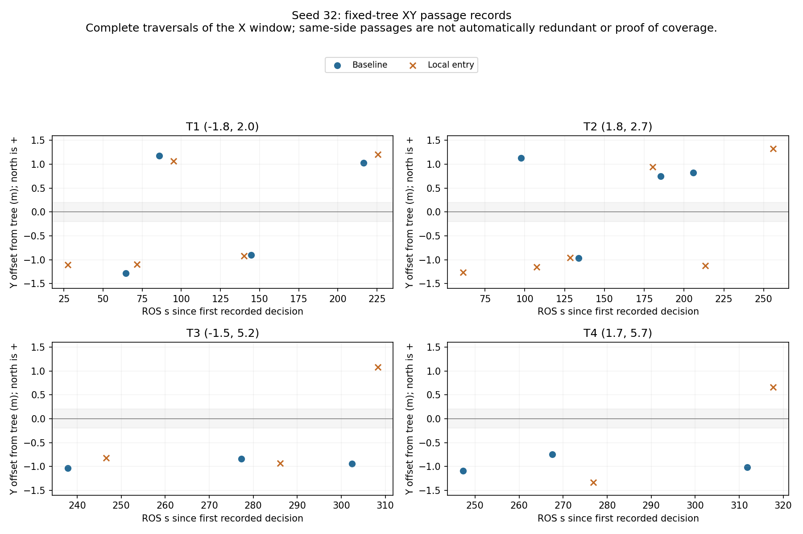
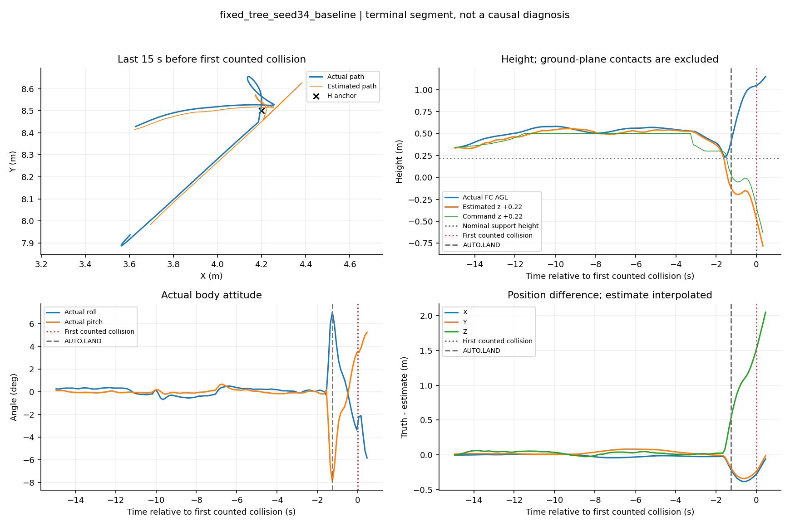

# R64固定树箱、随机靶/门四轮提效对照

2026-09-12，研究分支`feat/coverage-efficiency-research`。按用户当前要求，固定R64树箱，随机靶标和门，完成seed32/34各一组局部入口关闭/开启的真实PX4/Gazebo对照。四轮源码冻结为`3d4403e`；相对上轮`f61764e`只增加场景和研究文档，没有改飞行算法或阈值。

**固定树后仍未证明当前入口原型能够节省搜索时间。** seed32航程略短，但低速时间增加；seed34航程和时间都增加。四轮均完成三投、三次恢复、两门和9个投后航点，完整Gate为3 PASS、1次LAND阶段FAIL。原型继续默认关闭，正赛工作树与交付包保持原版。

## 固定与随机的范围

| 项目 | 本批设置 |
|---|---|
| 四组树箱 | T1=(-1.8,2.0)、T2=(1.8,2.7)、T3=(-1.5,5.2)、T4=(1.7,5.7)m；yaw=0、Z=0.30m |
| 树箱来源 | 完整模型子树与R64先导`1983b2f`一致；尺寸、树下垫箱及朝向保持，无独立纸箱 |
| 随机靶 | 生产spawner的field_seed=32/34，位置与朝向随机，沿用当前4标准类+红十字及避墙约束 |
| 随机门 | 独立door_seed=1032/1034，按原随机流抽样为RR/LL；两门净宽0.80m，走廊1.50m |
| 航带/等待 | 两组均0.70m；seed32初始规划等待上限0，seed34为20s，与上一轮一致 |
| 唯一处理差异 | 每对均开启观察器和只读建议，仅切换`local_motion_enabled` |

随机门真值只给私有Gate；任务使用同一组中线墙前/墙后引导点，没有按门位置生成飞行目标。每对11份实际场景/机架/配置副本一致，五个实际靶位/朝向也一致。固定树模型、预生成靶板避墙与四种静态启动参数检查见[preflight.json](preflight.json)、[static_launch.json](static_launch.json)，最终配对核对见[validation.json](validation.json)。

树箱排除区域改变后，同seed的靶位可能与上一轮全随机树场景不同，因此旧结果只作背景。本批真正的同图对照是各seed内部的关闭/开启组。两个门组合不代表LL/LR/RL/RR全覆盖；每种处理仅一次、先基线后执行，不把单次差值当稳定概率或普适收益。本批没有测试0.80m航带。

## 搜索时间与航程

三投时间从第一条记录的任务指令到第三次成功mock释放回执。SEARCH/RESUME按实际指令区间统计，到终止或下一指令截断；投递精定位和投后路线另计。低速时间为这些区间内真值XY差分速度低于0.1m/s的累计时长，包含悬停和慢速跟踪，不能全部归为停点等待。

| 指标 | 32基线 | 32入口开 | 34基线 | 34入口开 |
|---|---:|---:|---:|---:|
| 三投时间，s | 329.746 | 333.192 | 260.287 | 275.169 |
| SEARCH/RESUME时间，s | 300.597 | 304.163 | 233.573 | 246.003 |
| SEARCH/RESUME实际XY航程，m | 93.296 | 92.137 | 72.623 | 73.924 |
| 搜索低速时间，s | 16.872 | 20.396 | 11.753 | 17.465 |
| 初始规划超时次数/等待，s | 0/0 | 0/0 | 0/0 | 0/0 |
| 三投时活动名义游标 | 18 | 17 | 15 | 15 |
| 释放顺序 | panzer→bridge→red_cross | bridge→panzer→red_cross | bridge→panzer→red_cross | 同基线 |





- **seed32：**航程减少1.159m（1.2%），搜索增加3.566s（1.2%），三投增加3.446s（1.0%）。低速时间增加3.524s，与总搜索时间增量接近；距离缩短没有转化为节时。第三投在更早的名义游标触发，但之前增加的开销抵消了收益。
- **seed34：**航程增加1.301m（1.8%），搜索增加12.430s（5.3%），三投增加14.882s（5.7%）。低速时间增加5.712s，只解释部分时间增量；还存在移动路径/跟踪速度和精定位差异，不能全部归因于单一停顿成本。

四轮最终都释放bridge、panzer、red_cross各一次，seed32先后顺序改变，故不把“第一次释放时刻”直接当成同类别效率比较。三投是视觉/任务/mock链确认，不是机械实投落点得分。完整逐类时间与精定位区间见各`*_metrics.json`，另有[seed32三投时间分解](seed32_release_breakdown.png)、[seed34三投时间分解](seed34_release_breakdown.png)。

## 固定树两侧是否出现了不同路径

新增离线通行记录：只在连续SEARCH/RESUME中，飞机从树X坐标的一侧0.5m外到达另一侧0.5m外、且片段始终处于树Y±1.5m窗口内时，记录跨越中心线的插值位置。N表示Y偏移≥0.2m，S表示≤−0.2m；非搜索、超过0.5s的数据间隔或离开窗口会重置。目标中断前未完成检测带横穿的片段不计入。

| 树 | seed32基线 | seed32入口开 | seed34基线 | seed34入口开 |
|---|---|---|---|---|
| T1 | S N S N | S S N S N | S S S N | S N N |
| T2 | N S N N | S S S N S N | S S N | S S N N |
| T3 | S S S | S S N | S | S |
| T4 | S S S | S N | S | — |



[seed34树侧图](seed34_tree_sides.png)。图和表是近树XY检测带的经过记录，**不是覆盖率，也不能把同侧次数直接当成重复航程**。空白表示没有满足窗口/阶段条件的完整横穿，不能解读为没有经过该树或已经减少了冗余；特别是窗口外航段、提前选靶的部分轨迹会被排除。实际全航迹应与此表一起看。

seed32后部T3/T4确实由连续南侧记录变为包含北侧记录，前部T1/T2却增加了一些经过。整体只缩短约1.16m，仍多耗时约3.57s。两组入口额度分别在100.993s、111.684s前完成/用完，后续仍由原规划器执行；晚些时候出现的侧别变化不能直接证明规划器持续执行“已飞北侧就改走南侧”的记忆约束。当前模块没有持续的轨迹侧别成本或自动删减已覆盖名义航段。

## 入口执行和原任务恢复

| 组别 | 接纳入口 | 结果 | 预算/游标恢复 |
|---|---|---|---|
| seed32入口开 | decision2/5/9/13 | 4次正常完成 | 原目标、游标正确；3个deadline纳秒值一致，1个缩短1ns |
| seed34入口开 | decision2/6/10/14 | 第1次被bridge优先中断，其余3次完成 | 中断后恢复原目标；3个普通恢复deadline一致 |

7次正常入口的估计位置XY偏差为0.017–0.075m；这是执行器所用估计位置，不是真值或实机精度。每场最多4次、每名义点最多一次的限制生效，没有把入口到达计为名义航点完成。四轮均只有原Planner Bridge发布规划目标，`unmatched_result_count=0`。

seed32的decision5后，deadline从118158000000变为118157999999ns，缩短1ns。源码以`now + (deadline - now)`重建时长，浮点消减再转换ROS纳秒可复现该差异；没有延长预算，不属于飞行失败。保留严格相等结果和`deadline_delta_ns`，不把原始差值改成零。[数值记录](deadline_numeric_review.json)。本批未改飞行代码。

当前两组初始规划等待均为零，例行入口没有消除已有等待的机会；它主要增加了到点、低速和恢复过程。尤其seed32第1个入口、seed34第2个普通入口沿原方向，说明仅以入口观察矩形的潜在收益排序，仍可能为原轨迹本来会经过的区域插入停点。固定树条件没有解决收益基准和动作成本不充分的问题。

## 完整Gate与降落故障

| 组别 | Gate | 三投/恢复 | 投后航点/两门 | 碰撞 | 完整任务时间 |
|---|---|---|---|---:|---:|
| seed32基线 | PASS 37/37 | 3/3、3次 | 9/9、按序 | 0 | 545.500s |
| seed32入口开 | PASS 37/37 | 3/3、3次 | 9/9、按序 | 0 | 558.621s |
| seed34基线 | FAIL 27/37 | 3/3、3次 | 9/9、按序 | 1 | 未完成 |
| seed34入口开 | PASS 37/37 | 3/3、3次 | 9/9、按序 | 0 | 508.871s |

seed34基线在443.774s发出LAND；452.476s真值模型Z接近支撑面（0.0083m），452.774s记录到AUTO.LAND。CSV首次记录通道FC高度超过0.7m在453.182s，随后454.034s护桨包络接触隔墙Wall_13，LAND阶段实际FC高度最高约1.149m。Gate主错误为`corridor_height_limit_violation`并伴随`actual_collision`。43个高度违规计数是同一次异常中的采样，不是43次事故。[时序数据](seed34_baseline_terminal_review.json)。



[seed34入口开启组末段](fixed_tree_seed34_active_terminal.png)、[seed32基线末段](fixed_tree_seed32_baseline_terminal.png)、[seed32入口开启组末段](fixed_tree_seed32_active_terminal.png)。这是现有Gate的**通道0.7m高度门槛**超限，不是全场4m限高超限；四轮记录最高FC高度约1.64–1.73m。其它未完成检查不能被当成独立故障累加。

原监视器过滤ground_plane和H支撑面接触，碰撞为零不证明从未擦地。实际FC高度按真值CSV的Z加0.22m机架偏移绘制，估计/指令曲线单独标注。成功组也可出现触地后的估计高度波动，不能用Z差值单项替代真实接触和落地判断。失败发生在三投之后，局部关闭时也会出现；本批不能认定入口策略修复或导致了降落根因。

seed32整轮时间增加13.121s，包含搜索和投后差异；seed34基线失败，不能用其截尾时间与成功组做完整任务时间增益比较。本批不修改Gate掩盖失败，不追加同版本补跑替换结果。

## 观测与端侧资源

| 项目 | 32基线 | 32入口开 | 34基线 | 34入口开 |
|---|---:|---:|---:|---:|
| 接受观测/状态tick | 971/1671 | 822/1715 | 1043/1362 | 860/1565 |
| 其中地图新鲜 | 970 | 821 | 1042 | 859 |
| 同步原始快照 | 89 | 90 | 73 | 84 |
| 重处理tick P95，ms | 276.98 | 335.66 | 205.57 | 283.59 |
| 三投前抽样观测并集，m² | 44.13 | 44.69 | 39.81 | 40.13 |
| 有效建议回复 | 197 | 4 | 160 | 4 |
| 有效回复内预检P95，ms | 0.164 | 0.112 | 0.137 | 0.063 |
| 观察器累计CPU采样，单核% | 53.7 | 59.1 | 53.2 | 55.7 |
| 观察器采样RSS，MiB | 193.6 | 177.8 | 178.6 | 164.0 |
| 观察器采样HWM，MiB | 199.0 | 203.6 | 197.0 | 196.7 |

观测并集由同一generation、三投前约6 ROS秒一次保存的`SEEN_ESTIMATE`栅格取并集，可能遗漏快照间状态变化，含投递期间观测，不是全帧覆盖、召回或自由空间。增加0.56/0.32m²的抽样代理值不足以抵消本批时间退化，更不能单独作为节时证据。见各`*_sampled_union.png`和`*_supplement.json`。

P95只取实际重处理tick，排除冷却跳过记录；有效回复的内部预检很轻，不代表整个RPC、ROS接收/发布或整节点成本。入口开启组达到额度后停止无效查询，所以回复较少不代表服务成功率较低。

观察器整节点采样约0.53–0.59核，仍高于0.25核待验收目标；建议节点约0.03–0.12核。0.15核软预算不是整节点CPU限额，预算外接收/回调/发布等仍需剖析。这里是**x86笔记本、完整SITL、限量记录开启**的累计采样，HWM为采样时已达到的高水位；不是OrangePi的实时并发验收。板端无记录模式、RKNN/LIO/规划同时运行时的成本和有效观测频率仍需测量。

## 图表、原始记录与复现

共18张图，包含两组配对航迹/时间、树侧记录、三投时间分解以及每轮名义航带、实际航迹、高度、观察估计、任务阶段和末段放大。

| 原始run目录 | 航迹/高度/阶段图 | 指标 |
|---|---|---|
| `logs/fixed_tree_seed32_baseline_20260912_045841` | [综合图](fixed_tree_seed32_baseline_20260912_045841.png) | [JSON](fixed_tree_seed32_baseline_metrics.json) |
| `logs/fixed_tree_seed32_active_20260912_053523` | [综合图](fixed_tree_seed32_active_20260912_053523.png) | [JSON](fixed_tree_seed32_active_metrics.json) |
| `logs/fixed_tree_seed34_baseline_20260912_061303` | [综合图](fixed_tree_seed34_baseline_20260912_061303.png) | [JSON](fixed_tree_seed34_baseline_metrics.json) |
| `logs/fixed_tree_seed34_active_20260912_064523` | [综合图](fixed_tree_seed34_active_20260912_064523.png) | [JSON](fixed_tree_seed34_active_metrics.json) |

四轮无全场视频/bag，保留336份图像/点云同步快照、CSV、事件、Gate、参数和场景副本。各轮结束并确认零残留后，无损压缩ULog，逐字节回读一致才移除未压缩副本，逻辑占用减少298,797,831字节（284.96MiB）。临时图清理与最终空间采样见[storage.json](storage.json)。没有压缩VHDX，也不把逻辑释放量当成宿主物理回收量；必要原始数据完整保留。

在研究根目录使用既有conda环境复现，脚本只读日志，不启动ROS或仿真：

```bash
source /home/xhj/miniconda3/etc/profile.d/conda.sh
conda activate rl_drone
OPENBLAS_NUM_THREADS=1 OMP_NUM_THREADS=1 python docs/verification/fixed_tree_efficiency_20260912/analyze.py
OPENBLAS_NUM_THREADS=1 OMP_NUM_THREADS=1 python docs/verification/fixed_tree_efficiency_20260912/tree_passages.py
OPENBLAS_NUM_THREADS=1 OMP_NUM_THREADS=1 python docs/verification/fixed_tree_efficiency_20260912/pair_plot.py
```

`analyze.py`定向复用上一批报告的计时/绘图函数并补充低速时间与deadline差值；不会覆盖上一批报告。`tree_passages.py`含直线横穿、未走完检测带、搜索中断、折返四个几何自检；这些只验证离线统计定义，不是新增飞行试验。数据、链接、图片和收尾检查见[validation.json](validation.json)。[全部运行索引](runs.json)保留原始Gate与失败。

## 下一步

固定树条件值得保留为可比较的研究场景，但本批不支持把当前例行插点方案用于提效部署。下一步应先建立“继续原轨迹、不插点”的收益基准，计入减速、到点及恢复成本，减少已在即将执行航线内的插点；再考虑按明确缺口/重复绕行触发、保留后部预算，或从轨迹层研究观察收益。不能仅增加插点次数。

航带间距仍是独立候选，本批保持0.70m，没有新增0.80m实跑；后续与地图记忆策略分别归因。近地/降落故障继续单列稳定性问题。优先级只在[ROADMAP](../../../VISION_2026_ROADMAP.md)维护。

本轮仅同步研究分支。正赛工作树保持干净的`86e382d`，CURRENT交付仍为driver2的`c369e6f8`；不合并main、不重打包、不替换机载部署。
