# seed2672：新视场、搜索内环与降落修复 A/B/C 完整报告

三轮按约定依次静默运行，各一次，无补跑替换；三轮均完成三投、三次恢复、9个投后航点、两门和H识别降落，37项飞行Gate全部通过、零障碍碰撞。每轮均正常收尾，复查无ROS/Gazebo/PX4/RViz残留。完整双视角录像与原始CSV/JSON/ULog均保留。

**本轮最优实测是B：2.6m高位＋已有快走廊，187.73秒。** 3m并未更快：C再次出现panzer空间类别冲突，保留两个候选并低位复核成功，整场216.55秒。两者都是高位优先策略，本轮没有新跑传统全覆盖基线，不能据此给出高位相对遍历的最终因果结论。

[图表与视频总览](index.html) · [原始运行索引](runs.json) · [原始指标](summary.json) · [后续时间/精度讨论（未实施）](../../planning/fov_landing_inner_20260919/NEXT_DISCUSSION.md)

## 1. 完赛时间与对照边界

以下时间从任务首条决策开始，到落地/任务成功确认，单位为ROS仿真秒。不是笔记本运行墙钟时间，也不是实机完赛保证。10s/投仍为用户指定的待标定机构预算，表中明确列为**额外预留30s**，没有把它伪装成本轮真实执行的机构等待。

| 方案 | Gate | 第三投ACK/s | 完整任务/s | 另留30s预算/s | XY航程/m | 碰撞 |
|---|---|---|---|---|---|---|
| A：2.6m原走廊 | PASS | 111.78 | 251.67 | 281.67 | 54.46 | 0 |
| B：2.6m快走廊 | PASS | 87.73 | 187.73 | 217.73 | 52.84 | 0 |
| C：3m快走廊 | PASS | 114.22 | 216.55 | 246.55 | 62.39 | 0 |

B比A少 **63.934s（25.40%）**；但三投前就相差24.049s，主要涉及panzer对准等待波动，不能把全部差值算成走廊收益。第三投ACK至完成由139.888s降至100.003s，少 **39.885s（28.51%）**，是更贴近投后配置变化的区段比较；仍只有同seed各一次。

C比B多 **28.815s（15.35%）**，本轮不支持将默认高位升到3m。相对更早286.456s的2672成功记录，B数值上少98.723s（34.46%），但那轮场景门位/坐标朝向和配置不同，仅作历史参照。

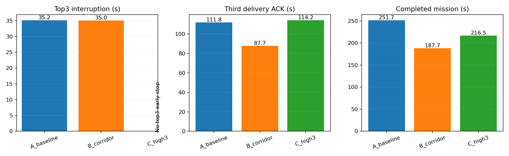
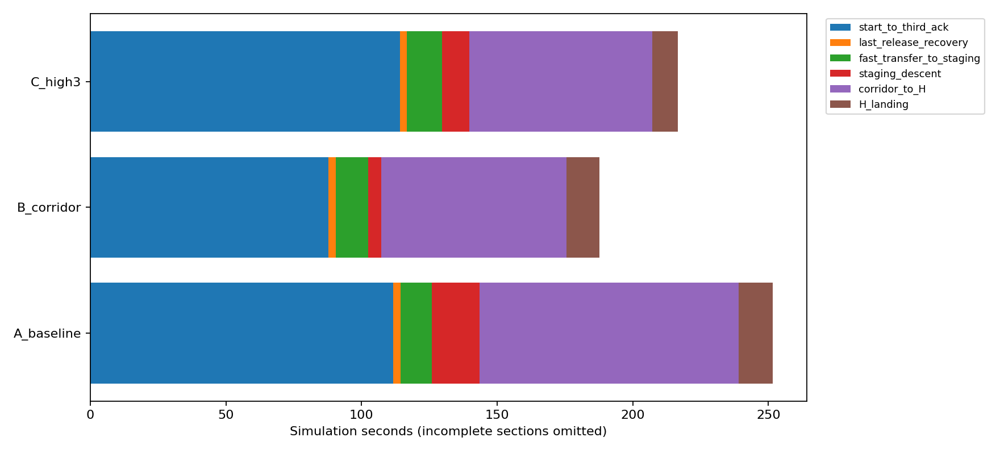


| 区段/s | A：2.6m原走廊 | B：2.6m快走廊 | C：3m快走廊 |
|---|---|---|---|
| 起始至第三投ACK | 111.779 | 87.730 | 114.217 |
| 末投恢复 | 2.565 | 2.778 | 2.395 |
| 进廊前转场 | 11.487 | 11.933 | 13.005 |
| 入口下降 | 17.601 | 4.861 | 10.110 |
| 走廊至LAND接管 | 95.633 | 68.326 | 67.473 |
| H降落事务 | 12.602 | 12.105 | 9.348 |

“走廊至LAND接管”从第3个投后航点的决策起算，包含进廊与门间航段，不是仅两扇门的净通行时间。A/B同时对照已有的分段速度和走廊高度，无法单独拆出二者各自的因果收益。

## 2. 本轮实际修改与冻结条件

- 飞行源码 `708529d`，导航权威来源 `30ff44d`（飞行修复在`0f116bd`，后续为测试桩补齐）；研究分支，未合main或替换机载部署。三轮飞行代码/权重冻结，中间仅准备离线报告脚本。
- seed2672的树、靶、连续随机80cm门和4m外墙复用同一冻结world；固定起飞系：新X＝旧Y朝场内、新Y＝−旧X朝起飞机体左侧、Z向上。初始机头+X。
- 相机机械yaw旋转−90°，光学TF `[0,1,0,0]`、像素到机体矩阵`[-1,0,0,1]`同步，保持原K/D/分辨率，恢复原路线配套的视场方向。
- 搜索区采用真实墙内净边界X[-0.5,7.4]、Y[-4.8,4.8]。名义8.5×10m包含墙体等，现有world扣除墙厚后的净区域约7.9×9.6m；不扩域穿墙。规划机心再留0.4m余量，独立Gate检查55cm整机投影。正式投后路线开始才释放搜索域约束。
- 高位继续保留完整水平障碍柱，增加0.10m跟踪余量；低位恢复原配置，没有开放从树顶通过的捷径。
- 仅LAND阶段物理守护盒及判碰一起改为50×50×40cm；其他阶段55×55×40cm。Z尺寸不变、接地后不重新膨回55cm，墙接触仍计碰撞。新增地面/H支持接触记录。
- 最后H接近/观测使用独立1.2m高度窗口，FC目标与捕获高度统一0.9m；A其他走廊仍为原0.7m验收上限，B/C沿用已有1.2m上限。末段`MPC_LAND_SPEED=0.25m/s`作为降落修复，三轮ULog均核实生效。
- 保留已有巡航/走廊速度；没有新增提速或投递阈值修改。整机Catkin编译、329项导航与71项高位/录像Python回归、导航plan_env C++测试通过；三入口静态展开与相机几何一致性通过。

配置见[scene目录](seed_2672/)，[静态验证](static_validation.json)，[跨仓设计说明](../../planning/fov_landing_inner_20260919/PLAN.md)。

## 3. 搜索覆盖、冲突复核与航线

同一真实墙内区域、完整名义路线的理想地面视场覆盖：2.6m由84.29%恢复至96.80%，3m由90.91%恢复至99.74%。计算包含实际内参与畸变，假设机体水平、无树遮挡和检测限制，不是实际识别召回。此前报告使用不同统计边界，不能混算其百分比。

A/B分别在任务35.168s/35.041s三类线索齐备后提前结束高位，在当前区域回降，按bridge→panzer→red_cross低位重捕与投递；没有返回起飞升降点，也没有遍历低位牛耕路线。C未触发三类齐备中断：高位panzer出现两个空间候选，一个近真实panzer、另一个近pillbox；完成高位路线后保留bridge/red_cross，并执行panzer低位候选复核，首个候选成功，未进入全覆盖补搜。

这说明恢复视场改善了2.6m本次观测，但没有消除模型在3m下的类别混淆。C的两个panzer候选距真实panzer分别约0.296m、1.762m；后者最近真值类别是pillbox。仅靠类别/空间日志不能把根因唯一归为图像旋转、尺寸或模型本身。本轮只验证“先查到正确候选”的实跑路径，“先查错候选再换另一个”仍主要由单元测试覆盖。

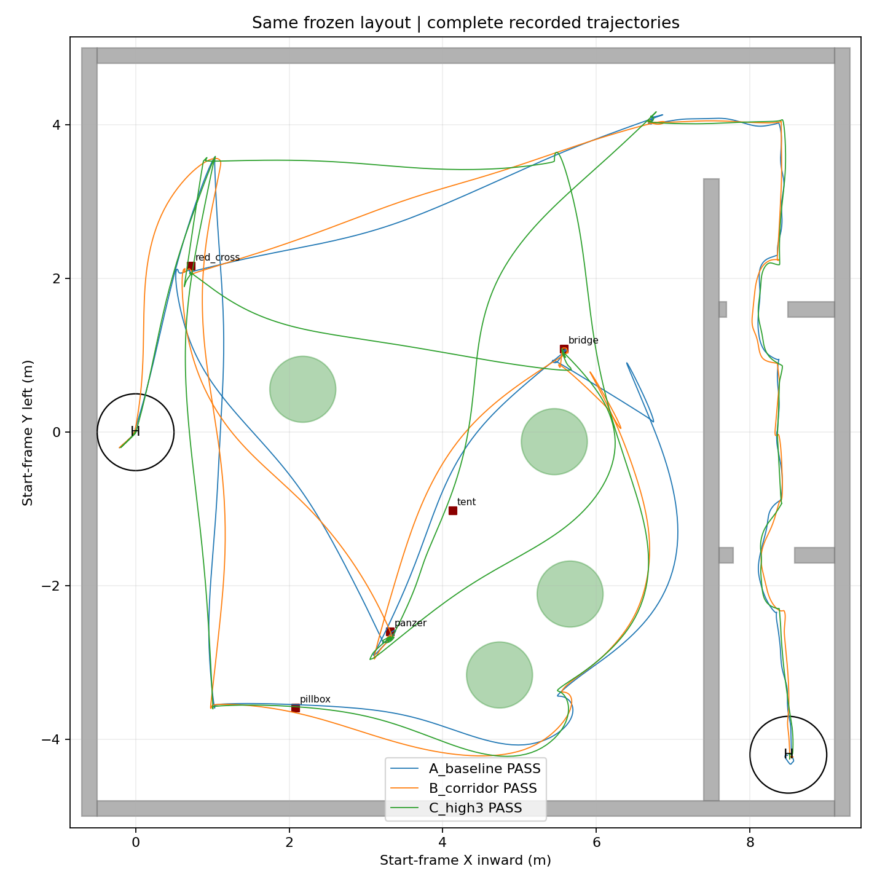
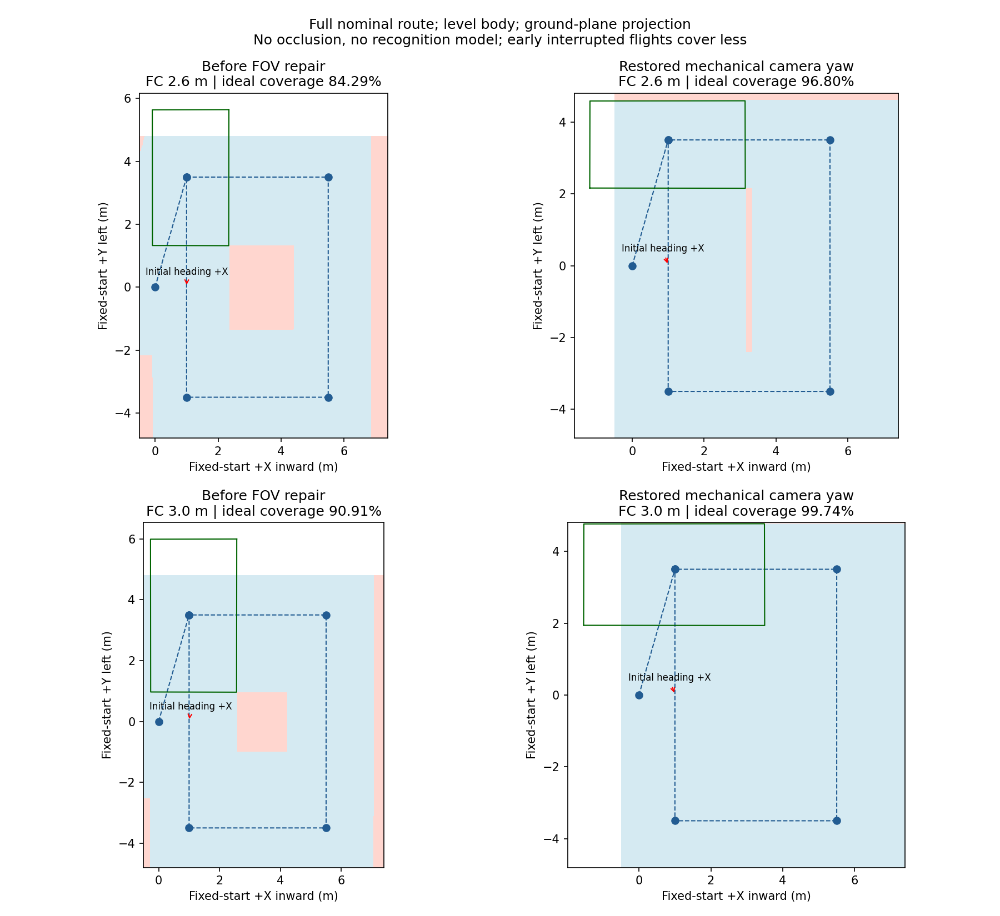
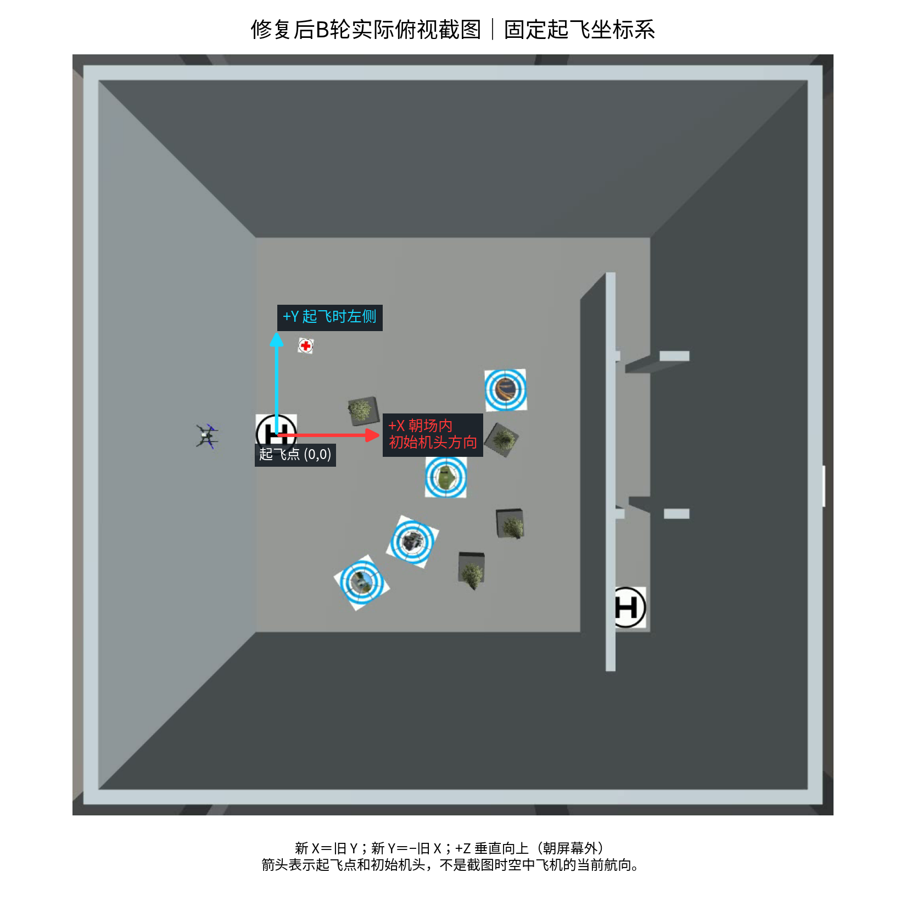

## 4. 搜索边界、越树与降落核查

独立Gate和离线整机姿态投影均未发现三投前进入走廊上空。越树检查把55cm保守盒按真实姿态投影，并与树及垫箱的保守凸包比较，沿轨迹按最多2.5cm平移间隔插值；只统计整盒高于对应障碍顶面的时段。三轮中心和整机投影均无越树重叠采样。该离线检查有采样和几何模型边界，不等同实机认证。

| 方案 | 投后路线前整机墙内余量/cm | 越树最差分离轴间距/cm | LAND盒/cm | 触地前0.7s最速下降/m·s⁻¹ | 接地后最大向上速度/m·s⁻¹ |
|---|---|---|---|---|---|
| A：2.6m原走廊 | 5.51 | 11.03 | 50 | 0.277 | 0.011 |
| B：2.6m快走廊 | 19.12 | 4.16 | 50 | 0.274 | 0.008 |
| C：3m快走廊 | 19.45 | 3.77 | 50 | 0.258 | 0.001 |

原A/B报告的是守护盒与Wall_9/Wall_11的物理接触，不是把ground_plane统一误判成墙。可视模型小于守护盒时，录像未见机身碰墙仍可能出现代理接触。本轮将用户允许的LAND 50cm尺寸实际应用于物理模型，并同时调整H阶段交接与末段下降速度，三轮稳定接地，无原先明显反弹。多项修复同时生效，不能单独声称只靠缩盒或只靠降速解决了根因。

新接触日志保留地面/H支持事件的法向、位置、深度、采样力以及guard尺寸；支持接触与墙接触独立统计，地面+墙同时接触的单元测试仍计墙碰。采样力不是连续接触冲量。ULog落地状态和独立真实高度共同确认完成。表中下降速度取接近支撑面的最后0.7s，整段速度曲线另见下图。图中灰区为PX4已判定landed，之后内部轨迹速度仍可能为负，不能把该设定值当成实际机体仍在下落。

近地估计偏差仍未完全消失：本轮LAND窗口MAVROS相对真值最大Z偏差A/B/C约26.35/19.69/5.13cm，LIO约0.74/0.66/0.66cm。稳定着陆不等于已根治飞控高度估计误差，后续仍应关注。

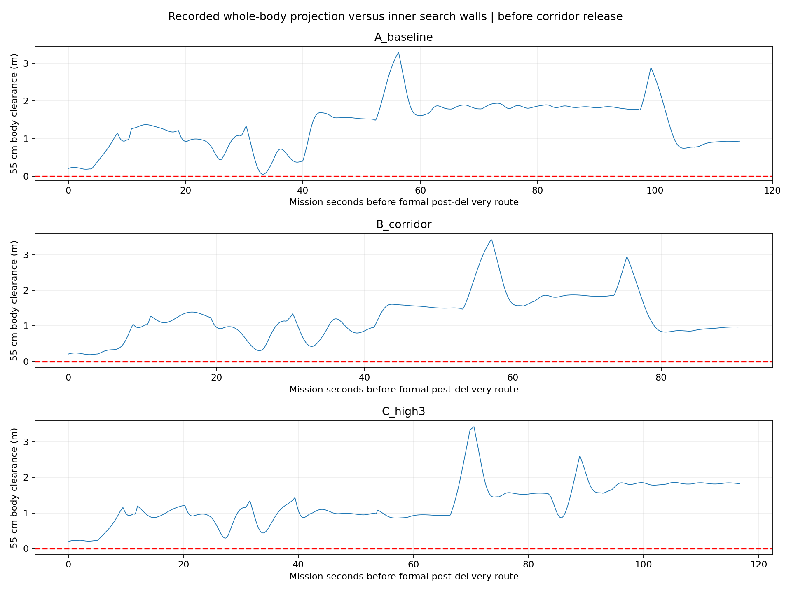
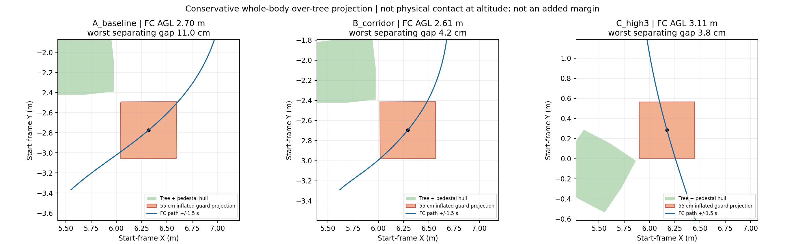
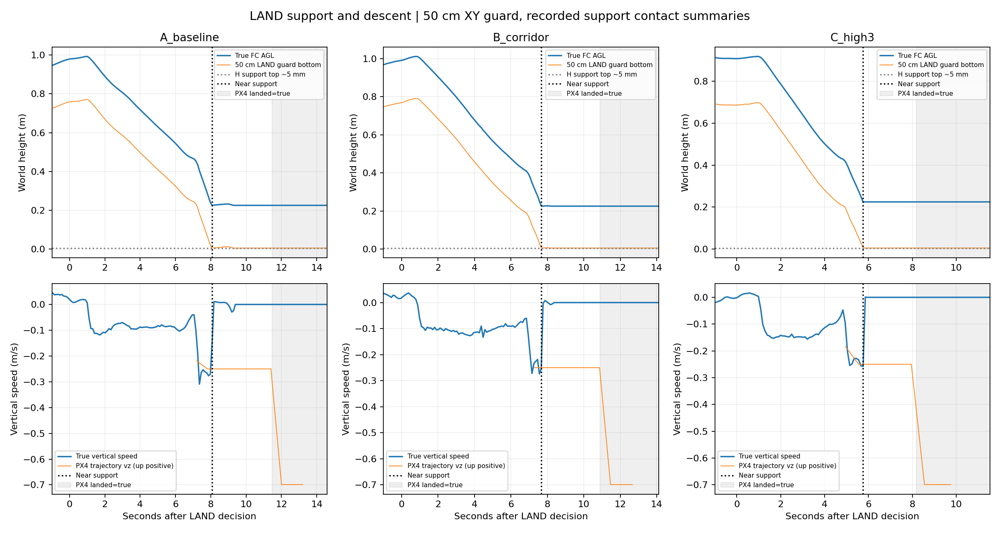
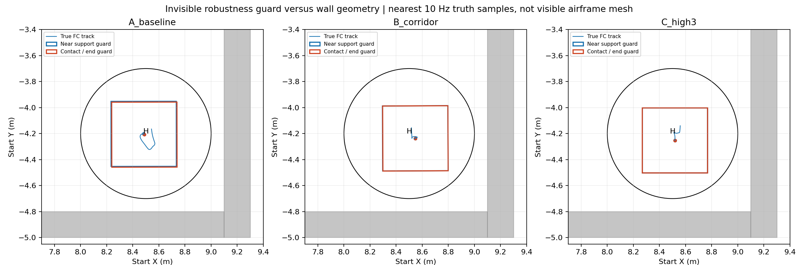

名义巡航高度不是硬高度封顶：本轮真实FC最高A/B/C分别为2.804/2.811/3.171m，工程全场Gate采用4m。若后续把3.0m作为绝对上限，需要单独控制跟踪超调，不能用“配置3m”替代真实高度检查。H窗口内A最高约0.993m是允许的识别/接近，不再误套原走廊0.7m窗口。

## 5. 投递对齐精度与等待

本轮九次成功mock ACK时，真实FC中心到靶模型中心的误差：**中位8.01cm，P95 11.89cm，最大13.06cm；2/9≤5cm、7/9≤10cm、9/9≤15cm。** 修复前同组三版九次为中位10.56cm、P95 13.43cm、最大15.08cm。本轮没有改变释放门槛，样本量小且不是独立重复精度试验，不能据此宣称已经完成专项精度优化。

| 轮次 | 投递槽 | 类别 | 真实误差/cm | ΔX/cm | ΔY/cm |
|---|---|---|---|---|---|
| A_baseline | 1 | bridge | 1.33 | 0.31 | -1.30 |
| A_baseline | 2 | panzer | 13.06 | -5.40 | -11.89 |
| A_baseline | 3 | red_cross | 7.58 | -1.91 | -7.34 |
| B_corridor | 1 | bridge | 3.48 | 3.42 | -0.65 |
| B_corridor | 2 | panzer | 8.01 | 0.13 | -8.01 |
| B_corridor | 3 | red_cross | 5.77 | -0.46 | -5.75 |
| C_high3 | 1 | red_cross | 10.14 | -0.37 | -10.14 |
| C_high3 | 2 | bridge | 9.85 | 0.42 | -9.84 |
| C_high3 | 3 | panzer | 8.38 | 1.22 | -8.29 |

九次ΔY均为负，平均-7.02cm，值得先排查共同的投影/对准偏差；同seed不能证明所有布局都如此。历史78次可重算成功ACK汇总中位9.06cm、P95 14.87cm、最大18.88cm；不同阶段和配置混合，仅作描述。实物释放口杆臂、机构延迟、盒体动力学/风等尚未纳入，这些数值不能称为实际投递落点误差。

panzer进入ALIGN至锁定释放证据分别为 **30.463/4.858/17.231s**。A期间释放许可记录主要为`no_release_commitment`，属于视觉对准/证据等待，不是规划器无进展恢复。本轮没有连续保留全部未通过视觉证据的像素偏差和拒绝细项，不能进一步唯一归因于中心漂移、像素门槛或稳定帧数。后续宜先补轻量诊断、分离等待原因，再讨论精度与耗时折中；本轮未落实后续优化。

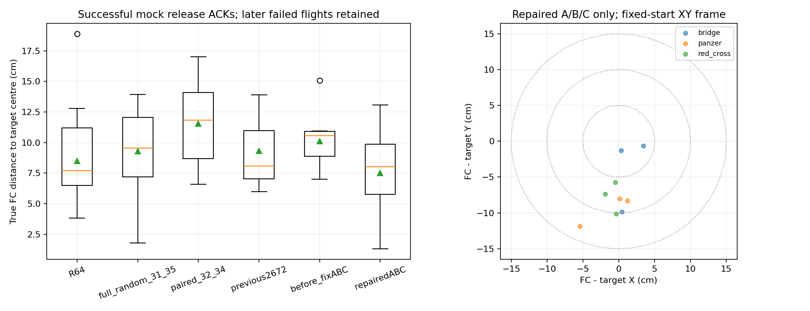
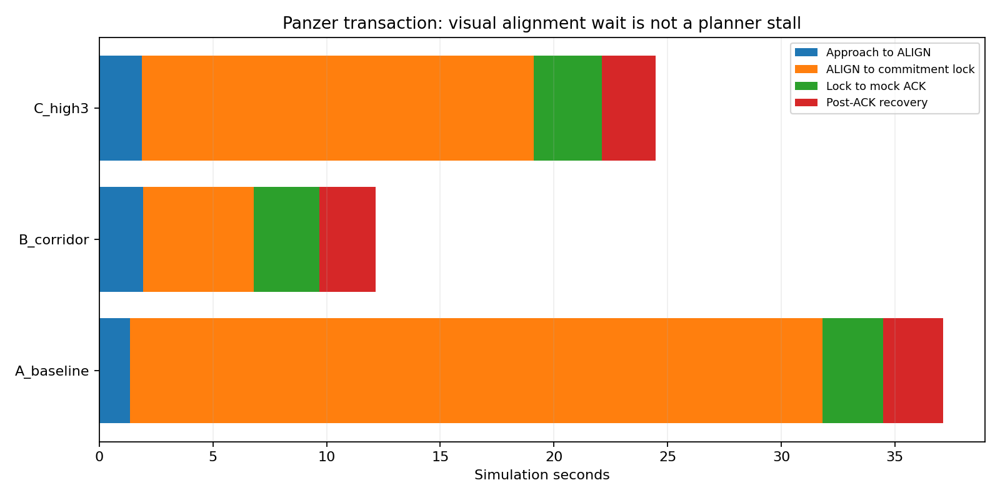

## 6. 停滞、速度与下一步

三轮初次规划成功等待均未超过3s，轨迹进展监视器恢复请求0次、恢复预算耗尽0次；旧A最后H初次规划约31.72s/36次尝试的现象未再出现。本轮不能证明历史所有seed的停滞都已彻底修复，且视觉对准等待仍明显存在。

真实移动速度（过滤≤0.03m/s样本后的中位数）：巡航约0.74–0.77m/s，投后进廊前转场约0.79–0.84m/s；A走廊约0.117m/s，B/C开阔走廊约0.300m/s，窄门约0.110–0.114m/s。配置上限不能当作全程平均速度。本轮下一步优先级建议：

1. 保留B作为这个场景下的候选；保持当前修复与视场，不因理想覆盖面积更大就直接默认3m。
2. 先分析panzer对准等待与ΔY共同偏差，力争同时缩短等待、提高真实精度；不先放宽释放条件。
3. 将停滞复发、错候选先访问、连续随机门极端位置、落地估计漂移列为后续回归范围。是否进一步实跑由后续任务安排，本批没有追加轮次。
4. 机构每投10s预算及成功反馈语义仍需落地；本轮只列预算，没有擅自接入硬件动作。
5. 时间优化继续停留在[文档研讨](../../planning/fov_landing_inner_20260919/NEXT_DISCUSSION.md)。若要确认高位优先相对传统遍历的净收益，需要相同新地图、相同速度和相同投递/机构预算的配对实验；本批没有用历史异布局数据冒充该对照。

## 7. 录像时长和播放方式

保留follow/overview两份原始渲染录像，另合成跟随视角主画面＋正上方小窗，中文阶段/FC真实高度/投递次数/最终结果。录像使用Gazebo服务端观察相机，无需打开Gazebo GUI，观察相机不参与控制。

原始视频写入固定帧率，与ROS时间采样不完全一致，所以此前约140s短片不等于任务仅140s。新`presentation.mp4`严格按原始图像ROS时间戳重采样为10fps，摄像机缺帧时保持上一帧，保留时间长度；视频通常比任务时间多约11s启动阶段，另有少量完成后收尾。HUD从首指令连续计时，收尾画面的计时可能略大于完赛值；表中完赛取Gate事件时间。H阶段HUD读取实际阶段和独立高度窗口，支持合法升高识别。

| 方案 | 任务/s | 原始跟随视频/s | 校正双视角/s | 视频链接 |
|---|---|---|---|---|
| A：2.6m原走廊 | 251.67 | 186.20 | 264.30 | [播放 A](../../../logs/fovfix2672_A_20260919_224157/presentation.mp4) |
| B：2.6m快走廊 | 187.73 | 143.20 | 199.70 | [播放 B](../../../logs/fovfix2672_B_20260919_230322/presentation.mp4) |
| C：3m快走廊 | 216.55 | 160.60 | 228.60 | [播放 C](../../../logs/fovfix2672_C_20260919_231830/presentation.mp4) |

视频解码检查、图片数量和全部本地链接核查见[validation.json](validation.json)。报告图表可在[index.html](index.html)逐轮浏览：完整XY轨迹、3D航迹、高度/姿态、速度、阶段/目标时间轴、进展监视与近地估计误差。

## 8. 复现与产物

三轮均使用`sim_run.sh`统一目录、单实例锁及结束收尾。需要新的用户运行授权才执行下一次SITL；以下列入口作为复现说明，不自动再启动：

```text
uav_high_view/fov_inner_repair.launch
scene_dir:=docs/verification/fov_landing_inner_20260919/seed_2672（实际运行使用绝对路径）
A: corridor_fast:=false high_agl:=2.6
B: corridor_fast:=true  high_agl:=2.6
C: corridor_fast:=true  high_agl:=3.0
```

笔记本使用rl_drone与既有模型。原始视频/CSV/ULog/日志留在各run，未入Git；报告、图表、配置和离线处理脚本入研究分支。无新全场bag，无额外seed或补跑。旧失败与旧报告全部保留。

离线汇总入口为`process_runs.py`，额外等待诊断为`alignment_waits.py`，报告生成`write_report.py`，验收`validate_artifacts.py`；这些脚本不启动仿真。已存在完整视频不会被覆盖。
