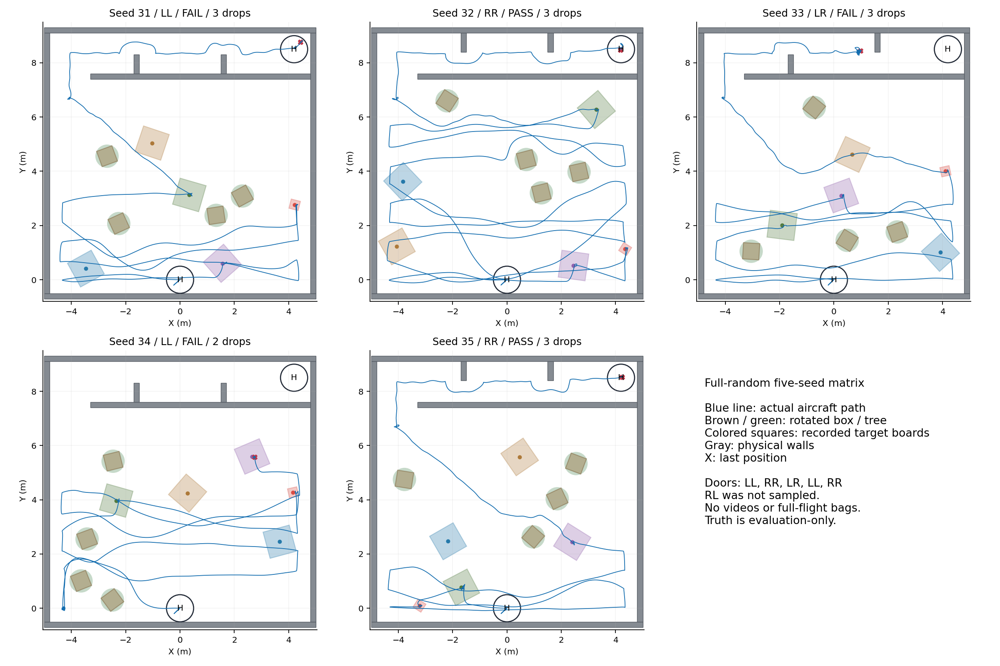
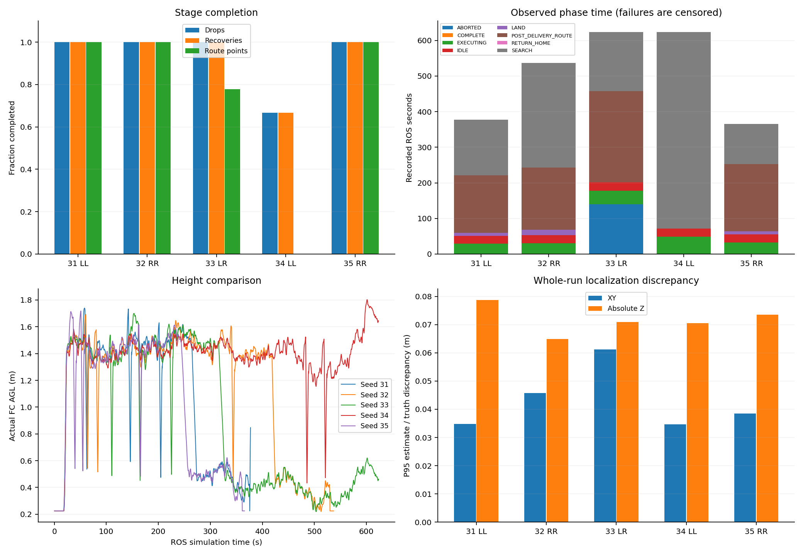

# 首次靶子、树箱、左右门全随机五seed矩阵

2026-09-11：[进一步离线分析](followup_20260911/REPORT.md)新增3张图，补充IMU时序、目标占据构成、覆盖重试与ABORT语义；不改变下述原始五组结果。

2026-09-10。按用户要求，五组串行完成后统一分析，**2/5完整PASS、4/5三投及三恢复、3/5走完9点投后路线与两门**。五组实际靶板均未发现与墙、树箱或其他靶板相交，只有seed31发生碰撞。没有补跑、替换失败或中途调参；没有新先导、实机动作、视频或全场bag。五次强制收尾与最后进程复查均通过。

这次新增的是**真实点云驱动的随机树箱/门飞行验证**：LL场景有完整过两门、RR有两次完整任务成功；LR在第二门前失败，RL没有抽到。不能宣称四种门组合全部验收，也不能把2/5当成总体可靠性的精确估计。

## 全部图表

[本地图表浏览页](index.html) · [五组横向对比](matrix_comparison.png) · [逐组完整指标](flight_metrics.json) · [原始批次索引](matrix_status.json) · [失败详细分析](FAILURE_ANALYSIS.md)。本报告配套20张图：五组场地/名义航线/实际航迹/指令/高度/阶段组合图、五组末段位置高度姿态图、两张总览、六张感知地图截面、两张关键规划停滞图。

| seed | 门组合 | 原始Gate | 三槽释放/恢复 | 投后航点 | 实际门数 | 结果 |
|---|---|---|---|---|---|---|
| [31](seed_31.png) | LL | FAIL 28/37 | 3/3、3/3 | 9/9 | 2/2 | H降落阶段碰北墙Wall_9 |
| [32](seed_32.png) | RR | **PASS 37/37** | 3/3、3/3 | 9/9 | 2/2 | 509.328s观测到自主落地；原Gate 513.573s |
| [33](seed_33.png) | LR | FAIL 22/37 | 3/3、3/3 | 7/9 | 1/2 | 第8投后目标规划失败，90s后ABORT，最终600s截尾 |
| [34](seed_34.png) | LL | FAIL 17/37 | 2/3、2/3 | 0/9 | 0/2 | 前两搜索目标四次90s超时，第三投未赶上600s |
| [35](seed_35.png) | RR | **PASS 37/37** | 3/3、3/3 | 9/9 | 2/2 | 339.889s观测到自主落地；原Gate 342.134s |

门数只数Wall_20/Wall_22两扇门；底层matrix_status的passages还包括corridor_entry，不能把3 passages写成3扇门。投后完成数用对应post_delivery_route决策的成功结果核对，普通故障RETURN_HOME不算投后航点。

## 时间、高度、路径及投递

| seed | 完整任务时间s | 已观测任务跨度s | 实际XY累计路程m | 最大FC离地高度m | 本机运行墙钟s |
|---|---:|---:|---:|---:|---:|
| 31 | 未完成 | 354.827 | 68.61 | 1.740 | 1302 |
| 32 | 513.573 | 514.192 | 114.79 | 1.692 | 1680 |
| 33 | 未完成 | 600.642 | 77.40 | 1.699 | 1900 |
| 34 | 未完成 | 600.583 | 69.40 | 1.803 | 1837 |
| 35 | 342.134 | 342.698 | 57.39 | 1.718 | 1109 |

正式任务时间从任务开始到完成，失败没有完成时间；已观测跨度延续到记录停止，包含Gate/ROS收尾的少量尾部，不能当成功耗时。图的横轴为ROS仿真时刻，含约22–23s任务启动前记录；两次成功完整ROS记录分别536.826s、365.535s，也均小于600s。五轮墙钟从10:11:59至12:22:38，约2小时11分钟；WSL低于实时速度，不能把本机墙钟当比赛用时。

两次成功的投后路线开始至disarm分别**188.431s、196.698s**；LAND交接至disarm分别14.225s、8.518s。R64此前成功样本的投后最长为181.580s，本批连成功样本也超过180s；仅用最后降落十几秒估算剩余时间明显不足。即使按用户提出的落地口径、不等待disarm，两次投后至ON_GROUND仍为185.628/194.685秒，180秒不足的结论不变。样本只有两次，不能据此设置新的保证阈值。本批提前返航仍关闭，没有启用450/150或420秒提前返航。

所有组Gate均未记录越界或超高。最大高度在1.69–1.80m AGL之间；低廊高度约束仍按0.7m核对，详见原始Gate。位姿CSV里的z是local FC高度，图中实际AGL=z+0.22；估计/指令也加0.22作同参考比较，但估计值不等于物理高度。全程P95定位差异不能掩盖末端短时失稳，seed31另有放大图。

五组共14次成功mock ACK，对应14次任务释放提交；回执接收时真实机体XY至该类别真值中心的距离约**1.68–14.02cm**。这是机体位置诊断，**不是包裹真实落点或实机投递精度**，未模拟/测量机械带载释放与弹道。各槽类别、时刻、高度及距离在flight_metrics.json的release_geometry中。

## 三个失败的关键结论

**seed31：降落近地估计与实际运动分离，随后回升碰墙。** 三投、三恢复、两门、9点路线均完成，368.951s发LAND，375.371s进入AUTO.LAND。375.604s真实local z约0.034；随后估计高度快速降低而实际高度回升，376.523s实际位置约(4.499,8.798,0.455)，邻近MAVROS约(4.125,8.395,-0.419)。376.560s护框接触Wall_9。AUTO.LAND交接附近航向目标跨度仅0.067°，自动降落段目标保持不变，未复现R63约90°重置问题。不能据此把问题完整归因于某个单一融合源或接地动力学；本轮没有取得落地确认。[末段诊断图](seed_31/terminal_diagnostics.png)、[飞控与位置细节](seed_31/diagnostic_details.json)。

**seed33：第二门后的中线目标在感知地图中被判占据。** 第一门通过，393.986s发第8/9目标(2.3,8.35,0.23local)，该目标累计110次新轨迹失败，90s后任务发ABORT。日志反复报告目标占据或超出地图、邻域找不到无碰撞替代。394.357s局部快照中，目标附近静态点最近约13.3cm、膨胀点最近约3.6cm，支持这是感知/占据地图与规划目标的矛盾；不能把点云最近距离单独当安全净空。无实际碰撞，也没有通过第二门或在终点落地；观察至600s终止。[关键停滞图](seed_33/planning_stall.png)、[局部地图截面](seed_33/local_map_failure_2.png)。

**seed34：主要耗时在搜索路径无法生成，并非单纯识别慢。** 约42.6–402.7s，(4.3,0,1.18)与(4.3,0.7,1.18)各尝试两次90s，四次总计约360s；飞机长时间留在西侧起始搜索端。四段分别95/93/92/96次新轨迹失败，日志为kinodynamic search fail/Can't find path。跳过后才逐渐继续覆盖，485.578s、520.955s完成前两投；595.300s开始第三个bridge，622.627s任务总时限附近证据截止，触发故障返航/ABORT且尚未回收。这不是420s提前返航。[360s停滞图](seed_34/planning_stall.png)、[第一目标地图](seed_34/local_map_failure_1.png)。仅有目标周围局部快照，尚不足以还原整条路径哪里不可达，不能宣称已经证明树箱实体完全封死通路。

## 降落计分与工程收尾口径（按用户补充复核）

规则书1786409924213228.pdf第13页2.5(6)要求在降落区完成自主降落10分、压边5分、区外0分；第15–16页要求落地后由裁判确认、未经允许不得移动飞机或快递盒。这里没有将PX4/MAVROS的`armed=false`规定为得分条件。disarm是飞控电机解除武装，与舵机空槽无关；停桨/解除武装作为工程收尾单列。

原37项Gate包含解除武装，保留其原始结果；另按实际终点区自主落地复核，仍为**2/5**，没有任何一组“已完成目标落地，只缺disarm”。31近地回升碰墙，33没有第二门/终点落地，34三投未完成。仅删除disarm检查不会使这些任务变成完成。

| seed | 首次ON_GROUND（ROS s） | 任务开始至落地s | 投后开始至落地s | 解除武装（ROS s，单列） |
|---|---:|---:|---:|---:|
| 32 | 531.962 | 509.328 | 185.628 | 534.765 |
| 35 | 362.726 | 339.889 | 194.685 | 364.739 |

落地时刻使用自主LAND之后的ON_GROUND事件，并结合终点真实包络检查；它是本地落地观测口径，不是裁判计时器。未单独记录桨叶RPM，不能把disarm日志声称为另一项独立停桨实测。[逐组复核](landing_assessment.json) · [规则说明](../../competition/RULES_20260906.md)。

## 成功降落与布设合法性

seed32、35最终中心距终点H分别**2.61cm、3.73cm**；按55×55×40cm三维保守包络旋转后八角投影，最大半径分别0.415m、0.425m，均在名义半径0.5m黑圈内，并有ON_GROUND/disarm。其余三组未完成落地回收，不能把最后一帧的几何距离当作落地精度。

五组实际靶位/朝向各不同；树箱由独立2031–2035生成，门由1031–1035生成。开跑前检查树箱与墙、目标采样可行；结束后用每轮冻结world、实际spawner真值做旋转矩形相交检查，五组靶板均无墙/树箱/靶板相交。本批修复后的布设不再带入旧R64的seed5/7/8压墙问题。合法布设仍可能有不良视场、局部地图或任务可达性问题。

自然抽样门组合为LL/RR/LR/LL/RR；未按结果挑选或补齐RL。LL两组中只有31进入走廊并通过两门；34未到走廊，不能拿它判断LL过门能力。RR两组完整成功；LR一组停在第二门前。几何可达、单门通过、全程Gate和实机验收分别记录。

## 与R60、R64的关系及后续

| 批次 | 全场PASS | 三投 | 两门与完整投后路线 | 随机化范围 |
|---|---|---|---|---|
| R60十seed | 2/10 | 8/10 | 6/10投后路线 | 旧机架/几何，靶位随机 |
| R64十seed原始记录 | 7/10 | 8/10 | 8/10 | 新机架，固定树箱/门；3组布设压墙 |
| 本批五seed | 2/5 | 4/5 | 3/5 | 修复布设，靶位/树箱/左右门随机，实验中线目标 |

本批40%与旧70%来自不同场景分布、样本量与投后路线，不能解释为严格配对的算法退化或增益；同样不能用两次RR成功替代全随机鲁棒验收。本批证明随机场景下部分完整闭环可行，也明确暴露降落、局部规划和搜索时间利用三个问题。优先级仅在[ROADMAP](../../../VISION_2026_ROADMAP.md)维护；本次未修复这三个飞行问题，未追加重跑。板端并发、真实执行器、机械落点和实机验收边界不变。

## 版本、参数和记录

冻结整机HEAD：`7eb94462170d0adce666754ec2547d79a71b29df`，分支`feat/full-random-five-seeds`。与R64部署源码相比，本轮飞行算法/控制/模型不变；矩阵编排支持逐seed场景文件。五组experiment runtime内容相同，固定墙前/墙后中线目标不含L/R答案，门真值仅加载到Gate私有参数。PX4沿用已构建R64补丁版本。五组关键EKF参数实读一致；启动期参数表尚未就绪的重试不能直接认定最终没设置，实读附件为准。

参数：搜索24点、local1.18/名义AGL1.40；接近local1.38；严格0.80m门/1.50m走廊；投后低廊指令local0.23；600s任务时限，目标动作120s、普通运动90s、同一搜索点最多两次失败；early_return_enabled=false。图中的24点名义搜索折线不是飞机实际扫过范围，也不是实际视场覆盖率。

[计划与种子定义](PLAN.md) · [收尾/归档清单](CLOSEOUT.md) · [复现方法](REPRODUCE.md) · [原始数据索引](archive_manifest.json)。原始run.log、CSV、关键事件、ULog和完整局部点云留本地logs；Git保留小报告、图表、冻结场景、参数实读与统计。所有图均由记录重画，没有生成或补造缺失的视频。
