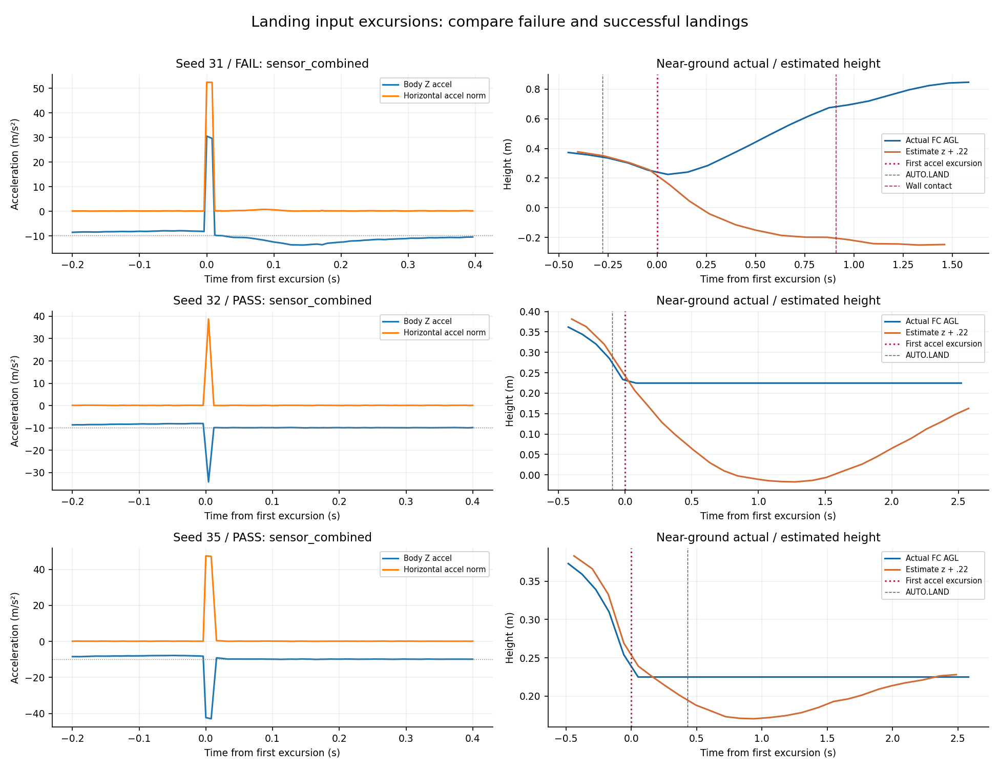
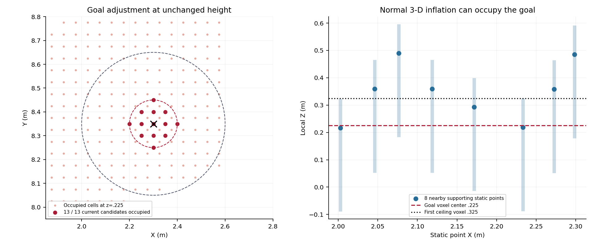
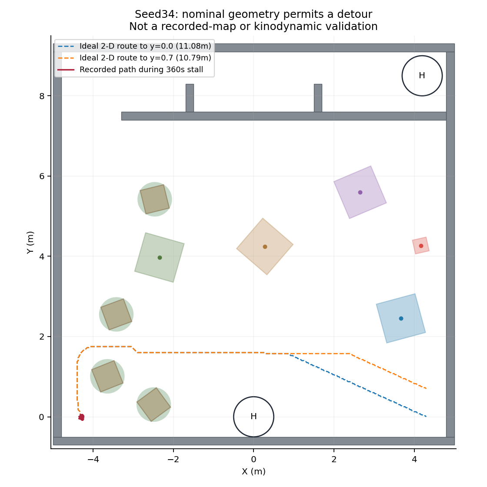

# 全随机失败的进一步离线分析（2026-09-11）

本次读取原五组日志/ULog/局部地图及对应代码，没有新SITL、实机动作、飞行代码修改或重新打包。原始2/5结果不变；本报告补充机制定位，不声称已经修复。关于比赛计分，仍按自主落地评价，disarm仅作工程状态记录。

## 1. seed31：优先追查近地IMU输入与积分，而不是再次处理航向重置

ULog与CSV给出的先后顺序如下（ULog仿真时钟与ROS接收时刻近似对应，不解释成亚毫秒同步）：

| 观测 | 时间s | 说明 |
|---|---:|---|
| AUTO.LAND状态收到 | 375.371 | 原任务已完成三投、两门与9个投后点 |
| sensor_combined首次明显加速度脉冲 | **375.650** | 机体三轴约(-37.15,+36.99,+30.51)m/s² |
| 真值与MAVROS位置差首次超过本次诊断用0.10m | **375.806** | 估计下降/向西南偏，实际随后回升/向东北偏 |
| 首次Wall_9接触 | **376.560** | 比首个脉冲晚约0.91s |
| 自动降落后首次气压观测拒绝 | **376.802** | 发生在初始估计分离与碰墙之后 |

近地窗口内xy/z/heading reset counter均未变化；此前已查到AUTO.LAND航向目标只变化约0.067°。因此没有证据将这次失败归为旧90°重置问题，首次气压拒绝也不是初始异常的先导。

**成功样本也有脉冲，差别不能简化为“有尖峰就会失败”。** seed32与35的水平加速度峰值也分别约38.74、47.48m/s²，但脉冲附近机体Z加速度是负向（最小−34.13、−42.94）；seed31出现正向+30.51。按日志估计姿态将短窗加速度转至NED并近似积分，31得到向下的速度增量约+0.32m/s，而32/35分别约−0.19/−0.24m/s，方向与失败样本的估计下降加剧相符。这只是输入冲量诊断，使用了估计姿态，不能当成独立真值速度或完整因果证明。

Gazebo IMU插件当前使用主刚体的RelativeLinearAccel并扣除重力、加入噪声；支撑/接触模型仍使用ODE。本批没有高频真实刚体速度和完整接触力记录，故尚不能区分接触动力学、IMU取样/积分链或其它输入问题，也不能直接断言Gazebo插件存在某个已证实bug。下一次针对性验证应在近地短窗口同步记录刚体速度/接触与IMU采样，再决定修改点。不要先通过加大气压权重、禁用碰撞或强制空中停机来掩盖现象。

[时序与对照指标](causal_timing.json) · [输入冲量近似](impulse_diagnostic.json)。诊断阈值只是定位显著变化，不是新增正式Gate。

## 2. seed33：不是单纯顶棚过低；现有同高度目标调整已经无候选

按实际0.05m栅格与地图原点(-6,-11,-0.2)还原目标(2.3,8.35,0.23)：目标落在z索引8，体素中心z=0.225；阶段顶棚0.33m从z索引10、体素中心0.325开始写占据。**顶棚不会直接把目标这一层写为占据。**

搜索区障碍柱只接受y≤7.6的源点；考虑0.30m水平膨胀与一个体素余量，最多影响至约y7.95，仍达不到目标邻域y8.25–8.45。因此也不能把它归为搜索障碍柱直接延伸到这里。

另一方面，局部static_map中有8个邻近点，其正常三维膨胀范围就足以覆盖目标体素。源码对所有点保留普通膨胀，水平方向6格、向上2格、向下6格。静态和膨胀快照分开接收，所以这证明了足以产生占据的机制，并非对同一输入点云的逐点重建。至于这些邻近回波来自实体表面、地图累积还是其它感知环节，已有局部记录还不能完全溯源。

对照nearbyFreeGoal实际的**固定高度、XY圆形采样**规则，在记录的膨胀图上检查：

| XY半径 | 候选数 | 未占据数 |
|---:|---:|---:|
| 当前0.10m | 13 | **0** |
| 0.15m | 29 | 0 |
| 0.20m | 49 | 0 |
| 0.25m | 81 | 0 |
| 0.30m | 113 | 2 |

0.30m附近才有未占据候选，例如(2.3,8.05,0.23)。这还没检验ESDF净空或动力学可达，而且已超过投后原航点约0.12m的到达容差。**单独放大goal_adjustment_radius并不是闭环修复**：还需要处理“感知得到的安全有效目标”和“任务层按哪个目标确认到达”的一致性。降低顶棚或删除占据同样缺乏依据。

对应代码：`plan_env/src/sdf_map.cpp::cloudCallback/applyFlightCeiling`、`plan_manage/include/plan_manage/goal_adjustment.h::nearbyFreeGoal`与`kino_replan_fsm.cpp::checkCollisionCallback`。[还原数据](map_attribution.json)。

## 3. seed34：四次90s是当前策略的结果，并非投递恢复循环出错

CoverageRoute在第一次失败后保留当前索引；MissionRuntime因尚未推进游标，将下一次请求标为RESUME；第二次失败才跳过该点。因此这里的`resume_interrupted_waypoint`也可表示普通搜索重试，不能只看名称就认定发生了投递中断恢复。

同一配置下，两个失败点的消耗自然是：2点×每点2次×每次90s=360s。底层一个动作期间不停重试规划，但任务层并不因几十次相同NO_PATH而提前推进覆盖索引。这种固定超时/重试组合解释了为何首投拖到485.578s。

当前记录参数：跨场目标距起点约8.6m，search/horizon=7.0m，每次搜索wall-time预算0.25s。与少量直接穿行相比，随机树箱需要绕行；较长局部视距与严格搜索预算可能增加失败，但现有日志不能确定每次退出究竟是预算到期、节点用尽还是无可行扩展。源码有一处内层预算到期直接返回NO_PATH而不打印预算警告，**没有对应警告不能排除搜索预算用尽**。

还有一个具体范围不匹配：SDF的local_update_range_x=8.5m，第一次失败日志的起点x≈−4.31354，目标x=4.3，相差8.61354m。按该里程计位置计算，更新窗右侧只到x≈4.18646；远端目标在窗外约11cm。cloudCallback只处理更新窗内点，原地等待并不能保证远端目标附近刷新。目标仍位于全局地图边界内，旧缓存也可能使它保持空闲，所以这不等于已经证明“目标越界导致NO_PATH”；应把全局边界、局部更新窗口和请求/有效目标一起记录和检查。

对原场景做了独立的理想二维几何反查：四树/箱采用0.43m包络，再加0.30m方形膨胀；墙体预留同等边界，0.025m栅格禁止斜穿占据角。两目标仍有约11.08m、10.79m绕行路径。这支持“不能宣称名义场地被完全封死”，但不是记录SDF或六维动力学规划验证，也不能据此证明真机必然可飞。

下一步应先使NO_PATH可区分原因、记录扩展节点/实际搜索耗时/局部进展，再比较可观测子目标、局部视距和覆盖失败预算。直接把90s缩短虽会少等，却可能只是更快放弃目标；不能当作路径问题已经解决。[几何反查数据](ideal_geometry.json)。

## 4. 一项额外明确的行为：ABORT确认只代表保持，不代表已落地

`navigation_planner_bridge.py`把ABORT转换成当前里程计位置的运动目标；`mission_core.py`确认后保持ABORTED。这里没有自动衔接LAND。seed33在约486s确认保持后，继续被观察约139s到总时限，符合这段代码逻辑。

这不是“解除武装太严格”的问题，而是故障任务结束后的动作策略尚未覆盖完整回收。后续应明确保持、可行位置降落和人工接管的选择与验收边界，不能将ABORT ACK等同自主落地，更不能直接把ABORT改成停电机。本次没有修改此行为。

## 本次清理与产物

删除今天两轮中间产物：e973ca6f、3883a8aa对应的四个tar.gz和两份JSON清单，合计193,399,612字节（约193.4MB/184.4MiB）。CURRENT仍指向d1ab9208最终机载/仿真两包，原始历史包和所有五组运行数据保留。[删除清单](cleanup.json)。

此前三轮打包分别处理元数据/包装入口、包根说明入口、旧D435i网格URI；前两轮没有及时清理是本次冗余来源。本次不再打包，离线分析只作本地提交。后续先在临时产物目录完成资源校验，再将最终一对交付包放入deliverables，收尾删除当轮草稿。
