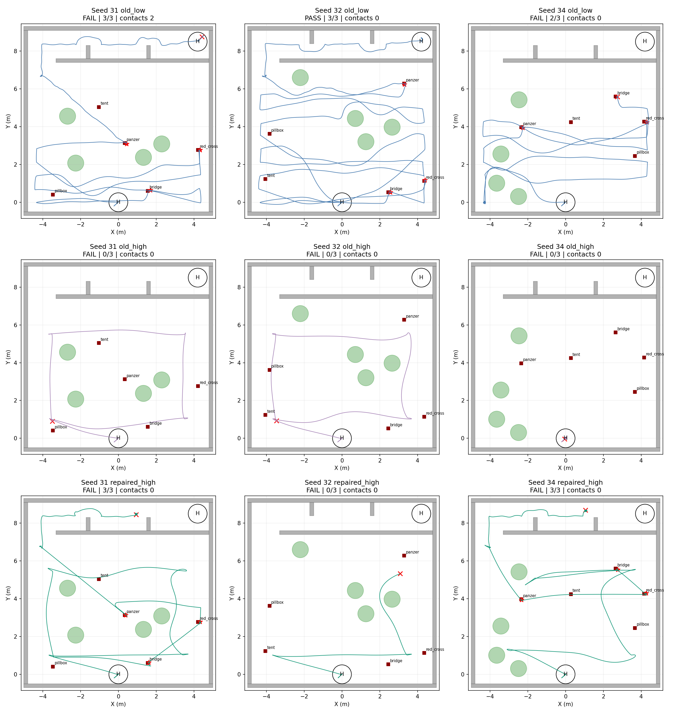
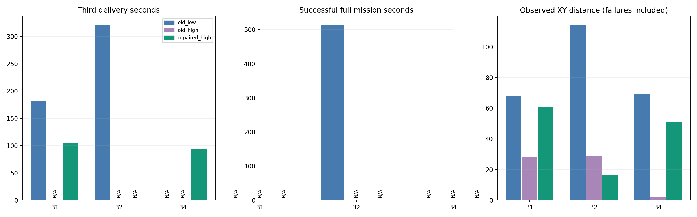
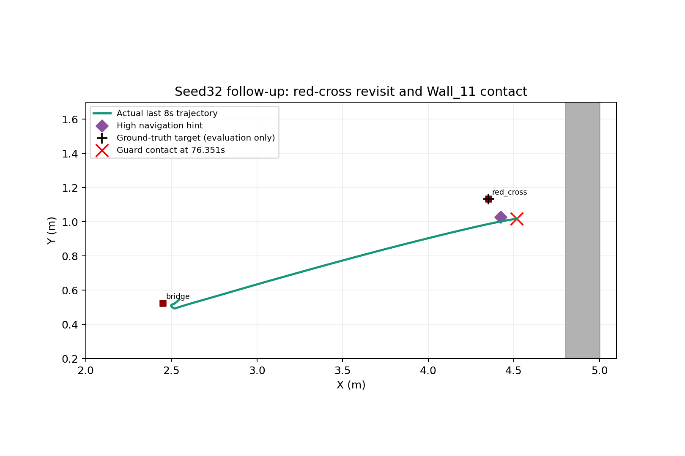

# 高位修复31/32/34重跑报告

[同场景历史过门与本轮停滞的专项复盘](CORRIDOR_REVIEW.md)：31历史确实能通过两门，本轮是轨迹就绪后执行停滞，不应统称初始规划不可达。下降解耦按用户意见保留。

首版冻结源码 `d463613b`，三轮各一次，无自动重试。完整PASS 0/3，完成三投 2/3。旧失败保留，不以此次重跑替换。

32暴露下降选择问题后另作相关补修，以 `a12750b5` 单独补验一次，结果 **FAIL**、2/3投递。共四次新运行；补验不合并成同版本三轮成功率，不覆盖32首版失败。

**结论：修复部分奏效，整场尚未通过。** 31的缺靶兜底与34的高位换点都实际完成三投，但随后卡在第二门；32补验两投后复访红十字时发生保护圈与Wall_11接触。按用户意见保留a12750b下降解耦和逐点排序，同时保留持久导航记忆、有界换点与低位兜底。两投后靠墙复访碰撞单列待修，不把整场FAIL归因于下降解耦，也不宣称通过部署验收。

| seed | 方案 | Gate | 投递 | 碰撞 | 三投(s) | 完赛(s) |
|---|---|---|---:|---:|---:|---:|
| 31 | old_low | FAIL | 3/3 | 2 | 182.10 | — |
| 31 | old_high | FAIL | 0/3 | 0 | — | — |
| 31 | repaired_high | FAIL | 3/3 | 0 | 104.42 | — |
| 32 | old_low | PASS | 3/3 | 0 | 321.14 | 513.57 |
| 32 | old_high | FAIL | 0/3 | 0 | — | — |
| 32 | repaired_high | FAIL | 0/3 | 0 | — | — |
| 34 | old_low | FAIL | 2/3 | 0 | — | — |
| 34 | old_high | FAIL | 0/3 | 0 | — | — |
| 34 | repaired_high | FAIL | 3/3 | 0 | 93.91 | — |
| 32 | repaired_high_v2 | FAIL | 2/3 | 1 | — | — |

相对历史低速遍历的同阶段节时：

| seed | 三投节时 | 双侧成功完赛节时 |
|---|---:|---:|
| 31 | 42.66% | 不可计算 |
| 32 | 不可计算 | 不可计算 |
| 34 | 不可计算 | 不可计算 |

32补版相对历史低速：三投节时不可计算，双侧成功完赛节时不可计算。

只有两侧均完成相同阶段才能计算节时；旧高位三轮均失败，不能以其较短终止时间评价优化。历史低速与本轮不是单变量消融。

## 理想高位视场


完整名义航线、水平姿态、航向0、FC AGL2.6m和相机低16cm，几何覆盖约96.8%；未计遮挡、转弯/倾斜、实际避障改道与中断。中央窄缝与左边缘漏区不能忽略；不能把该比例当实际识别召回。

## 前后航迹及时间





## 修复触发及逐轮结果

### seed31 repaired_high

终态 `TAIL`；状态摘要失败 `decision_pending`；原Gate原因 `manager_failed`。

首次合格线索：bridge, red_cross；最终持有：bridge, red_cross。

```json
[
  {
    "known": [
      "bridge",
      "red_cross"
    ],
    "stage": "PARTIAL_HINT_FALLBACK",
    "time": 62.705
  },
  {
    "committed_slots": 2,
    "entry_index": 9,
    "original_deadline": 611.654,
    "reason": "known_hints_exhausted",
    "stage": "LOW_COVERAGE_HANDOFF",
    "time": 97.002
  }
]
```

最终任务命令：`safety_motion_timed_out`。
下降诊断：`null`。
原始数据：`/home/xhj/liftrace-worktrees/r2026-high-view-search/logs/high_fallback_repair_seed31_20260915_124852`。

### seed32 repaired_high

终态 `SURVEY`；状态摘要失败 `no_local_descent_route`；原Gate原因 `manager_failed`。

首次合格线索：bridge, panzer, red_cross；最终持有：bridge, panzer, red_cross。

```json
[
  {
    "original_deadline": 124.032,
    "retired_seq": 4,
    "stage": "SURVEY_INTERRUPTED_TOP3",
    "time": 40.7
  }
]
```

最终任务命令：`research_segment_end:no_local_descent_route`。
下降诊断：`null`。
原始数据：`/home/xhj/liftrace-worktrees/r2026-high-view-search/logs/high_fallback_repair_seed32_20260915_130605`。

### seed34 repaired_high

终态 `TAIL`；状态摘要失败 `decision_pending`；原Gate原因 `manager_failed`。

首次合格线索：bridge, panzer, red_cross；最终持有：bridge, panzer, red_cross。

```json
[
  {
    "decision_seq": 2,
    "goal": [
      -3.5,
      1.0
    ],
    "stage": "SURVEY_NO_PROGRESS",
    "time": 22.719
  },
  {
    "scope": "COARSE_PROPOSAL_REQUIRES_3D_PLANNER",
    "stage": "SURVEY_ALTERNATIVE",
    "time": 22.719,
    "xy": [
      -2.945672280493228,
      1.2296100594190538
    ]
  },
  {
    "original_deadline": 141.471,
    "retired_seq": 6,
    "stage": "SURVEY_INTERRUPTED_TOP3",
    "time": 58.419
  }
]
```

最终任务命令：`safety_motion_timed_out`。
下降诊断：`null`。
原始数据：`/home/xhj/liftrace-worktrees/r2026-high-view-search/logs/high_fallback_repair_seed34_20260915_130829`。

### seed32 repaired_high_v2

终态 `REVISIT`；状态摘要失败 ``；原Gate原因 `actual_collision`。

首次合格线索：bridge, panzer, red_cross；最终持有：bridge, panzer, red_cross。

```json
[
  {
    "original_deadline": 122.656,
    "retired_seq": 4,
    "stage": "SURVEY_INTERRUPTED_TOP3",
    "time": 38.1
  },
  {
    "stage": "DESCENT_COLUMN_WITHOUT_FULL_TOUR",
    "time": 38.1,
    "xy": [
      3.558295965194702,
      4.945868968963623
    ]
  }
]
```

最终任务命令：`high_view_full:REVISIT`。
下降诊断：`{"current_blocked": false, "current_xy": [3.558295965194702, 4.945868968963623], "exit_blocked": false, "map_stamp": 37.946, "target_blocked": {"bridge": false, "panzer": false, "red_cross": true}, "time": 38.1}`。
原始数据：`/home/xhj/liftrace-worktrees/r2026-high-view-search/logs/high_fallback_descent32_seed32_20260915_132723`。

## 32补验碰撞及保留解耦的依据

补验在38.1s记录：感知图时间37.946s，当前位置下降柱未占据、走廊入口未占据，red_cross端点被粗栅格占据。它确实展示了下降可行与完整目标排序不应混为一谈，但不能据此倒推首版32的None具有完全相同原因。
补验已完成panzer和bridge投递，复访red_cross时保护圈接触Wall_11，Gate实际碰撞计数1。这里存在Gazebo接触事件，仍按本批原Gate记FAIL，未用此前约1mm事后投影容差改写结果。



```json
[
  {
    "pairs": [
      [
        "iris_mid360::iris::base_link::competition_guard_collision",
        "toudi2::Wall_11::Wall_11_collision"
      ]
    ],
    "ros_stamp": 76.351,
    "sequence": 1,
    "wall_time": 1789450326.8722703
  }
]
```

原先按整场FAIL回退整个补版的范围过大，现已撤销该本地回退。下降已完成且随后两投成功，碰撞发生于最后一次靠墙复访，不能据此否定下降解耦；恢复旧耦合反而会重新引入已知退出条件。后续应先处理靠墙目标的复访终点、到点减速和规划跟踪余量，再重新评价解耦方案；本次不继续补跑。31/34应另查投后第二门的规划停滞，不扩大修改本轮速度/地图。

## 实现和验证范围

持久导航记忆不刷新last_seen，不替代新鲜投递证据。高位8s无进展走原超时事务，最多一次0.6m横向候选替代再跳过，实际三维规划与全高障碍柱保留。部分线索优先复访，耗尽或重捕失败接原低位覆盖，保留已投槽位和原截止时间。
保留补版解耦下降柱与完整排序，完整排序失败时可先访问当前可达目标。首版181项、补版183项离线测试及两工作区构建通过；按用户意见恢复解耦后183项再次通过，三份飞行/测试文件与a12750b无差异。8s无进展可能误判长绕行，未对原成功33/35重跑，不宣称泛化稳定。
本轮未新增弱线索高位补视角、局部30s补扫或新动态尾段储备估计，先复用原覆盖。三场及32补验world/实际靶位/相机匹配检查通过。运行日志与图表仅笔记本SITL，不替代规则完整投影或板端实飞验收。

[所有图表](index.html) · [指标](metrics.json) · [配对检查](pairing.json) · [实现范围](STATUS.md)
