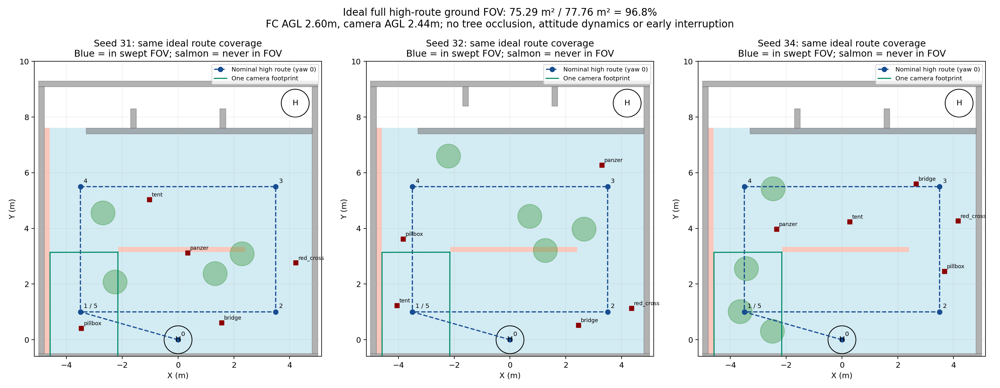

# 高位修复及31/32/34重跑

当前：冻结d463613的31/32/34三轮已结束，完整0/3 PASS；31和34完成三投，均在第二门附近的第8个投后航点超时。32已累计三类并中断高位，但退出于no_local_descent_route。原始失败全部保留。随后补修下降柱与完整三点排序的耦合，183项测试与构建通过，准备只对32补验一次。

完整名义路线、航向0、机体水平、飞控AGL2.6m、相机低16cm时，搜索区域77.76平方米的几何覆盖约75.29平方米（96.8%），单帧外接范围约2.43×4.33m。使用实际K/D反投影，2.5cm栅格估面积；中央窄缝及左边缘未覆盖。图上树和目标仅评测叠加；不计遮挡、转弯姿态、提前中断或实际避障改道，名义直线也不代表允许越树。

本轮实现：
- 已确认高位线索独立持久保存，短窗帧数不足不抹除；强证据冲突暂停，epoch/时钟/有效期限失效则清除。原始观测时间保留，不替代低位新鲜释放证据。
- 高位平面段连续8s无0.15m进展，走原超时事务；至多16个0.6m横向候选、一次替代，仍失败就跳过。粗栅格仅排序提案，实际三维规划器仍负责路径与占据判断，全高障碍柱保留。
- 线索未齐不直接结束：已有线索先低位复访；必要时经已验证升降位置下降，之后接入原低位覆盖。接入点按可达成本/转场距离选择，不把高位视场当作低位已覆盖。
- 复访超时或已知线索耗尽亦转入原覆盖，保持槽位、已投类别和原任务截止时间；低位航高/调整半径恢复。

本轮未增加弱线索高位换视角或局部30s补扫模块：先复用原覆盖兜底，避免把质量尚未明确的弱线索变成新导航点。返航时间预算沿用原任务逻辑，没有实现设计中的新动态尾段储备估计。端侧性能和规则实机验收不由本轮SITL代替。

补修：优先原完整路线排序；其不可用时，单独寻找新鲜感知图中的下降柱，再尝试当前可达目标的逐点重排。粗地图仍仅提案，实际三维规划与新鲜投递门控不变。新增下降诊断记录（地图时间、当前位置/目标/走廊入口是否占据）；第一轮32的None原因缺少这些字段，不能唯一归因为某一端点占据。

验证：首版`checks.sh`181项PASS，补版183项PASS，两次构建通过；原三轮都正常收尾。仅研究分支，机载部署不变。额外32补验单独记录，不并入原冻结三轮或覆盖其失败。
