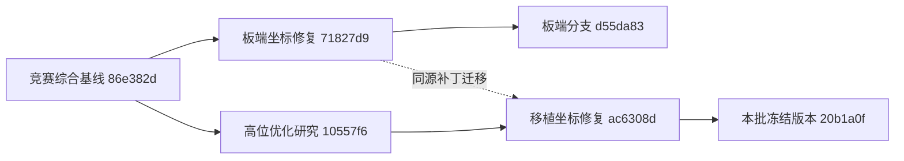

# 综合基线与坐标修复继承核实

当前高位研究是在竞赛综合基线上的增量实验。最初核查发现，综合基线已继承，但板端独立修复未进入研究分支；本次已补齐，不能把之前的缺口写成“一直存在”。

核实结果见[机器可读记录](frame_inheritance.json)：

- Git祖先检查确认86e382d在研究分支历史中；竞赛综合基线别名保留为86e382d，main未改动。
- `navigation_frame_adapter.py`、`map_camera_alignment.py`、`competition_hardware.launch`及原适配器测试与71827d9完全一致；三个运行文件也与当前板端分支d55da83一致。
- 硬件入口使用测量得到的`camera_init → map`对齐；MAVROS反馈转换到任务坐标系，任务设定点逆向转换回MAVROS坐标系。`vision_pose_tf`父坐标系为map，不再直接把MAVROS姿态标为camera_init。
- 7项适配器回归覆盖旋转和平移、逆变换、协方差和体坐标twist、错误帧、过期/未来/零时间、缺失TF、无效四元数；4项对齐回归覆盖非单位初始化、未解锁要求、错帧拒绝、跳变确认。
- 两工作区实际构建完成，两个节点的devel执行入口存在；硬件launch仅做静态展开与接线检查，没有启动硬件节点。

本批五轮是SITL，沿用竞赛仿真原有的定位接线，不会启动真实雷达/相机/投递执行器。板端动态对齐的非单位变换通过离线回归验证；五轮飞行本身不构成板端动态TF或实机验收。未覆盖现有机载部署或重新生成旧交付包。
