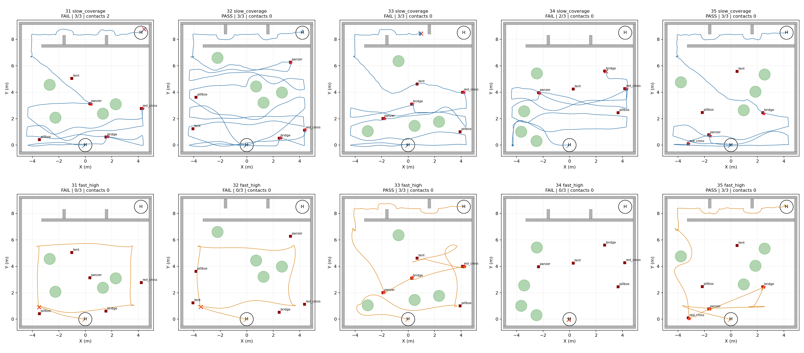
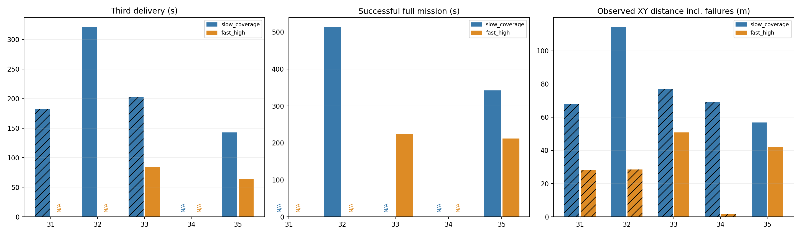
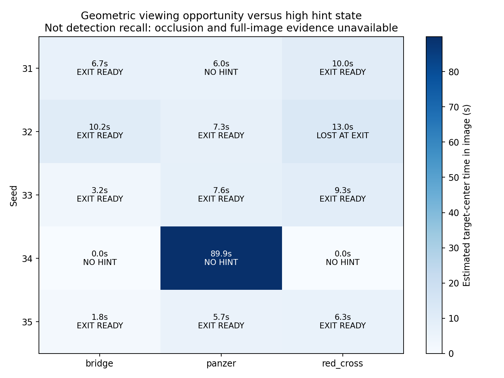

# 高空快速先搜五seed验证报告

本轮高位快速先搜完整通过 **2/5**，历史低速遍历为 **2/5**；三投完成分别2/5、4/5。全部预定seed31–35均保留，没有重跑替换失败。

**结论：当前版本尚不能稳定替代低速遍历。** 本批完整成功率没有提升，三投完成率下降。高位方案在部分可用场景有明显节时，但此前固定树两布局的成功不能外推到本批五套历史随机场景。

地图、树、门及实际靶位逐seed核对一致。历史低速源码7eb9446，新高位使用本批冻结源码；这是综合优化版本与历史数据的对照，不是严格单变量或统计显著性证明。失败终止策略/观察时长差异须与成功完赛指标分开理解。

| Seed | 方案 | Gate | 投递 | 碰撞 | 三投(s) | 成功完赛(s) | 原因 |
|---|---|---|---:|---:|---:|---:|---|
| 31 | slow_coverage | FAIL | 3/3 | 2 | 182.10 | — | actual_collision |
| 31 | fast_high | FAIL | 0/3 | 0 | — | — | manager_failed |
| 32 | slow_coverage | PASS | 3/3 | 0 | 321.14 | 513.57 | all_checks_passed |
| 32 | fast_high | FAIL | 0/3 | 0 | — | — | manager_failed |
| 33 | slow_coverage | FAIL | 3/3 | 0 | 202.38 | — | manager_failed |
| 33 | fast_high | PASS | 3/3 | 0 | 83.80 | 224.37 | all_checks_passed |
| 34 | slow_coverage | FAIL | 2/3 | 0 | — | — | full_trial_mission_timeout |
| 34 | fast_high | FAIL | 0/3 | 0 | — | — | manager_failed |
| 35 | slow_coverage | PASS | 3/3 | 0 | 142.64 | 342.13 | all_checks_passed |
| 35 | fast_high | PASS | 3/3 | 0 | 64.21 | 211.86 | all_checks_passed |

## 同场景提升效果

| Seed | 成功整场节时 | 三投节时 |
|---|---:|---:|
| 31 | 不可计算 | 不可计算 |
| 32 | 不可计算 | 不可计算 |
| 33 | 不可计算 | 58.59% |
| 34 | 不可计算 | 不可计算 |
| 35 | 38.08% | 54.98% |

只在两轮均完成相应阶段时计算节时；不把高位漏检或提前失败的短运行时间当作提效。单一平均成功用时不能代替成功率与失败机制。

## 工程基线及坐标修复继承

高位分支以竞赛综合86e382d为祖先。核查发现板端71827d9此前未自动继承，现已移植动态camera_init→map对齐、双向反馈/设定点适配和硬件launch接线；四个来源文件完全一致，CMake保留新研究内容并补安装/测试注册。7项适配器与4项对齐回归、实际构建和硬件XML接线检查通过。详见frame_inheritance.json。
SITL沿用综合仿真定位链，未启动真实设备或板端控制。非单位旋转/平移转换由离线回归验证，不能把仿真当作板端动态TF或实飞验收；没有覆盖正赛机载部署。

## 清理结果

删除36个本地及26个远端冗余引用，退休2个旧worktree，保留3个实际工作树。旧日志、交付资产与报告已归档，旧路径保留兼容链接；原始脏基线及独有分支保留。删除引用的提交仍由保留分支持有，详见CLEANUP.md及cleanup系列记录。

## 完整航迹与耗时

## 新高位逐轮诊断

### seed31

高位终态：`SURVEY`，失败原因：`survey_complete_missing_top3`；齐备线索：bridge, red_cross。原始目录：`/home/xhj/liftrace-worktrees/r2026-high-view-search/logs/high_fast_five_seed31_20260915_101053`。

实测最大FC离地高度2.77m，采样断档0次。失败项：committed_targets_were_selected, contract_errors_zero, doors_crossed_in_order, final_landed_on_ground, final_vehicle_disarmed, forced_return_within_limit, land_success, landing_align_mode_seen, landing_h_mark_valid, manager_complete, manager_post_delivery_route_matches, mission_ros_within_limit, post_delivery_return_goals, post_delivery_return_sequence, real_approach_commands, return_after_deliveries, return_before_land, return_home_success, three_capture_started, three_recovery_successes, three_release_commits。

观测统计：`{"accepted": 183, "candidate:profile_excluded": 1839, "candidate:state_not_confirmed": 16, "candidate:streak_too_short": 1978, "duplicate_or_too_close": 211}`。

退出时保存的可用线索集：bridge, red_cross。

### seed32

高位终态：`SURVEY`，失败原因：`survey_complete_missing_top3`；齐备线索：bridge, panzer, red_cross。原始目录：`/home/xhj/liftrace-worktrees/r2026-high-view-search/logs/high_fast_five_seed32_20260915_101502`。

实测最大FC离地高度2.80m，采样断档0次。失败项：committed_targets_were_selected, contract_errors_zero, doors_crossed_in_order, final_landed_on_ground, final_vehicle_disarmed, forced_return_within_limit, land_success, landing_align_mode_seen, landing_h_mark_valid, manager_complete, manager_post_delivery_route_matches, mission_ros_within_limit, post_delivery_return_goals, post_delivery_return_sequence, real_approach_commands, return_after_deliveries, return_before_land, return_home_success, three_capture_started, three_recovery_successes, three_release_commits。

观测统计：`{"accepted": 219, "candidate:profile_excluded": 2053, "candidate:state_not_confirmed": 80, "candidate:streak_too_short": 2056, "duplicate_or_too_close": 265}`。

退出时保存的可用线索集：bridge, panzer。

### seed33

高位终态：`TAIL`，失败原因：``；齐备线索：bridge, panzer, red_cross。原始目录：`/home/xhj/liftrace-worktrees/r2026-high-view-search/logs/high_fast_five_seed33_20260915_101944`。

实测最大FC离地高度2.76m，采样断档0次。失败项：无。

观测统计：`{"accepted": 157, "candidate:profile_excluded": 13972, "candidate:state_not_confirmed": 3457, "candidate:streak_too_short": 12499, "duplicate_or_too_close": 193}`。

退出时保存的可用线索集：bridge, panzer, red_cross。

### seed34

高位终态：`SURVEY`，失败原因：`motion_failed:SURVEY`；齐备线索：无。原始目录：`/home/xhj/liftrace-worktrees/r2026-high-view-search/logs/high_fast_five_seed34_20260915_103731`。

实测最大FC离地高度2.77m，采样断档0次。失败项：committed_targets_were_selected, contract_errors_zero, doors_crossed_in_order, final_landed_on_ground, final_vehicle_disarmed, forced_return_within_limit, land_success, landing_align_mode_seen, landing_h_mark_valid, manager_complete, manager_post_delivery_route_matches, mission_ros_within_limit, post_delivery_return_goals, post_delivery_return_sequence, real_approach_commands, return_after_deliveries, return_before_land, return_home_success, three_capture_started, three_recovery_successes, three_release_commits。

退出时保存的可用线索集：无/未执行退出评估。

### seed35

高位终态：`TAIL`，失败原因：``；齐备线索：bridge, panzer, red_cross。原始目录：`/home/xhj/liftrace-worktrees/r2026-high-view-search/logs/high_fast_five_seed35_20260915_104526`。

实测最大FC离地高度2.79m，采样断档0次。失败项：无。

观测统计：`{"accepted": 131, "candidate:profile_excluded": 10569, "candidate:state_not_confirmed": 3411, "candidate:streak_too_short": 9252, "duplicate_or_too_close": 145}`。

退出时保存的可用线索集：bridge, panzer, red_cross。

## 失败机制与下一步

- seed31：高位路线结束仍未形成panzer合格导航线索，退出集合仅bridge/red_cross。几何估计Panzer中心约6.0s在像面内，不能简单认定完全没覆盖；遮挡、实际识别和质量过滤仍需原图/逐条候选记录区分。
- seed32：曾分别形成三类提示，但高位退出时red_cross不再可用，最终零投递。这不是“从未发现第三类”；当前实现按现时Catalog.hints及唯一类别集合判断终止，观测窗重置、投票/不确定度和歧义过滤均可能改变集合。现有记录不能确定是哪一项使red_cross失效。
- seed34：起飞上升后，第一个高位平面目标(-3.5,1,2.38)处于地图内但被膨胀占据，0.30m邻域没有可用点；约90s后运动失败，未开始投递。应处理不可达高位航点，不能靠从障碍顶上穿越解决。
- seed33/35：完成三投、两门和降落，0碰撞。seed33把旧未完成场景跑通；只有seed35两方案都完整成功，可给整场节时38.08%。不能用不同成功子集的均值声称整批节时。

后续优先级：先分离持久导航线索与短时观测窗，并保留低空新鲜重捕/释放门控；再增加高位未齐目标后的有界低空补搜或回退，以及不可达高位航点的横向替代/跳过。最后补同步原图和候选拒绝原因，再检验视场/遮挡与参数。上述改进本批未实施，不能算作已验证效果。

该图由10Hz真值位姿、相机K/D和既有下视安装关系作几何估计，只计算目标中心是否进入像面，不含遮挡或实际神经网络检出。EXIT READY为高位退出时可用；LOST AT EXIT表示曾形成提示但退出时不可用。不能将几何时间解释为检测召回率。

## 规则与解释边界

工程来源与坐标继承见[INHERITANCE.md](INHERITANCE.md)，分支和worktree清理见[CLEANUP.md](CLEANUP.md)，五轮配对、原始Gate、53张图及收尾检查见[validation.json](validation.json)。板端双向坐标适配器已移植并通过11项离线测试和构建；本批SITL不等于板端动态TF实飞验收。

保留全高障碍柱，不采用已撤回的柱顶截断；高位仅允许0.30m水平目标调整，低位恢复0.15m。原飞行Gate仍含0.7m走廊工程阈值；不能直接把规则墙高1.5m代替本批原判据。零碰撞不等于整机在障碍水平投影外已有完备证明，此前保守包络投影疑点仍保留；本报告不据飞行Gate宣称最终规则/实机验收。

[全部图表浏览](index.html) · [原始运行索引](runs.json) · [对照指标](metrics.json) · [同场景校验及节时](paired_comparison.json)。所有分析用rl_drone，未记录全场bag/视频。
