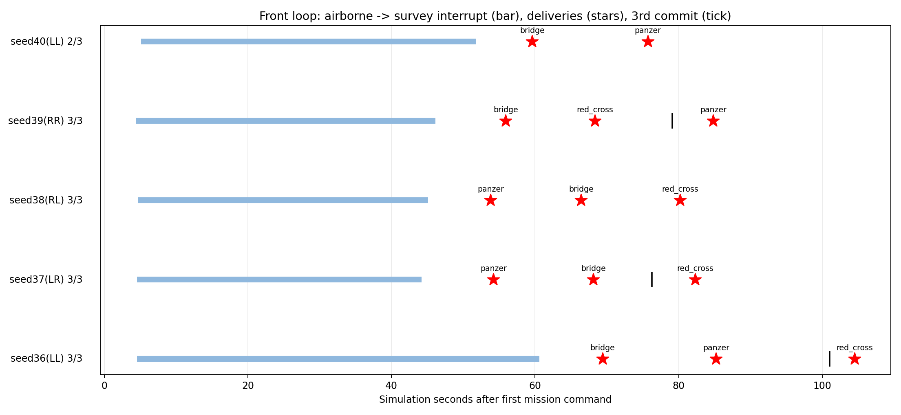
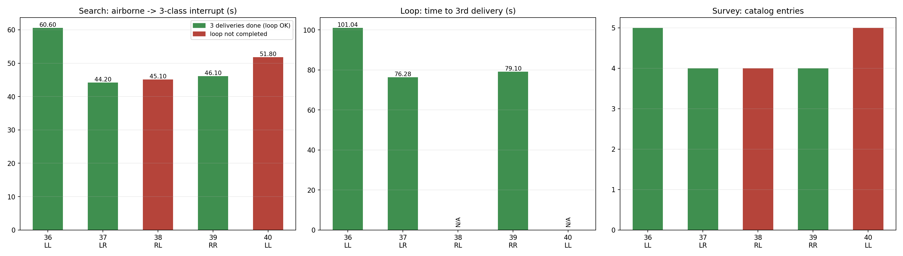
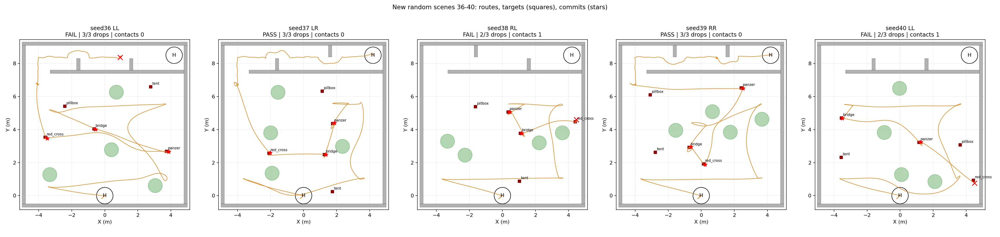
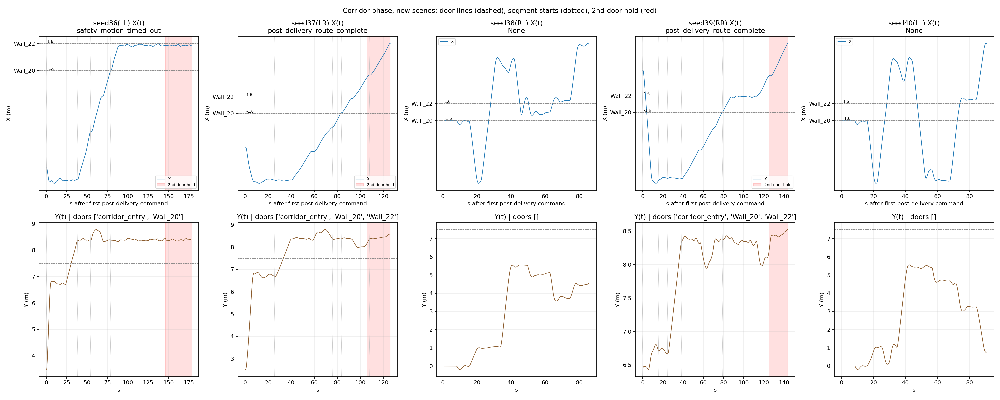
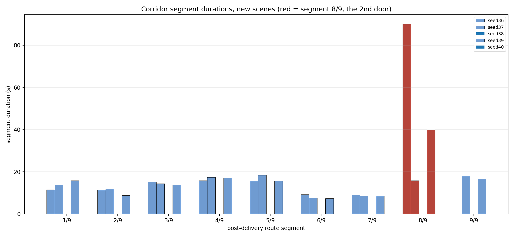
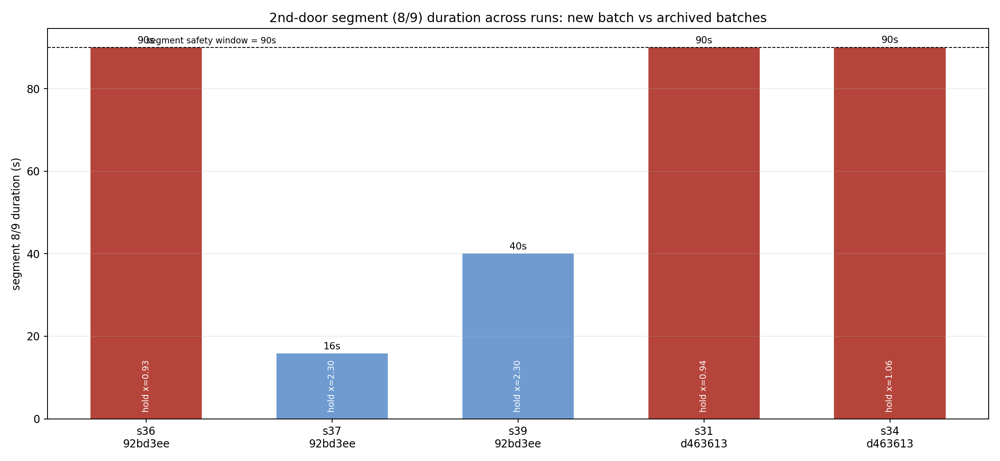
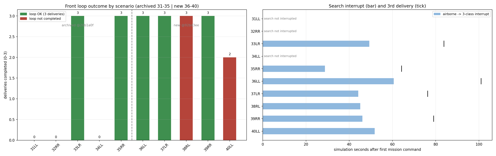

# 新随机场景 36–40 高位策略闭环鲁棒性报告

本轮在 5 个**全新全随机场景**（树 obstacle_seed、门 door_seed/门型、靶 field_seed 均随机）上各跑 1 轮，评估现有高位策略「起飞→搜索→投递」闭环鲁棒性。结果：闭环（三投齐备）**3/5**，投递合计 14/15，整场 Gate PASS **2/5**，碰撞合计 2。所有预定场景均保留，失败未重跑替换。

本批按用户要求**重点分析走廊问题**：专项定位投后路线第 8 段（第二门 Wall_22，x=+1.6）的停滞现象，见第三节；后段其余失败原因单列在第二节。

补充分析（37/39 降落确认、38/40 近墙碰撞几何根因、重规划停滞的三条件死锁分析、以及已计划但未实现项逐条核对）见 [ANALYSIS_landing_collision_replan.md](ANALYSIS_landing_collision_replan.md)。

门型分配：36=LL、37=LR、38=RL、39=RR、40=LL（LL 为 seed31 同类，加权两组）。场景由本仓 `simulation_tools/tools/export_r2026_scene.py` 生成；生成器已用归档 seed31 复现校验（field.world/field_config/gate_geometry 逐字节一致）。

## 一、前段闭环（本次重点）

| Seed | 门型 | 起飞(s) | 搜索中断(s) | 目录条目 | 齐备线索 | 投递事件 | 已提交 | 三投(s) | 环路 | 退出阶段 |
|---|---|---:|---:|---:|---|---:|---:|---:|---|---|
| 36 | LL | 4.54 | 60.60 | 5 | bridge, panzer, red_cross | 3/3 | 3/3 | 101.04 | OK | TAIL` decision_pending` |
| 37 | LR | 4.54 | 44.20 | 4 | bridge, panzer, red_cross | 3/3 | 3/3 | 76.28 | OK | TAIL`` |
| 38 | RL | 4.69 | 45.10 | 4 | bridge, panzer, red_cross | 3/3 | 2/3 | — | FAIL | DELIVERY`` |
| 39 | RR | 4.44 | 46.10 | 4 | bridge, panzer, red_cross | 3/3 | 3/3 | 79.10 | OK | TAIL`` |
| 40 | LL | 5.15 | 51.80 | 5 | bridge, panzer, red_cross | 2/3 | 2/3 | — | FAIL | REVISIT`` |

### 环内碰撞（原始接触对，含归档轮）

| 场景 | 来源 | 时刻(s) | 接触对 | 当时进度 |
|---|---:|---|---|---|
| 38(RL) | 92bd3eed | 85.20 | base_link vs competition_guard_collision, Wall_11 vs Wall_11_collision | 投递事件 3/3、已提交 2/3 |
| 40(LL) | 92bd3eed | 90.15 | base_link vs competition_guard_collision, Wall_11 vs Wall_11_collision | 投递事件 2/3、已提交 2/3 |
| 32(RR) | a12750b | 76.35 | base_link vs competition_guard_collision, Wall_11 vs Wall_11_collision | 归档轮 |

碰撞对象分布：Wall_11 x3。三次 Wall_11 接触分别发生在 a12750b/seed32（t~76.4s）、本批 seed38（t~85.2s）与 seed40（t~90.2s），均在第三次投递前后；该墙体附近是本策略在搜索-投递末段的高风险区，具体净空/绕行机制需单列分析。

## 二、后段（走廊/门/降落，单列不计入闭环结论）

| Seed | 过门 | 投后路线 | 走廊限高违规 | 降落 | disarm | 整场 Gate | 原因 |
|---|---:|---|---:|---|---|---|---|
| 36 | 2 | 7/9 | 0 | FAIL | FAIL | FAIL | manager_failed |
| 37 | 3 | 9/9 | 0 | OK | OK | PASS | all_checks_passed |
| 38 | 0 | 0/9 | 0 | FAIL | FAIL | FAIL | actual_collision |
| 39 | 3 | 9/9 | 0 | OK | OK | PASS | all_checks_passed |
| 40 | 0 | 0/9 | 0 | FAIL | FAIL | FAIL | actual_collision |

## 三、走廊段专项：第二门前停滞（Wall_22, x=+1.6）

走廊段定义为投后路线 1/9→9/9；第 5 段目标需穿越 Wall_20（x=-1.6），第 8 段目标需穿越 Wall_22（x=+1.6）。「停滞」= 该段内真值位移步长 ≤1cm 的尾段长度；「保持指令 x」= 段末规划器设定点（1cm 判据）的 x 值，可复核 `corridor_evidence.json`。

### 本次新场景

| 场景 | 来源 | 过门 | 第5段(一门前) 时长/停滞 | 第8段(二门前) 时长/停滞 | 段末设定点 x | 距二门线 | 终止原因 |
|---|---|---|---|---|---|---:|---|
| 36(LL) | 92bd3ee | corridor_entry, Wall_20 | 15.7s / 0.9s | 90.0s / 90.0s | 0.93m | 0.67m | safety_motion_timed_out |
| 37(LR) | 92bd3ee | corridor_entry, Wall_20, Wall_22 | 18.4s / 0.9s | 15.9s / 0.6s | 2.30m | -0.70m | post_delivery_route_complete |
| 38(RL) | 92bd3ee | 无 | — | — | — | — | — |
| 39(RR) | 92bd3ee | corridor_entry, Wall_20, Wall_22 | 15.7s / 0.6s | 40.0s / 0.7s | 2.30m | -0.70m | post_delivery_route_complete |
| 40(LL) | 92bd3ee | 无 | — | — | — | — | — |

### 历史归档（同一测量口径）

| 场景 | 来源 | 过门 | 第5段(一门前) 时长/停滞 | 第8段(二门前) 时长/停滞 | 段末设定点 x | 距二门线 | 终止原因 |
|---|---|---|---|---|---|---:|---|
| 31(LL) | d463613 | corridor_entry, Wall_20 | 18.9s / 1.1s | 90.0s / 90.0s | 0.94m | 0.66m | safety_motion_timed_out |
| 32(RR) | d463613 | 无 | — | — | — | — | — |
| 34(LL) | d463613 | corridor_entry, Wall_20 | 14.5s / 2.9s | 90.0s / 86.2s | 1.06m | 0.54m | safety_motion_timed_out |
| 32(RR) | a12750b | 无 | — | — | — | — | — |
| 31(LL) | 20b1a0f | 无 | — | — | — | — | — |
| 32(RR) | 20b1a0f | 无 | — | — | — | — | — |
| 34(LL) | 20b1a0f | 无 | — | — | — | — | — |

整轮日志计数（`kinodynamic search fail` 行不带 ROS 时间戳，无法按段切分，故只给整轮值）：

| 场景 | 来源 | kinodynamic search fail | no planner command received | Time jump detected |
|---|---|---:|---:|---:|
| 36(LL) | 92bd3ee | 13 | 6 | 25 |
| 37(LR) | 92bd3ee | 6 | 2 | 14 |
| 38(RL) | 92bd3ee | 5 | 1 | 5 |
| 39(RR) | 92bd3ee | 6 | 2 | 14 |
| 40(LL) | 92bd3ee | 3 | 2 | 5 |
| 31(LL) | d463613 | 4 | 5 | 18 |
| 32(RR) | d463613 | 1 | 1 | 2 |
| 34(LL) | d463613 | 15 | 3 | 17 |
| 32(RR) | a12750b | 2 | 2 | 5 |
| 31(LL) | 20b1a0f | 0 | 2 | 4 |
| 32(RR) | 20b1a0f | 1 | 1 | 4 |
| 34(LL) | 20b1a0f | 107 | 1 | 8 |

复发性：本批到达第 8 段的 3 个 run 中 1 个跑满安全窗（90s）后超时；归档批（d463613）到达该段的 2 个 run 中 2 个同样跑满 90s。即：该停滞在**不同源码版本、不同随机场景上重复出现**，但并非每次到达该段都发生——本批 seed37/39 分别用 15.9s、40.0s 正常通过。

结论口径：本专项只描述可复现现象与代码窗口（设定点保持 + 无位移 + 规划失败计数），不认定唯一根因；现场 `trajectory_progress` hold 标志未记录，离线构造的 0.25m 偏差反例（见 `high_fallback_repair_20260915/CORRIDOR_REVIEW.md`）不等于现场触发条件。

## 四、跨批次汇总（31–40 共 10 场景，闭环口径）

归档高位批次（源码 20b1a0f）闭环 2/5；本批新场景（源码 92bd3ee）闭环 3/5。两组源码不同（本批含 d463613 兜底修复与 a12750b 下降解耦），因此这是覆盖度汇总而非单变量对照。

| 场景 | 门型 | 来源 | 环路 | 投递 | 搜索中断(s) | 三投(s) | 整场 Gate | 原因 |
|---|---|---|---|---:|---:|---:|---|---|
| 31 | LL | 20b1a0f | FAIL | 0/3 | — | — | FAIL | manager_failed |
| 32 | RR | 20b1a0f | FAIL | 0/3 | — | — | FAIL | manager_failed |
| 33 | LR | 20b1a0f | OK | 3/3 | 49.30 | 83.80 | PASS | all_checks_passed |
| 34 | LL | 20b1a0f | FAIL | 0/3 | — | — | FAIL | manager_failed |
| 35 | RR | 20b1a0f | OK | 3/3 | 28.80 | 64.21 | PASS | all_checks_passed |
| 36 | LL | 92bd3ee | OK | 3/3 | 60.60 | 101.04 | FAIL | manager_failed |
| 37 | LR | 92bd3ee | OK | 3/3 | 44.20 | 76.28 | PASS | all_checks_passed |
| 38 | RL | 92bd3ee | FAIL | 3/3 | 45.10 | — | FAIL | actual_collision |
| 39 | RR | 92bd3ee | OK | 3/3 | 46.10 | 79.10 | PASS | all_checks_passed |
| 40 | LL | 92bd3ee | FAIL | 2/3 | 51.80 | — | FAIL | actual_collision |

解释边界：归档批次的运行条件（场景随机种子、机型、相机、模型质量门槛）与参数在 `high_fast_five_20260915/REPORT.md` 中单列；本表只做「前段闭环是否完成」的覆盖度合并，不把两批的不同源码与不同场景混为一次受控对比。

## 五、逐场景图表

### seed36（LL）

环路：完成三投（投递事件 3/3、已提交 3/3）；高位终态 `TAIL`，失败原因 `decision_pending`。
后段：过门 2、投后路线 7/9、整场 Gate `FAIL`（manager_failed）。
碰撞：无。
原始目录：`/home/xhj/liftrace-worktrees/r2026-high-view-search/logs/high_fast_new_seed36_20260915_180729`。

### seed37（LR）

环路：完成三投（投递事件 3/3、已提交 3/3）；高位终态 `TAIL`，失败原因 `无`。
后段：过门 3、投后路线 9/9、整场 Gate `PASS`（all_checks_passed）。
碰撞：无。
原始目录：`/home/xhj/liftrace-worktrees/r2026-high-view-search/logs/high_fast_new_seed37_20260915_182936`。

### seed38（RL）

环路：未完成（投递事件 3/3、已提交 2/3）；高位终态 `DELIVERY`，失败原因 `无`。
后段：过门 0、投后路线 0/9、整场 Gate `FAIL`（actual_collision）。
碰撞：t=85.20s base_link vs competition_guard_collision, Wall_11 vs Wall_11_collision。
原始目录：`/home/xhj/liftrace-worktrees/r2026-high-view-search/logs/high_fast_new_seed38_20260915_184340`。

### seed39（RR）

环路：完成三投（投递事件 3/3、已提交 3/3）；高位终态 `TAIL`，失败原因 `无`。
后段：过门 3、投后路线 9/9、整场 Gate `PASS`（all_checks_passed）。
碰撞：无。
原始目录：`/home/xhj/liftrace-worktrees/r2026-high-view-search/logs/high_fast_new_seed39_20260915_184841`。

### seed40（LL）

环路：未完成（投递事件 2/3、已提交 2/3）；高位终态 `REVISIT`，失败原因 `无`。
后段：过门 0、投后路线 0/9、整场 Gate `FAIL`（actual_collision）。
碰撞：t=90.15s base_link vs competition_guard_collision, Wall_11 vs Wall_11_collision。
原始目录：`/home/xhj/liftrace-worktrees/r2026-high-view-search/logs/high_fast_new_seed40_20260915_190259`。

## 六、口径与边界

- 闭环成功定义为「完成 3 次投递（3 次 release/commit）」；后段走廊、过门与降落结果单列，不与闭环鲁棒性混算。
- 每轮为独立样本，n=1/场景；本报告度量的是新场景覆盖，不是同一场景的重复性统计。
- 高位仍只做导航提示，低空新鲜重捕/释放门控与低空走廊 0.7m 工程阈值均未改动；
  零碰撞不等于规则/实机验收，仿真结果不外推到板端部署。

[全部图表浏览](index.html) · [指标](metrics.json) · [汇总](summary.json) · [场景校验](scene_validation.json)。
