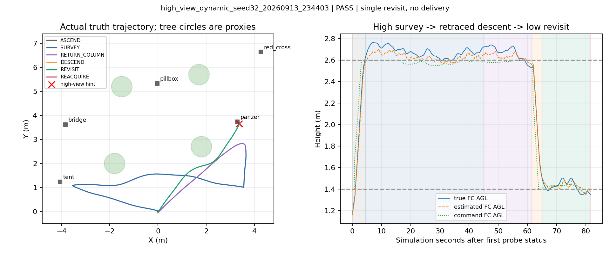
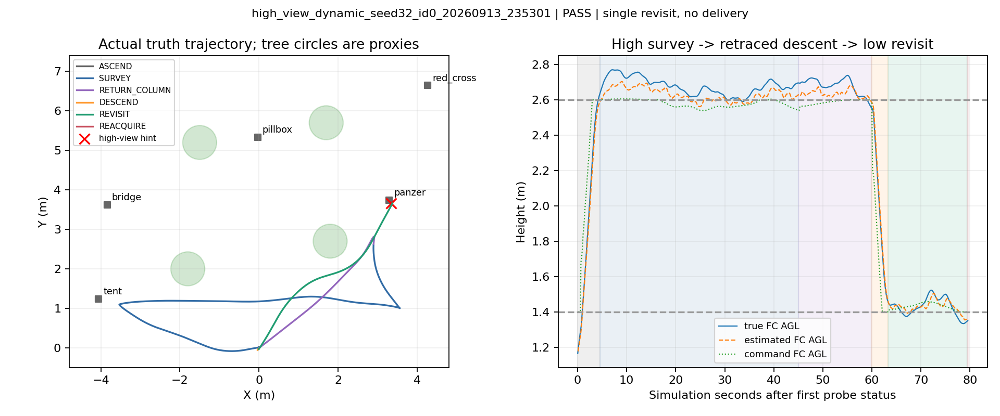
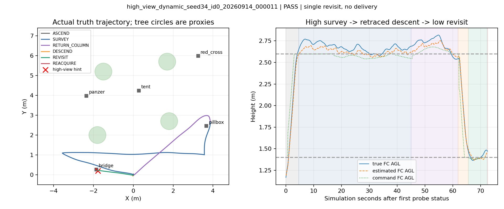
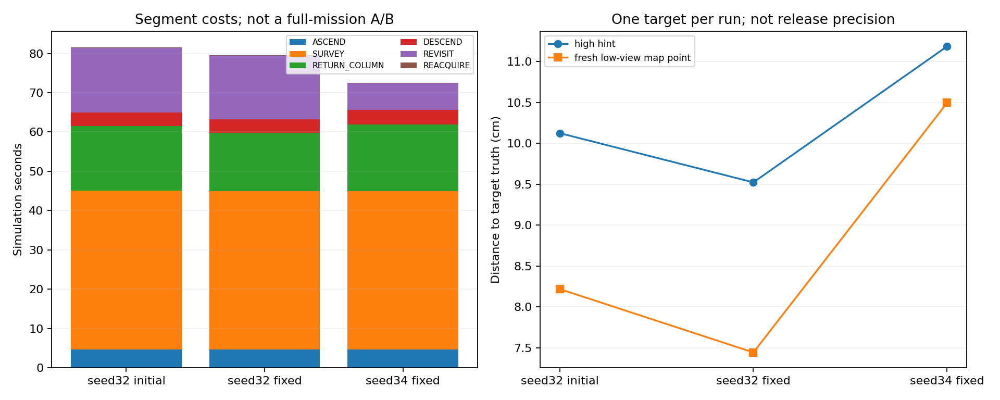

# 高位线索→同柱回降→低位重捕：动态验证报告

2026-09-13至09-14跨日，`feat/high-view-search-research`。本轮已接入并实际运行PX4+Gazebo+MAVROS+LIO+原规划/控制/视觉链，完成三次受限动态实验。**三次分段Gate均PASS、未检测到碰撞；没有投递、过门或降落，不是完整比赛任务验收。**

## 本轮结论

- “高位粗线索用于低位复访”已有动态实跑支持：修复版在seed32复访装甲车、seed34复访桥梁，均到达低位后取得新鲜视觉候选。
- 高位线索距真值约9.5/11.2cm，低位新鲜重捕时的融合地图点误差约7.4/10.5cm。低位没有执行投递ALIGN/释放，因此不能将这个数值称为最终释放精度。
- seed34的高位线索到低位新观测相隔约46s。旧线索只引导运动，没有伪造新鲜时间戳或放宽原候选新鲜度。
- 实跑发现并修复了ID=0兼容问题；修复后seed34实际选中并重捕ID=0目标，证明该接口分支不再被误拒收。
- 还未证明整场提效。高位45s预算只走了部分观察路线，同柱返回/下降另耗约18–21s；需要下一步优化观测路线和验证三目标调度的净收益。

## 实现与边界

研究入口 `uav_high_view/dynamic_probe.launch` 选择专用 `navigation_high_view_probe.py`，其ROS壳继承原任务管理器，事务仍由原MissionCore/MissionRuntime处理。原管理器是默认值，正式入口行为未切换；旧patrol_control源码未修改。

流程为：原起飞就绪→home同柱上升→FC名义AGL2.6m观察→预算结束返回已验证柱顶→原规划器下降至1.4m→恢复低位高度限制→复访一个视觉线索→等待新鲜低位候选→原ABORT/保持接口结束测试段。

ABORT在这里是研究段收尾，不是伪造三槽任务COMPLETE；分段评估器随后停止整套SITL。未执行实机动作，未更新机载部署。

线索只来自 `/uav_vision/targets`，未读取场景目标真值。原start gate保留场景就绪检查，靶位数值不进入研究管理器；真值只由独立Gate核对物理目标、碰撞、边界和高度。

高位规划速度上限0.8m/s、预算45模拟秒（包含上升）；返回/下降/复访各受原30s运动事务上限约束。选取当前可用最高权重线索，**尚未调用三目标最短路径排序，也没有按发现价值提前终止高位观察**。

同柱下降只作为本静态场景的受限实验：先收到上升完成和返回柱顶的原规划到达确认，再执行下降；每段继续接受原规划器检查，不将其推广为通用自由空间证明。

## 运行结果

| 运行 | 源码 | 目标/ID | 分段结果 | 研究段耗时 | 实际XY航程 | 高位线索误差 | 重捕时地图点误差 |
|---|---|---|---|---:|---:|---:|---:|
| seed32初版 | `1c3c061` | panzer / 2 | PASS | 81.609s | 22.905m | 0.101m | 0.082m |
| seed32修复版 | `1e2dbf3` | panzer / 2 | PASS | 79.580s | 22.506m | 0.095m | 0.074m |
| seed34修复版 | `1e2dbf3` | bridge / 0 | PASS | 72.530s | 19.917m | 0.112m | 0.105m |

三次实际碰撞计数均为0、提交槽位均为0，收尾均确认无ROS/Gazebo/PX4/RViz残留。seed32修复前后不是策略提速A/B：修复改变候选接纳，运行还存在仿真波动，不能把2.029s差异全部归因于ID修复。seed34目标更近且类别不同，也不能据此比较算法速度。

耗时从首个研究状态被记录到结束状态计算，包含该段上升、观察和复访，不含此前设备准备/起飞过渡；不是裁判起计时间。XY航程来自实际真值轨迹，只累计有效连续时间段。

### 实际航迹与高度

真值、估计和指令高度分开绘制；换算读取本轮参数，世界地面为当前仿真平面。图中树圆只是原场景排除区域代理，不能视作精确树冠或碰撞包络。

实际FC最高AGL分别约2.765、2.770、2.817m，高于2.6m名义目标但未触及本段3.0m观察门槛。低位复访阶段最高真值AGL约1.503、1.523、1.485m，离线复核符合本段低位范围；不能只看目标高度忽略真实跟踪偏差。

## 各阶段开销

| 阶段，模拟秒 | seed32初版 | seed32修复版 | seed34修复版 |
|---|---:|---:|---:|
| 上升到达 | 4.614 | 4.600 | 4.641 |
| 高位观察移动 | 40.416 | 40.409 | 40.372 |
| 返回上升柱 | 16.463 | 14.838 | 16.930 |
| 同柱下降 | 3.514 | 3.433 | 3.631 |
| 低位复访移动 | 16.384 | 16.181 | 6.790 |
| 到达后新鲜候选等待 | 0.218 | 0.119 | 0.166 |

这里的最后一行只表示到达后的新鲜候选被接纳时间；原目标记忆在接近期间也持续观测，不代表完整“从零开始识别”只需0.1s。原连续帧、关联和新鲜度仍参与筛选。

同柱返回和下降约占18–21s，是当前明确可见的额外成本。优化方向是缩短观察后到安全下降区的路程，或在有证据的下降区域中选择更合适的位置；不能直接把这个开销删除或跳过净空验证。

## ID=0修复

现有target_memory的 `_next_id=0`，而新Catalog初版要求ID>0。seed32初版记录116次invalid_identity拒收，仍通过另一条ID=2线索完成了实验，所以初版PASS不代表所有候选接入正常。

修复只将范围改为 `0 <= id < 2**32`，first_seen、质量、关联、时间和位姿限制保持。运动协议通过has_target区分空目标，不能以数值0作统一哨兵。

修复后：seed32 Catalog接纳观测6→29、保留身份1→2；seed34保留2个身份且实际复访ID=0的桥梁。两个修复版均无invalid_identity拒收。接纳计数不是独立目标数，也不是检测召回率。

## 验证与证据

- 新动态runtime 15项、原核心/任务回归合计82项通过；线索/排序/评估原型61项通过，共143项离线测试。
- 视觉和导航工作区实际构建通过；静态展开确认仅一名任务管理器、一名规划桥，研究Gate与原全场Gate分开。
- 实跑注册图中 `/fastplanner/goal` 仅由 `/navigation/planner_bridge` 发布。
- 每轮记录7条无目标payload的SEARCH和1条ABORT，没有APPROACH/ALIGN投递事务。独立Gate同时记录0提交槽位。
- 新研究管理器检查位姿连续性和CameraInfo变化；源码加载已处理Catkin devel relay不能直接导出类的兼容问题。
- 原始运行、分段Gate、参数/布局与关键数据索引见[runs.json](runs.json)及[validation.json](validation.json)。轨迹和阶段脚本为[analyze.py](analyze.py)，只读已有数据。

原始目录：

- `logs/high_view_dynamic_seed32_20260913_234403`
- `logs/high_view_dynamic_seed32_id0_20260913_235301`
- `logs/high_view_dynamic_seed34_id0_20260914_000011`

无新增bag/录屏，保留CSV、关键事件、参数、Gate及PX4日志。旧结果不覆盖，研究未合并main或替换实机部署。

## 下一步

1. 先改进受限高位观察的路线/方向与提前结束判据，核对45s内实际看到了哪些高价值目标；当前只保证某条可用线索，尚未高位找齐红十字、装甲车、桥梁。
2. 在保留原下降安全检查的条件下评估下降位置与返回开销；当前静态同柱方案作为可靠回退。
3. 再将低位复访结果交回原APPROACH→ALIGN→释放→恢复链，逐步扩展到三目标；不能把研究段ABORT收尾直接用于完整比赛。
4. 完整策略接入后才能做同布局基线/实验对照，统计三投、过门、降落和整场净节时。当前三次PASS不是稳定成功率或节时收益证明。

报告收尾时将评估节点的话题、真值路径、边界和匹配半径改为可配置项，默认值与已执行版本一致；没有更改飞行逻辑或重跑替换结果。
