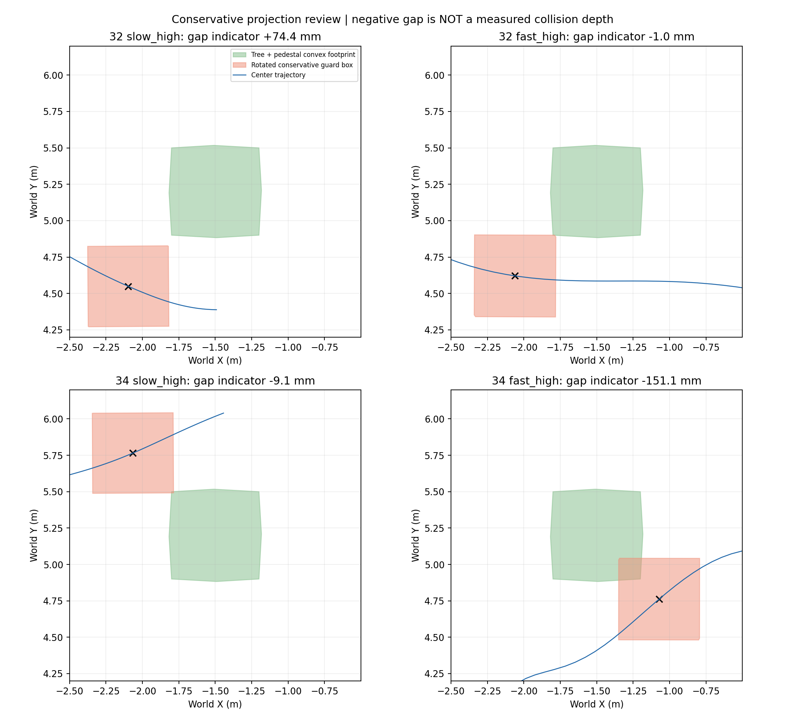
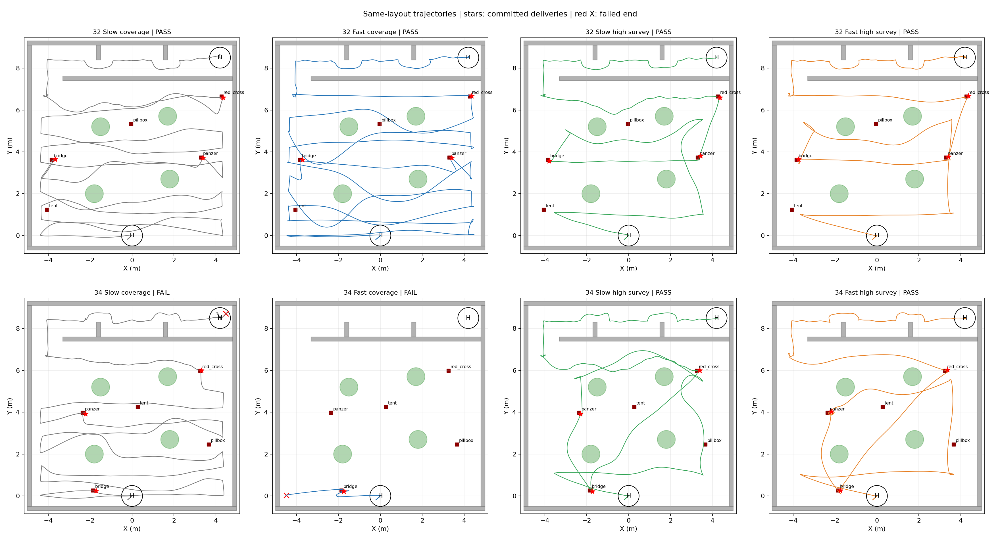
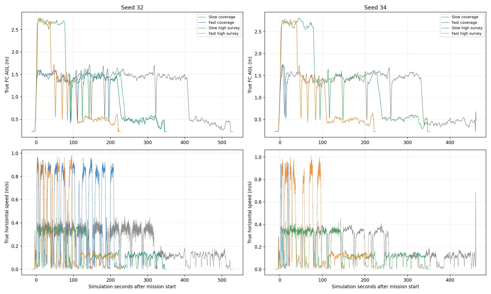
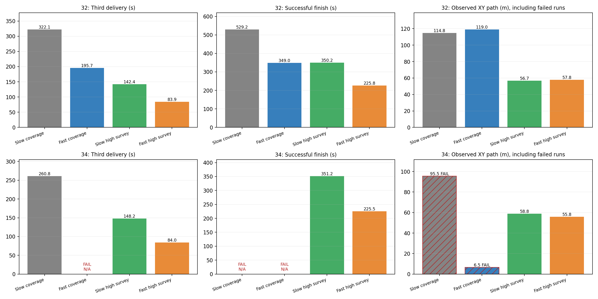

# 固定布局seed32/34：速度与搜索策略效率对照

两布局均通过飞行Gate的已测方案中，平均完赛时间最短的是 **提速高位先搜**。但seed34较大的保守包络投影交叠尚未解决，当前只能称为最快候选，不能称为禁止整机越树条件下已最终验收的方案。

本次复用凌晨四轮和seed32先导，补seed34两轮。每个seed四种方案的世界文件及实际靶位一致。全随机计划按用户指令暂不执行；不能将这些结果推广为全随机或实机已验收。

| Seed | 方案 | Gate | 已投/3 | 碰撞 | 三投(s) | 成功完赛(s) |
|---|---|---|---:|---:|---:|---:|
| 32 | 提速前覆盖 | PASS | 3 | 0 | 322.135 | 529.224 |
| 32 | 提速覆盖 | PASS | 3 | 0 | 195.716 | 348.954 |
| 32 | 提速前高位先搜 | PASS | 3 | 0 | 142.352 | 350.240 |
| 32 | 提速高位先搜 | PASS | 3 | 0 | 83.883 | 225.762 |
| 34 | 提速前覆盖 | FAIL | 3 | 1 | 260.807 | — |
| 34 | 提速覆盖 | FAIL | 1 | 1 | — | — |
| 34 | 提速前高位先搜 | PASS | 3 | 0 | 148.238 | 351.248 |
| 34 | 提速高位先搜 | PASS | 3 | 0 | 83.998 | 225.506 |

## 提升效果

| Seed | 变化 | 完赛节时 | 三投节时 |
|---|---|---:|---:|
| 32 | 提速前覆盖 → 提速覆盖 | 34.063% | 39.244% |
| 32 | 提速前覆盖 → 提速前高位先搜 | 33.820% | 55.810% |
| 32 | 提速前高位先搜 → 提速高位先搜 | 35.541% | 41.074% |
| 32 | 提速覆盖 → 提速高位先搜 | 35.303% | 57.140% |
| 32 | 提速前覆盖 → 提速高位先搜 | 57.341% | 73.960% |
| 34 | 提速前覆盖 → 提速覆盖 | 无法计算 | 无法计算 |
| 34 | 提速前覆盖 → 提速前高位先搜 | 无法计算 | 43.162% |
| 34 | 提速前高位先搜 → 提速高位先搜 | 35.799% | 43.336% |
| 34 | 提速覆盖 → 提速高位先搜 | 无法计算 | 无法计算 |
| 34 | 提速前覆盖 → 提速高位先搜 | 无法计算 | 67.793% |

只有双方成功完赛才计算整场节时。seed34提速前覆盖在降落失败，提速覆盖在首投恢复时碰Wall_12；不能把失败结束时间当成更快的完赛时间，也不补跑替代这两个失败。

## 实施组合与适用边界

- 提速配置：巡航前视1.0m、规划上限1.2m/s；精细阶段0.4m；末投后保持巡航，到走廊入口首个航点完成后切0.15m。参数上限不等于实测速度。
- 高位先搜：FC离地约2.6m；累计获得三类高权重坐标线索后中断高位路线，就近下降，按感知地图代价排序，逐个低位新鲜重捕与投递。
- 禁止越树：保留全高障碍柱；高位只允许0.30m水平航点调整，不改变Z、不降低净空，低位恢复0.15m，走廊保持原航点条件。柱顶截断的试验已撤回且不计入这八条有效对照记录。
- 横移兜底的验证边界：新增0.30m范围通过了单元测试和旧失败快照检查；本批新高位轮没有记录到requested/effective目标偏移，不能凭成功轮认定先前地图波动已被完全排除，也不能把节时归功于该兜底。
- 保守包络：seed32新高位中心航迹未进入障碍投影，55×55×40cm保守包络存在约1mm单次凸包边界重叠；用户确认其属于扩大的包络余量提示，保留记录，不按真实碰撞处理，不为此追加膨胀或重跑。
- 新发现：seed34新高位中心航迹同样未进入障碍投影，但旋转保守包络与树/箱体凸包有约15.1cm的SAT投影交叠指示。这不是碰撞引擎的接触深度，也不能直接等同真实机体越树；它明显不同于先前约1mm的容差，不能未经确认就沿用该忽略口径。
- 几何复核：低速高位seed32的最小分离轴间隙约+74mm，seed34约-9mm；提速高位seed32约-1mm，seed34约-151mm。负值为保守投影重叠。旧低速方案也不是“零保守投影交叠”证书；实际机体轮廓和规则解释尚需核对，当前不升级正赛部署。
- 结论是这两布局、这些实际试验中的选择，不是全局最优或统计稳定性证明。seed34快速覆盖的真实仿真接触说明不能把提速参数直接当作所有路线均已稳定的默认部署。

下一步如继续优化，应优先处理高位转弯/中断下降时的贴边与轨迹跟踪，同时保留直线、低位复访和末投转场提速。该局部限速方案尚未实跑，不写成已验证最优组合。

[投影指标](projection_review.json)；该检查与原飞行Gate分别报告，不追改旧Gate。

## 完整图表

## 各轮原始记录与图表

### seed32 提速前覆盖

源码记录：`5667bed`；原始目录：`/home/xhj/liftrace-worktrees/r2026-high-view-search/logs/high_view_full_frozen_baseline_seed32_20260914_015313`。Gate原因：`all_checks_passed`。

- [完整航迹/高度/速度](../32_baseline/flight_charts.png)
- [阶段航线](../32_baseline/route_stages.png)
- [阶段和投递事件](../32_baseline/phase_target_timeline.png)

### seed32 提速覆盖

源码记录：`cca98cb`；原始目录：`/home/xhj/liftrace-worktrees/r2026-high-view-search/logs/fast_speed_pilot32_baseline_20260914_100040`。Gate原因：`all_checks_passed`。

- [完整航迹/高度/速度](../../fast_full_random_20260914/pilot/results/32_baseline/flight_charts.png)
- [阶段航线](../../fast_full_random_20260914/pilot/results/32_baseline/route_stages.png)
- [阶段和投递事件](../../fast_full_random_20260914/pilot/results/32_baseline/phase_target_timeline.png)
- [速度参数切换](../../fast_full_random_20260914/pilot/results/32_baseline/speed_profile.png)
- [三维航迹](../../fast_full_random_20260914/pilot/results/32_baseline/route_3d.png)

### seed32 提速前高位先搜

源码记录：`5667bed`；原始目录：`/home/xhj/liftrace-worktrees/r2026-high-view-search/logs/high_view_full_local_strategy_seed32_20260914_012723`。Gate原因：`all_checks_passed`。

- [完整航迹/高度/速度](../32_strategy/flight_charts.png)
- [阶段航线](../32_strategy/route_stages.png)
- [阶段和投递事件](../32_strategy/phase_target_timeline.png)

### seed32 提速高位先搜

源码记录：`fabdc8c`；原始目录：`/home/xhj/liftrace-worktrees/r2026-high-view-search/logs/high_speed_lateral_fix_seed32_20260914_111432`。Gate原因：`all_checks_passed`。

- [完整航迹/高度/速度](../../fast_full_random_20260914/pilot/results/32_strategy_lateral/flight_charts.png)
- [阶段航线](../../fast_full_random_20260914/pilot/results/32_strategy_lateral/route_stages.png)
- [阶段和投递事件](../../fast_full_random_20260914/pilot/results/32_strategy_lateral/phase_target_timeline.png)
- [速度参数切换](../../fast_full_random_20260914/pilot/results/32_strategy_lateral/speed_profile.png)
- [三维航迹](../../fast_full_random_20260914/pilot/results/32_strategy_lateral/route_3d.png)

### seed34 提速前覆盖

源码记录：`5667bed`；原始目录：`/home/xhj/liftrace-worktrees/r2026-high-view-search/logs/high_view_full_frozen_baseline_seed34_20260914_025732`。Gate原因：`actual_collision`。

失败项：contact_ready_zero, contract_errors_zero, final_landed_on_ground, final_vehicle_disarmed, land_success, manager_complete, mission_ros_within_limit, return_before_land, zero_collisions。

- [完整航迹/高度/速度](../34_baseline/flight_charts.png)
- [阶段航线](../34_baseline/route_stages.png)
- [阶段和投递事件](../34_baseline/phase_target_timeline.png)

### seed34 提速覆盖

源码记录：`72e17e6`；原始目录：`/home/xhj/liftrace-worktrees/r2026-high-view-search/logs/fixed_fast_baseline_seed34_20260914_114415`。Gate原因：`actual_collision`。

失败项：committed_targets_were_selected, contact_ready_zero, contract_errors_zero, doors_crossed_in_order, final_landed_on_ground, final_vehicle_disarmed, forced_return_within_limit, land_success, landing_align_mode_seen, landing_h_mark_valid, manager_complete, manager_post_delivery_route_matches, mission_ros_within_limit, post_delivery_return_goals, post_delivery_return_sequence, real_approach_commands, return_after_deliveries, return_before_land, return_home_success, three_capture_started, three_recovery_successes, three_release_commits, zero_collisions。

- [完整航迹/高度/速度](34_fast_coverage/flight_charts.png)
- [阶段航线](34_fast_coverage/route_stages.png)
- [阶段和投递事件](34_fast_coverage/phase_target_timeline.png)
- [速度参数切换](34_fast_coverage/speed_profile.png)
- [三维航迹](34_fast_coverage/route_3d.png)

### seed34 提速前高位先搜

源码记录：`5667bed`；原始目录：`/home/xhj/liftrace-worktrees/r2026-high-view-search/logs/high_view_full_local_strategy_seed34_20260914_023010`。Gate原因：`all_checks_passed`。

- [完整航迹/高度/速度](../34_strategy/flight_charts.png)
- [阶段航线](../34_strategy/route_stages.png)
- [阶段和投递事件](../34_strategy/phase_target_timeline.png)

### seed34 提速高位先搜

源码记录：`ca40911`；原始目录：`/home/xhj/liftrace-worktrees/r2026-high-view-search/logs/fixed_fast_strategy_seed34_20260914_115010`。Gate原因：`all_checks_passed`。

- [完整航迹/高度/速度](34_fast_high/flight_charts.png)
- [阶段航线](34_fast_high/route_stages.png)
- [阶段和投递事件](34_fast_high/phase_target_timeline.png)
- [速度参数切换](34_fast_high/speed_profile.png)
- [三维航迹](34_fast_high/route_3d.png)

## 复现与口径

使用rl_drone运行本目录report.py；runs.json为八条输入，summary.json为逐轮指标，comparisons.json记录同布局检查和节时计算。新增轮次原始数据均经sim_run.sh单实例运行及零残留收尾。

耗时使用原Gate的mission_ros_sec，统一任务开始口径，不含Gazebo/模型加载和人工准备；电脑墙钟速度不用于比赛效率排名。轨迹速度从真值采样差分获得，断档剔除。旧轮源码5667bed，新提速轮包含速度阶段和高位横移修复，比较的是实际方案组合，不声称只隔离了一个数值参数。
