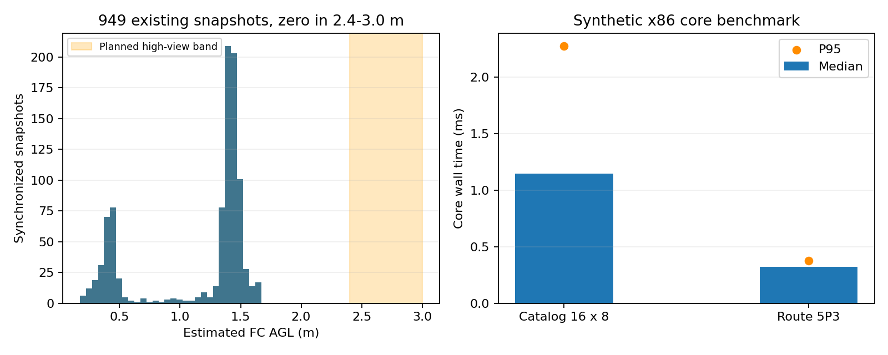

# 高位研究首批实现与验证

后续进展：[Gazebo高位480帧筛查](../high_view_render_20260913/REPORT.md)已完成；下文“没有高位素材”为本轮开发时的数据状态，原库存盘点与原型测试结果保留。

2026-09-13，分支 `feat/high-view-search-research`。用户已批准执行方案；本轮完成P0数据盘点与评估工具，以及可独立验证的P1离线原型。**P0观测可行性尚未证明，因此没有进入P2飞行执行接入。** 未启动ROS节点、仿真或实机，未改正赛部署。

## 结果与范围

| 项目 | 本轮结果 |
|---|---|
| 同步素材盘点 | 近期12轮、949份RGB/标定/TF/地图配套快照，2.4–3.0m高度样本0份 |
| 额外高位素材 | 用户确认没有其他对应素材 |
| P0评估器 | 已实现按独立段统计发现率、误分类、未匹配确认、位置P95、前三目标组合及Wilson区间；当前无合格高位标注，输出NOT_DEMONSTRATED |
| P1线索表 | 16身份、每身份8摘要；独立观测间隔、投票、误差散布、跨ID歧义、TTL、epoch、复访额度、已投递槽记忆 |
| P1路线/阶段 | 参数化内环/补中线/稀疏航带骨架；得分优先的显式有向成本枚举；有界观测与下降证据/回退建议 |
| 执行权限 | 仅离线输入/输出文件，没有ROS控制接口；回放固定P0待定，输入文件不能开启执行 |
| 验证 | 独立Catkin构建、安装后两个CLI执行、59项单元/契约测试全部通过 |

实现包：[uav_high_view](../../../vision_ws/src/uav_high_view/README.md)。原始设计：[PLAN](../../planning/high_view_search_20260913/PLAN.md)。

## P0：现有数据能够回答什么

扫描范围仅为 `r2026-coverage-efficiency-research/logs` 下具有coverage同步样本的12个近期run，不声称穷尽所有历史磁盘资产。全部949个图像/数组文件配对存在；估计FC AGL范围约0.17–1.67m，未出现2.4–3.0m样本。完整目录、计数和范围见[inventory.json](inventory.json)。

高度由记录的camera_to_map、ground_z及0.16m刚性外参计算，包含姿态投影：`FC_AGL = T_camera[2,3] − 0.16·R_camera[2,2] − ground_z`。这是估计高度；稀疏快照的最高值不是整轮真实飞行最高值，也不能用于修改旧Gate。

已读实拍回放frame_summary只有帧号、视频时间、检测类别和置信度，缺少已验证高度、同步位姿及人工物理实例/中心真值。不能用这些表证明高处发现率，不能把低空图缩小或仿真几何覆盖当成真实高位数据。

评估器对空合格标注集合的输出见[p0_evaluation.json](p0_evaluation.json)：零样本、误差/召回为空，P0未证明。**没有把缺数据判成算法失败，也没有报告虚构的95%召回。** 下一批具体输入和标注格式见[DATA_PLAN](DATA_PLAN.md)。

## P1：已经实现的行为

### 线索与投递证据隔离

输入需有任务、定位、标定三部分epoch；使用原观测时间戳，0.5s以上陈旧输入拒收。相同帧反复发布不增加命中数；至少3次、跨度0.5s、独立间隔0.25s，才可能形成可复访线索。配置阈值仍待P0标定。

历史位置允许保留60s用于复访，但不会重写last_seen，也没有转回TargetCandidate、NavigationDecision或释放许可的方法。输出明确带REVISIT_HINT_ONLY。观测误差下限加最大位置散布形成保守范围，不通过多帧平均把误差强行缩小；该范围尚未统计校准。

不同ID的误差区重叠时保留歧义、不送排序。同类出现多个不同物理线索时也保守排除该类，后续需重新确认。16个身份的限制包含过期身份墓碑，避免通过逐出/重建绕过2次复访额度；代价是ID碎裂时会较早停止接纳，不能宣称召回已优化。

定位/标定变化清空空间线索，同任务已投递槽/类别保留；时钟回退后要求新的epoch。新任务清空上一任务账本，需由原任务链负责新任务与载荷状态一致性。槽位ACK按1→2→3，重复ACK幂等、冲突ACK拒收。

### 排序不假装已经找到安全路径

最多五类的三目标顺序60种，权重优先，同权重按预计时间排序。时间包括剩余观测/下降固定成本、方向相关的路径成本、每一槽的重捕/投递/恢复、第三目标到走廊入口及终点储备。支持剩余1/2/3槽。

边必须显式给出、同epoch、足够新鲜且声明可通行；缺失、封闭、过期或未知边直接不可用，没有直线距离补偿。重复物理身份不得出现在同一输入集合。**目前路径成本来自离线声明，尚未连接原规划器或地图更新；本原型不构成路径安全确认。**

阶段函数在观测预算到期或理想价值线索齐备时只产生建议。下降证据必须有同代际、时间和已验证扫掠体积；“点云为空”不被认可。最近已验证下降通道可作为回退，否则留给现有监督逻辑处理，不输出盲降指令。所有这些分支用构造数据测试，实际下降自由空间生产者尚未开发。

### 合成回放结果

[synthetic_replay.jsonl](synthetic_replay.jsonl)包含人工构造的五类线索和有向成本，**不是历史飞行记录或真实地图**。安装后的CLI读取59个事件，输出[synthetic_results.jsonl](synthetic_results.jsonl)。

最终保留5条线索，枚举60个顺序，选红十字→装甲车→桥梁，权重和14.5；声明总成本52s，包含6s移动、6s三槽服务、10s固定升降观测和30s终点储备。52s只是人工费用表求和，不是预测实机完赛时间或节时结果。即使有这个建议，CLI最终决策仍为OBSERVATION_ONLY_P0_PENDING。

## 测试与资源

59项覆盖：新鲜度/未来时间、frame/epoch、缺图关联、错误置信度、重复近时帧、间断、投票/空间歧义、身份和摘要上限、TTL/复访、时钟回退与槽记忆、权重与非对称终点成本、剩余槽位、无路径/未知/过期边、下降证据、P0阻断、独立段评估和参数化航带。

在只叠加系统Noetic的独立工作区构建/安装，不依赖旧研究运行代码。`catkin_test_results`：59 tests、0 errors、0 failures、0 skipped。日志留在本地 `logs/high_view_build.log`、`logs/high_view_tests_final.log`，不提交build/devel/install。

| x86/WSL、系统Python3.8核心测量 | 中位 | P95 | 每次CPU |
|---|---:|---:|---:|
| 重建16身份×8观测并检查线索，500次 | 1.145ms | 2.272ms | 1.255ms |
| 五类三目标60顺序排序，1000次 | 0.320ms | 0.377ms | 0.325ms |

独立基准进程峰值RSS12.25MiB。程序与数据见[benchmark.py](benchmark.py)、[benchmark_ros.json](benchmark_ros.json)。包含解释器及本基准，不含ROS接收、TF、地图成本生产、RKNN、日志记录，**不是OrangePi整节点平均CPU≤0.10核或额外RSS≤64MiB验收**。目前算法本体成本较小，下一步重点仍是高位观测质量、路径证据与上游成本。

图左是实际记录快照的估计高度分布，阴影为计划研究高度；图右是构造输入的核心计算基准。两部分不能合起来解释为真实高位性能。

## 当前完成边界与下一步

已完成可以独立推进的P1离线基础、P0评估工具和数据盘点。未完成：高位检测/定位实测、真实路径成本接口、动态epoch来源、下降自由空间证明、线上只读并发评估、P2运动事务接入以及配对SITL。P0尚未过门槛，不能据此替换正赛搜索策略。

用户确认没有额外高位素材后，下一步必须取得新的高位同步数据。建议先按DATA_PLAN做少量高度比较，再决定候选高度和是否扩大30布局统计。无需再次审批整个开发设计；涉及新仿真或实机采样时按对应单轮启动边界执行。本轮没有设置SIM_RUN_AUTHORIZED或访问硬件。

本轮新增的是小源码/JSON/报告和图，没有新bag或录像；原949份素材只读，不复制/删除。宿主F盘本轮初查约69GiB可用，后续采样仍需再次检查空间。
