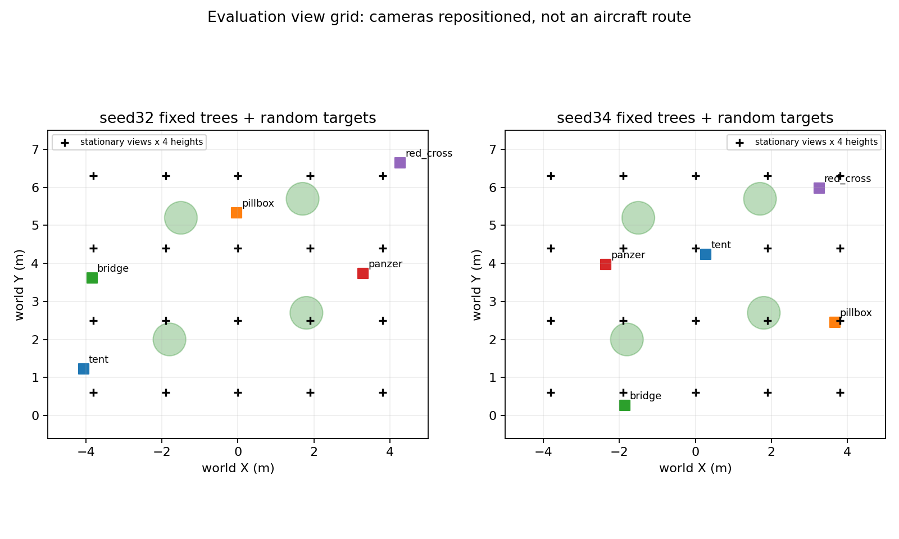
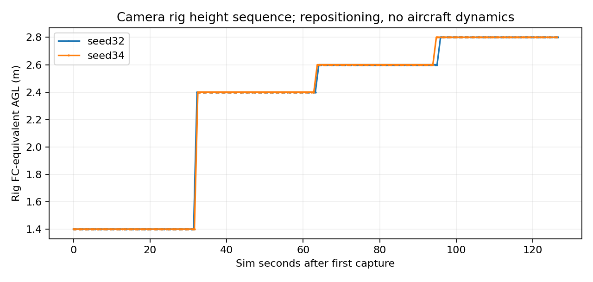
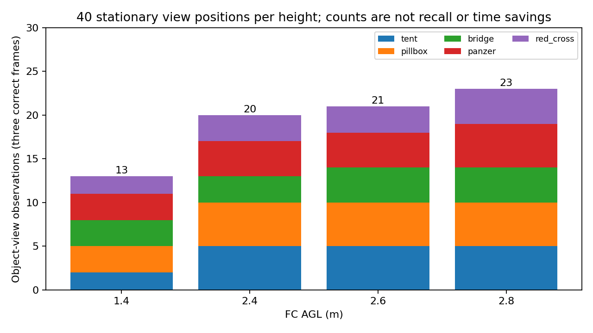
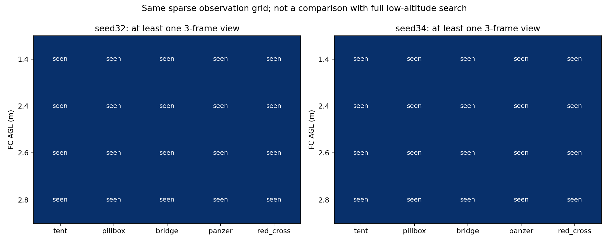
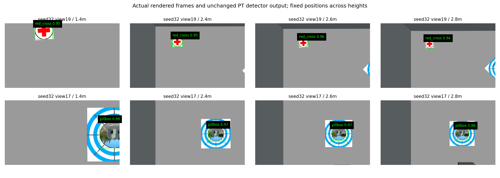
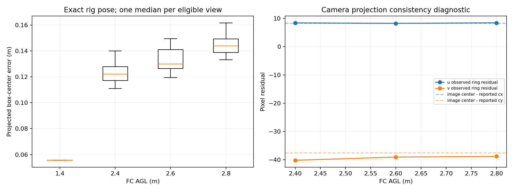

# 高位Gazebo观测：两布局四高度筛查

2026-09-13，`feat/high-view-search-research`。按用户“优先以仿真为主，继续推进”的要求，完成seed32、34两套固定树/随机靶/随机门场景的相机观测实验。**这次确实运行了Gazebo，但没有运行飞机动力学、PX4、MAVROS、LIO或任务控制；不能称为两轮完整SITL飞行。**

## 结论

1. 两个布局中，1.4、2.4、2.6、2.8 m四个高度都能在本批20个观察位置中找到五类目标，至少一个位置连续三帧正确检出。高处没有出现本批可见图案“太小而完全认不出”的现象。
2. 同一稀疏网格上，三帧正确检出的“目标×观察位置”机会从低位13个增加到20/21/23个；完整靶板几何入画机会从1个增加到12/14/14个。这支持扩大视场的价值，**不是搜索节时或召回概率证明**。
3. 2.6 m可作为下一步运动/复访实验的首选候选，同时保留2.4 m对照。2.8 m增加少量观察机会但投影误差更大，尚不足以成为默认高度。
4. 当前理想rig位姿下，完整入画目标的检测框中心投影误差P95约0.139/0.149/0.159 m。按用户本轮补充，这可作为低位复访的粗线索候选；下一步重点是低空重捕成功率、重捕耗时和动态误差，而不是先将所有投影误差清零。
5. CameraInfo与实际成像存在约(+8,-39)像素的中心偏移线索。保留原结果，不做悄悄校正；将该项作为并行改进，不单独阻断受限粗线索研究。不能将粗线索直接作为下降许可或释放坐标。

## 实验定义与实际运行

相机从当前 `iris_mid360_ks2a543_installed/model.sdf` 提取：1280×720、同HFOV、畸变、CameraInfo参数及FC下0.16m的安装偏置。只把频率降至10Hz便于限量采集，移除飞机、动力学和执行器，保留静态相机rig。没有测试机身/桨叶自遮挡、运动模糊或定位误差。

每个布局四高度×20个固定位置×每位置3帧=240帧；两布局合计480帧。每次移位后稳定0.5模拟秒，采样源时间间隔至少0.3s。位置为X=[-3.8,-1.9,0,1.9,3.8]、Y=[0.6,2.5,4.4,6.3]的场地网格，固定yaw=0，不读取靶位来选观察点。

相机按网格直接重定位，不规划或验证点间运动可达性；部分位置可能与实际树/墙净空不适合作为飞行点。这是光学实验，不把该网格交给飞机飞行。

| seed | 本地run目录 | 图像 | 图像字节 | 采集/清理 |
|---|---|---:|---:|---|
| 32 | `logs/high_view_render_seed32_20260913_225236` | 240 | 23,329,503 | PASS / 零残留 |
| 34 | `logs/high_view_render_seed34_20260913_225601` | 240 | 23,912,814 | PASS / 零残留 |

总PNG约45.1MiB，均低于单轮100MiB上限；没有全场bag或录屏。两次分别在22:52–22:54和22:56–22:58完成，模拟传感器按规定独占运行并自动收尾。`gate_status.json`的PASS仅表示240帧采集完整，不是原37项比赛Gate或P0全部通过。

采集源码冻结`12d73dc`，本分支视觉工作区实际构建；导航包显式来自同基点`86e382d`集成工作区，仅用于复用原随机场景生成器。第二次运行期间新增的是离线分析脚本，采集脚本、相机和配置未变。两套布局沿用固定树对照的场景和随机参数，未把靶真值送入导航或采集路径。

## 识别与粗发现

使用现有 `liftrace_6cls_v5_merged_standard_20260714/weights/best.pt`，与当前SITL检测器相同的单图predict、imgsz=640、conf=0.5、RTX device=0。没有更换模型或调整识别阈值。这里是PT/GPU离线检测，不是RKNN/NPU板端验收。

评测端用实际靶板几何、rig位姿及CameraInfo，将检测中心投到靶平面作类别无关的空间匹配；真值只在这个离线步骤使用。一个匹配再比较类别，避免先按类别选真值而掩盖误分类。每个视角的三帧只用于重复性检查，不视作三个独立布局。

| FC AGL | 五类均有三帧正确检出的布局 | 三帧正确的目标×视角机会 | 完整靶板几何入画且三帧正确 | 完整入画视角中心误差P95 |
|---:|---:|---:|---:|---:|
| 1.4 m | 2/2 | 13 | 1/1 | 0.056 m（仅1个视角） |
| 2.4 m | 2/2 | 20 | 12/12 | 0.139 m |
| 2.6 m | 2/2 | 21 | 14/14 | 0.149 m |
| 2.8 m | 2/2 | 23 | 14/14 | 0.159 m |

每高度40个相机观察位置，可能同时看见多个靶；“机会”按目标×视角计数，并非40个位置的覆盖率。靶位不同导致同类别完整入画样本很少；2.4m的装甲车没有整板入画视角，但局部图案仍可被正确识别，所以不能将整板入画当作粗线索的必要条件。

初版离线匹配曾因部分板角在畸变有效域外，把已经检出的截边目标排除，导致低位发现统计偏低。图像复核发现这一问题后，改为检测像素射线与物理靶平面的类别无关匹配；最终表格/JSON/图均使用修正统计。没有重跑Gazebo或更改图像/模型。保留畸变视场外射线拒绝，完整入画与粗发现分别统计。

全样本还有27个未匹配预测，可能包含截边匹配误差或实际误检，未逐一人工标注，不能报告“全局零误检”。完整入画小子集未观测到错误类别，但样本量不支持正式误分类率上界。树冠遮挡未独立标注，几何入画不能等同无遮挡可见；不能把12/12或14/14直接写成高位召回率100%。

原始详细输出见[metrics](results/metrics.json)、[视角统计](results/segments.json)、[预测和匹配](results/predictions.jsonl)。数据表引用本地PNG路径，原图不入Git。

## 位置误差的解释与使用边界

这里的坐标误差来自**原始检测框中心+精确rig位姿+所报CameraInfo**，没有低位几何精修、LIO或飞控状态估计。表中P95先对同视角3帧取中位，再跨合格视角取95分位，避免把三帧相同图像当成独立位置精度样本。metrics.json内还保留按帧、按类别统计，口径不要混用。

蓝环颜色像素的独立椭圆诊断，在完整入画标准靶上得到约(+8,-39)像素中心偏差，与图像几何中心(640,360)减所报主点(631.672,397.566)的(+8.328,-37.566)接近。这支持“成像/CameraInfo主点不一致”的机制线索，仍不是完整相机标定验收。少量椭圆样本、纹理/遮挡和畸变也会影响诊断，未用它修改主结果。

用户明确提出将高位位置仅用于低位快速复访，本方案采用以下口径：

- 粗线索携带误差范围与观测时间，不要求直接达到释放精度；保留设计中的0.25m线索误差候选门槛，后续根据动态实测校准，不能把本批0.16m当绝对误差上界。
- 指向目标附近的可达观察区域，靠近后用新鲜低位视觉重新捕获、确认和精定位；原释放/关联/时效门槛保持。
- 靠树或墙的线索不能直接变成目标中心航点。观察位置及下降通道还需满足原规划净空、机体包络和定位不确定性；无可行观察位置时回退搜索。
- 将低位重捕成功率、重捕所需时间、最终选靶价值和任务净节时作为主要判据。高位yaw变化会改变系统偏差在世界坐标中的方向，多视角融合也需验证。
- 该偏差作为并行改进项，不单独阻断受限运动/复访研究；若误差造成错误合并、反复重捕、不可达目标或净空不足，才升级为执行阻断。

## 当前状态与后续顺序

高位静态识别已有真实Gazebo图像支持，不再是完全缺高位数据；但仅两个固定树布局，不满足原设计30布局及运动/端侧样本要求，P0仍为部分完成。本批没有证据说明高位环扫已经节时，也没有验证降高、绕树、重捕和三投闭环。

下一步按用户的粗线索口径，优先2.6m候选与2.4m对照，推进受限运动观测及低位复访验证；同步观察定位/姿态/时间误差和原流程恢复。先证明线索能节省寻找目标的时间，再扩大到完整环线、目标排序和三投对照。投影一致性修正并行进行，不为追求理想零误差停掉全部提效研究。

采集入口是独立 `uav_high_view/gazebo_observation.launch`，只能经sim_run执行；分析/绘图脚本只读已有数据，不会启动仿真。所有工作留在研究分支，正赛默认配置、59项离线原型契约、机载部署和原比赛Gate保持。
