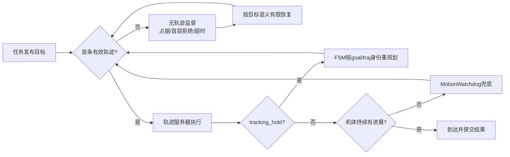

# seed31–40可靠性复盘与停滞根治计划

## 结论

当前研究版的速度收益成立于成功子集，但可靠性尚不具备替换正赛机载代码的条件。十轮完整PASS为4/10；seed32和34在起飞后的第一条高位爬升指令即失败，seed31在三投后走廊首轨迹反复失败约90秒，seed38/40出现大规模失败规划和兜底抖动。起飞失败占本批20%，必须作为P0阻断项，而不是再靠多跑seed观察波动。

现有异常不是一个“停滞bug”，而是三个不同层次：

1. **无轨迹**：目标占据、起点附近不可扩展或A*所有后继被拒，规划器从未给出可执行轨迹。seed31/32/34和板端第二轮属于这一层，但原因并不完全相同。
2. **有轨迹但服务器保持**：轨迹服务器因跟踪偏差进入`tracking_hold`，FSM可能尚未达到自己的重规划阈值，形成跨模块死区。
3. **任务层反复换点/兜底**：单点失败有上限，但连续目标没有区域级预算，seed38/40仍可在多个相邻无效目标上重复消耗。

已有`MotionWatchdog`只覆盖第二层中的部分物理停滞，而且十轮日志中`no_physical_progress_replan`和`liveness_budget_exhausted`均为0。不能据此宣称历史停滞已彻底修复。

[十轮主报告](REPORT.md) · [规划告警逐轮统计](planner_warning_counts.json) · [此前停滞与边界清单](../../planning/reliability_speed_review_20260919/STALL_AND_EDGE_CASES.md)

## 1. 十轮重新分类

| seed | 完整结果 | 主要异常 | 目标占据/邻域封锁 | A*失败 | 处置判断 |
|---|---|---|---:|---:|---|
| 31 | FAIL | 三投后走廊目标占据，首轨迹约90s未就绪 | 108 / 86 | 110 | 与板端ABORT同一大类；全阶段首轨迹保护缺失 |
| 32 | FAIL | 起飞后第一条高位爬升，根节点即无后继 | 0 / 0 | 14 | 独立的起飞/起点局部可扩展性故障 |
| 33 | PASS | 少量规划失败、2次优化异常后恢复 | 0 / 0 | 9 | 需保留异常原因，但不是本轮阻断 |
| 34 | FAIL | 与seed32同阶段、同形态起飞失败 | 0 / 0 | 15 | 重复故障，不能按随机波动处理 |
| 35 | PASS | 4次优化异常后恢复 | 0 / 0 | 5 | 优化异常需可观测和有界降级 |
| 36 | PASS | 高位目标占据后恢复 | 10 / 8 | 22 | 证明当前恢复可能成功，但行为不稳定 |
| 37 | FAIL | 完成路线后LAND位姿突变 | 0 / 0 | 3 | 终端估计/状态交接故障，不应关闭跳变保护 |
| 38 | FAIL | 兜底区域连续失败，最终保守边界触发 | 0 / 0 | 313 | 区域级失败缓存和总预算缺失 |
| 39 | PASS | 原Gate通过，独立55cm树投影有小重叠 | 0 / 0 | 4 | 在线/离线包络口径需统一 |
| 40 | FAIL | 多组目标占据/失败，最终墙钟截尾 | 30 / 24 | 121 | 算法拖时与评测墙钟配置同时存在 |

十轮合计616次A*失败。数量本身不等于616个独立故障，但说明当前策略允许同一目标和相邻失败区域被高频重复求解。优化器异常出现在33/35/37/40；通过轮也存在，说明它不是充分失败条件，却不能继续只留一条通用异常日志。

## 2. 起飞失败必须单独处理

### 2.1 已确认的共同现象

seed32/34均在第一条`high_view_full:SURVEY`升高动作失败，约12秒结束，尚未进入搜索或投递：

- seed32起点约`(-0.0017,-0.0001,1.057)`，目标约`(0,0.05,2.38)`；
- seed34起点约`(-0.0038,0.0017,1.052)`，目标约`(0.05,0.05,2.38)`；
- 规划日志反复为`open set empty, no path, use node num: 1, iter num: 1`；
- 初次搜索与放宽后的重试都在根节点结束；
- 没有`goal occupied`、目标邻域封锁或显式`start occupied`告警。

这说明失败发生在A*从起始状态生成第一层可用后继之前，不是“飞到一半停住”，也不是高位航点终点已明确占据。

### 2.2 现有实现的薄弱点

首次扩展只使用当前`start_acc_`和最长0.8秒。新目标时FSM把`start_acc_`置零；低速、近垂直起步时，该原语可能仍落在同一体素而被拒。规划管理器随后会用完整加速度格重试，所以这个细节可以解释首次失败，却**不能单独解释重试仍然只扩展一个节点**。

更可能的剩余候选是：起点位于场地边缘和墙膨胀附近，所有重试后继因占据、搜索域、同体素、速度或原语沿途碰撞被拒；或者任务接管时地图/状态刚满足“新鲜”，但起点局部尚未形成可扩展自由空间。当前A*只输出最终`node num: 1`，没有按拒绝原因计数，无法从现有日志进一步唯一归因。

### 2.3 P0修复方向

1. **加入低空进场点再升高。** 起飞后先在1.0–1.4m高度移动到场内已验证的staging点，再执行2.6m高位爬升；避免在边界墙膨胀旁原地垂直规划。该段仍走SDF和碰撞检查。
2. **起飞接管Gate。** 任务开始前同时满足：飞控状态稳定、LIO/地图/TF连续新鲜、起点及机体包络自由、至少一组短原语可扩展。只检查话题“有消息”不够。
3. **A*首层拒绝统计。** 输出同体素、速度越限、占据、搜索域越界、沿原语碰撞、超时各自数量，并记录起点SDF距离和地图版本。
4. **有限恢复。** 第一条轨迹失败后只允许一次地图刷新/状态重采样和一个低空备选staging点；仍失败则明确中止，禁止重复原地求解到动作超时。

起飞Gate应先用seed32/34固定布局做定向回归，再进入新的随机矩阵。验收标准不是“最终起飞”，而是首条有效轨迹在规定时间内就绪、没有根节点重复失败、恢复次数有界。

## 3. seed31与板端ABORT：无轨迹状态缺少统一契约

进一步读取原始日志后，seed31不再只是“原因未知的规划饥饿”：走廊目标`(8.35,2.3,0.68)`明确为`in_map=1, inflated=1`，0.10m邻域没有合法点，共出现108条占据/越界告警、86条邻域封锁和110次搜索失败。板端视觉中断第二轮同样是固定目标膨胀占据、0.15m邻域无替代点、未生成轨迹后ABORT。

seed36的高位点也出现相同类别，但后来恢复并PASS；seed40则多次命中占据目标并严重拖时。这证明当前行为取决于后续策略恰好能否换到可达点，并没有统一保证。

当前12秒`search_initial_plan_timeout`只覆盖部分SEARCH/RESUME路径。seed31位于RETURN_HOME/走廊动作，最终使用90秒动作期限。因此应把“首条有效轨迹尚未出现”做成任务执行层的通用状态，而不是按任务阶段零散配置：

- 从目标发布开始计时，轨迹身份必须与当前goal一致；
- 超时前允许有限重试，且相同地图版本/相同起终点不得无限重复；
- 超时后按目标语义处置：搜索点可侧移/跳过，普通过渡点可退回最近验证点，门前后点需要门区专用恢复，靶心/H不得擅自搬移；
- 失败结果必须携带起点、请求/有效终点、地图版本、占据类别和已尝试候选。

缩短等待时间只会让失败更快暴露；配合语义恢复和诊断后才构成修复。

## 4. 轨迹服务器与FSM之间的停滞死区仍未闭合

此前离线复现指出：走廊阶段轨迹服务器`target_dist=0.15m`，当原始命令与里程计偏差超过`target_dist + 0.05 = 0.20m`时进入`tracking_hold`并在当前位置发零速度；FSM的`tracking_replan_distance=0.45m`。若偏差落在0.20–0.45m，服务器停止推进，而FSM仅凭自己的偏差阈值可能不重规划。此前0.25m固定偏差可持续1000周期保持且无重规划。

现有`MotionWatchdog`增加了物理进展兜底：已有当前目标和轨迹、控制模式正确，控制/里程计/地图均新鲜，距目标大于0.10m时，4秒内位移不足4cm会请求重规划，预算2次。它改善了部分“有轨迹但不动”的情况，但仍有三个缺口：

1. 它不消费轨迹服务器已经发布的`tracking_hold`、`no_lookahead`或`interrupted`状态，只能事后用机体位移推断。
2. 任一输入暂时过期、控制模式变化或轻微位移超过4cm都会暂停/重置观察；有抖动的保持状态可能逃过检测。
3. 十轮中恢复和耗尽事件全为0，没有动态证据证明原死区已被触发并正确恢复。

根治方式应是显式跨模块契约：轨迹服务器发布`traj_id + goal_id + tracking_hold + interrupted + tracking_error`，FSM只接受与当前目标/轨迹一致的状态；`tracking_hold`持续短窗口即直接重规划，不再等待0.45m。`MotionWatchdog`保留为第二层兜底。阶段切换时的`target_dist`、FSM阈值和任务到达阈值要原子更新并回读校验。

## 5. 阈值并不需要相等，但必须满足不变量

| 层 | 当前典型值 | 含义 | 风险 |
|---|---:|---|---|
| 轨迹服务器前视/保持`target_dist` | 走廊0.15m | 命令前视和保持触发基准 | 加0.05后0.20m即保持 |
| FSM完成阈值`thresh_no_replan` | 0.10m | 规划目标完成 | 与任务层到达阈值不完全相同 |
| FSM跟踪重规划 | 0.45m | 样条投影偏差触发重规划 | 大于服务器保持阈值，形成死区 |
| bridge到达阈值 | 分段0.05/0.12m | 任务动作完成 | 动态切换错误会造成早到/永不到 |
| `/px4_max_distance` | 走廊0.15m | 旧控制设定点前导 | 同时影响爬升和水平响应速度 |

这些值服务于不同模块，不能机械改成同一个数。需要保证：服务器进入安全保持后FSM必能感知并有界重规划；任务层的到达判定不能早于规划目标安全完成；参数阶段切换必须作为一个版本化profile成功应用，失败时回滚整组，而非部分参数留在上一阶段。

## 6. seed38/40：需要区域级预算，不能逐点耗尽

seed38记录313次A*失败，多个连续goal各重试9–15次；seed40记录121次失败，多组目标同样耗尽。单目标有重试上限，但任务层会换到附近新goal并重新获得完整预算，形成“逻辑上有界、整场仍无限拖长”的兜底抖动。

建议新增目标区域失败缓存：以地图版本、空间栅格、任务语义和高度层为键。相邻目标在同一地图版本下因相同原因失败时，共享预算；只有地图显著更新、障碍清除或从新验证位置进入，才允许重新开放。与此同时设置每阶段规划饥饿总预算和整场恢复预算，耗尽后进入明确的安全降级，而不是继续生成goal 20–38。

## 7. 其他必须纳入回归的edge case

- **seed37 LAND位姿跳变**：真实模型已接地，但MAVROS local Z从约2.79m突变到0.071m并触发21次位姿连续性告警。AUTO.LAND接管后，研究探针不应再拥有任务终止权；仍需记录估计器reset并以飞控landed/disarm和真值/接触作验收。不能全局关闭跳变保护。
- **seed38边界Gate**：55cm保守盒只发生毫米到厘米级边界触发，未物理碰撞。应在规划区域额外留跟踪滞后余量，避免控制误差触发硬Gate；不能直接放宽碰撞边界掩盖问题。
- **seed39树投影差异**：在线任务PASS，离线保守凸包有最多1.47cm重叠。需要统一在线SDF障碍模型、水平柱和离线包络的几何口径，并区分“安全余量警告”和“物理碰撞”。
- **优化器异常**：通过轮也出现。日志应给出异常类型、输入轨迹ID、随后采用的搜索轨迹以及最终是否发布有效样条；连续异常计入规划预算。
- **seed40墙钟**：2700s墙钟不等于600s ROS任务期限。评测器应根据预期RTF给足墙钟，同时保持ROS规则期限不变；算法本身的失败抖动仍须修复，不能只延长墙钟。
- **地图/坐标切换**：任务目标、FreeDOM、SDF和MAVROS的frame/profile版本应随goal一起记录。静态TF或阶段参数改变后，旧轨迹和旧目标必须失效，避免跨版本继续执行。

## 8. 实施顺序与验收门槛

### P0-A：可诊断性

- A*首层和全搜索拒绝原因计数；
- 当前goal/traj/map/profile统一身份；
- 首次无轨迹、`tracking_hold`和规划预算耗尽时保存小型地图窗口；
- Gate：seed31/32/34失败均能由单份日志确定层级，不再只看到`node num: 1`。

### P0-B：起飞链

- 低空staging后升高、起点包络/短原语预检、有限恢复；
- Gate：固定seed32/34各至少连续3次首轨迹及时就绪，再加边缘起点和地图延迟注入；不得通过自动重跑挑成功。

### P0-C：无轨迹与有轨迹两套监督

- 所有运动阶段统一首轨迹期限和语义恢复；
- 轨迹服务器保持状态直接送FSM，watchdog作兜底；
- Gate：终点占据、0.25m跟踪偏差、地图短时过期、控制抖动四类注入均在预算内恢复或明确失败，无静默停滞。

### P1：区域失败缓存与终端事务

- 邻近失败目标共享预算；
- AUTO.LAND交接后区分估计器告警与任务完成判定；
- Gate：seed38/40不再出现数百次重复失败；seed37不会因研究探针在已接地后抢占终端状态。

### P2：再做速度优化

只有上述可靠性Gate通过后，才继续提高高位/低位/投后和走廊速度。当前20.58%的成功交集节时可保留为方向证据，但不能抵消6/10未完整通过。下一轮报告应同时给出成功率、首轨迹P95、每阶段失败规划次数、恢复次数和完赛时间，避免只优化成功轮均值。

本文件只整合现有源码、日志和报告并给出处置设计，没有修改导航、视觉、地图、速度或评测代码，也没有启动新的仿真。
