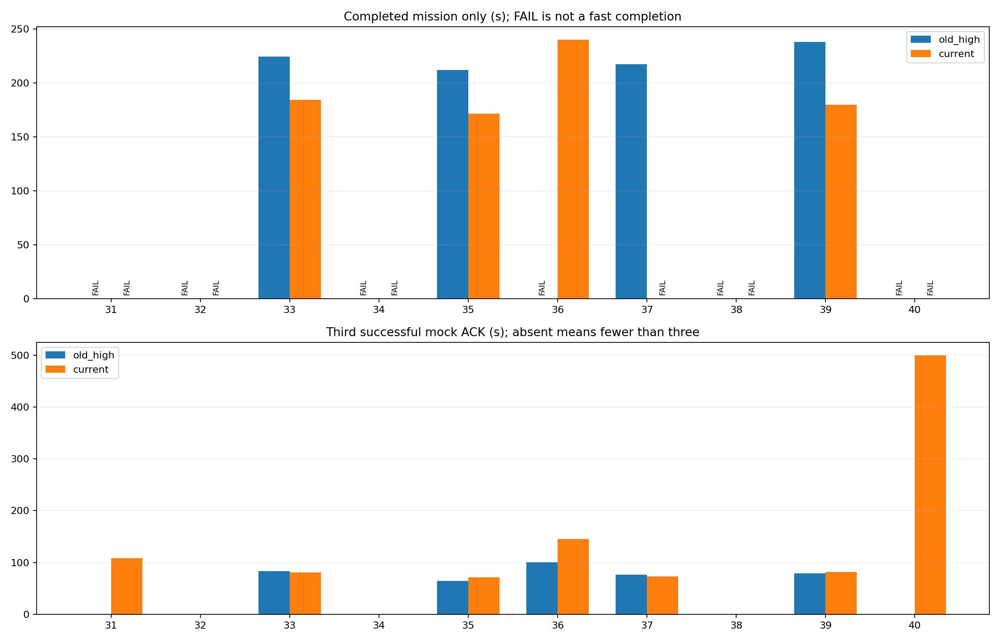
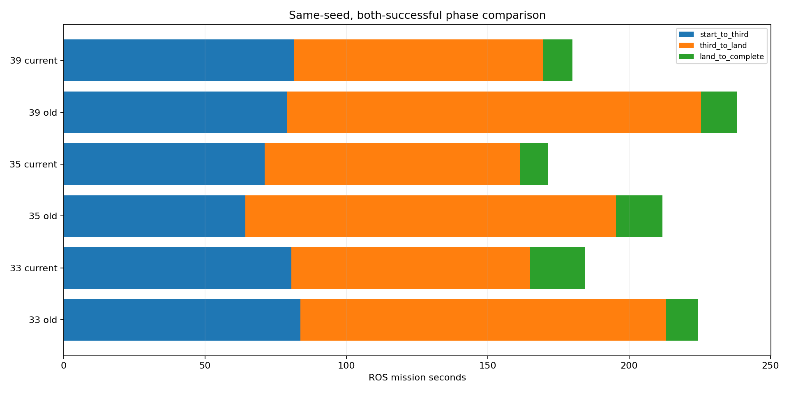
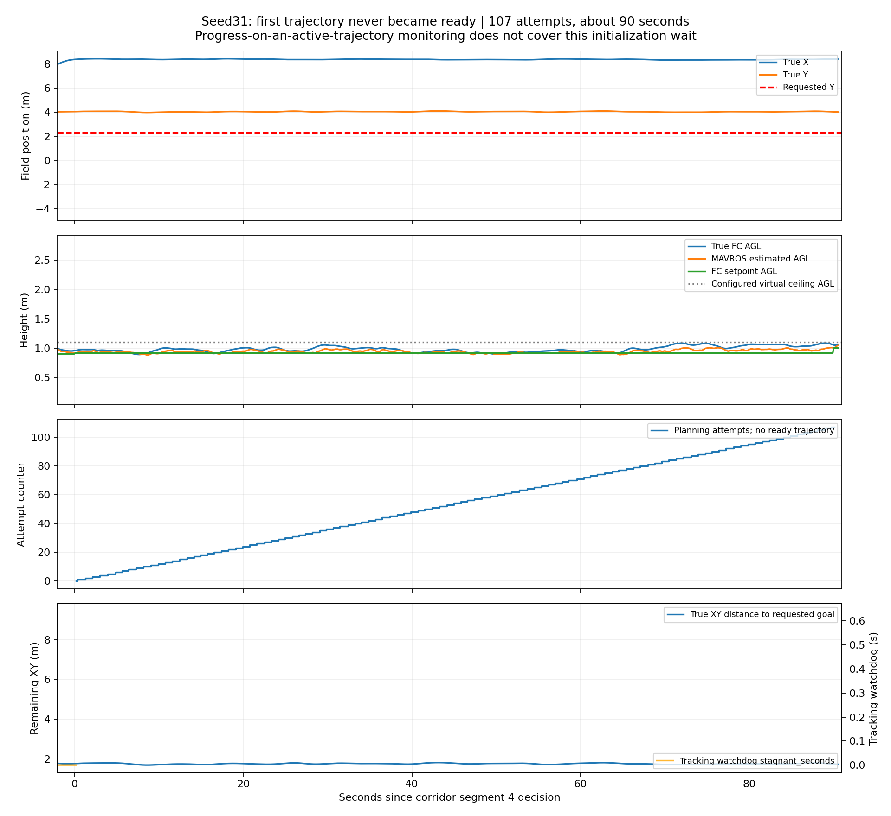
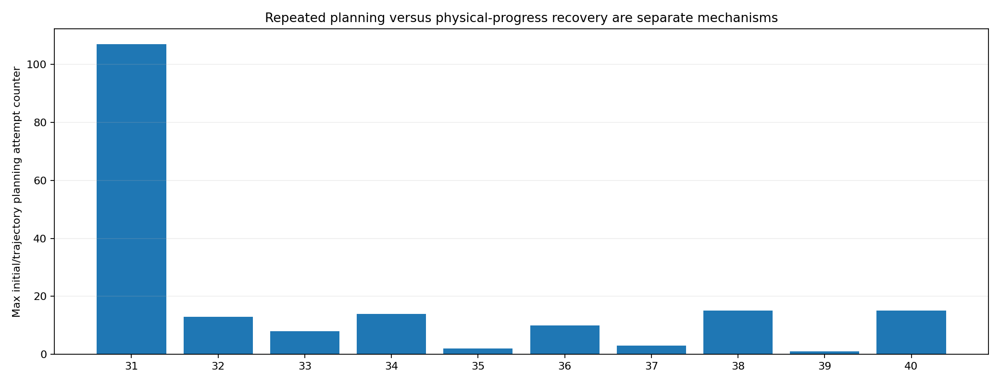
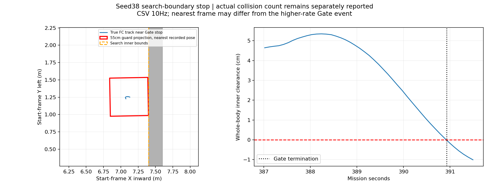
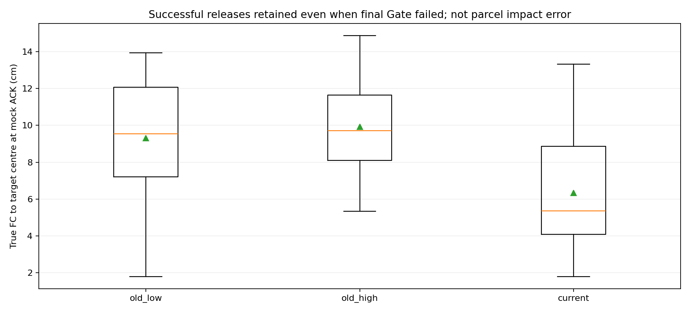

# 历史seed31–40：当前高位修复版统一回归报告

用户指定的10个历史seed各运行一次，无补跑替换，全部保留原始结果和录像。当前版完整通过 **4/10**，三投完成 **7/10**，累计模拟投递 **23/30**；历史高位版完整通过 **4/10**，三投完成 **5/10**。

本批用于检查当前2.6m高位＋快走廊修复版在历史布局中的表现，不是新一轮盲目提速。seed31的停滞确实复发在另一个分支：已有轨迹进展恢复不能覆盖首次轨迹一直生成失败的等待。不能凭上一批seed2672成功就宣称全场景停滞已根治。

三投完成由5/10升至7/10、模拟投递总数由19/30升至23/30，发生实际碰撞的轮次由2降到0；这些是本批改善，但完整通过率未增加。相同成功交集33/35/39的整场节时主要来自投后航段：其中35/39的第三投反而比历史稍晚，不能把整场收益全部归给高位搜索。

[图表和十份完整视频](index.html) · [每轮指标](metrics.json) · [配对比较数据](comparison.json) · [失败定位](failure_diagnosis.json) · [可靠性根因与处置计划](RELIABILITY_ACTIONS.md) · [源版本核对](source_consistency.json)

## 1. 使用版本和布局可比性

- 所有本轮run的manifest均为`26e36731c8f50e8527d686528a8016761f25c745`；导航、视觉实际包路径全部指向`r2026-high-view-search`，无旧工作树混入。与上一批通过的`708529d`相比，飞行目录仅有fov入口新增field_seed参数，算法与编译成果保持一致。
- 板端三套在另一工作树/本地分支开发，未修改本批仿真代码。没有在十轮中途修复或调参，也没有用补跑成功替换失败。
- 历史树、门、靶的位置按新X=旧Y、新Y=−旧X统一旋转，靶面yaw同步，使用旧run真值冻结，未重新随机抽样。十轮实际生成靶坐标与历史旋转结果均已逐项核对，见[布局核对](actual_layout_equivalence.json)和[场景几何核对](layout_validation.json)。
- 可以统一做同布局版本对照；同时标明其他变化：外墙按当前录像要求升至4m，相机安装/FOV、走廊高度与已有分段速度、内环约束、降落修复、各阶段代码版本不同。因此不把版本总差值全部归给单一提速因素。
- 当前三投前不进入走廊上空，使用55cm飞行包络；LAND允许50cm，H有独立观测窗口，末段仿真MPC_LAND_SPEED=.25。历史Gate与录像保留原定义，不事后追改旧成绩。

## 2. 十seed高位版配对结果

单位为任务首决策后的ROS仿真秒。失败没有完整完赛时间，绝不以早失败时刻作为节时。相同seed各一次，不能估计长期成功率或统计显著性。

| seed | 历史高位 | 当前版 | 历史完赛/s | 当前完赛/s | 双侧成功节时/s | 节时/% | 当前投递数 |
|---|---|---|---|---|---|---|---|
| 31 | FAIL | FAIL | — | — | — | — | 3 |
| 32 | FAIL | FAIL | — | — | — | — | 0 |
| 33 | PASS | PASS | 224.37 | 184.28 | 40.08 | 17.86 | 3 |
| 34 | FAIL | FAIL | — | — | — | — | 0 |
| 35 | PASS | PASS | 211.86 | 171.43 | 40.43 | 19.08 | 3 |
| 36 | FAIL | PASS | — | 240.23 | — | — | 3 |
| 37 | PASS | FAIL | 217.40 | — | — | — | 3 |
| 38 | FAIL | FAIL | — | — | — | — | 2 |
| 39 | PASS | PASS | 238.21 | 179.93 | 58.27 | 24.46 | 3 |
| 40 | FAIL | FAIL | — | — | — | — | 3 |

双侧均成功的共同子集为3个seed（33, 35, 39）。该子集历史/当前合计完赛时间674.432/535.642s，合计减少138.790s（20.58%）。这个数字只覆盖成功交集，不能代替全部10轮的可靠性结论。

| seed | 历史三投/s | 当前三投/s | 三投节时/s | 历史投递数 | 当前投递数 |
|---|---|---|---|---|---|
| 31 | — | 107.98 | — | 0 | 3 |
| 32 | — | — | — | 0 | 0 |
| 33 | 83.80 | 80.50 | 3.30 | 3 | 3 |
| 34 | — | — | — | 0 | 0 |
| 35 | 64.21 | 71.08 | -6.87 | 3 | 3 |
| 36 | 101.04 | 145.41 | -44.37 | 3 | 3 |
| 37 | 76.28 | 73.28 | 3.00 | 3 | 3 |
| 38 | — | — | — | 2 | 2 |
| 39 | 79.10 | 81.44 | -2.34 | 3 | 3 |
| 40 | — | 499.85 | — | 2 | 3 |

## 3. 与历史低速遍历的比较（仅31–35存在该配对基线）

36–40没有同批低速遍历数据，不用其他seed或其他布局填补。31–35同样只对双侧成功计算完整完赛节时；三投时间和最终完成分别列出。

| seed | 历史遍历结果 | 当前结果 | 遍历完赛/s | 当前完赛/s | 双成功节时/s | 遍历三投/s | 当前三投/s |
|---|---|---|---|---|---|---|---|
| 31 | FAIL | FAIL | — | — | — | 182.10 | 107.98 |
| 32 | PASS | FAIL | 513.57 | — | — | 321.14 | — |
| 33 | FAIL | PASS | — | 184.28 | — | 202.38 | 80.50 |
| 34 | FAIL | FAIL | — | — | — | — | — |
| 35 | PASS | PASS | 342.13 | 171.43 | 170.71 | 142.64 | 71.08 |

## 4. 停滞与失败复盘

### seed31：源码正确，但首次规划等待没有被覆盖

该轮三投、三次恢复已完成，进入走廊后第4/9段，目标为(8.35,2.3,local Z .68)。ROS约157.832s发出该段，到247.818s以`safety_motion_timed_out`结束。对应规划目标16从未出现ready状态，共107次初始规划尝试，等待约90s。用户看到的60s停滞是其中一部分。

轨迹进展记录里最大stagnant_seconds仅约0.641s，等待期间主要是interrupted/inactive；这不是“飞机没有停滞”，而是没有有效轨迹时该观察口径并不计入跟踪停滞。当前12s首次规划保护只覆盖SEARCH/RESUME，走廊RETURN_HOME仍消耗90s动作期限。

进一步复核`run.log`已确认该目标反复返回`in_map=1, inflated=1`，0.10m目标邻域无合法点；本轮共有108条目标占据/地图外告警和86条邻域封锁告警。因此可以确认“膨胀终点占据→无首轨迹”这一级直接原因。现有产物仍没有保存触发占据的原始SDF体素，不能继续把它细分为墙体、障碍柱、边界膨胀或其他地图来源。

### 启动与降落阶段也暴露了不同问题

seed32/34在第一条高位升高指令阶段触发12s保护，以`motion_failed:SURVEY`停止，尚未投递。两轮初次搜索和完整加速度重试都以`open set empty, node num: 1, iter num: 1`结束，且没有终点占据告警；失败位于A*首层后继生成。已有反馈的起始X仍在配置边界内，不能凭“起点靠边”就断言越域是唯一原因。现有A*未分别统计同体素、占据、搜索域、速度和原语碰撞拒绝数，完整处置见[可靠性根因与处置计划](RELIABILITY_ACTIONS.md)。

seed37已完成三投、两门和9个投后点，LAND后被`probe_pose_exception:ValueError`终止。真值在ROS185.185–185.589s始终贴地（FC AGL约0.225m），但MAVROS local Z先到2.79m，再突然变为0.071m；日志明确报`probe pose discontinuity`，并未取得完整ON_GROUND/解除武装验收。这里既有严重高度估计异常，也有末段状态检查的问题，不能直接把它改判PASS或简单关闭位姿跳变保护。进一步需要看高度重置、接地IMU/动力学与落地状态时序。

### 各轮终止位置

| seed | 分类 | 最后有效动作 | 动作时长/s | 最大规划尝试计数 | 轨迹进展恢复次数 | 最终碰撞数 |
|---|---|---|---|---|---|---|
| 31 | 首次轨迹生成反复失败 | post_delivery_route:4/9:fov-inner-repair-fast:segment_complete | 90.00 | 107 | 0 | 0 |
| 32 | 首次轨迹生成反复失败 | high_view_full:SURVEY | 12.03 | 13 | 0 | 0 |
| 33 | 完整通过 | post_delivery_route_complete | 19.30 | 8 | 0 | 0 |
| 34 | 首次轨迹生成反复失败 | high_view_full:SURVEY | 12.10 | 14 | 0 | 0 |
| 35 | 完整通过 | post_delivery_route_complete | 9.92 | 2 | 0 | 0 |
| 36 | 完整通过 | post_delivery_route_complete | 13.22 | 10 | 0 | 0 |
| 37 | 位姿/任务事务失败（详表） | post_delivery_route_complete | 13.03 | 3 | 0 | 0 |
| 38 | 搜索整机包络越界 | high_view_full:LOW_COVERAGE | 4.52 | 15 | 0 | 0 |
| 39 | 完整通过 | post_delivery_route_complete | 10.36 | 1 | 0 | 0 |
| 40 | 评测墙钟上限截尾 | post_delivery_route:9/9:fov-inner-repair-fast:segment_complete | 4.32 | 15 | 0 | 0 |

- **seed31**：Gate=`manager_failed`；终止决策=`safety_motion_timed_out`；高位状态=`TAIL`，其末次failure字段=`decision_pending`。未生成首轨迹的高尝试目标：goal 16 / 107次。

- **seed32**：Gate=`manager_failed`；终止决策=`research_segment_end:motion_failed:SURVEY`；高位状态=`SURVEY`，其末次failure字段=`motion_failed:SURVEY`。未生成首轨迹的高尝试目标：goal 1 / 13次。

- **seed34**：Gate=`manager_failed`；终止决策=`research_segment_end:motion_failed:SURVEY`；高位状态=`SURVEY`，其末次failure字段=`motion_failed:SURVEY`。未生成首轨迹的高尝试目标：goal 1 / 14次。

- **seed37**：Gate=`manager_failed`；终止决策=`probe_pose_exception:ValueError`；高位状态=`TAIL`，其末次failure字段=`decision_pending`。未生成首轨迹的高尝试目标：。

- **seed38**：Gate=`search_envelope_outside_inner_region`；终止决策=`high_view_full:LOW_COVERAGE`；高位状态=`LOW_COVERAGE`，其末次failure字段=``。未生成首轨迹的高尝试目标：goal 4 / 9次, goal 5 / 9次, goal 20 / 14次, goal 21 / 15次, goal 22 / 15次, goal 23 / 15次, goal 24 / 15次, goal 25 / 15次, goal 26 / 15次, goal 27 / 15次, goal 28 / 15次, goal 29 / 15次, goal 30 / 15次, goal 31 / 15次, goal 32 / 15次, goal 33 / 15次, goal 34 / 15次, goal 35 / 15次, goal 36 / 15次, goal 37 / 15次, goal 38 / 15次。

- **seed40**：Gate=`mission_wall_timeout`；终止决策=`post_delivery_route:9/9:fov-inner-repair-fast:segment_complete`；高位状态=`TAIL`，其末次failure字段=``。未生成首轨迹的高尝试目标：goal 11 / 15次, goal 12 / 15次, goal 13 / 15次, goal 19 / 15次, goal 29 / 15次, goal 30 / 14次, goal 39 / 15次。

高位failure末值有时只是decision_pending，必须结合终止决策和规划事件判读，不能凭一个状态字符串归因。失败原始片段、完整航迹及阶段图在每轮目录中。

seed40是评测器2700秒墙钟上限截尾，而不是等价于600秒ROS任务超时：该轮三投和两门完成、8个投后航点完成，H接近/最终降落未完成。包装器外层虽然允许7200秒，评测器内部仍保留2700秒墙钟上限。本次保留原FAIL，不补跑替换；不能推定继续就会PASS，也不能把该墙钟截尾直接叫作算法超时。以后长轮回归应先统一评测墙钟预算与实测RTF，保持ROS任务600秒规则单独不变。

## 5. 边界、越树和碰撞

碰撞采用最终Gazebo接触记录，不只看Gate终止瞬间的快照。搜索包络越界与物理碰撞是不同事件；新边界Gate的FAIL不能自动改成PASS，也不能未经区分叫作撞墙。

seed38属于**很小的保守包络边界触发**：最接近Gate时刻的CSV样本（早43ms）中，FC中心X约7.119m，仍在搜索区内，55cm包络距X=7.4m边界只剩约0.77mm；含随后短收尾的记录最多越出约1.01cm，最终物理碰撞仍为0。最近样本真实FC AGL约1.783m。55cm本身已有膨胀，这项工程Gate不等于官方扣分或肉眼可见撞墙；按本批原定义保留FAIL，但应和实质侵入区别评估。该轮当时只有两投，不能推定放宽容差后就一定完赛。

| seed | 搜索包络Gate违规数 | 记录到的最小墙内间距/cm | 55cm整盒越树重叠采样 | 最小树分离轴间距/cm | 最终实际碰撞 |
|---|---|---|---|---|---|
| 31 | 0 | 17.28 | 0 | 20.69 | 0 |
| 32 | 0 | 19.33 | 0 | — | 0 |
| 33 | 0 | 19.25 | 0 | 1.38 | 0 |
| 34 | 0 | 19.32 | 0 | — | 0 |
| 35 | 0 | 19.11 | 0 | 80.03 | 0 |
| 36 | 0 | 16.76 | 0 | 8.14 | 0 |
| 37 | 0 | 18.85 | 0 | 18.62 | 0 |
| 38 | 1 | -0.88 | 0 | 8.84 | 0 |
| 39 | 0 | 17.46 | 5 | -1.47 | 0 |
| 40 | 0 | 0.53 | 0 | 6.46 | 0 |

统计墙内间距使用三投前及恢复阶段的10Hz真值和完整姿态包络，可能包含Gate后的极短收尾；独立Gate采样频率更高，短越界可能不落在CSV样本上。树投影使用55×55×40cm盒与树/垫箱保守凸包，在整盒高于障碍顶部时检查；沿轨迹插值最多2.5cm。不是实机外形认证或实际碰撞深度。

seed39虽然原始任务Gate为PASS，独立55cm整盒树投影检查仍记录5个重叠采样、最小分离轴间距−1.47cm。因此不能把“物理碰撞0”写成“所有保守越树检查通过”。保留原Gate与独立检查两种结果；包络本身已膨胀，不能直接据此断言真实机体越树或官方违规，也不隐去该项。

## 6. 模拟投递对准误差

统计成功mock ACK瞬间真实飞控中心到场景靶中心的距离，保留最终Gate失败轮中已经成功的投递。它不是包裹落点，未包含真实机构延迟、释放口杆臂和盒体动力学。

| 组别 | 成功ACK数 | 中位/cm | P95/cm | 最大/cm |
|---|---|---|---|---|
| old_low | 14 | 9.55 | 13.48 | 13.94 |
| old_high | 19 | 9.72 | 14.09 | 14.88 |
| current | 23 | 5.37 | 12.11 | 13.32 |

真实机构仍按每投额外10s预留、三投共30s作为待标定预算；本批全部是mock，没有把预算伪装成机构实测。相同三投双方加30s不改变绝对节时，但会改变百分比的分母。

## 7. 下一步建议（本批未实施新修复）

对首轨迹失败、轨迹服务器/FSM死区、起飞根节点失败和区域级兜底抖动的统一分析及分级验收门槛，见[可靠性根因与处置计划](RELIABILITY_ACTIONS.md)。

1. 先为所有运动阶段补齐“首条有效轨迹”的独立、有界监控，重点RETURN_HOME/走廊；记录首次失败时的start/goal、SDF距离、地图时间、当前限高与求解原因。只留少量失败快照，避免再堆大bag。
2. 不把90s简单缩成12s然后更早失败当成修复。需要验证无解原因，并设计有限次数的重建状态/合法局部换点或退回已验证位置，同时保留整场deadline和门顺序。
3. 初始规划、已有轨迹跟踪停滞、视觉对准等待、几何越界分别验收。seed2672的panzer等待与本批seed31首轨迹无解不是同一种问题。
4. 结合本批失败布局选择定向修复回归；在修复前保持当前研究版与正赛部署隔离。成功交集上的节时不能抵消未完成轮次，不宣布已找出全布局最终最优方案。
5. 后续新增速度优化仍仅讨论，本批没有再改速度参数、放宽释放门槛或用更小搜索碰撞盒抹掉失败。

## 8. 视频、图表与交付

十轮原始follow/overview及图像时间CSV全部保留；另生成按ROS图像时间重采样的10fps双视角视频，主画面跟随、小窗正上方，含任务阶段/真实高度/投递数/最终Gate。其长度含启动和少量收尾，完赛时间以表中Gate事件为准。没有用加速短片长度当比赛用时。

| seed | 结果 | 校时视频/s | 完整任务/s | 入口 |
|---|---|---|---|---|
| 31 | FAIL | 247.10 | — | [视频](../../../logs/history20260920_seed31_20260920_010635/presentation.mp4) |
| 32 | FAIL | 22.40 | — | [视频](../../../logs/history20260920_seed32_20260920_012512/presentation.mp4) |
| 33 | PASS | 194.90 | 184.28 | [视频](../../../logs/history20260920_seed33_20260920_012724/presentation.mp4) |
| 34 | FAIL | 22.80 | — | [视频](../../../logs/history20260920_seed34_20260920_014349/presentation.mp4) |
| 35 | PASS | 183.60 | 171.43 | [视频](../../../logs/history20260920_seed35_20260920_014611/presentation.mp4) |
| 36 | PASS | 251.00 | 240.23 | [视频](../../../logs/history20260920_seed36_20260920_020039/presentation.mp4) |
| 37 | FAIL | 184.20 | — | [视频](../../../logs/history20260920_seed37_20260920_022131/presentation.mp4) |
| 38 | FAIL | 401.20 | — | [视频](../../../logs/history20260920_seed38_20260920_023547/presentation.mp4) |
| 39 | PASS | 192.60 | 179.93 | [视频](../../../logs/history20260920_seed39_20260920_030625/presentation.mp4) |
| 40 | FAIL | 588.80 | — | [视频](../../../logs/history20260920_seed40_20260920_032126/presentation.mp4) |

各轮有完整XY分阶段航迹、3D航迹、高度/姿态、实际速度、目标/任务时间轴、进展监控及到达LAND时的估计误差图。[验证记录](validation.json)包含完整视频解码和链接检查。

原始run列表见[runs.json](runs.json)，十轮状态见[matrix.json](matrix.json)。日志、视频、ULog留本地，不入Git；报告、图表、配置和离线脚本纳入研究分支。所有仿真均已通过包装器收尾，无自动追加试验。

板端三套另在本地 `r2026-board-vision-tests` 工作树，提交`efbdea7`，未推远端或上板运行；[三套说明](/home/xhj/liftrace-worktrees/r2026-board-vision-tests/deployment/board_trials_4x4/README.md)。其19项逻辑/坐标回归、六入口检查和录制自检不代替板端动态飞行验收，也没有修改本批SITL源版本。
