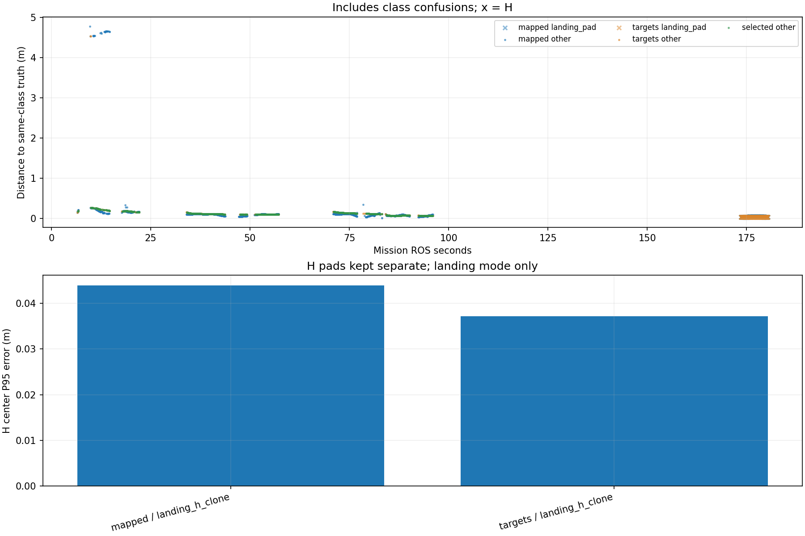

# Recorded target-center comparison

Phase-specific interpretation: [frozen SURVEY, interrupt and low reacquisition comparison](stages/PHASE_REPORT.md). The full-mission statistics below are not initial-high or low-only values.

Scope: CORRECTED_CURRENT_RUN
Gate: PASS. Historical comparison only; changed model/inflation/ceiling/H size.

Run: /home/xhj/liftrace-worktrees/r2026-board-frame-fix/logs/integrated_two_seed31_20261004_011753
World: /home/xhj/liftrace-worktrees/r2026-board-frame-fix/docs/verification/integrated_two_20261004/seed_31/field.world
Coordinate transform: World_XY_aligned_to_camera_init_world_Z_minus_0.22_recorded_TF_for_other_frames

Distances below are to same-class truth; inspect the class/instance table before interpreting localization.

| Scope | Stream | Class | Truth instance | N | Median/m | P95/m | RMSE/m | Max/m |
|---|---|---|---|---:|---:|---:|---:|---:|
| unique_valid_mission | hint_bbox | bridge | random_bridge | 16 | 0.1335 | 0.1652 | 0.1381 | 0.1752 |
| unique_valid_mission | hint_bbox | panzer | random_panzer | 87 | 0.2368 | 4.6663 | 2.2806 | 4.6746 |
| unique_valid_mission | hint_bbox | pillbox | random_pillbox | 7 | 0.2498 | 0.2770 | 0.2543 | 0.2825 |
| unique_valid_mission | hint_bbox | red_cross | random_red_cross | 4 | 0.1468 | 0.1629 | 0.1483 | 0.1645 |
| unique_valid_mission | hint_vision | bridge | random_bridge | 24 | 0.1775 | 0.1829 | 0.1750 | 0.1830 |
| unique_valid_mission | hint_vision | panzer | random_panzer | 2 | 0.0689 | 0.0689 | 0.0689 | 0.0689 |
| unique_valid_mission | hint_vision | pillbox | random_pillbox | 29 | 0.2395 | 0.2616 | 0.2379 | 0.2622 |
| unique_valid_mission | hint_vision | red_cross | random_red_cross | 2 | 0.1185 | 0.1185 | 0.1185 | 0.1185 |
| unique_valid_mission | mapped | bridge | random_bridge | 262 | 0.1076 | 0.1830 | 0.3192 | 4.7792 |
| unique_valid_mission | mapped | landing_pad | landing_h_clone | 133 | 0.0383 | 0.0439 | 0.0375 | 0.0442 |
| unique_valid_mission | mapped | panzer | random_panzer | 222 | 0.0704 | 4.6526 | 1.6420 | 4.6634 |
| unique_valid_mission | mapped | pillbox | random_pillbox | 66 | 0.1845 | 0.2630 | 0.1958 | 0.2668 |
| unique_valid_mission | mapped | red_cross | random_red_cross | 375 | 0.1021 | 0.1512 | 0.0999 | 0.1705 |
| unique_valid_mission | selected | bridge | random_bridge | 244 | 0.1357 | 0.1829 | 0.1435 | 0.1885 |
| unique_valid_mission | selected | panzer | random_panzer | 183 | 0.0687 | 0.0756 | 0.0694 | 0.0903 |
| unique_valid_mission | selected | pillbox | random_pillbox | 56 | 0.2351 | 0.2616 | 0.2340 | 0.2640 |
| unique_valid_mission | selected | red_cross | random_red_cross | 342 | 0.1075 | 0.1458 | 0.1100 | 0.1594 |
| unique_valid_mission | targets | bridge | random_bridge | 258 | 0.1355 | 0.1829 | 0.1435 | 0.1885 |
| unique_valid_mission | targets | landing_pad | landing_h_clone | 133 | 0.0357 | 0.0372 | 0.0347 | 0.0372 |
| unique_valid_mission | targets | panzer | random_panzer | 193 | 0.0688 | 0.0783 | 0.4672 | 4.5399 |
| unique_valid_mission | targets | pillbox | random_pillbox | 56 | 0.2351 | 0.2616 | 0.2340 | 0.2640 |
| unique_valid_mission | targets | red_cross | random_red_cross | 356 | 0.1073 | 0.1533 | 0.1103 | 0.1594 |
| fresh_unique_mission | hint_bbox | bridge | random_bridge | 16 | 0.1335 | 0.1652 | 0.1381 | 0.1752 |
| fresh_unique_mission | hint_bbox | panzer | random_panzer | 87 | 0.2368 | 4.6663 | 2.2806 | 4.6746 |
| fresh_unique_mission | hint_bbox | pillbox | random_pillbox | 7 | 0.2498 | 0.2770 | 0.2543 | 0.2825 |
| fresh_unique_mission | hint_bbox | red_cross | random_red_cross | 4 | 0.1468 | 0.1629 | 0.1483 | 0.1645 |
| fresh_unique_mission | hint_vision | bridge | random_bridge | 24 | 0.1775 | 0.1829 | 0.1750 | 0.1830 |
| fresh_unique_mission | hint_vision | panzer | random_panzer | 2 | 0.0689 | 0.0689 | 0.0689 | 0.0689 |
| fresh_unique_mission | hint_vision | pillbox | random_pillbox | 29 | 0.2395 | 0.2616 | 0.2379 | 0.2622 |
| fresh_unique_mission | hint_vision | red_cross | random_red_cross | 2 | 0.1185 | 0.1185 | 0.1185 | 0.1185 |
| fresh_unique_mission | mapped | bridge | random_bridge | 262 | 0.1076 | 0.1830 | 0.3192 | 4.7792 |
| fresh_unique_mission | mapped | landing_pad | landing_h_clone | 133 | 0.0383 | 0.0439 | 0.0375 | 0.0442 |
| fresh_unique_mission | mapped | panzer | random_panzer | 222 | 0.0704 | 4.6526 | 1.6420 | 4.6634 |
| fresh_unique_mission | mapped | pillbox | random_pillbox | 66 | 0.1845 | 0.2630 | 0.1958 | 0.2668 |
| fresh_unique_mission | mapped | red_cross | random_red_cross | 375 | 0.1021 | 0.1512 | 0.0999 | 0.1705 |
| fresh_unique_mission | selected | bridge | random_bridge | 244 | 0.1357 | 0.1829 | 0.1435 | 0.1885 |
| fresh_unique_mission | selected | panzer | random_panzer | 183 | 0.0687 | 0.0756 | 0.0694 | 0.0903 |
| fresh_unique_mission | selected | pillbox | random_pillbox | 56 | 0.2351 | 0.2616 | 0.2340 | 0.2640 |
| fresh_unique_mission | selected | red_cross | random_red_cross | 342 | 0.1075 | 0.1458 | 0.1100 | 0.1594 |
| fresh_unique_mission | targets | bridge | random_bridge | 258 | 0.1355 | 0.1829 | 0.1435 | 0.1885 |
| fresh_unique_mission | targets | landing_pad | landing_h_clone | 133 | 0.0357 | 0.0372 | 0.0347 | 0.0372 |
| fresh_unique_mission | targets | panzer | random_panzer | 193 | 0.0688 | 0.0783 | 0.4672 | 4.5399 |
| fresh_unique_mission | targets | pillbox | random_pillbox | 56 | 0.2351 | 0.2616 | 0.2340 | 0.2640 |
| fresh_unique_mission | targets | red_cross | random_red_cross | 356 | 0.1073 | 0.1533 | 0.1103 | 0.1594 |
| fresh_nearest_class_agrees | hint_bbox | bridge | random_bridge | 16 | 0.1335 | 0.1652 | 0.1381 | 0.1752 |
| fresh_nearest_class_agrees | hint_bbox | panzer | random_panzer | 66 | 0.2335 | 0.2878 | 0.2380 | 0.3461 |
| fresh_nearest_class_agrees | hint_bbox | pillbox | random_pillbox | 7 | 0.2498 | 0.2770 | 0.2543 | 0.2825 |
| fresh_nearest_class_agrees | hint_bbox | red_cross | random_red_cross | 4 | 0.1468 | 0.1629 | 0.1483 | 0.1645 |
| fresh_nearest_class_agrees | hint_vision | bridge | random_bridge | 24 | 0.1775 | 0.1829 | 0.1750 | 0.1830 |
| fresh_nearest_class_agrees | hint_vision | panzer | random_panzer | 2 | 0.0689 | 0.0689 | 0.0689 | 0.0689 |
| fresh_nearest_class_agrees | hint_vision | pillbox | random_pillbox | 29 | 0.2395 | 0.2616 | 0.2379 | 0.2622 |
| fresh_nearest_class_agrees | hint_vision | red_cross | random_red_cross | 2 | 0.1185 | 0.1185 | 0.1185 | 0.1185 |
| fresh_nearest_class_agrees | mapped | bridge | random_bridge | 261 | 0.1075 | 0.1830 | 0.1216 | 0.3380 |
| fresh_nearest_class_agrees | mapped | landing_pad | landing_h_clone | 133 | 0.0383 | 0.0439 | 0.0375 | 0.0442 |
| fresh_nearest_class_agrees | mapped | panzer | random_panzer | 194 | 0.0689 | 0.0948 | 0.0702 | 0.1133 |
| fresh_nearest_class_agrees | mapped | pillbox | random_pillbox | 66 | 0.1845 | 0.2630 | 0.1958 | 0.2668 |
| fresh_nearest_class_agrees | mapped | red_cross | random_red_cross | 375 | 0.1021 | 0.1512 | 0.0999 | 0.1705 |
| fresh_nearest_class_agrees | selected | bridge | random_bridge | 244 | 0.1357 | 0.1829 | 0.1435 | 0.1885 |
| fresh_nearest_class_agrees | selected | panzer | random_panzer | 183 | 0.0687 | 0.0756 | 0.0694 | 0.0903 |
| fresh_nearest_class_agrees | selected | pillbox | random_pillbox | 56 | 0.2351 | 0.2616 | 0.2340 | 0.2640 |
| fresh_nearest_class_agrees | selected | red_cross | random_red_cross | 342 | 0.1075 | 0.1458 | 0.1100 | 0.1594 |
| fresh_nearest_class_agrees | targets | bridge | random_bridge | 258 | 0.1355 | 0.1829 | 0.1435 | 0.1885 |
| fresh_nearest_class_agrees | targets | landing_pad | landing_h_clone | 133 | 0.0357 | 0.0372 | 0.0347 | 0.0372 |
| fresh_nearest_class_agrees | targets | panzer | random_panzer | 191 | 0.0687 | 0.0767 | 0.0699 | 0.1133 |
| fresh_nearest_class_agrees | targets | pillbox | random_pillbox | 56 | 0.2351 | 0.2616 | 0.2340 | 0.2640 |
| fresh_nearest_class_agrees | targets | red_cross | random_red_cross | 356 | 0.1073 | 0.1533 | 0.1103 | 0.1594 |
| fresh_H_landing_mode | mapped | landing_pad | landing_h_clone | 133 | 0.0383 | 0.0439 | 0.0375 | 0.0442 |
| fresh_H_landing_mode | targets | landing_pad | landing_h_clone | 133 | 0.0357 | 0.0372 | 0.0347 | 0.0372 |

## Nearest any-class instance versus predicted class

Fresh unique mapped/targets/selected; all unique mission hints. A large same-class distance can be a class error.

| Stream | Predicted | Nearest class | Nearest instance | N | Median nearest/m | Median same-class/m | Suspected confusion N |
|---|---|---|---|---:|---:|---:|---:|
| hint_bbox | bridge | bridge | random_bridge | 16 | 0.1335 | 0.1335 | 0 |
| hint_bbox | panzer | panzer | random_panzer | 66 | 0.2335 | 0.2335 | 0 |
| hint_bbox | panzer | pillbox | random_pillbox | 21 | 0.1389 | 4.6563 | 21 |
| hint_bbox | pillbox | pillbox | random_pillbox | 7 | 0.2498 | 0.2498 | 0 |
| hint_bbox | red_cross | red_cross | random_red_cross | 4 | 0.1468 | 0.1468 | 0 |
| hint_vision | bridge | bridge | random_bridge | 24 | 0.1775 | 0.1775 | 0 |
| hint_vision | panzer | panzer | random_panzer | 2 | 0.0689 | 0.0689 | 0 |
| hint_vision | pillbox | pillbox | random_pillbox | 29 | 0.2395 | 0.2395 | 0 |
| hint_vision | red_cross | red_cross | random_red_cross | 2 | 0.1185 | 0.1185 | 0 |
| mapped | bridge | bridge | random_bridge | 261 | 0.1075 | 0.1075 | 0 |
| mapped | bridge | pillbox | random_pillbox | 1 | 0.2751 | 4.7792 | 1 |
| mapped | landing_pad | landing_pad | landing_h_clone | 133 | 0.0383 | 0.0383 | 0 |
| mapped | panzer | panzer | random_panzer | 194 | 0.0689 | 0.0689 | 0 |
| mapped | panzer | pillbox | random_pillbox | 28 | 0.1319 | 4.6494 | 28 |
| mapped | pillbox | pillbox | random_pillbox | 66 | 0.1845 | 0.1845 | 0 |
| mapped | red_cross | red_cross | random_red_cross | 375 | 0.1021 | 0.1021 | 0 |
| selected | bridge | bridge | random_bridge | 244 | 0.1357 | 0.1357 | 0 |
| selected | panzer | panzer | random_panzer | 183 | 0.0687 | 0.0687 | 0 |
| selected | pillbox | pillbox | random_pillbox | 56 | 0.2351 | 0.2351 | 0 |
| selected | red_cross | red_cross | random_red_cross | 342 | 0.1075 | 0.1075 | 0 |
| targets | bridge | bridge | random_bridge | 258 | 0.1355 | 0.1355 | 0 |
| targets | landing_pad | landing_pad | landing_h_clone | 133 | 0.0357 | 0.0357 | 0 |
| targets | panzer | panzer | random_panzer | 191 | 0.0687 | 0.0687 | 0 |
| targets | panzer | pillbox | random_pillbox | 2 | 0.2684 | 4.5381 | 2 |
| targets | pillbox | pillbox | random_pillbox | 56 | 0.2351 | 0.2351 | 0 |
| targets | red_cross | red_cross | random_red_cross | 356 | 0.1073 | 0.1073 | 0 |

Missing bag topics: []

No rows is missing evidence, not zero error.

- Offline recorded map centers, not parcel impacts or physical release accuracy.
- Association is nearest same-class truth; not an independent instance recall evaluation.
- Same-class distance is not localization-only error: a wrong class may be near a different true instance.
- Nearest-any-instance association is diagnostic, not independently verified object identity.
- Suspected category confusion requires a different nearest class within the stated radius and a same-vs-any distance margin.
- Hint streams are reconstructed from high_view_full_events navigation_support, with explicitly supplied mission frame and projection plane.
- H start and landing pads are separate truth instances; a class/position error can change nearest association.
- World-to-evaluation transform is explicitly supplied, not estimated from the detections.
- Reported error is XY only. H dimensions do not change its center; no Z/size accuracy claim.
- Valid but old candidate publications are separate from fresh unique observations.
- TF lookup reuses bag_replay.TransformTree (latest past sample, max dynamic age 0.5s, no interpolation).
- Raw duplicates and invalid samples remain in CSV; errors aggregate only inside the mission interval.
- H branch-complete counters only show recorded pipeline completion, not proof of a detected H contour; raw detector output was not in this lightweight bag.

All samples including invalid, stale and duplicate publications: center_samples.csv.
Machine-readable provenance, truth and counts: center_summary.json.
