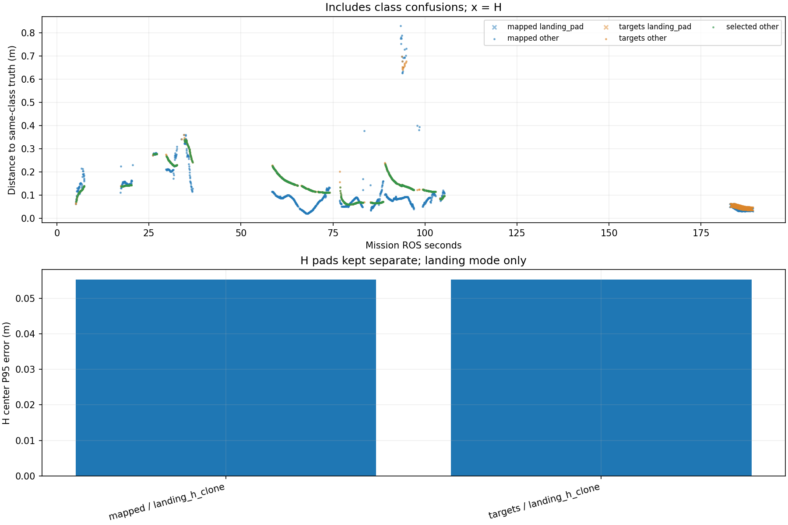

# Recorded target-center comparison

Phase-specific interpretation: [frozen SURVEY, interrupt and low reacquisition comparison](stages/PHASE_REPORT.md). The full-mission statistics below are not initial-high or low-only values.

Scope: CORRECTED_CURRENT_RUN
Gate: PASS. Historical comparison only; changed model/inflation/ceiling/H size.

Run: /home/xhj/liftrace-worktrees/r2026-board-frame-fix/logs/integrated_two_seed38_20261004_013059
World: /home/xhj/liftrace-worktrees/r2026-board-frame-fix/docs/verification/integrated_two_20261004/seed_38/field.world
Coordinate transform: World_XY_aligned_to_camera_init_world_Z_minus_0.22_recorded_TF_for_other_frames

Distances below are to same-class truth; inspect the class/instance table before interpreting localization.

| Scope | Stream | Class | Truth instance | N | Median/m | P95/m | RMSE/m | Max/m |
|---|---|---|---|---:|---:|---:|---:|---:|
| unique_valid_mission | hint_bbox | bridge | random_bridge | 16 | 0.3085 | 0.4787 | 0.3487 | 0.4922 |
| unique_valid_mission | hint_bbox | panzer | random_panzer | 3 | 0.4528 | 0.4753 | 0.4475 | 0.4778 |
| unique_valid_mission | hint_bbox | red_cross | random_red_cross | 9 | 0.2786 | 0.3352 | 0.2929 | 0.3426 |
| unique_valid_mission | hint_bbox | tent | random_tent | 11 | 3.3662 | 3.6062 | 2.7668 | 3.6098 |
| unique_valid_mission | hint_vision | bridge | random_bridge | 1 | 0.0641 | 0.0641 | 0.0641 | 0.0641 |
| unique_valid_mission | hint_vision | panzer | random_panzer | 2 | 0.1826 | 0.1833 | 0.1826 | 0.1834 |
| unique_valid_mission | hint_vision | red_cross | random_red_cross | 29 | 0.2476 | 0.2763 | 0.2494 | 0.2766 |
| unique_valid_mission | hint_vision | tent | random_tent | 37 | 0.1373 | 0.1417 | 0.1278 | 0.1419 |
| unique_valid_mission | mapped | bridge | random_bridge | 199 | 0.0685 | 0.6941 | 0.2300 | 0.8296 |
| unique_valid_mission | mapped | landing_pad | landing_h_clone | 97 | 0.0383 | 0.0553 | 0.0424 | 0.0557 |
| unique_valid_mission | mapped | panzer | random_panzer | 255 | 0.0865 | 0.3214 | 0.1372 | 0.3997 |
| unique_valid_mission | mapped | pillbox | random_pillbox | 22 | 0.0969 | 0.1136 | 0.0976 | 0.1196 |
| unique_valid_mission | mapped | red_cross | random_red_cross | 360 | 0.0924 | 0.2758 | 0.1352 | 0.3081 |
| unique_valid_mission | mapped | tent | random_tent | 102 | 0.1472 | 0.2017 | 0.1492 | 0.2297 |
| unique_valid_mission | selected | bridge | random_bridge | 164 | 0.0660 | 0.0831 | 0.0682 | 0.1323 |
| unique_valid_mission | selected | panzer | random_panzer | 236 | 0.1415 | 0.3292 | 0.1850 | 0.3385 |
| unique_valid_mission | selected | pillbox | random_pillbox | 20 | 0.0856 | 0.0961 | 0.0876 | 0.0965 |
| unique_valid_mission | selected | red_cross | random_red_cross | 293 | 0.1578 | 0.2762 | 0.1792 | 0.2771 |
| unique_valid_mission | selected | tent | random_tent | 93 | 0.1374 | 0.1420 | 0.1287 | 0.1426 |
| unique_valid_mission | targets | bridge | random_bridge | 186 | 0.0664 | 0.6494 | 0.1832 | 0.6978 |
| unique_valid_mission | targets | landing_pad | landing_h_clone | 95 | 0.0455 | 0.0552 | 0.0472 | 0.0554 |
| unique_valid_mission | targets | panzer | random_panzer | 249 | 0.1415 | 0.3301 | 0.1857 | 0.3589 |
| unique_valid_mission | targets | pillbox | random_pillbox | 22 | 0.0855 | 0.0960 | 0.0873 | 0.0965 |
| unique_valid_mission | targets | red_cross | random_red_cross | 316 | 0.1565 | 0.2761 | 0.1789 | 0.2771 |
| unique_valid_mission | targets | tent | random_tent | 97 | 0.1374 | 0.1420 | 0.1278 | 0.1426 |
| fresh_unique_mission | hint_bbox | bridge | random_bridge | 16 | 0.3085 | 0.4787 | 0.3487 | 0.4922 |
| fresh_unique_mission | hint_bbox | panzer | random_panzer | 3 | 0.4528 | 0.4753 | 0.4475 | 0.4778 |
| fresh_unique_mission | hint_bbox | red_cross | random_red_cross | 9 | 0.2786 | 0.3352 | 0.2929 | 0.3426 |
| fresh_unique_mission | hint_bbox | tent | random_tent | 11 | 3.3662 | 3.6062 | 2.7668 | 3.6098 |
| fresh_unique_mission | hint_vision | bridge | random_bridge | 1 | 0.0641 | 0.0641 | 0.0641 | 0.0641 |
| fresh_unique_mission | hint_vision | panzer | random_panzer | 2 | 0.1826 | 0.1833 | 0.1826 | 0.1834 |
| fresh_unique_mission | hint_vision | red_cross | random_red_cross | 29 | 0.2476 | 0.2763 | 0.2494 | 0.2766 |
| fresh_unique_mission | hint_vision | tent | random_tent | 37 | 0.1373 | 0.1417 | 0.1278 | 0.1419 |
| fresh_unique_mission | mapped | bridge | random_bridge | 199 | 0.0685 | 0.6941 | 0.2300 | 0.8296 |
| fresh_unique_mission | mapped | landing_pad | landing_h_clone | 97 | 0.0383 | 0.0553 | 0.0424 | 0.0557 |
| fresh_unique_mission | mapped | panzer | random_panzer | 255 | 0.0865 | 0.3214 | 0.1372 | 0.3997 |
| fresh_unique_mission | mapped | pillbox | random_pillbox | 22 | 0.0969 | 0.1136 | 0.0976 | 0.1196 |
| fresh_unique_mission | mapped | red_cross | random_red_cross | 348 | 0.0916 | 0.2756 | 0.1315 | 0.3081 |
| fresh_unique_mission | mapped | tent | random_tent | 102 | 0.1472 | 0.2017 | 0.1492 | 0.2297 |
| fresh_unique_mission | selected | bridge | random_bridge | 164 | 0.0660 | 0.0831 | 0.0682 | 0.1323 |
| fresh_unique_mission | selected | panzer | random_panzer | 236 | 0.1415 | 0.3292 | 0.1850 | 0.3385 |
| fresh_unique_mission | selected | pillbox | random_pillbox | 20 | 0.0856 | 0.0961 | 0.0876 | 0.0965 |
| fresh_unique_mission | selected | red_cross | random_red_cross | 293 | 0.1578 | 0.2762 | 0.1792 | 0.2771 |
| fresh_unique_mission | selected | tent | random_tent | 93 | 0.1374 | 0.1420 | 0.1287 | 0.1426 |
| fresh_unique_mission | targets | bridge | random_bridge | 186 | 0.0664 | 0.6494 | 0.1832 | 0.6978 |
| fresh_unique_mission | targets | landing_pad | landing_h_clone | 95 | 0.0455 | 0.0552 | 0.0472 | 0.0554 |
| fresh_unique_mission | targets | panzer | random_panzer | 249 | 0.1415 | 0.3301 | 0.1857 | 0.3589 |
| fresh_unique_mission | targets | pillbox | random_pillbox | 22 | 0.0855 | 0.0960 | 0.0873 | 0.0965 |
| fresh_unique_mission | targets | red_cross | random_red_cross | 316 | 0.1565 | 0.2761 | 0.1789 | 0.2771 |
| fresh_unique_mission | targets | tent | random_tent | 97 | 0.1374 | 0.1420 | 0.1278 | 0.1426 |
| fresh_nearest_class_agrees | hint_bbox | bridge | random_bridge | 16 | 0.3085 | 0.4787 | 0.3487 | 0.4922 |
| fresh_nearest_class_agrees | hint_bbox | panzer | random_panzer | 3 | 0.4528 | 0.4753 | 0.4475 | 0.4778 |
| fresh_nearest_class_agrees | hint_bbox | red_cross | random_red_cross | 9 | 0.2786 | 0.3352 | 0.2929 | 0.3426 |
| fresh_nearest_class_agrees | hint_bbox | tent | random_tent | 4 | 0.0468 | 0.0512 | 0.0464 | 0.0513 |
| fresh_nearest_class_agrees | hint_vision | bridge | random_bridge | 1 | 0.0641 | 0.0641 | 0.0641 | 0.0641 |
| fresh_nearest_class_agrees | hint_vision | panzer | random_panzer | 2 | 0.1826 | 0.1833 | 0.1826 | 0.1834 |
| fresh_nearest_class_agrees | hint_vision | red_cross | random_red_cross | 29 | 0.2476 | 0.2763 | 0.2494 | 0.2766 |
| fresh_nearest_class_agrees | hint_vision | tent | random_tent | 37 | 0.1373 | 0.1417 | 0.1278 | 0.1419 |
| fresh_nearest_class_agrees | mapped | bridge | random_bridge | 193 | 0.0675 | 0.6303 | 0.1882 | 0.7324 |
| fresh_nearest_class_agrees | mapped | landing_pad | landing_h_clone | 97 | 0.0383 | 0.0553 | 0.0424 | 0.0557 |
| fresh_nearest_class_agrees | mapped | panzer | random_panzer | 255 | 0.0865 | 0.3214 | 0.1372 | 0.3997 |
| fresh_nearest_class_agrees | mapped | pillbox | random_pillbox | 22 | 0.0969 | 0.1136 | 0.0976 | 0.1196 |
| fresh_nearest_class_agrees | mapped | red_cross | random_red_cross | 348 | 0.0916 | 0.2756 | 0.1315 | 0.3081 |
| fresh_nearest_class_agrees | mapped | tent | random_tent | 102 | 0.1472 | 0.2017 | 0.1492 | 0.2297 |
| fresh_nearest_class_agrees | selected | bridge | random_bridge | 164 | 0.0660 | 0.0831 | 0.0682 | 0.1323 |
| fresh_nearest_class_agrees | selected | panzer | random_panzer | 236 | 0.1415 | 0.3292 | 0.1850 | 0.3385 |
| fresh_nearest_class_agrees | selected | pillbox | random_pillbox | 20 | 0.0856 | 0.0961 | 0.0876 | 0.0965 |
| fresh_nearest_class_agrees | selected | red_cross | random_red_cross | 293 | 0.1578 | 0.2762 | 0.1792 | 0.2771 |
| fresh_nearest_class_agrees | selected | tent | random_tent | 93 | 0.1374 | 0.1420 | 0.1287 | 0.1426 |
| fresh_nearest_class_agrees | targets | bridge | random_bridge | 186 | 0.0664 | 0.6494 | 0.1832 | 0.6978 |
| fresh_nearest_class_agrees | targets | landing_pad | landing_h_clone | 95 | 0.0455 | 0.0552 | 0.0472 | 0.0554 |
| fresh_nearest_class_agrees | targets | panzer | random_panzer | 249 | 0.1415 | 0.3301 | 0.1857 | 0.3589 |
| fresh_nearest_class_agrees | targets | pillbox | random_pillbox | 22 | 0.0855 | 0.0960 | 0.0873 | 0.0965 |
| fresh_nearest_class_agrees | targets | red_cross | random_red_cross | 316 | 0.1565 | 0.2761 | 0.1789 | 0.2771 |
| fresh_nearest_class_agrees | targets | tent | random_tent | 97 | 0.1374 | 0.1420 | 0.1278 | 0.1426 |
| fresh_H_landing_mode | mapped | landing_pad | landing_h_clone | 97 | 0.0383 | 0.0553 | 0.0424 | 0.0557 |
| fresh_H_landing_mode | targets | landing_pad | landing_h_clone | 95 | 0.0455 | 0.0552 | 0.0472 | 0.0554 |

## Nearest any-class instance versus predicted class

Fresh unique mapped/targets/selected; all unique mission hints. A large same-class distance can be a class error.

| Stream | Predicted | Nearest class | Nearest instance | N | Median nearest/m | Median same-class/m | Suspected confusion N |
|---|---|---|---|---:|---:|---:|---:|
| hint_bbox | bridge | bridge | random_bridge | 16 | 0.3085 | 0.3085 | 0 |
| hint_bbox | panzer | panzer | random_panzer | 3 | 0.4528 | 0.4528 | 0 |
| hint_bbox | red_cross | red_cross | random_red_cross | 9 | 0.2786 | 0.2786 | 0 |
| hint_bbox | tent | pillbox | random_pillbox | 7 | 2.8600 | 3.4054 | 0 |
| hint_bbox | tent | tent | random_tent | 4 | 0.0468 | 0.0468 | 0 |
| hint_vision | bridge | bridge | random_bridge | 1 | 0.0641 | 0.0641 | 0 |
| hint_vision | panzer | panzer | random_panzer | 2 | 0.1826 | 0.1826 | 0 |
| hint_vision | red_cross | red_cross | random_red_cross | 29 | 0.2476 | 0.2476 | 0 |
| hint_vision | tent | tent | random_tent | 37 | 0.1373 | 0.1373 | 0 |
| mapped | bridge | bridge | random_bridge | 193 | 0.0675 | 0.0675 | 0 |
| mapped | bridge | panzer | random_panzer | 6 | 0.7238 | 0.7782 | 0 |
| mapped | landing_pad | landing_pad | landing_h_clone | 97 | 0.0383 | 0.0383 | 0 |
| mapped | panzer | panzer | random_panzer | 255 | 0.0865 | 0.0865 | 0 |
| mapped | pillbox | pillbox | random_pillbox | 22 | 0.0969 | 0.0969 | 0 |
| mapped | red_cross | red_cross | random_red_cross | 348 | 0.0916 | 0.0916 | 0 |
| mapped | tent | tent | random_tent | 102 | 0.1472 | 0.1472 | 0 |
| selected | bridge | bridge | random_bridge | 164 | 0.0660 | 0.0660 | 0 |
| selected | panzer | panzer | random_panzer | 236 | 0.1415 | 0.1415 | 0 |
| selected | pillbox | pillbox | random_pillbox | 20 | 0.0856 | 0.0856 | 0 |
| selected | red_cross | red_cross | random_red_cross | 293 | 0.1578 | 0.1578 | 0 |
| selected | tent | tent | random_tent | 93 | 0.1374 | 0.1374 | 0 |
| targets | bridge | bridge | random_bridge | 186 | 0.0664 | 0.0664 | 0 |
| targets | landing_pad | landing_pad | landing_h_clone | 95 | 0.0455 | 0.0455 | 0 |
| targets | panzer | panzer | random_panzer | 249 | 0.1415 | 0.1415 | 0 |
| targets | pillbox | pillbox | random_pillbox | 22 | 0.0855 | 0.0855 | 0 |
| targets | red_cross | red_cross | random_red_cross | 316 | 0.1565 | 0.1565 | 0 |
| targets | tent | tent | random_tent | 97 | 0.1374 | 0.1374 | 0 |

Missing bag topics: []

No rows is missing evidence, not zero error.

- Offline recorded map centers, not parcel impacts or physical release accuracy.
- Association is nearest same-class truth; not an independent instance recall evaluation.
- Same-class distance is not localization-only error: a wrong class may be near a different true instance.
- Nearest-any-instance association is diagnostic, not independently verified object identity.
- Suspected category confusion requires a different nearest class within the stated radius and a same-vs-any distance margin.
- Hint streams are reconstructed from high_view_full_events navigation_support, with explicitly supplied mission frame and projection plane.
- H start and landing pads are separate truth instances; a class/position error can change nearest association.
- World-to-evaluation transform is explicitly supplied, not estimated from the detections.
- Reported error is XY only. H dimensions do not change its center; no Z/size accuracy claim.
- Valid but old candidate publications are separate from fresh unique observations.
- TF lookup reuses bag_replay.TransformTree (latest past sample, max dynamic age 0.5s, no interpolation).
- Raw duplicates and invalid samples remain in CSV; errors aggregate only inside the mission interval.
- H branch-complete counters only show recorded pipeline completion, not proof of a detected H contour; raw detector output was not in this lightweight bag.

All samples including invalid, stale and duplicate publications: center_samples.csv.
Machine-readable provenance, truth and counts: center_summary.json.
