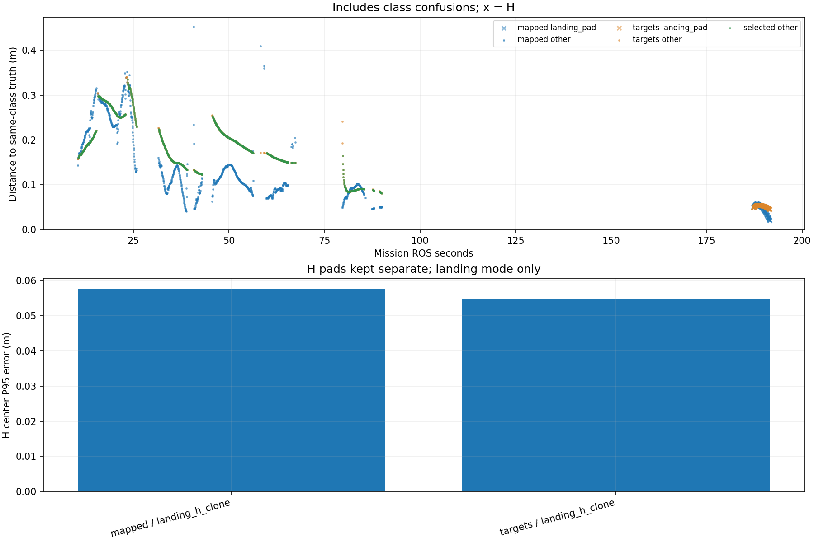

# Recorded target-center comparison

Phase-specific interpretation: [frozen SURVEY, interrupt and low reacquisition comparison](stages/PHASE_REPORT.md). The full-mission statistics below are not initial-high or low-only values.

Scope: 31_rectangle
Gate: PASS. Same-source route/speed matrix; see main report for paired comparisons and failures.

Run: /home/xhj/liftrace-worktrees/r2026-high-view-search/logs/latest_six_rectangle_seed31_20261005_023409
World: /home/xhj/liftrace-worktrees/r2026-high-view-search/docs/verification/latest_six_20261005/generated/rectangle_31/rectangle_seed31/field.world
Coordinate transform: FLU world XY equals mission XY; local Z ground=-0.22, only XY distances compared

Distances below are to same-class truth; inspect the class/instance table before interpreting localization.

| Scope | Stream | Class | Truth instance | N | Median/m | P95/m | RMSE/m | Max/m |
|---|---|---|---|---:|---:|---:|---:|---:|
| unique_valid_mission | hint_bbox | bridge | random_bridge | 17 | 0.3260 | 0.4543 | 0.3581 | 0.4751 |
| unique_valid_mission | hint_bbox | panzer | random_panzer | 5 | 0.3889 | 0.4400 | 0.3978 | 0.4428 |
| unique_valid_mission | hint_bbox | red_cross | random_red_cross | 15 | 0.3551 | 0.3936 | 0.3612 | 0.4031 |
| unique_valid_mission | hint_bbox | tent | random_tent | 5 | 0.1615 | 0.1741 | 0.1639 | 0.1742 |
| unique_valid_mission | hint_vision | bridge | random_bridge | 58 | 0.2762 | 0.2969 | 0.2736 | 0.2978 |
| unique_valid_mission | hint_vision | panzer | random_panzer | 4 | 0.1792 | 0.1807 | 0.1792 | 0.1809 |
| unique_valid_mission | hint_vision | red_cross | random_red_cross | 2 | 0.1026 | 0.1039 | 0.1026 | 0.1040 |
| unique_valid_mission | hint_vision | tent | random_tent | 38 | 0.1862 | 0.2078 | 0.1852 | 0.2115 |
| unique_valid_mission | mapped | bridge | random_bridge | 474 | 0.1179 | 0.2967 | 0.1759 | 0.4095 |
| unique_valid_mission | mapped | landing_pad | landing_h_clone | 86 | 0.0499 | 0.0578 | 0.0468 | 0.0580 |
| unique_valid_mission | mapped | panzer | random_panzer | 239 | 0.1159 | 0.3062 | 0.1491 | 0.4527 |
| unique_valid_mission | mapped | red_cross | random_red_cross | 144 | 0.0848 | 0.1020 | 0.0897 | 0.3400 |
| unique_valid_mission | mapped | tent | random_tent | 93 | 0.2178 | 0.3030 | 0.2266 | 0.3157 |
| unique_valid_mission | selected | bridge | random_bridge | 458 | 0.2027 | 0.2906 | 0.2177 | 0.2980 |
| unique_valid_mission | selected | panzer | random_panzer | 224 | 0.1534 | 0.3143 | 0.1927 | 0.3349 |
| unique_valid_mission | selected | red_cross | random_red_cross | 120 | 0.0886 | 0.1076 | 0.0915 | 0.1649 |
| unique_valid_mission | selected | tent | random_tent | 90 | 0.1894 | 0.2162 | 0.1891 | 0.2207 |
| unique_valid_mission | targets | bridge | random_bridge | 471 | 0.2026 | 0.2909 | 0.2176 | 0.3048 |
| unique_valid_mission | targets | landing_pad | landing_h_clone | 86 | 0.0525 | 0.0549 | 0.0519 | 0.0550 |
| unique_valid_mission | targets | panzer | random_panzer | 236 | 0.1534 | 0.3149 | 0.1932 | 0.3407 |
| unique_valid_mission | targets | red_cross | random_red_cross | 134 | 0.0886 | 0.1276 | 0.1025 | 0.3400 |
| unique_valid_mission | targets | tent | random_tent | 92 | 0.1888 | 0.2161 | 0.1884 | 0.2207 |
| fresh_unique_mission | hint_bbox | bridge | random_bridge | 17 | 0.3260 | 0.4543 | 0.3581 | 0.4751 |
| fresh_unique_mission | hint_bbox | panzer | random_panzer | 5 | 0.3889 | 0.4400 | 0.3978 | 0.4428 |
| fresh_unique_mission | hint_bbox | red_cross | random_red_cross | 15 | 0.3551 | 0.3936 | 0.3612 | 0.4031 |
| fresh_unique_mission | hint_bbox | tent | random_tent | 5 | 0.1615 | 0.1741 | 0.1639 | 0.1742 |
| fresh_unique_mission | hint_vision | bridge | random_bridge | 58 | 0.2762 | 0.2969 | 0.2736 | 0.2978 |
| fresh_unique_mission | hint_vision | panzer | random_panzer | 4 | 0.1792 | 0.1807 | 0.1792 | 0.1809 |
| fresh_unique_mission | hint_vision | red_cross | random_red_cross | 2 | 0.1026 | 0.1039 | 0.1026 | 0.1040 |
| fresh_unique_mission | hint_vision | tent | random_tent | 38 | 0.1862 | 0.2078 | 0.1852 | 0.2115 |
| fresh_unique_mission | mapped | bridge | random_bridge | 474 | 0.1179 | 0.2967 | 0.1759 | 0.4095 |
| fresh_unique_mission | mapped | landing_pad | landing_h_clone | 86 | 0.0499 | 0.0578 | 0.0468 | 0.0580 |
| fresh_unique_mission | mapped | panzer | random_panzer | 239 | 0.1159 | 0.3062 | 0.1491 | 0.4527 |
| fresh_unique_mission | mapped | red_cross | random_red_cross | 144 | 0.0848 | 0.1020 | 0.0897 | 0.3400 |
| fresh_unique_mission | mapped | tent | random_tent | 93 | 0.2178 | 0.3030 | 0.2266 | 0.3157 |
| fresh_unique_mission | selected | bridge | random_bridge | 458 | 0.2027 | 0.2906 | 0.2177 | 0.2980 |
| fresh_unique_mission | selected | panzer | random_panzer | 224 | 0.1534 | 0.3143 | 0.1927 | 0.3349 |
| fresh_unique_mission | selected | red_cross | random_red_cross | 120 | 0.0886 | 0.1076 | 0.0915 | 0.1649 |
| fresh_unique_mission | selected | tent | random_tent | 90 | 0.1894 | 0.2162 | 0.1891 | 0.2207 |
| fresh_unique_mission | targets | bridge | random_bridge | 471 | 0.2026 | 0.2909 | 0.2176 | 0.3048 |
| fresh_unique_mission | targets | landing_pad | landing_h_clone | 86 | 0.0525 | 0.0549 | 0.0519 | 0.0550 |
| fresh_unique_mission | targets | panzer | random_panzer | 236 | 0.1534 | 0.3149 | 0.1932 | 0.3407 |
| fresh_unique_mission | targets | red_cross | random_red_cross | 134 | 0.0886 | 0.1276 | 0.1025 | 0.3400 |
| fresh_unique_mission | targets | tent | random_tent | 92 | 0.1888 | 0.2161 | 0.1884 | 0.2207 |
| fresh_nearest_class_agrees | hint_bbox | bridge | random_bridge | 17 | 0.3260 | 0.4543 | 0.3581 | 0.4751 |
| fresh_nearest_class_agrees | hint_bbox | panzer | random_panzer | 5 | 0.3889 | 0.4400 | 0.3978 | 0.4428 |
| fresh_nearest_class_agrees | hint_bbox | red_cross | random_red_cross | 15 | 0.3551 | 0.3936 | 0.3612 | 0.4031 |
| fresh_nearest_class_agrees | hint_bbox | tent | random_tent | 5 | 0.1615 | 0.1741 | 0.1639 | 0.1742 |
| fresh_nearest_class_agrees | hint_vision | bridge | random_bridge | 58 | 0.2762 | 0.2969 | 0.2736 | 0.2978 |
| fresh_nearest_class_agrees | hint_vision | panzer | random_panzer | 4 | 0.1792 | 0.1807 | 0.1792 | 0.1809 |
| fresh_nearest_class_agrees | hint_vision | red_cross | random_red_cross | 2 | 0.1026 | 0.1039 | 0.1026 | 0.1040 |
| fresh_nearest_class_agrees | hint_vision | tent | random_tent | 38 | 0.1862 | 0.2078 | 0.1852 | 0.2115 |
| fresh_nearest_class_agrees | mapped | bridge | random_bridge | 474 | 0.1179 | 0.2967 | 0.1759 | 0.4095 |
| fresh_nearest_class_agrees | mapped | landing_pad | landing_h_clone | 86 | 0.0499 | 0.0578 | 0.0468 | 0.0580 |
| fresh_nearest_class_agrees | mapped | panzer | random_panzer | 239 | 0.1159 | 0.3062 | 0.1491 | 0.4527 |
| fresh_nearest_class_agrees | mapped | red_cross | random_red_cross | 144 | 0.0848 | 0.1020 | 0.0897 | 0.3400 |
| fresh_nearest_class_agrees | mapped | tent | random_tent | 93 | 0.2178 | 0.3030 | 0.2266 | 0.3157 |
| fresh_nearest_class_agrees | selected | bridge | random_bridge | 458 | 0.2027 | 0.2906 | 0.2177 | 0.2980 |
| fresh_nearest_class_agrees | selected | panzer | random_panzer | 224 | 0.1534 | 0.3143 | 0.1927 | 0.3349 |
| fresh_nearest_class_agrees | selected | red_cross | random_red_cross | 120 | 0.0886 | 0.1076 | 0.0915 | 0.1649 |
| fresh_nearest_class_agrees | selected | tent | random_tent | 90 | 0.1894 | 0.2162 | 0.1891 | 0.2207 |
| fresh_nearest_class_agrees | targets | bridge | random_bridge | 471 | 0.2026 | 0.2909 | 0.2176 | 0.3048 |
| fresh_nearest_class_agrees | targets | landing_pad | landing_h_clone | 86 | 0.0525 | 0.0549 | 0.0519 | 0.0550 |
| fresh_nearest_class_agrees | targets | panzer | random_panzer | 236 | 0.1534 | 0.3149 | 0.1932 | 0.3407 |
| fresh_nearest_class_agrees | targets | red_cross | random_red_cross | 134 | 0.0886 | 0.1276 | 0.1025 | 0.3400 |
| fresh_nearest_class_agrees | targets | tent | random_tent | 92 | 0.1888 | 0.2161 | 0.1884 | 0.2207 |
| fresh_H_landing_mode | mapped | landing_pad | landing_h_clone | 86 | 0.0499 | 0.0578 | 0.0468 | 0.0580 |
| fresh_H_landing_mode | targets | landing_pad | landing_h_clone | 86 | 0.0525 | 0.0549 | 0.0519 | 0.0550 |

## Nearest any-class instance versus predicted class

Fresh unique mapped/targets/selected; all unique mission hints. A large same-class distance can be a class error.

| Stream | Predicted | Nearest class | Nearest instance | N | Median nearest/m | Median same-class/m | Suspected confusion N |
|---|---|---|---|---:|---:|---:|---:|
| hint_bbox | bridge | bridge | random_bridge | 17 | 0.3260 | 0.3260 | 0 |
| hint_bbox | panzer | panzer | random_panzer | 5 | 0.3889 | 0.3889 | 0 |
| hint_bbox | red_cross | red_cross | random_red_cross | 15 | 0.3551 | 0.3551 | 0 |
| hint_bbox | tent | tent | random_tent | 5 | 0.1615 | 0.1615 | 0 |
| hint_vision | bridge | bridge | random_bridge | 58 | 0.2762 | 0.2762 | 0 |
| hint_vision | panzer | panzer | random_panzer | 4 | 0.1792 | 0.1792 | 0 |
| hint_vision | red_cross | red_cross | random_red_cross | 2 | 0.1026 | 0.1026 | 0 |
| hint_vision | tent | tent | random_tent | 38 | 0.1862 | 0.1862 | 0 |
| mapped | bridge | bridge | random_bridge | 474 | 0.1179 | 0.1179 | 0 |
| mapped | landing_pad | landing_pad | landing_h_clone | 86 | 0.0499 | 0.0499 | 0 |
| mapped | panzer | panzer | random_panzer | 239 | 0.1159 | 0.1159 | 0 |
| mapped | red_cross | red_cross | random_red_cross | 144 | 0.0848 | 0.0848 | 0 |
| mapped | tent | tent | random_tent | 93 | 0.2178 | 0.2178 | 0 |
| selected | bridge | bridge | random_bridge | 458 | 0.2027 | 0.2027 | 0 |
| selected | panzer | panzer | random_panzer | 224 | 0.1534 | 0.1534 | 0 |
| selected | red_cross | red_cross | random_red_cross | 120 | 0.0886 | 0.0886 | 0 |
| selected | tent | tent | random_tent | 90 | 0.1894 | 0.1894 | 0 |
| targets | bridge | bridge | random_bridge | 471 | 0.2026 | 0.2026 | 0 |
| targets | landing_pad | landing_pad | landing_h_clone | 86 | 0.0525 | 0.0525 | 0 |
| targets | panzer | panzer | random_panzer | 236 | 0.1534 | 0.1534 | 0 |
| targets | red_cross | red_cross | random_red_cross | 134 | 0.0886 | 0.0886 | 0 |
| targets | tent | tent | random_tent | 92 | 0.1888 | 0.1888 | 0 |

Missing bag topics: []

No rows is missing evidence, not zero error.

- Offline recorded map centers, not parcel impacts or physical release accuracy.
- Association is nearest same-class truth; not an independent instance recall evaluation.
- Same-class distance is not localization-only error: a wrong class may be near a different true instance.
- Nearest-any-instance association is diagnostic, not independently verified object identity.
- Suspected category confusion requires a different nearest class within the stated radius and a same-vs-any distance margin.
- Hint streams are reconstructed from high_view_full_events navigation_support, with explicitly supplied mission frame and projection plane.
- H start and landing pads are separate truth instances; a class/position error can change nearest association.
- World-to-evaluation transform is explicitly supplied, not estimated from the detections.
- Reported error is XY only. H dimensions do not change its center; no Z/size accuracy claim.
- Valid but old candidate publications are separate from fresh unique observations.
- TF lookup reuses bag_replay.TransformTree (latest past sample, max dynamic age 0.5s, no interpolation).
- Raw duplicates and invalid samples remain in CSV; errors aggregate only inside the mission interval.
- H branch-complete counters only show recorded pipeline completion, not proof of a detected H contour; raw detector output was not in this lightweight bag.

All samples including invalid, stale and duplicate publications: center_samples.csv.
Machine-readable provenance, truth and counts: center_summary.json.
