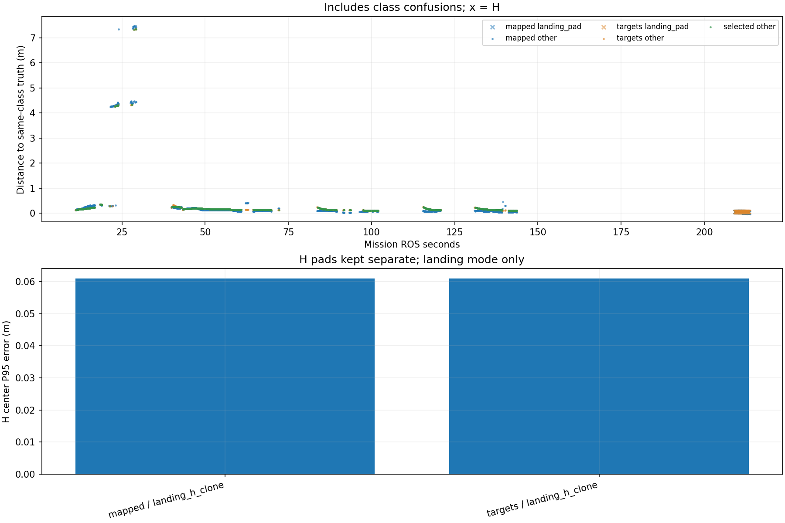

# Recorded target-center comparison

Phase-specific interpretation: [frozen SURVEY, interrupt and low reacquisition comparison](stages/PHASE_REPORT.md). The full-mission statistics below are not initial-high or low-only values.

Scope: 31_snake2
Gate: PASS. Same-source route/speed matrix; see main report for paired comparisons and failures.

Run: /home/xhj/liftrace-worktrees/r2026-high-view-search/logs/latest_six_snake2_seed31_20261005_025002
World: /home/xhj/liftrace-worktrees/r2026-high-view-search/docs/verification/latest_six_20261005/generated/snake2_31/snake2_seed31/field.world
Coordinate transform: FLU world XY equals mission XY; local Z ground=-0.22, only XY distances compared

Distances below are to same-class truth; inspect the class/instance table before interpreting localization.

| Scope | Stream | Class | Truth instance | N | Median/m | P95/m | RMSE/m | Max/m |
|---|---|---|---|---:|---:|---:|---:|---:|
| unique_valid_mission | hint_bbox | bridge | random_bridge | 22 | 7.4478 | 7.4956 | 5.9585 | 7.5141 |
| unique_valid_mission | hint_bbox | panzer | random_panzer | 46 | 4.2698 | 4.3302 | 3.2437 | 4.3416 |
| unique_valid_mission | hint_bbox | pillbox | random_pillbox | 8 | 0.2774 | 0.2946 | 0.2782 | 0.2958 |
| unique_valid_mission | hint_bbox | red_cross | random_red_cross | 8 | 0.2352 | 0.2426 | 0.2343 | 0.2431 |
| unique_valid_mission | hint_bbox | tent | random_tent | 7 | 0.1656 | 0.1704 | 0.1630 | 0.1705 |
| unique_valid_mission | hint_vision | bridge | random_bridge | 22 | 0.1734 | 0.1810 | 0.1714 | 0.1818 |
| unique_valid_mission | hint_vision | panzer | random_panzer | 25 | 0.2758 | 4.2790 | 1.5043 | 4.2840 |
| unique_valid_mission | hint_vision | pillbox | random_pillbox | 1 | 0.1677 | 0.1677 | 0.1677 | 0.1677 |
| unique_valid_mission | hint_vision | red_cross | random_red_cross | 13 | 0.2400 | 0.2434 | 0.2360 | 0.2435 |
| unique_valid_mission | hint_vision | tent | random_tent | 44 | 0.1713 | 0.2123 | 0.1751 | 0.2168 |
| unique_valid_mission | mapped | bridge | random_bridge | 470 | 0.1235 | 0.2131 | 1.2428 | 7.4773 |
| unique_valid_mission | mapped | landing_pad | landing_h_clone | 81 | 0.0459 | 0.0610 | 0.0462 | 0.0612 |
| unique_valid_mission | mapped | panzer | random_panzer | 332 | 0.0812 | 4.3789 | 1.7530 | 4.4683 |
| unique_valid_mission | mapped | pillbox | random_pillbox | 115 | 0.0785 | 0.2816 | 0.1169 | 0.3114 |
| unique_valid_mission | mapped | red_cross | random_red_cross | 269 | 0.0832 | 0.2456 | 0.1180 | 0.2494 |
| unique_valid_mission | mapped | tent | random_tent | 110 | 0.2413 | 0.3160 | 0.2403 | 0.3259 |
| unique_valid_mission | selected | bridge | random_bridge | 441 | 0.1549 | 0.1900 | 0.6254 | 7.3416 |
| unique_valid_mission | selected | panzer | random_panzer | 249 | 0.1443 | 2.6985 | 0.9949 | 4.3266 |
| unique_valid_mission | selected | pillbox | random_pillbox | 103 | 0.1410 | 0.2247 | 0.1573 | 0.2771 |
| unique_valid_mission | selected | red_cross | random_red_cross | 217 | 0.1317 | 0.2435 | 0.1546 | 0.2440 |
| unique_valid_mission | selected | tent | random_tent | 107 | 0.1757 | 0.2195 | 0.1804 | 0.2243 |
| unique_valid_mission | targets | bridge | random_bridge | 460 | 0.1538 | 0.1901 | 0.7807 | 7.3416 |
| unique_valid_mission | targets | landing_pad | landing_h_clone | 80 | 0.0529 | 0.0610 | 0.0534 | 0.0611 |
| unique_valid_mission | targets | panzer | random_panzer | 292 | 0.1516 | 4.2671 | 1.0515 | 4.3266 |
| unique_valid_mission | targets | pillbox | random_pillbox | 107 | 0.1427 | 0.2397 | 0.1630 | 0.2807 |
| unique_valid_mission | targets | red_cross | random_red_cross | 236 | 0.1328 | 0.2434 | 0.1551 | 0.2440 |
| unique_valid_mission | targets | tent | random_tent | 109 | 0.1748 | 0.2194 | 0.1795 | 0.2243 |
| fresh_unique_mission | hint_bbox | bridge | random_bridge | 22 | 7.4478 | 7.4956 | 5.9585 | 7.5141 |
| fresh_unique_mission | hint_bbox | panzer | random_panzer | 46 | 4.2698 | 4.3302 | 3.2437 | 4.3416 |
| fresh_unique_mission | hint_bbox | pillbox | random_pillbox | 8 | 0.2774 | 0.2946 | 0.2782 | 0.2958 |
| fresh_unique_mission | hint_bbox | red_cross | random_red_cross | 8 | 0.2352 | 0.2426 | 0.2343 | 0.2431 |
| fresh_unique_mission | hint_bbox | tent | random_tent | 7 | 0.1656 | 0.1704 | 0.1630 | 0.1705 |
| fresh_unique_mission | hint_vision | bridge | random_bridge | 22 | 0.1734 | 0.1810 | 0.1714 | 0.1818 |
| fresh_unique_mission | hint_vision | panzer | random_panzer | 25 | 0.2758 | 4.2790 | 1.5043 | 4.2840 |
| fresh_unique_mission | hint_vision | pillbox | random_pillbox | 1 | 0.1677 | 0.1677 | 0.1677 | 0.1677 |
| fresh_unique_mission | hint_vision | red_cross | random_red_cross | 13 | 0.2400 | 0.2434 | 0.2360 | 0.2435 |
| fresh_unique_mission | hint_vision | tent | random_tent | 44 | 0.1713 | 0.2123 | 0.1751 | 0.2168 |
| fresh_unique_mission | mapped | bridge | random_bridge | 470 | 0.1235 | 0.2131 | 1.2428 | 7.4773 |
| fresh_unique_mission | mapped | landing_pad | landing_h_clone | 81 | 0.0459 | 0.0610 | 0.0462 | 0.0612 |
| fresh_unique_mission | mapped | panzer | random_panzer | 332 | 0.0812 | 4.3789 | 1.7530 | 4.4683 |
| fresh_unique_mission | mapped | pillbox | random_pillbox | 115 | 0.0785 | 0.2816 | 0.1169 | 0.3114 |
| fresh_unique_mission | mapped | red_cross | random_red_cross | 269 | 0.0832 | 0.2456 | 0.1180 | 0.2494 |
| fresh_unique_mission | mapped | tent | random_tent | 110 | 0.2413 | 0.3160 | 0.2403 | 0.3259 |
| fresh_unique_mission | selected | bridge | random_bridge | 441 | 0.1549 | 0.1900 | 0.6254 | 7.3416 |
| fresh_unique_mission | selected | panzer | random_panzer | 249 | 0.1443 | 2.6985 | 0.9949 | 4.3266 |
| fresh_unique_mission | selected | pillbox | random_pillbox | 103 | 0.1410 | 0.2247 | 0.1573 | 0.2771 |
| fresh_unique_mission | selected | red_cross | random_red_cross | 217 | 0.1317 | 0.2435 | 0.1546 | 0.2440 |
| fresh_unique_mission | selected | tent | random_tent | 107 | 0.1757 | 0.2195 | 0.1804 | 0.2243 |
| fresh_unique_mission | targets | bridge | random_bridge | 460 | 0.1538 | 0.1901 | 0.7807 | 7.3416 |
| fresh_unique_mission | targets | landing_pad | landing_h_clone | 80 | 0.0529 | 0.0610 | 0.0534 | 0.0611 |
| fresh_unique_mission | targets | panzer | random_panzer | 292 | 0.1516 | 4.2671 | 1.0515 | 4.3266 |
| fresh_unique_mission | targets | pillbox | random_pillbox | 107 | 0.1427 | 0.2397 | 0.1630 | 0.2807 |
| fresh_unique_mission | targets | red_cross | random_red_cross | 236 | 0.1328 | 0.2434 | 0.1551 | 0.2440 |
| fresh_unique_mission | targets | tent | random_tent | 109 | 0.1748 | 0.2194 | 0.1795 | 0.2243 |
| fresh_nearest_class_agrees | hint_bbox | bridge | random_bridge | 8 | 0.1197 | 0.1510 | 0.1252 | 0.1580 |
| fresh_nearest_class_agrees | hint_bbox | panzer | random_panzer | 20 | 0.3679 | 0.4908 | 0.3913 | 0.5068 |
| fresh_nearest_class_agrees | hint_bbox | pillbox | random_pillbox | 8 | 0.2774 | 0.2946 | 0.2782 | 0.2958 |
| fresh_nearest_class_agrees | hint_bbox | red_cross | random_red_cross | 8 | 0.2352 | 0.2426 | 0.2343 | 0.2431 |
| fresh_nearest_class_agrees | hint_bbox | tent | random_tent | 7 | 0.1656 | 0.1704 | 0.1630 | 0.1705 |
| fresh_nearest_class_agrees | hint_vision | bridge | random_bridge | 22 | 0.1734 | 0.1810 | 0.1714 | 0.1818 |
| fresh_nearest_class_agrees | hint_vision | panzer | random_panzer | 22 | 0.2683 | 0.3432 | 0.2715 | 0.3477 |
| fresh_nearest_class_agrees | hint_vision | pillbox | random_pillbox | 1 | 0.1677 | 0.1677 | 0.1677 | 0.1677 |
| fresh_nearest_class_agrees | hint_vision | red_cross | random_red_cross | 13 | 0.2400 | 0.2434 | 0.2360 | 0.2435 |
| fresh_nearest_class_agrees | hint_vision | tent | random_tent | 44 | 0.1713 | 0.2123 | 0.1751 | 0.2168 |
| fresh_nearest_class_agrees | mapped | bridge | random_bridge | 457 | 0.1227 | 0.2062 | 0.1413 | 0.4117 |
| fresh_nearest_class_agrees | mapped | landing_pad | landing_h_clone | 81 | 0.0459 | 0.0610 | 0.0462 | 0.0612 |
| fresh_nearest_class_agrees | mapped | panzer | random_panzer | 278 | 0.0780 | 0.3128 | 0.1345 | 0.4541 |
| fresh_nearest_class_agrees | mapped | pillbox | random_pillbox | 115 | 0.0785 | 0.2816 | 0.1169 | 0.3114 |
| fresh_nearest_class_agrees | mapped | red_cross | random_red_cross | 269 | 0.0832 | 0.2456 | 0.1180 | 0.2494 |
| fresh_nearest_class_agrees | mapped | tent | random_tent | 110 | 0.2413 | 0.3160 | 0.2403 | 0.3259 |
| fresh_nearest_class_agrees | selected | bridge | random_bridge | 438 | 0.1547 | 0.1896 | 0.1586 | 0.1913 |
| fresh_nearest_class_agrees | selected | panzer | random_panzer | 236 | 0.1413 | 0.2805 | 0.1719 | 0.3530 |
| fresh_nearest_class_agrees | selected | pillbox | random_pillbox | 103 | 0.1410 | 0.2247 | 0.1573 | 0.2771 |
| fresh_nearest_class_agrees | selected | red_cross | random_red_cross | 217 | 0.1317 | 0.2435 | 0.1546 | 0.2440 |
| fresh_nearest_class_agrees | selected | tent | random_tent | 107 | 0.1757 | 0.2195 | 0.1804 | 0.2243 |
| fresh_nearest_class_agrees | targets | bridge | random_bridge | 455 | 0.1535 | 0.1895 | 0.1580 | 0.1913 |
| fresh_nearest_class_agrees | targets | landing_pad | landing_h_clone | 80 | 0.0529 | 0.0610 | 0.0534 | 0.0611 |
| fresh_nearest_class_agrees | targets | panzer | random_panzer | 275 | 0.1469 | 0.3290 | 0.1856 | 0.3563 |
| fresh_nearest_class_agrees | targets | pillbox | random_pillbox | 107 | 0.1427 | 0.2397 | 0.1630 | 0.2807 |
| fresh_nearest_class_agrees | targets | red_cross | random_red_cross | 236 | 0.1328 | 0.2434 | 0.1551 | 0.2440 |
| fresh_nearest_class_agrees | targets | tent | random_tent | 109 | 0.1748 | 0.2194 | 0.1795 | 0.2243 |
| fresh_H_landing_mode | mapped | landing_pad | landing_h_clone | 81 | 0.0459 | 0.0610 | 0.0462 | 0.0612 |
| fresh_H_landing_mode | targets | landing_pad | landing_h_clone | 80 | 0.0529 | 0.0610 | 0.0534 | 0.0611 |

## Nearest any-class instance versus predicted class

Fresh unique mapped/targets/selected; all unique mission hints. A large same-class distance can be a class error.

| Stream | Predicted | Nearest class | Nearest instance | N | Median nearest/m | Median same-class/m | Suspected confusion N |
|---|---|---|---|---:|---:|---:|---:|
| hint_bbox | bridge | bridge | random_bridge | 8 | 0.1197 | 0.1197 | 0 |
| hint_bbox | bridge | pillbox | random_pillbox | 14 | 0.1482 | 7.4687 | 14 |
| hint_bbox | panzer | panzer | random_panzer | 20 | 0.3679 | 0.3679 | 0 |
| hint_bbox | panzer | pillbox | random_pillbox | 26 | 0.2874 | 4.3004 | 26 |
| hint_bbox | pillbox | pillbox | random_pillbox | 8 | 0.2774 | 0.2774 | 0 |
| hint_bbox | red_cross | red_cross | random_red_cross | 8 | 0.2352 | 0.2352 | 0 |
| hint_bbox | tent | tent | random_tent | 7 | 0.1656 | 0.1656 | 0 |
| hint_vision | bridge | bridge | random_bridge | 22 | 0.1734 | 0.1734 | 0 |
| hint_vision | panzer | panzer | random_panzer | 22 | 0.2683 | 0.2683 | 0 |
| hint_vision | panzer | pillbox | random_pillbox | 3 | 0.2895 | 4.2798 | 3 |
| hint_vision | pillbox | pillbox | random_pillbox | 1 | 0.1677 | 0.1677 | 0 |
| hint_vision | red_cross | red_cross | random_red_cross | 13 | 0.2400 | 0.2400 | 0 |
| hint_vision | tent | tent | random_tent | 44 | 0.1713 | 0.1713 | 0 |
| mapped | bridge | bridge | random_bridge | 457 | 0.1227 | 0.1227 | 0 |
| mapped | bridge | pillbox | random_pillbox | 13 | 0.2372 | 7.4502 | 13 |
| mapped | landing_pad | landing_pad | landing_h_clone | 81 | 0.0459 | 0.0459 | 0 |
| mapped | panzer | panzer | random_panzer | 278 | 0.0780 | 0.0780 | 0 |
| mapped | panzer | pillbox | random_pillbox | 54 | 0.2852 | 4.3209 | 54 |
| mapped | pillbox | pillbox | random_pillbox | 115 | 0.0785 | 0.0785 | 0 |
| mapped | red_cross | red_cross | random_red_cross | 269 | 0.0832 | 0.0832 | 0 |
| mapped | tent | tent | random_tent | 110 | 0.2413 | 0.2413 | 0 |
| selected | bridge | bridge | random_bridge | 438 | 0.1547 | 0.1547 | 0 |
| selected | bridge | pillbox | random_pillbox | 3 | 0.2550 | 7.3393 | 3 |
| selected | panzer | panzer | random_panzer | 236 | 0.1413 | 0.1413 | 0 |
| selected | panzer | pillbox | random_pillbox | 13 | 0.2879 | 4.2906 | 13 |
| selected | pillbox | pillbox | random_pillbox | 103 | 0.1410 | 0.1410 | 0 |
| selected | red_cross | red_cross | random_red_cross | 217 | 0.1317 | 0.1317 | 0 |
| selected | tent | tent | random_tent | 107 | 0.1757 | 0.1757 | 0 |
| targets | bridge | bridge | random_bridge | 455 | 0.1535 | 0.1535 | 0 |
| targets | bridge | pillbox | random_pillbox | 5 | 0.2547 | 7.3353 | 5 |
| targets | landing_pad | landing_pad | landing_h_clone | 80 | 0.0529 | 0.0529 | 0 |
| targets | panzer | panzer | random_panzer | 275 | 0.1469 | 0.1469 | 0 |
| targets | panzer | pillbox | random_pillbox | 17 | 0.2879 | 4.2906 | 17 |
| targets | pillbox | pillbox | random_pillbox | 107 | 0.1427 | 0.1427 | 0 |
| targets | red_cross | red_cross | random_red_cross | 236 | 0.1328 | 0.1328 | 0 |
| targets | tent | tent | random_tent | 109 | 0.1748 | 0.1748 | 0 |

Missing bag topics: []

No rows is missing evidence, not zero error.

- Offline recorded map centers, not parcel impacts or physical release accuracy.
- Association is nearest same-class truth; not an independent instance recall evaluation.
- Same-class distance is not localization-only error: a wrong class may be near a different true instance.
- Nearest-any-instance association is diagnostic, not independently verified object identity.
- Suspected category confusion requires a different nearest class within the stated radius and a same-vs-any distance margin.
- Hint streams are reconstructed from high_view_full_events navigation_support, with explicitly supplied mission frame and projection plane.
- H start and landing pads are separate truth instances; a class/position error can change nearest association.
- World-to-evaluation transform is explicitly supplied, not estimated from the detections.
- Reported error is XY only. H dimensions do not change its center; no Z/size accuracy claim.
- Valid but old candidate publications are separate from fresh unique observations.
- TF lookup reuses bag_replay.TransformTree (latest past sample, max dynamic age 0.5s, no interpolation).
- Raw duplicates and invalid samples remain in CSV; errors aggregate only inside the mission interval.
- H branch-complete counters only show recorded pipeline completion, not proof of a detected H contour; raw detector output was not in this lightweight bag.

All samples including invalid, stale and duplicate publications: center_samples.csv.
Machine-readable provenance, truth and counts: center_summary.json.
