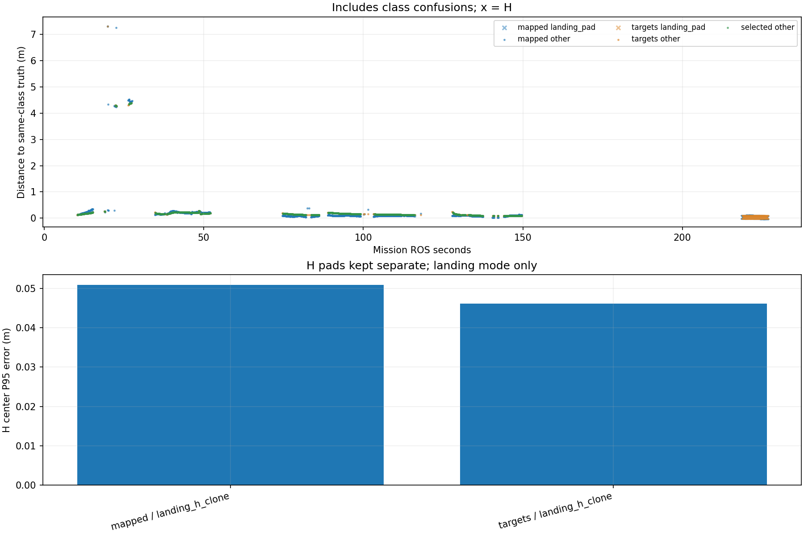

# Recorded target-center comparison

Phase-specific interpretation: [frozen SURVEY, interrupt and low reacquisition comparison](stages/PHASE_REPORT.md). The full-mission statistics below are not initial-high or low-only values.

Scope: 31_snake3
Gate: PASS. Same-source route/speed matrix; see main report for paired comparisons and failures.

Run: /home/xhj/liftrace-worktrees/r2026-high-view-search/logs/latest_six_snake3_seed31_20261005_030704
World: /home/xhj/liftrace-worktrees/r2026-high-view-search/docs/verification/latest_six_20261005/generated/snake3_31/snake3_seed31/field.world
Coordinate transform: FLU world XY equals mission XY; local Z ground=-0.22, only XY distances compared

Distances below are to same-class truth; inspect the class/instance table before interpreting localization.

| Scope | Stream | Class | Truth instance | N | Median/m | P95/m | RMSE/m | Max/m |
|---|---|---|---|---:|---:|---:|---:|---:|
| unique_valid_mission | hint_bbox | bridge | random_bridge | 14 | 0.1686 | 7.5772 | 4.8586 | 7.5833 |
| unique_valid_mission | hint_bbox | panzer | random_panzer | 73 | 0.3234 | 4.2904 | 2.1979 | 4.3472 |
| unique_valid_mission | hint_bbox | pillbox | random_pillbox | 20 | 0.2713 | 0.2883 | 0.2708 | 0.2898 |
| unique_valid_mission | hint_bbox | red_cross | random_red_cross | 9 | 0.2668 | 0.3162 | 0.2767 | 0.3214 |
| unique_valid_mission | hint_bbox | tent | random_tent | 8 | 0.1441 | 0.1639 | 0.1485 | 0.1651 |
| unique_valid_mission | hint_vision | bridge | random_bridge | 78 | 0.2199 | 0.2335 | 0.2170 | 0.2339 |
| unique_valid_mission | hint_vision | panzer | random_panzer | 53 | 0.1744 | 4.3512 | 1.4672 | 4.3619 |
| unique_valid_mission | hint_vision | red_cross | random_red_cross | 6 | 0.1426 | 0.2385 | 0.1701 | 0.2697 |
| unique_valid_mission | hint_vision | tent | random_tent | 38 | 0.1707 | 0.2039 | 0.1700 | 0.2094 |
| unique_valid_mission | mapped | bridge | random_bridge | 588 | 0.0967 | 0.2621 | 0.5400 | 7.3062 |
| unique_valid_mission | mapped | landing_pad | landing_h_clone | 96 | 0.0408 | 0.0509 | 0.0403 | 0.0513 |
| unique_valid_mission | mapped | panzer | random_panzer | 336 | 0.0895 | 4.4218 | 1.2968 | 4.5312 |
| unique_valid_mission | mapped | pillbox | random_pillbox | 4 | 0.3020 | 0.3165 | 0.3044 | 0.3190 |
| unique_valid_mission | mapped | red_cross | random_red_cross | 300 | 0.0976 | 0.1228 | 0.1012 | 0.2721 |
| unique_valid_mission | mapped | tent | random_tent | 84 | 0.2089 | 0.3397 | 0.2356 | 0.3511 |
| unique_valid_mission | selected | bridge | random_bridge | 565 | 0.1650 | 0.2314 | 0.1770 | 0.2347 |
| unique_valid_mission | selected | panzer | random_panzer | 298 | 0.1617 | 0.2564 | 0.9527 | 4.3836 |
| unique_valid_mission | selected | red_cross | random_red_cross | 245 | 0.0984 | 0.1776 | 0.1160 | 0.2705 |
| unique_valid_mission | selected | tent | random_tent | 82 | 0.1741 | 0.2157 | 0.1754 | 0.2207 |
| unique_valid_mission | targets | bridge | random_bridge | 580 | 0.1644 | 0.2314 | 0.3510 | 7.3062 |
| unique_valid_mission | targets | landing_pad | landing_h_clone | 93 | 0.0435 | 0.0461 | 0.0430 | 0.0462 |
| unique_valid_mission | targets | panzer | random_panzer | 317 | 0.1618 | 4.2773 | 1.0149 | 4.3836 |
| unique_valid_mission | targets | red_cross | random_red_cross | 265 | 0.0992 | 0.1942 | 0.1191 | 0.2721 |
| unique_valid_mission | targets | tent | random_tent | 84 | 0.1733 | 0.2156 | 0.1744 | 0.2207 |
| fresh_unique_mission | hint_bbox | bridge | random_bridge | 14 | 0.1686 | 7.5772 | 4.8586 | 7.5833 |
| fresh_unique_mission | hint_bbox | panzer | random_panzer | 73 | 0.3234 | 4.2904 | 2.1979 | 4.3472 |
| fresh_unique_mission | hint_bbox | pillbox | random_pillbox | 20 | 0.2713 | 0.2883 | 0.2708 | 0.2898 |
| fresh_unique_mission | hint_bbox | red_cross | random_red_cross | 9 | 0.2668 | 0.3162 | 0.2767 | 0.3214 |
| fresh_unique_mission | hint_bbox | tent | random_tent | 8 | 0.1441 | 0.1639 | 0.1485 | 0.1651 |
| fresh_unique_mission | hint_vision | bridge | random_bridge | 78 | 0.2199 | 0.2335 | 0.2170 | 0.2339 |
| fresh_unique_mission | hint_vision | panzer | random_panzer | 53 | 0.1744 | 4.3512 | 1.4672 | 4.3619 |
| fresh_unique_mission | hint_vision | red_cross | random_red_cross | 6 | 0.1426 | 0.2385 | 0.1701 | 0.2697 |
| fresh_unique_mission | hint_vision | tent | random_tent | 38 | 0.1707 | 0.2039 | 0.1700 | 0.2094 |
| fresh_unique_mission | mapped | bridge | random_bridge | 588 | 0.0967 | 0.2621 | 0.5400 | 7.3062 |
| fresh_unique_mission | mapped | landing_pad | landing_h_clone | 96 | 0.0408 | 0.0509 | 0.0403 | 0.0513 |
| fresh_unique_mission | mapped | panzer | random_panzer | 336 | 0.0895 | 4.4218 | 1.2968 | 4.5312 |
| fresh_unique_mission | mapped | pillbox | random_pillbox | 4 | 0.3020 | 0.3165 | 0.3044 | 0.3190 |
| fresh_unique_mission | mapped | red_cross | random_red_cross | 300 | 0.0976 | 0.1228 | 0.1012 | 0.2721 |
| fresh_unique_mission | mapped | tent | random_tent | 84 | 0.2089 | 0.3397 | 0.2356 | 0.3511 |
| fresh_unique_mission | selected | bridge | random_bridge | 565 | 0.1650 | 0.2314 | 0.1770 | 0.2347 |
| fresh_unique_mission | selected | panzer | random_panzer | 298 | 0.1617 | 0.2564 | 0.9527 | 4.3836 |
| fresh_unique_mission | selected | red_cross | random_red_cross | 245 | 0.0984 | 0.1776 | 0.1160 | 0.2705 |
| fresh_unique_mission | selected | tent | random_tent | 82 | 0.1741 | 0.2157 | 0.1754 | 0.2207 |
| fresh_unique_mission | targets | bridge | random_bridge | 580 | 0.1644 | 0.2314 | 0.3510 | 7.3062 |
| fresh_unique_mission | targets | landing_pad | landing_h_clone | 93 | 0.0435 | 0.0461 | 0.0430 | 0.0462 |
| fresh_unique_mission | targets | panzer | random_panzer | 317 | 0.1618 | 4.2773 | 1.0149 | 4.3836 |
| fresh_unique_mission | targets | red_cross | random_red_cross | 265 | 0.0992 | 0.1942 | 0.1191 | 0.2721 |
| fresh_unique_mission | targets | tent | random_tent | 84 | 0.1733 | 0.2156 | 0.1744 | 0.2207 |
| fresh_nearest_class_agrees | hint_bbox | bridge | random_bridge | 8 | 0.1382 | 0.1691 | 0.1447 | 0.1703 |
| fresh_nearest_class_agrees | hint_bbox | panzer | random_panzer | 54 | 0.3036 | 0.4134 | 0.2971 | 0.4620 |
| fresh_nearest_class_agrees | hint_bbox | pillbox | random_pillbox | 20 | 0.2713 | 0.2883 | 0.2708 | 0.2898 |
| fresh_nearest_class_agrees | hint_bbox | red_cross | random_red_cross | 9 | 0.2668 | 0.3162 | 0.2767 | 0.3214 |
| fresh_nearest_class_agrees | hint_bbox | tent | random_tent | 8 | 0.1441 | 0.1639 | 0.1485 | 0.1651 |
| fresh_nearest_class_agrees | hint_vision | bridge | random_bridge | 78 | 0.2199 | 0.2335 | 0.2170 | 0.2339 |
| fresh_nearest_class_agrees | hint_vision | panzer | random_panzer | 47 | 0.1725 | 0.1858 | 0.1734 | 0.1919 |
| fresh_nearest_class_agrees | hint_vision | red_cross | random_red_cross | 6 | 0.1426 | 0.2385 | 0.1701 | 0.2697 |
| fresh_nearest_class_agrees | hint_vision | tent | random_tent | 38 | 0.1707 | 0.2039 | 0.1700 | 0.2094 |
| fresh_nearest_class_agrees | mapped | bridge | random_bridge | 585 | 0.0966 | 0.2578 | 0.1437 | 0.3209 |
| fresh_nearest_class_agrees | mapped | landing_pad | landing_h_clone | 96 | 0.0408 | 0.0509 | 0.0403 | 0.0513 |
| fresh_nearest_class_agrees | mapped | panzer | random_panzer | 307 | 0.0872 | 0.2215 | 0.1377 | 0.3788 |
| fresh_nearest_class_agrees | mapped | pillbox | random_pillbox | 4 | 0.3020 | 0.3165 | 0.3044 | 0.3190 |
| fresh_nearest_class_agrees | mapped | red_cross | random_red_cross | 300 | 0.0976 | 0.1228 | 0.1012 | 0.2721 |
| fresh_nearest_class_agrees | mapped | tent | random_tent | 84 | 0.2089 | 0.3397 | 0.2356 | 0.3511 |
| fresh_nearest_class_agrees | selected | bridge | random_bridge | 565 | 0.1650 | 0.2314 | 0.1770 | 0.2347 |
| fresh_nearest_class_agrees | selected | panzer | random_panzer | 284 | 0.1607 | 0.1846 | 0.1580 | 0.2567 |
| fresh_nearest_class_agrees | selected | red_cross | random_red_cross | 245 | 0.0984 | 0.1776 | 0.1160 | 0.2705 |
| fresh_nearest_class_agrees | selected | tent | random_tent | 82 | 0.1741 | 0.2157 | 0.1754 | 0.2207 |
| fresh_nearest_class_agrees | targets | bridge | random_bridge | 579 | 0.1643 | 0.2312 | 0.1767 | 0.2347 |
| fresh_nearest_class_agrees | targets | landing_pad | landing_h_clone | 93 | 0.0435 | 0.0461 | 0.0430 | 0.0462 |
| fresh_nearest_class_agrees | targets | panzer | random_panzer | 300 | 0.1607 | 0.1857 | 0.1590 | 0.2589 |
| fresh_nearest_class_agrees | targets | red_cross | random_red_cross | 265 | 0.0992 | 0.1942 | 0.1191 | 0.2721 |
| fresh_nearest_class_agrees | targets | tent | random_tent | 84 | 0.1733 | 0.2156 | 0.1744 | 0.2207 |
| fresh_H_landing_mode | mapped | landing_pad | landing_h_clone | 96 | 0.0408 | 0.0509 | 0.0403 | 0.0513 |
| fresh_H_landing_mode | targets | landing_pad | landing_h_clone | 93 | 0.0435 | 0.0461 | 0.0430 | 0.0462 |

## Nearest any-class instance versus predicted class

Fresh unique mapped/targets/selected; all unique mission hints. A large same-class distance can be a class error.

| Stream | Predicted | Nearest class | Nearest instance | N | Median nearest/m | Median same-class/m | Suspected confusion N |
|---|---|---|---|---:|---:|---:|---:|
| hint_bbox | bridge | bridge | random_bridge | 8 | 0.1382 | 0.1382 | 0 |
| hint_bbox | bridge | pillbox | random_pillbox | 6 | 0.2199 | 7.3660 | 6 |
| hint_bbox | panzer | panzer | random_panzer | 54 | 0.3036 | 0.3036 | 0 |
| hint_bbox | panzer | pillbox | random_pillbox | 19 | 0.2814 | 4.2730 | 19 |
| hint_bbox | pillbox | pillbox | random_pillbox | 20 | 0.2713 | 0.2713 | 0 |
| hint_bbox | red_cross | red_cross | random_red_cross | 9 | 0.2668 | 0.2668 | 0 |
| hint_bbox | tent | tent | random_tent | 8 | 0.1441 | 0.1441 | 0 |
| hint_vision | bridge | bridge | random_bridge | 78 | 0.2199 | 0.2199 | 0 |
| hint_vision | panzer | panzer | random_panzer | 47 | 0.1725 | 0.1725 | 0 |
| hint_vision | panzer | pillbox | random_pillbox | 6 | 0.2365 | 4.3518 | 6 |
| hint_vision | red_cross | red_cross | random_red_cross | 6 | 0.1426 | 0.1426 | 0 |
| hint_vision | tent | tent | random_tent | 38 | 0.1707 | 0.1707 | 0 |
| mapped | bridge | bridge | random_bridge | 585 | 0.0966 | 0.0966 | 0 |
| mapped | bridge | pillbox | random_pillbox | 3 | 0.3057 | 7.3020 | 3 |
| mapped | landing_pad | landing_pad | landing_h_clone | 96 | 0.0408 | 0.0408 | 0 |
| mapped | panzer | panzer | random_panzer | 307 | 0.0872 | 0.0872 | 0 |
| mapped | panzer | pillbox | random_pillbox | 29 | 0.2561 | 4.4335 | 29 |
| mapped | pillbox | pillbox | random_pillbox | 4 | 0.3020 | 0.3020 | 0 |
| mapped | red_cross | red_cross | random_red_cross | 300 | 0.0976 | 0.0976 | 0 |
| mapped | tent | tent | random_tent | 84 | 0.2089 | 0.2089 | 0 |
| selected | bridge | bridge | random_bridge | 565 | 0.1650 | 0.1650 | 0 |
| selected | panzer | panzer | random_panzer | 284 | 0.1607 | 0.1607 | 0 |
| selected | panzer | pillbox | random_pillbox | 14 | 0.2358 | 4.3541 | 14 |
| selected | red_cross | red_cross | random_red_cross | 245 | 0.0984 | 0.0984 | 0 |
| selected | tent | tent | random_tent | 82 | 0.1741 | 0.1741 | 0 |
| targets | bridge | bridge | random_bridge | 579 | 0.1643 | 0.1643 | 0 |
| targets | bridge | pillbox | random_pillbox | 1 | 0.3057 | 7.3062 | 1 |
| targets | landing_pad | landing_pad | landing_h_clone | 93 | 0.0435 | 0.0435 | 0 |
| targets | panzer | panzer | random_panzer | 300 | 0.1607 | 0.1607 | 0 |
| targets | panzer | pillbox | random_pillbox | 17 | 0.2413 | 4.3328 | 17 |
| targets | red_cross | red_cross | random_red_cross | 265 | 0.0992 | 0.0992 | 0 |
| targets | tent | tent | random_tent | 84 | 0.1733 | 0.1733 | 0 |

Missing bag topics: []

No rows is missing evidence, not zero error.

- Offline recorded map centers, not parcel impacts or physical release accuracy.
- Association is nearest same-class truth; not an independent instance recall evaluation.
- Same-class distance is not localization-only error: a wrong class may be near a different true instance.
- Nearest-any-instance association is diagnostic, not independently verified object identity.
- Suspected category confusion requires a different nearest class within the stated radius and a same-vs-any distance margin.
- Hint streams are reconstructed from high_view_full_events navigation_support, with explicitly supplied mission frame and projection plane.
- H start and landing pads are separate truth instances; a class/position error can change nearest association.
- World-to-evaluation transform is explicitly supplied, not estimated from the detections.
- Reported error is XY only. H dimensions do not change its center; no Z/size accuracy claim.
- Valid but old candidate publications are separate from fresh unique observations.
- TF lookup reuses bag_replay.TransformTree (latest past sample, max dynamic age 0.5s, no interpolation).
- Raw duplicates and invalid samples remain in CSV; errors aggregate only inside the mission interval.
- H branch-complete counters only show recorded pipeline completion, not proof of a detected H contour; raw detector output was not in this lightweight bag.

All samples including invalid, stale and duplicate publications: center_samples.csv.
Machine-readable provenance, truth and counts: center_summary.json.
