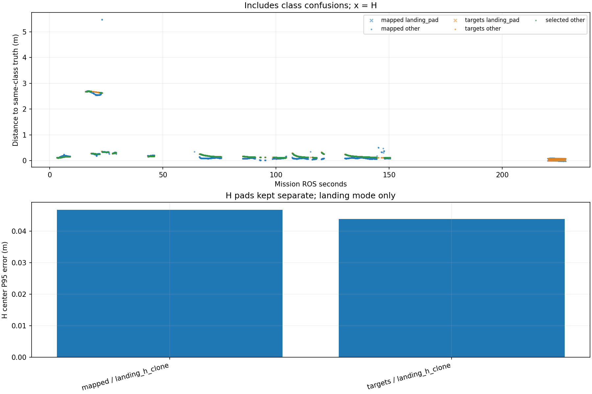

# Recorded target-center comparison

Phase-specific interpretation: [frozen SURVEY, interrupt and low reacquisition comparison](stages/PHASE_REPORT.md). The full-mission statistics below are not initial-high or low-only values.

Scope: 38_rectangle
Gate: PASS. Same-source route/speed matrix; see main report for paired comparisons and failures.

Run: /home/xhj/liftrace-worktrees/r2026-high-view-search/logs/latest_six_rectangle_seed38_20261005_032449
World: /home/xhj/liftrace-worktrees/r2026-high-view-search/docs/verification/latest_six_20261005/generated/rectangle_38/rectangle_seed38/field.world
Coordinate transform: FLU world XY equals mission XY; local Z ground=-0.22, only XY distances compared

Distances below are to same-class truth; inspect the class/instance table before interpreting localization.

| Scope | Stream | Class | Truth instance | N | Median/m | P95/m | RMSE/m | Max/m |
|---|---|---|---|---:|---:|---:|---:|---:|
| unique_valid_mission | hint_bbox | bridge | random_bridge | 30 | 0.2655 | 3.0585 | 1.4081 | 5.4051 |
| unique_valid_mission | hint_bbox | panzer | random_panzer | 30 | 2.6784 | 2.7297 | 2.0405 | 2.7644 |
| unique_valid_mission | hint_bbox | pillbox | random_pillbox | 1 | 0.2519 | 0.2519 | 0.2519 | 0.2519 |
| unique_valid_mission | hint_bbox | red_cross | random_red_cross | 4 | 0.1700 | 0.1746 | 0.1701 | 0.1749 |
| unique_valid_mission | hint_bbox | tent | random_tent | 8 | 0.3843 | 1.9938 | 1.0561 | 2.8061 |
| unique_valid_mission | hint_vision | bridge | random_bridge | 14 | 0.2830 | 0.2948 | 0.2676 | 0.2960 |
| unique_valid_mission | hint_vision | panzer | random_panzer | 67 | 2.6459 | 2.6927 | 2.0717 | 2.6935 |
| unique_valid_mission | hint_vision | pillbox | random_pillbox | 1 | 0.1925 | 0.1925 | 0.1925 | 0.1925 |
| unique_valid_mission | hint_vision | red_cross | random_red_cross | 49 | 0.1576 | 0.1650 | 0.1534 | 0.1663 |
| unique_valid_mission | hint_vision | tent | random_tent | 24 | 0.3356 | 0.3402 | 0.3357 | 0.3415 |
| unique_valid_mission | mapped | bridge | random_bridge | 212 | 0.0836 | 0.3185 | 0.5508 | 5.4830 |
| unique_valid_mission | mapped | landing_pad | landing_h_clone | 131 | 0.0377 | 0.0468 | 0.0365 | 0.0491 |
| unique_valid_mission | mapped | panzer | random_panzer | 549 | 0.1072 | 2.6858 | 1.2983 | 2.7074 |
| unique_valid_mission | mapped | pillbox | random_pillbox | 189 | 0.0947 | 0.1160 | 0.1042 | 0.3417 |
| unique_valid_mission | mapped | red_cross | random_red_cross | 403 | 0.1023 | 0.1978 | 0.1309 | 0.2424 |
| unique_valid_mission | mapped | tent | random_tent | 86 | 0.3278 | 0.3410 | 0.2876 | 0.3605 |
| unique_valid_mission | selected | bridge | random_bridge | 196 | 0.1495 | 0.2966 | 0.1885 | 0.3020 |
| unique_valid_mission | selected | panzer | random_panzer | 428 | 0.1580 | 2.6897 | 0.9205 | 2.6951 |
| unique_valid_mission | selected | pillbox | random_pillbox | 181 | 0.1696 | 0.2422 | 0.1826 | 0.2594 |
| unique_valid_mission | selected | red_cross | random_red_cross | 346 | 0.1367 | 0.1644 | 0.1377 | 0.1679 |
| unique_valid_mission | selected | tent | random_tent | 73 | 0.3325 | 0.3398 | 0.3213 | 0.3440 |
| unique_valid_mission | targets | bridge | random_bridge | 207 | 0.1498 | 0.2960 | 0.1892 | 0.3020 |
| unique_valid_mission | targets | landing_pad | landing_h_clone | 129 | 0.0409 | 0.0439 | 0.0405 | 0.0440 |
| unique_valid_mission | targets | panzer | random_panzer | 483 | 0.1631 | 2.6887 | 1.1319 | 2.6951 |
| unique_valid_mission | targets | pillbox | random_pillbox | 182 | 0.1698 | 0.2438 | 0.1831 | 0.2609 |
| unique_valid_mission | targets | red_cross | random_red_cross | 360 | 0.1365 | 0.1647 | 0.1377 | 0.1679 |
| unique_valid_mission | targets | tent | random_tent | 77 | 0.3325 | 0.3411 | 0.3222 | 0.3531 |
| fresh_unique_mission | hint_bbox | bridge | random_bridge | 30 | 0.2655 | 3.0585 | 1.4081 | 5.4051 |
| fresh_unique_mission | hint_bbox | panzer | random_panzer | 30 | 2.6784 | 2.7297 | 2.0405 | 2.7644 |
| fresh_unique_mission | hint_bbox | pillbox | random_pillbox | 1 | 0.2519 | 0.2519 | 0.2519 | 0.2519 |
| fresh_unique_mission | hint_bbox | red_cross | random_red_cross | 4 | 0.1700 | 0.1746 | 0.1701 | 0.1749 |
| fresh_unique_mission | hint_bbox | tent | random_tent | 8 | 0.3843 | 1.9938 | 1.0561 | 2.8061 |
| fresh_unique_mission | hint_vision | bridge | random_bridge | 14 | 0.2830 | 0.2948 | 0.2676 | 0.2960 |
| fresh_unique_mission | hint_vision | panzer | random_panzer | 67 | 2.6459 | 2.6927 | 2.0717 | 2.6935 |
| fresh_unique_mission | hint_vision | pillbox | random_pillbox | 1 | 0.1925 | 0.1925 | 0.1925 | 0.1925 |
| fresh_unique_mission | hint_vision | red_cross | random_red_cross | 49 | 0.1576 | 0.1650 | 0.1534 | 0.1663 |
| fresh_unique_mission | hint_vision | tent | random_tent | 24 | 0.3356 | 0.3402 | 0.3357 | 0.3415 |
| fresh_unique_mission | mapped | bridge | random_bridge | 212 | 0.0836 | 0.3185 | 0.5508 | 5.4830 |
| fresh_unique_mission | mapped | landing_pad | landing_h_clone | 131 | 0.0377 | 0.0468 | 0.0365 | 0.0491 |
| fresh_unique_mission | mapped | panzer | random_panzer | 529 | 0.1065 | 2.6855 | 1.2828 | 2.7074 |
| fresh_unique_mission | mapped | pillbox | random_pillbox | 187 | 0.0947 | 0.1158 | 0.1028 | 0.3417 |
| fresh_unique_mission | mapped | red_cross | random_red_cross | 403 | 0.1023 | 0.1978 | 0.1309 | 0.2424 |
| fresh_unique_mission | mapped | tent | random_tent | 81 | 0.3278 | 0.3411 | 0.2846 | 0.3605 |
| fresh_unique_mission | selected | bridge | random_bridge | 196 | 0.1495 | 0.2966 | 0.1885 | 0.3020 |
| fresh_unique_mission | selected | panzer | random_panzer | 428 | 0.1580 | 2.6897 | 0.9205 | 2.6951 |
| fresh_unique_mission | selected | pillbox | random_pillbox | 181 | 0.1696 | 0.2422 | 0.1826 | 0.2594 |
| fresh_unique_mission | selected | red_cross | random_red_cross | 346 | 0.1367 | 0.1644 | 0.1377 | 0.1679 |
| fresh_unique_mission | selected | tent | random_tent | 73 | 0.3325 | 0.3398 | 0.3213 | 0.3440 |
| fresh_unique_mission | targets | bridge | random_bridge | 207 | 0.1498 | 0.2960 | 0.1892 | 0.3020 |
| fresh_unique_mission | targets | landing_pad | landing_h_clone | 129 | 0.0409 | 0.0439 | 0.0405 | 0.0440 |
| fresh_unique_mission | targets | panzer | random_panzer | 483 | 0.1631 | 2.6887 | 1.1319 | 2.6951 |
| fresh_unique_mission | targets | pillbox | random_pillbox | 182 | 0.1698 | 0.2438 | 0.1831 | 0.2609 |
| fresh_unique_mission | targets | red_cross | random_red_cross | 360 | 0.1365 | 0.1647 | 0.1377 | 0.1679 |
| fresh_unique_mission | targets | tent | random_tent | 77 | 0.3325 | 0.3411 | 0.3222 | 0.3531 |
| fresh_nearest_class_agrees | hint_bbox | bridge | random_bridge | 28 | 0.2640 | 0.2860 | 0.2621 | 0.2899 |
| fresh_nearest_class_agrees | hint_bbox | panzer | random_panzer | 13 | 0.2723 | 0.4394 | 0.3163 | 0.4505 |
| fresh_nearest_class_agrees | hint_bbox | pillbox | random_pillbox | 1 | 0.2519 | 0.2519 | 0.2519 | 0.2519 |
| fresh_nearest_class_agrees | hint_bbox | red_cross | random_red_cross | 4 | 0.1700 | 0.1746 | 0.1701 | 0.1749 |
| fresh_nearest_class_agrees | hint_bbox | tent | random_tent | 7 | 0.3602 | 0.4654 | 0.3871 | 0.4852 |
| fresh_nearest_class_agrees | hint_vision | bridge | random_bridge | 14 | 0.2830 | 0.2948 | 0.2676 | 0.2960 |
| fresh_nearest_class_agrees | hint_vision | panzer | random_panzer | 27 | 0.2652 | 0.2796 | 0.2620 | 0.2806 |
| fresh_nearest_class_agrees | hint_vision | pillbox | random_pillbox | 1 | 0.1925 | 0.1925 | 0.1925 | 0.1925 |
| fresh_nearest_class_agrees | hint_vision | red_cross | random_red_cross | 49 | 0.1576 | 0.1650 | 0.1534 | 0.1663 |
| fresh_nearest_class_agrees | hint_vision | tent | random_tent | 24 | 0.3356 | 0.3402 | 0.3357 | 0.3415 |
| fresh_nearest_class_agrees | mapped | bridge | random_bridge | 210 | 0.0831 | 0.3146 | 0.1426 | 0.3390 |
| fresh_nearest_class_agrees | mapped | landing_pad | landing_h_clone | 131 | 0.0377 | 0.0468 | 0.0365 | 0.0491 |
| fresh_nearest_class_agrees | mapped | panzer | random_panzer | 404 | 0.0949 | 0.2734 | 0.1479 | 0.5045 |
| fresh_nearest_class_agrees | mapped | pillbox | random_pillbox | 187 | 0.0947 | 0.1158 | 0.1028 | 0.3417 |
| fresh_nearest_class_agrees | mapped | red_cross | random_red_cross | 403 | 0.1023 | 0.1978 | 0.1309 | 0.2424 |
| fresh_nearest_class_agrees | mapped | tent | random_tent | 81 | 0.3278 | 0.3411 | 0.2846 | 0.3605 |
| fresh_nearest_class_agrees | selected | bridge | random_bridge | 196 | 0.1495 | 0.2966 | 0.1885 | 0.3020 |
| fresh_nearest_class_agrees | selected | panzer | random_panzer | 379 | 0.1496 | 0.2725 | 0.1774 | 0.2838 |
| fresh_nearest_class_agrees | selected | pillbox | random_pillbox | 181 | 0.1696 | 0.2422 | 0.1826 | 0.2594 |
| fresh_nearest_class_agrees | selected | red_cross | random_red_cross | 346 | 0.1367 | 0.1644 | 0.1377 | 0.1679 |
| fresh_nearest_class_agrees | selected | tent | random_tent | 73 | 0.3325 | 0.3398 | 0.3213 | 0.3440 |
| fresh_nearest_class_agrees | targets | bridge | random_bridge | 207 | 0.1498 | 0.2960 | 0.1892 | 0.3020 |
| fresh_nearest_class_agrees | targets | landing_pad | landing_h_clone | 129 | 0.0409 | 0.0439 | 0.0405 | 0.0440 |
| fresh_nearest_class_agrees | targets | panzer | random_panzer | 398 | 0.1488 | 0.2732 | 0.1768 | 0.2841 |
| fresh_nearest_class_agrees | targets | pillbox | random_pillbox | 182 | 0.1698 | 0.2438 | 0.1831 | 0.2609 |
| fresh_nearest_class_agrees | targets | red_cross | random_red_cross | 360 | 0.1365 | 0.1647 | 0.1377 | 0.1679 |
| fresh_nearest_class_agrees | targets | tent | random_tent | 77 | 0.3325 | 0.3411 | 0.3222 | 0.3531 |
| fresh_H_landing_mode | mapped | landing_pad | landing_h_clone | 131 | 0.0377 | 0.0468 | 0.0365 | 0.0491 |
| fresh_H_landing_mode | targets | landing_pad | landing_h_clone | 129 | 0.0409 | 0.0439 | 0.0405 | 0.0440 |

## Nearest any-class instance versus predicted class

Fresh unique mapped/targets/selected; all unique mission hints. A large same-class distance can be a class error.

| Stream | Predicted | Nearest class | Nearest instance | N | Median nearest/m | Median same-class/m | Suspected confusion N |
|---|---|---|---|---:|---:|---:|---:|
| hint_bbox | bridge | bridge | random_bridge | 28 | 0.2640 | 0.2640 | 0 |
| hint_bbox | bridge | pillbox | random_pillbox | 2 | 0.2421 | 5.3644 | 2 |
| hint_bbox | panzer | panzer | random_panzer | 13 | 0.2723 | 0.2723 | 0 |
| hint_bbox | panzer | pillbox | random_pillbox | 17 | 0.2563 | 2.6899 | 17 |
| hint_bbox | pillbox | pillbox | random_pillbox | 1 | 0.2519 | 0.2519 | 0 |
| hint_bbox | red_cross | red_cross | random_red_cross | 4 | 0.1700 | 0.1700 | 0 |
| hint_bbox | tent | pillbox | random_pillbox | 1 | 0.2563 | 2.8061 | 1 |
| hint_bbox | tent | tent | random_tent | 7 | 0.3602 | 0.3602 | 0 |
| hint_vision | bridge | bridge | random_bridge | 14 | 0.2830 | 0.2830 | 0 |
| hint_vision | panzer | panzer | random_panzer | 27 | 0.2652 | 0.2652 | 0 |
| hint_vision | panzer | pillbox | random_pillbox | 40 | 0.2619 | 2.6811 | 40 |
| hint_vision | pillbox | pillbox | random_pillbox | 1 | 0.1925 | 0.1925 | 0 |
| hint_vision | red_cross | red_cross | random_red_cross | 49 | 0.1576 | 0.1576 | 0 |
| hint_vision | tent | tent | random_tent | 24 | 0.3356 | 0.3356 | 0 |
| mapped | bridge | bridge | random_bridge | 210 | 0.0831 | 0.0831 | 0 |
| mapped | bridge | pillbox | random_pillbox | 2 | 0.3328 | 5.4788 | 2 |
| mapped | landing_pad | landing_pad | landing_h_clone | 131 | 0.0377 | 0.0377 | 0 |
| mapped | panzer | panzer | random_panzer | 404 | 0.0949 | 0.0949 | 0 |
| mapped | panzer | pillbox | random_pillbox | 125 | 0.2646 | 2.6367 | 125 |
| mapped | pillbox | pillbox | random_pillbox | 187 | 0.0947 | 0.0947 | 0 |
| mapped | red_cross | red_cross | random_red_cross | 403 | 0.1023 | 0.1023 | 0 |
| mapped | tent | tent | random_tent | 81 | 0.3278 | 0.3278 | 0 |
| selected | bridge | bridge | random_bridge | 196 | 0.1495 | 0.1495 | 0 |
| selected | panzer | panzer | random_panzer | 379 | 0.1496 | 0.1496 | 0 |
| selected | panzer | pillbox | random_pillbox | 49 | 0.2653 | 2.6888 | 49 |
| selected | pillbox | pillbox | random_pillbox | 181 | 0.1696 | 0.1696 | 0 |
| selected | red_cross | red_cross | random_red_cross | 346 | 0.1367 | 0.1367 | 0 |
| selected | tent | tent | random_tent | 73 | 0.3325 | 0.3325 | 0 |
| targets | bridge | bridge | random_bridge | 207 | 0.1498 | 0.1498 | 0 |
| targets | landing_pad | landing_pad | landing_h_clone | 129 | 0.0409 | 0.0409 | 0 |
| targets | panzer | panzer | random_panzer | 398 | 0.1488 | 0.1488 | 0 |
| targets | panzer | pillbox | random_pillbox | 85 | 0.2628 | 2.6803 | 85 |
| targets | pillbox | pillbox | random_pillbox | 182 | 0.1698 | 0.1698 | 0 |
| targets | red_cross | red_cross | random_red_cross | 360 | 0.1365 | 0.1365 | 0 |
| targets | tent | tent | random_tent | 77 | 0.3325 | 0.3325 | 0 |

Missing bag topics: []

No rows is missing evidence, not zero error.

- Offline recorded map centers, not parcel impacts or physical release accuracy.
- Association is nearest same-class truth; not an independent instance recall evaluation.
- Same-class distance is not localization-only error: a wrong class may be near a different true instance.
- Nearest-any-instance association is diagnostic, not independently verified object identity.
- Suspected category confusion requires a different nearest class within the stated radius and a same-vs-any distance margin.
- Hint streams are reconstructed from high_view_full_events navigation_support, with explicitly supplied mission frame and projection plane.
- H start and landing pads are separate truth instances; a class/position error can change nearest association.
- World-to-evaluation transform is explicitly supplied, not estimated from the detections.
- Reported error is XY only. H dimensions do not change its center; no Z/size accuracy claim.
- Valid but old candidate publications are separate from fresh unique observations.
- TF lookup reuses bag_replay.TransformTree (latest past sample, max dynamic age 0.5s, no interpolation).
- Raw duplicates and invalid samples remain in CSV; errors aggregate only inside the mission interval.
- H branch-complete counters only show recorded pipeline completion, not proof of a detected H contour; raw detector output was not in this lightweight bag.

All samples including invalid, stale and duplicate publications: center_samples.csv.
Machine-readable provenance, truth and counts: center_summary.json.
