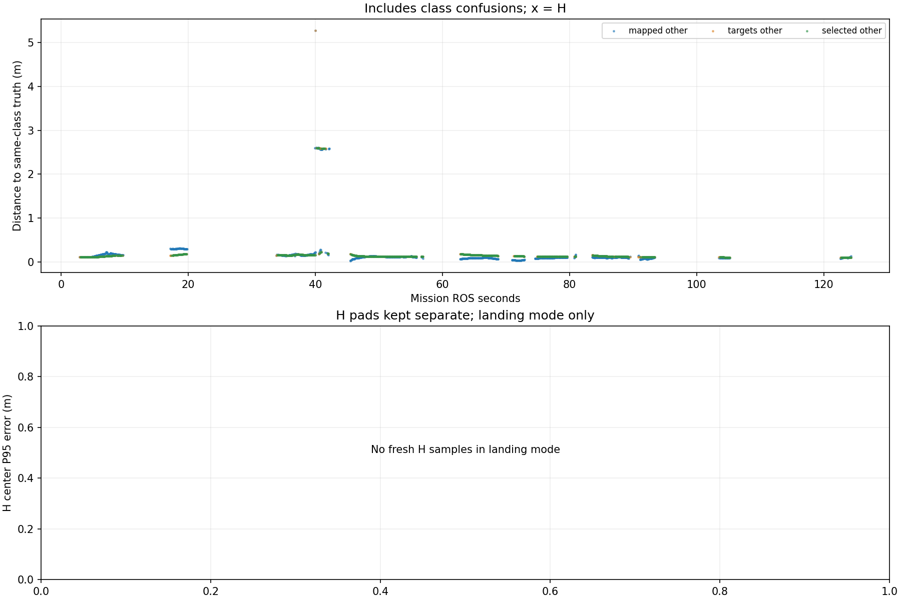

# Recorded target-center comparison

Phase-specific interpretation: [frozen SURVEY, interrupt and low reacquisition comparison](stages/PHASE_REPORT.md). The full-mission statistics below are not initial-high or low-only values.

Scope: 38_snake2
Gate: FAIL. Same-source route/speed matrix; see main report for paired comparisons and failures.

Run: /home/xhj/liftrace-worktrees/r2026-high-view-search/logs/latest_six_snake2_seed38_20261005_034318
World: /home/xhj/liftrace-worktrees/r2026-high-view-search/docs/verification/latest_six_20261005/generated/snake2_38/snake2_seed38/field.world
Coordinate transform: FLU world XY equals mission XY; local Z ground=-0.22, only XY distances compared

Distances below are to same-class truth; inspect the class/instance table before interpreting localization.

| Scope | Stream | Class | Truth instance | N | Median/m | P95/m | RMSE/m | Max/m |
|---|---|---|---|---:|---:|---:|---:|---:|
| unique_valid_mission | hint_bbox | bridge | random_bridge | 11 | 0.1602 | 5.1923 | 2.2186 | 5.2307 |
| unique_valid_mission | hint_bbox | panzer | random_panzer | 4 | 2.5914 | 2.6063 | 2.5926 | 2.6084 |
| unique_valid_mission | hint_bbox | red_cross | random_red_cross | 4 | 0.1653 | 0.1671 | 0.1649 | 0.1671 |
| unique_valid_mission | hint_bbox | tent | random_tent | 7 | 0.1498 | 0.1756 | 0.1562 | 0.1785 |
| unique_valid_mission | hint_vision | bridge | random_bridge | 23 | 0.1570 | 0.1619 | 0.1569 | 0.1620 |
| unique_valid_mission | hint_vision | pillbox | random_pillbox | 1 | 0.1323 | 0.1323 | 0.1323 | 0.1323 |
| unique_valid_mission | hint_vision | red_cross | random_red_cross | 43 | 0.1470 | 0.1747 | 0.1500 | 0.1787 |
| unique_valid_mission | hint_vision | tent | random_tent | 25 | 0.1633 | 0.1761 | 0.1666 | 0.1762 |
| unique_valid_mission | mapped | bridge | random_bridge | 280 | 0.1014 | 0.1647 | 0.3347 | 5.2742 |
| unique_valid_mission | mapped | panzer | random_panzer | 40 | 2.5798 | 2.5997 | 2.3479 | 2.6057 |
| unique_valid_mission | mapped | pillbox | random_pillbox | 222 | 0.1195 | 0.1366 | 0.1201 | 0.2192 |
| unique_valid_mission | mapped | red_cross | random_red_cross | 452 | 0.1011 | 0.3029 | 0.1502 | 0.3148 |
| unique_valid_mission | mapped | tent | random_tent | 63 | 0.1700 | 0.2092 | 0.1711 | 0.2326 |
| unique_valid_mission | selected | bridge | random_bridge | 259 | 0.1241 | 0.1602 | 0.1300 | 0.1627 |
| unique_valid_mission | selected | panzer | random_panzer | 21 | 2.5847 | 2.5982 | 2.2640 | 2.5986 |
| unique_valid_mission | selected | pillbox | random_pillbox | 217 | 0.1307 | 0.1591 | 0.1336 | 0.1987 |
| unique_valid_mission | selected | red_cross | random_red_cross | 386 | 0.1373 | 0.1771 | 0.1419 | 0.1851 |
| unique_valid_mission | selected | tent | random_tent | 59 | 0.1630 | 0.1773 | 0.1660 | 0.1776 |
| unique_valid_mission | targets | bridge | random_bridge | 277 | 0.1239 | 0.1602 | 0.3424 | 5.2742 |
| unique_valid_mission | targets | panzer | random_panzer | 30 | 2.5849 | 2.5984 | 2.2707 | 2.5992 |
| unique_valid_mission | targets | pillbox | random_pillbox | 219 | 0.1308 | 0.1631 | 0.1342 | 0.1987 |
| unique_valid_mission | targets | red_cross | random_red_cross | 400 | 0.1375 | 0.1775 | 0.1420 | 0.1851 |
| unique_valid_mission | targets | tent | random_tent | 61 | 0.1634 | 0.1773 | 0.1661 | 0.1776 |
| fresh_unique_mission | hint_bbox | bridge | random_bridge | 11 | 0.1602 | 5.1923 | 2.2186 | 5.2307 |
| fresh_unique_mission | hint_bbox | panzer | random_panzer | 4 | 2.5914 | 2.6063 | 2.5926 | 2.6084 |
| fresh_unique_mission | hint_bbox | red_cross | random_red_cross | 4 | 0.1653 | 0.1671 | 0.1649 | 0.1671 |
| fresh_unique_mission | hint_bbox | tent | random_tent | 7 | 0.1498 | 0.1756 | 0.1562 | 0.1785 |
| fresh_unique_mission | hint_vision | bridge | random_bridge | 23 | 0.1570 | 0.1619 | 0.1569 | 0.1620 |
| fresh_unique_mission | hint_vision | pillbox | random_pillbox | 1 | 0.1323 | 0.1323 | 0.1323 | 0.1323 |
| fresh_unique_mission | hint_vision | red_cross | random_red_cross | 43 | 0.1470 | 0.1747 | 0.1500 | 0.1787 |
| fresh_unique_mission | hint_vision | tent | random_tent | 25 | 0.1633 | 0.1761 | 0.1666 | 0.1762 |
| fresh_unique_mission | mapped | bridge | random_bridge | 280 | 0.1014 | 0.1647 | 0.3347 | 5.2742 |
| fresh_unique_mission | mapped | panzer | random_panzer | 40 | 2.5798 | 2.5997 | 2.3479 | 2.6057 |
| fresh_unique_mission | mapped | pillbox | random_pillbox | 222 | 0.1195 | 0.1366 | 0.1201 | 0.2192 |
| fresh_unique_mission | mapped | red_cross | random_red_cross | 452 | 0.1011 | 0.3029 | 0.1502 | 0.3148 |
| fresh_unique_mission | mapped | tent | random_tent | 63 | 0.1700 | 0.2092 | 0.1711 | 0.2326 |
| fresh_unique_mission | selected | bridge | random_bridge | 259 | 0.1241 | 0.1602 | 0.1300 | 0.1627 |
| fresh_unique_mission | selected | panzer | random_panzer | 21 | 2.5847 | 2.5982 | 2.2640 | 2.5986 |
| fresh_unique_mission | selected | pillbox | random_pillbox | 217 | 0.1307 | 0.1591 | 0.1336 | 0.1987 |
| fresh_unique_mission | selected | red_cross | random_red_cross | 386 | 0.1373 | 0.1771 | 0.1419 | 0.1851 |
| fresh_unique_mission | selected | tent | random_tent | 59 | 0.1630 | 0.1773 | 0.1660 | 0.1776 |
| fresh_unique_mission | targets | bridge | random_bridge | 277 | 0.1239 | 0.1602 | 0.3424 | 5.2742 |
| fresh_unique_mission | targets | panzer | random_panzer | 30 | 2.5849 | 2.5984 | 2.2707 | 2.5992 |
| fresh_unique_mission | targets | pillbox | random_pillbox | 219 | 0.1308 | 0.1631 | 0.1342 | 0.1987 |
| fresh_unique_mission | targets | red_cross | random_red_cross | 400 | 0.1375 | 0.1775 | 0.1420 | 0.1851 |
| fresh_unique_mission | targets | tent | random_tent | 61 | 0.1634 | 0.1773 | 0.1661 | 0.1776 |
| fresh_nearest_class_agrees | hint_bbox | bridge | random_bridge | 9 | 0.1554 | 0.1712 | 0.1574 | 0.1741 |
| fresh_nearest_class_agrees | hint_bbox | red_cross | random_red_cross | 4 | 0.1653 | 0.1671 | 0.1649 | 0.1671 |
| fresh_nearest_class_agrees | hint_bbox | tent | random_tent | 7 | 0.1498 | 0.1756 | 0.1562 | 0.1785 |
| fresh_nearest_class_agrees | hint_vision | bridge | random_bridge | 23 | 0.1570 | 0.1619 | 0.1569 | 0.1620 |
| fresh_nearest_class_agrees | hint_vision | pillbox | random_pillbox | 1 | 0.1323 | 0.1323 | 0.1323 | 0.1323 |
| fresh_nearest_class_agrees | hint_vision | red_cross | random_red_cross | 43 | 0.1470 | 0.1747 | 0.1500 | 0.1787 |
| fresh_nearest_class_agrees | hint_vision | tent | random_tent | 25 | 0.1633 | 0.1761 | 0.1666 | 0.1762 |
| fresh_nearest_class_agrees | mapped | bridge | random_bridge | 279 | 0.1014 | 0.1638 | 0.1128 | 0.1970 |
| fresh_nearest_class_agrees | mapped | panzer | random_panzer | 7 | 0.2335 | 0.2793 | 0.2403 | 0.2807 |
| fresh_nearest_class_agrees | mapped | pillbox | random_pillbox | 222 | 0.1195 | 0.1366 | 0.1201 | 0.2192 |
| fresh_nearest_class_agrees | mapped | red_cross | random_red_cross | 452 | 0.1011 | 0.3029 | 0.1502 | 0.3148 |
| fresh_nearest_class_agrees | mapped | tent | random_tent | 63 | 0.1700 | 0.2092 | 0.1711 | 0.2326 |
| fresh_nearest_class_agrees | selected | bridge | random_bridge | 259 | 0.1241 | 0.1602 | 0.1300 | 0.1627 |
| fresh_nearest_class_agrees | selected | panzer | random_panzer | 5 | 0.2209 | 0.2286 | 0.2174 | 0.2286 |
| fresh_nearest_class_agrees | selected | pillbox | random_pillbox | 217 | 0.1307 | 0.1591 | 0.1336 | 0.1987 |
| fresh_nearest_class_agrees | selected | red_cross | random_red_cross | 386 | 0.1373 | 0.1771 | 0.1419 | 0.1851 |
| fresh_nearest_class_agrees | selected | tent | random_tent | 59 | 0.1630 | 0.1773 | 0.1660 | 0.1776 |
| fresh_nearest_class_agrees | targets | bridge | random_bridge | 276 | 0.1238 | 0.1601 | 0.1298 | 0.1627 |
| fresh_nearest_class_agrees | targets | panzer | random_panzer | 7 | 0.2094 | 0.2286 | 0.2093 | 0.2286 |
| fresh_nearest_class_agrees | targets | pillbox | random_pillbox | 219 | 0.1308 | 0.1631 | 0.1342 | 0.1987 |
| fresh_nearest_class_agrees | targets | red_cross | random_red_cross | 400 | 0.1375 | 0.1775 | 0.1420 | 0.1851 |
| fresh_nearest_class_agrees | targets | tent | random_tent | 61 | 0.1634 | 0.1773 | 0.1661 | 0.1776 |

## Nearest any-class instance versus predicted class

Fresh unique mapped/targets/selected; all unique mission hints. A large same-class distance can be a class error.

| Stream | Predicted | Nearest class | Nearest instance | N | Median nearest/m | Median same-class/m | Suspected confusion N |
|---|---|---|---|---:|---:|---:|---:|
| hint_bbox | bridge | bridge | random_bridge | 9 | 0.1554 | 0.1554 | 0 |
| hint_bbox | bridge | pillbox | random_pillbox | 2 | 0.0725 | 5.1923 | 2 |
| hint_bbox | panzer | pillbox | random_pillbox | 4 | 0.0754 | 2.5914 | 4 |
| hint_bbox | red_cross | red_cross | random_red_cross | 4 | 0.1653 | 0.1653 | 0 |
| hint_bbox | tent | tent | random_tent | 7 | 0.1498 | 0.1498 | 0 |
| hint_vision | bridge | bridge | random_bridge | 23 | 0.1570 | 0.1570 | 0 |
| hint_vision | pillbox | pillbox | random_pillbox | 1 | 0.1323 | 0.1323 | 0 |
| hint_vision | red_cross | red_cross | random_red_cross | 43 | 0.1470 | 0.1470 | 0 |
| hint_vision | tent | tent | random_tent | 25 | 0.1633 | 0.1633 | 0 |
| mapped | bridge | bridge | random_bridge | 279 | 0.1014 | 0.1014 | 0 |
| mapped | bridge | pillbox | random_pillbox | 1 | 0.1133 | 5.2742 | 1 |
| mapped | panzer | panzer | random_panzer | 7 | 0.2335 | 0.2335 | 0 |
| mapped | panzer | pillbox | random_pillbox | 33 | 0.2182 | 2.5808 | 33 |
| mapped | pillbox | pillbox | random_pillbox | 222 | 0.1195 | 0.1195 | 0 |
| mapped | red_cross | red_cross | random_red_cross | 452 | 0.1011 | 0.1011 | 0 |
| mapped | tent | tent | random_tent | 63 | 0.1700 | 0.1700 | 0 |
| selected | bridge | bridge | random_bridge | 259 | 0.1241 | 0.1241 | 0 |
| selected | panzer | panzer | random_panzer | 5 | 0.2209 | 0.2209 | 0 |
| selected | panzer | pillbox | random_pillbox | 16 | 0.1691 | 2.5910 | 16 |
| selected | pillbox | pillbox | random_pillbox | 217 | 0.1307 | 0.1307 | 0 |
| selected | red_cross | red_cross | random_red_cross | 386 | 0.1373 | 0.1373 | 0 |
| selected | tent | tent | random_tent | 59 | 0.1630 | 0.1630 | 0 |
| targets | bridge | bridge | random_bridge | 276 | 0.1238 | 0.1238 | 0 |
| targets | bridge | pillbox | random_pillbox | 1 | 0.1133 | 5.2742 | 1 |
| targets | panzer | panzer | random_panzer | 7 | 0.2094 | 0.2094 | 0 |
| targets | panzer | pillbox | random_pillbox | 23 | 0.1729 | 2.5908 | 23 |
| targets | pillbox | pillbox | random_pillbox | 219 | 0.1308 | 0.1308 | 0 |
| targets | red_cross | red_cross | random_red_cross | 400 | 0.1375 | 0.1375 | 0 |
| targets | tent | tent | random_tent | 61 | 0.1634 | 0.1634 | 0 |

Missing bag topics: []

No rows is missing evidence, not zero error.

- Offline recorded map centers, not parcel impacts or physical release accuracy.
- Association is nearest same-class truth; not an independent instance recall evaluation.
- Same-class distance is not localization-only error: a wrong class may be near a different true instance.
- Nearest-any-instance association is diagnostic, not independently verified object identity.
- Suspected category confusion requires a different nearest class within the stated radius and a same-vs-any distance margin.
- Hint streams are reconstructed from high_view_full_events navigation_support, with explicitly supplied mission frame and projection plane.
- H start and landing pads are separate truth instances; a class/position error can change nearest association.
- World-to-evaluation transform is explicitly supplied, not estimated from the detections.
- Reported error is XY only. H dimensions do not change its center; no Z/size accuracy claim.
- Valid but old candidate publications are separate from fresh unique observations.
- TF lookup reuses bag_replay.TransformTree (latest past sample, max dynamic age 0.5s, no interpolation).
- Raw duplicates and invalid samples remain in CSV; errors aggregate only inside the mission interval.
- H branch-complete counters only show recorded pipeline completion, not proof of a detected H contour; raw detector output was not in this lightweight bag.

All samples including invalid, stale and duplicate publications: center_samples.csv.
Machine-readable provenance, truth and counts: center_summary.json.
