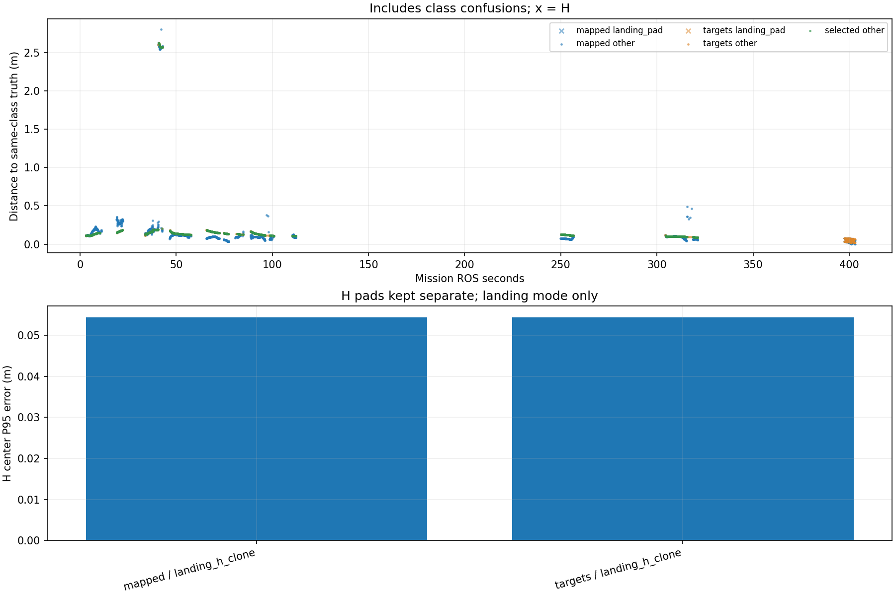

# Recorded target-center comparison

Phase-specific interpretation: [frozen SURVEY, interrupt and low reacquisition comparison](stages/PHASE_REPORT.md). The full-mission statistics below are not initial-high or low-only values.

Scope: 38_snake3
Gate: FAIL. Same-source route/speed matrix; see main report for paired comparisons and failures.

Run: /home/xhj/liftrace-worktrees/r2026-high-view-search/logs/latest_six_snake3_seed38_20261005_035440
World: /home/xhj/liftrace-worktrees/r2026-high-view-search/docs/verification/latest_six_20261005/generated/snake3_38/snake3_seed38/field.world
Coordinate transform: FLU world XY equals mission XY; local Z ground=-0.22, only XY distances compared

Distances below are to same-class truth; inspect the class/instance table before interpreting localization.

| Scope | Stream | Class | Truth instance | N | Median/m | P95/m | RMSE/m | Max/m |
|---|---|---|---|---:|---:|---:|---:|---:|
| unique_valid_mission | hint_bbox | bridge | random_bridge | 9 | 0.1118 | 0.1378 | 0.1163 | 0.1419 |
| unique_valid_mission | hint_bbox | panzer | random_panzer | 3 | 2.6339 | 2.6378 | 2.6307 | 2.6383 |
| unique_valid_mission | hint_bbox | red_cross | random_red_cross | 4 | 0.1640 | 0.1672 | 0.1638 | 0.1674 |
| unique_valid_mission | hint_bbox | tent | random_tent | 9 | 0.1816 | 0.2048 | 0.1702 | 0.2110 |
| unique_valid_mission | hint_vision | bridge | random_bridge | 27 | 0.1397 | 0.1604 | 0.1434 | 0.1627 |
| unique_valid_mission | hint_vision | pillbox | random_pillbox | 1 | 0.1431 | 0.1431 | 0.1431 | 0.1431 |
| unique_valid_mission | hint_vision | red_cross | random_red_cross | 46 | 0.1471 | 0.1760 | 0.1500 | 0.1795 |
| unique_valid_mission | hint_vision | tent | random_tent | 24 | 0.1848 | 0.1866 | 0.1825 | 0.1870 |
| unique_valid_mission | mapped | bridge | random_bridge | 296 | 0.0956 | 0.1998 | 0.1205 | 0.3802 |
| unique_valid_mission | mapped | landing_pad | landing_h_clone | 81 | 0.0465 | 0.0543 | 0.0438 | 0.0555 |
| unique_valid_mission | mapped | panzer | random_panzer | 301 | 0.0998 | 2.5774 | 0.9327 | 2.6322 |
| unique_valid_mission | mapped | pillbox | random_pillbox | 203 | 0.1164 | 0.1273 | 0.1172 | 0.2094 |
| unique_valid_mission | mapped | red_cross | random_red_cross | 571 | 0.0954 | 0.2902 | 0.1435 | 0.3532 |
| unique_valid_mission | mapped | tent | random_tent | 71 | 0.1878 | 0.2546 | 0.3843 | 2.8043 |
| unique_valid_mission | selected | bridge | random_bridge | 278 | 0.1294 | 0.1624 | 0.1321 | 0.1695 |
| unique_valid_mission | selected | panzer | random_panzer | 270 | 0.1001 | 2.5735 | 0.7764 | 2.6243 |
| unique_valid_mission | selected | pillbox | random_pillbox | 195 | 0.1334 | 0.1615 | 0.1373 | 0.2041 |
| unique_valid_mission | selected | red_cross | random_red_cross | 489 | 0.1335 | 0.1763 | 0.1400 | 0.1843 |
| unique_valid_mission | selected | tent | random_tent | 62 | 0.1862 | 0.1887 | 0.1837 | 0.1902 |
| unique_valid_mission | targets | bridge | random_bridge | 292 | 0.1287 | 0.1631 | 0.1318 | 0.1695 |
| unique_valid_mission | targets | landing_pad | landing_h_clone | 81 | 0.0500 | 0.0544 | 0.0492 | 0.0546 |
| unique_valid_mission | targets | panzer | random_panzer | 285 | 0.1000 | 2.5744 | 0.7870 | 2.6243 |
| unique_valid_mission | targets | pillbox | random_pillbox | 196 | 0.1335 | 0.1628 | 0.1376 | 0.2041 |
| unique_valid_mission | targets | red_cross | random_red_cross | 507 | 0.1337 | 0.1765 | 0.1401 | 0.1843 |
| unique_valid_mission | targets | tent | random_tent | 65 | 0.1862 | 0.1888 | 0.1831 | 0.1902 |
| fresh_unique_mission | hint_bbox | bridge | random_bridge | 9 | 0.1118 | 0.1378 | 0.1163 | 0.1419 |
| fresh_unique_mission | hint_bbox | panzer | random_panzer | 3 | 2.6339 | 2.6378 | 2.6307 | 2.6383 |
| fresh_unique_mission | hint_bbox | red_cross | random_red_cross | 4 | 0.1640 | 0.1672 | 0.1638 | 0.1674 |
| fresh_unique_mission | hint_bbox | tent | random_tent | 9 | 0.1816 | 0.2048 | 0.1702 | 0.2110 |
| fresh_unique_mission | hint_vision | bridge | random_bridge | 27 | 0.1397 | 0.1604 | 0.1434 | 0.1627 |
| fresh_unique_mission | hint_vision | pillbox | random_pillbox | 1 | 0.1431 | 0.1431 | 0.1431 | 0.1431 |
| fresh_unique_mission | hint_vision | red_cross | random_red_cross | 46 | 0.1471 | 0.1760 | 0.1500 | 0.1795 |
| fresh_unique_mission | hint_vision | tent | random_tent | 24 | 0.1848 | 0.1866 | 0.1825 | 0.1870 |
| fresh_unique_mission | mapped | bridge | random_bridge | 296 | 0.0956 | 0.1998 | 0.1205 | 0.3802 |
| fresh_unique_mission | mapped | landing_pad | landing_h_clone | 81 | 0.0465 | 0.0543 | 0.0438 | 0.0555 |
| fresh_unique_mission | mapped | panzer | random_panzer | 301 | 0.0998 | 2.5774 | 0.9327 | 2.6322 |
| fresh_unique_mission | mapped | pillbox | random_pillbox | 203 | 0.1164 | 0.1273 | 0.1172 | 0.2094 |
| fresh_unique_mission | mapped | red_cross | random_red_cross | 571 | 0.0954 | 0.2902 | 0.1435 | 0.3532 |
| fresh_unique_mission | mapped | tent | random_tent | 71 | 0.1878 | 0.2546 | 0.3843 | 2.8043 |
| fresh_unique_mission | selected | bridge | random_bridge | 278 | 0.1294 | 0.1624 | 0.1321 | 0.1695 |
| fresh_unique_mission | selected | panzer | random_panzer | 270 | 0.1001 | 2.5735 | 0.7764 | 2.6243 |
| fresh_unique_mission | selected | pillbox | random_pillbox | 195 | 0.1334 | 0.1615 | 0.1373 | 0.2041 |
| fresh_unique_mission | selected | red_cross | random_red_cross | 489 | 0.1335 | 0.1763 | 0.1400 | 0.1843 |
| fresh_unique_mission | selected | tent | random_tent | 62 | 0.1862 | 0.1887 | 0.1837 | 0.1902 |
| fresh_unique_mission | targets | bridge | random_bridge | 292 | 0.1287 | 0.1631 | 0.1318 | 0.1695 |
| fresh_unique_mission | targets | landing_pad | landing_h_clone | 81 | 0.0500 | 0.0544 | 0.0492 | 0.0546 |
| fresh_unique_mission | targets | panzer | random_panzer | 285 | 0.1000 | 2.5744 | 0.7870 | 2.6243 |
| fresh_unique_mission | targets | pillbox | random_pillbox | 196 | 0.1335 | 0.1628 | 0.1376 | 0.2041 |
| fresh_unique_mission | targets | red_cross | random_red_cross | 507 | 0.1337 | 0.1765 | 0.1401 | 0.1843 |
| fresh_unique_mission | targets | tent | random_tent | 65 | 0.1862 | 0.1888 | 0.1831 | 0.1902 |
| fresh_nearest_class_agrees | hint_bbox | bridge | random_bridge | 9 | 0.1118 | 0.1378 | 0.1163 | 0.1419 |
| fresh_nearest_class_agrees | hint_bbox | red_cross | random_red_cross | 4 | 0.1640 | 0.1672 | 0.1638 | 0.1674 |
| fresh_nearest_class_agrees | hint_bbox | tent | random_tent | 9 | 0.1816 | 0.2048 | 0.1702 | 0.2110 |
| fresh_nearest_class_agrees | hint_vision | bridge | random_bridge | 27 | 0.1397 | 0.1604 | 0.1434 | 0.1627 |
| fresh_nearest_class_agrees | hint_vision | pillbox | random_pillbox | 1 | 0.1431 | 0.1431 | 0.1431 | 0.1431 |
| fresh_nearest_class_agrees | hint_vision | red_cross | random_red_cross | 46 | 0.1471 | 0.1760 | 0.1500 | 0.1795 |
| fresh_nearest_class_agrees | hint_vision | tent | random_tent | 24 | 0.1848 | 0.1866 | 0.1825 | 0.1870 |
| fresh_nearest_class_agrees | mapped | bridge | random_bridge | 296 | 0.0956 | 0.1998 | 0.1205 | 0.3802 |
| fresh_nearest_class_agrees | mapped | landing_pad | landing_h_clone | 81 | 0.0465 | 0.0543 | 0.0438 | 0.0555 |
| fresh_nearest_class_agrees | mapped | panzer | random_panzer | 262 | 0.0992 | 0.1067 | 0.1078 | 0.4884 |
| fresh_nearest_class_agrees | mapped | pillbox | random_pillbox | 203 | 0.1164 | 0.1273 | 0.1172 | 0.2094 |
| fresh_nearest_class_agrees | mapped | red_cross | random_red_cross | 571 | 0.0954 | 0.2902 | 0.1435 | 0.3532 |
| fresh_nearest_class_agrees | mapped | tent | random_tent | 70 | 0.1877 | 0.2497 | 0.1936 | 0.2972 |
| fresh_nearest_class_agrees | selected | bridge | random_bridge | 278 | 0.1294 | 0.1624 | 0.1321 | 0.1695 |
| fresh_nearest_class_agrees | selected | panzer | random_panzer | 246 | 0.1000 | 0.1014 | 0.0984 | 0.1126 |
| fresh_nearest_class_agrees | selected | pillbox | random_pillbox | 195 | 0.1334 | 0.1615 | 0.1373 | 0.2041 |
| fresh_nearest_class_agrees | selected | red_cross | random_red_cross | 489 | 0.1335 | 0.1763 | 0.1400 | 0.1843 |
| fresh_nearest_class_agrees | selected | tent | random_tent | 62 | 0.1862 | 0.1887 | 0.1837 | 0.1902 |
| fresh_nearest_class_agrees | targets | bridge | random_bridge | 292 | 0.1287 | 0.1631 | 0.1318 | 0.1695 |
| fresh_nearest_class_agrees | targets | landing_pad | landing_h_clone | 81 | 0.0500 | 0.0544 | 0.0492 | 0.0546 |
| fresh_nearest_class_agrees | targets | panzer | random_panzer | 259 | 0.1000 | 0.1017 | 0.0984 | 0.1173 |
| fresh_nearest_class_agrees | targets | pillbox | random_pillbox | 196 | 0.1335 | 0.1628 | 0.1376 | 0.2041 |
| fresh_nearest_class_agrees | targets | red_cross | random_red_cross | 507 | 0.1337 | 0.1765 | 0.1401 | 0.1843 |
| fresh_nearest_class_agrees | targets | tent | random_tent | 65 | 0.1862 | 0.1888 | 0.1831 | 0.1902 |
| fresh_H_landing_mode | mapped | landing_pad | landing_h_clone | 81 | 0.0465 | 0.0543 | 0.0438 | 0.0555 |
| fresh_H_landing_mode | targets | landing_pad | landing_h_clone | 81 | 0.0500 | 0.0544 | 0.0492 | 0.0546 |

## Nearest any-class instance versus predicted class

Fresh unique mapped/targets/selected; all unique mission hints. A large same-class distance can be a class error.

| Stream | Predicted | Nearest class | Nearest instance | N | Median nearest/m | Median same-class/m | Suspected confusion N |
|---|---|---|---|---:|---:|---:|---:|
| hint_bbox | bridge | bridge | random_bridge | 9 | 0.1118 | 0.1118 | 0 |
| hint_bbox | panzer | pillbox | random_pillbox | 3 | 0.0900 | 2.6339 | 3 |
| hint_bbox | red_cross | red_cross | random_red_cross | 4 | 0.1640 | 0.1640 | 0 |
| hint_bbox | tent | tent | random_tent | 9 | 0.1816 | 0.1816 | 0 |
| hint_vision | bridge | bridge | random_bridge | 27 | 0.1397 | 0.1397 | 0 |
| hint_vision | pillbox | pillbox | random_pillbox | 1 | 0.1431 | 0.1431 | 0 |
| hint_vision | red_cross | red_cross | random_red_cross | 46 | 0.1471 | 0.1471 | 0 |
| hint_vision | tent | tent | random_tent | 24 | 0.1848 | 0.1848 | 0 |
| mapped | bridge | bridge | random_bridge | 296 | 0.0956 | 0.0956 | 0 |
| mapped | landing_pad | landing_pad | landing_h_clone | 81 | 0.0465 | 0.0465 | 0 |
| mapped | panzer | panzer | random_panzer | 262 | 0.0992 | 0.0992 | 0 |
| mapped | panzer | pillbox | random_pillbox | 39 | 0.1975 | 2.5672 | 39 |
| mapped | pillbox | pillbox | random_pillbox | 203 | 0.1164 | 0.1164 | 0 |
| mapped | red_cross | red_cross | random_red_cross | 571 | 0.0954 | 0.0954 | 0 |
| mapped | tent | pillbox | random_pillbox | 1 | 0.2079 | 2.8043 | 1 |
| mapped | tent | tent | random_tent | 70 | 0.1877 | 0.1877 | 0 |
| selected | bridge | bridge | random_bridge | 278 | 0.1294 | 0.1294 | 0 |
| selected | panzer | panzer | random_panzer | 246 | 0.1000 | 0.1000 | 0 |
| selected | panzer | pillbox | random_pillbox | 24 | 0.2014 | 2.5750 | 24 |
| selected | pillbox | pillbox | random_pillbox | 195 | 0.1334 | 0.1334 | 0 |
| selected | red_cross | red_cross | random_red_cross | 489 | 0.1335 | 0.1335 | 0 |
| selected | tent | tent | random_tent | 62 | 0.1862 | 0.1862 | 0 |
| targets | bridge | bridge | random_bridge | 292 | 0.1287 | 0.1287 | 0 |
| targets | landing_pad | landing_pad | landing_h_clone | 81 | 0.0500 | 0.0500 | 0 |
| targets | panzer | panzer | random_panzer | 259 | 0.1000 | 0.1000 | 0 |
| targets | panzer | pillbox | random_pillbox | 26 | 0.1975 | 2.5759 | 26 |
| targets | pillbox | pillbox | random_pillbox | 196 | 0.1335 | 0.1335 | 0 |
| targets | red_cross | red_cross | random_red_cross | 507 | 0.1337 | 0.1337 | 0 |
| targets | tent | tent | random_tent | 65 | 0.1862 | 0.1862 | 0 |

Missing bag topics: []

No rows is missing evidence, not zero error.

- Offline recorded map centers, not parcel impacts or physical release accuracy.
- Association is nearest same-class truth; not an independent instance recall evaluation.
- Same-class distance is not localization-only error: a wrong class may be near a different true instance.
- Nearest-any-instance association is diagnostic, not independently verified object identity.
- Suspected category confusion requires a different nearest class within the stated radius and a same-vs-any distance margin.
- Hint streams are reconstructed from high_view_full_events navigation_support, with explicitly supplied mission frame and projection plane.
- H start and landing pads are separate truth instances; a class/position error can change nearest association.
- World-to-evaluation transform is explicitly supplied, not estimated from the detections.
- Reported error is XY only. H dimensions do not change its center; no Z/size accuracy claim.
- Valid but old candidate publications are separate from fresh unique observations.
- TF lookup reuses bag_replay.TransformTree (latest past sample, max dynamic age 0.5s, no interpolation).
- Raw duplicates and invalid samples remain in CSV; errors aggregate only inside the mission interval.
- H branch-complete counters only show recorded pipeline completion, not proof of a detected H contour; raw detector output was not in this lightweight bag.

All samples including invalid, stale and duplicate publications: center_samples.csv.
Machine-readable provenance, truth and counts: center_summary.json.
