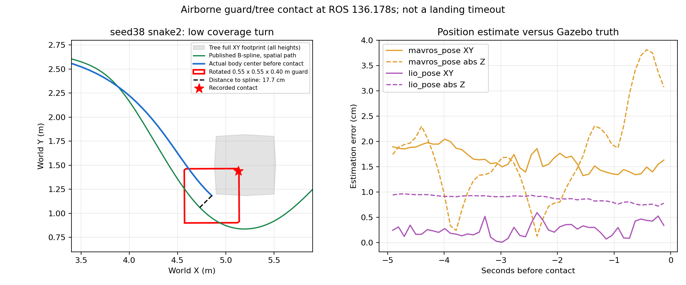

# 最新公共补丁：三种高位航线六轮整机验证（2026-10-05）

本批固定版本 `87258798`，矩形、双扫描线、三扫描线各跑seed31/38。下表随已结束轮次生成；原始Gate与物理落地分别记录。仅模拟释放，没有包裹弹道或实机舵机动作。

## 版本与方法

- 已含跨类记忆连续帧/换类/物理ID合并修复，四项运动修复及None选档、pending就绪/超时和高度ACK回执修复。
- FAST-LIO三线程；内环净空10×10m、外墙5cm、原始均匀四树、障碍柱ON、膨胀0.25/0.20/0.10m、H80cm；相机AGL2.6m/FC AGL2.76m，local ground=-0.22m。
- 六轮与前八轮同seed/同航线的场景模型逐项相同，见scene_comparison.json。旧八轮版本2b0678b9不含最新公共修复。
- 全域直线权重2、运动衔接开启。每轮同版一次，不用失败重跑择优。
- 原始Gate与视频的区域高度判据仍为1.2m；新规划/控制共同走廊上限是FC参考点1.0m。该Gate不能单独证明实际机体严格不超过1.0m，需同时看轨迹指令、估计高度、真值和跟踪超调。
- “物理触地”取H支撑接触，再核对真值静止。落地静止后才超时/跳变可按用户口径计飞行完成，原FAIL仍保留；空中碰撞、错靶另计。
- 时间从任务接受算ROS秒，不含前置起飞；视频长度、仿真墙钟耗时不能当任务用时。每配置每seed仅一次，不能据此估计成功率。

## 六轮结果

| seed/航线 | 原始Gate | 类别正确释放/总释放 | 实际最近靶标 | COMPLETE秒 | 物理触地秒 | 碰撞数 | 原因 |
|---|---|---:|---|---:|---:|---:|---|
| 31_rectangle | PASS | 3/3 | panzer,bridge,red_cross | 197.14 | 192.78 | 0 | all_checks_passed |
| 31_snake2 | PASS | 3/3 | bridge,red_cross,panzer | 218.98 | 215.25 | 0 | all_checks_passed |
| 31_snake3 | PASS | 3/3 | panzer,bridge,red_cross | 232.53 | 228.18 | 0 | all_checks_passed |
| 38_rectangle | PASS | 3/3 | red_cross,bridge,panzer | 233.53 | 229.43 | 0 | all_checks_passed |
| 38_snake2 | FAIL | 2/2 | red_cross,bridge | — | — | 1 | actual_collision |
| 38_snake3 | FAIL | 3/3 | red_cross,bridge,panzer | — | 403.98 | 0 | manager_failed |

当前批次状态：COMPLETE，已结束6/6。

## 与上一批比较

“节省”为旧物理触地秒减本次；正数更快。旧seed38矩形含误投，不作为等质量完赛节时基准。旧同航线与本批同时有公共补丁差异，因此不把所有变化归因于路线或单一速度项。

| 新配置 | 旧对照 | 旧触地s | 新触地s | 节省s | 旧/新投后航段s | 旧/新恢复合计s |
|---|---|---:|---:|---:|---|---|
| 31_rectangle | rectangle | 222.28 | 192.78 | 29.50 | 66.09 / 95.76 | 6.62 / 7.06 |
| 31_rectangle | rectangle_baseline | 178.80 | 192.78 | -13.98 | 81.80 / 95.76 | 9.48 / 7.06 |
| 31_snake2 | snake2 | 179.89 | 215.25 | -35.36 | 63.67 / 67.72 | 7.42 / 7.06 |
| 31_snake2 | rectangle_baseline | 178.80 | 215.25 | -36.45 | 81.80 / 67.72 | 9.48 / 7.06 |
| 31_snake3 | snake3 | 213.73 | 228.18 | -14.45 | 66.86 / 71.10 | 6.28 / 16.40 |
| 31_snake3 | rectangle_baseline | 178.80 | 228.18 | -49.38 | 81.80 / 71.10 | 9.48 / 16.40 |
| 38_rectangle | rectangle | 198.19 | 229.43 | -31.23 | 65.03 / 71.50 | 6.94 / 6.77 |
| 38_rectangle | rectangle_baseline | 219.81 | 229.43 | -9.61 | 82.90 / 71.50 | 10.79 / 6.77 |
| 38_snake2 | snake2 | 381.33 | — | — | 66.69 / — | 6.75 / 3.85 |
| 38_snake2 | rectangle_baseline | 219.81 | — | — | 82.90 / — | 10.79 / 3.85 |
| 38_snake3 | snake3 | — | 403.98 | — | — / 78.84 | 3.70 / 6.86 |
| 38_snake3 | rectangle_baseline | 219.81 | 403.98 | -184.17 | 82.90 / 78.84 | 10.79 / 6.86 |

## 靶心与实际靶位

首个高位观测与低空复核来自各自事件快照，不用最终被低空更新的记忆冒充高空定位。低空误差单位m，H单位cm；高位误类别造成的跨靶距离不能当投影误差。释放核对使用机体中心最近真实靶标，不等同快递盒落点。

| 配置 | 首次高位类别/同类中心距离 | 低空重新捕获事件 | H检测cm | H触地cm |
|---|---|---|---:|---:|
| 31_rectangle | tent 0.17m；bridge 0.48m；red_cross 0.40m；panzer 0.44m | panzer 0.18m；bridge 0.22m；red_cross 0.10m | 2.05 | 4.22 |
| 31_snake2 | tent 0.16m；panzer 0.51m；pillbox 0.28m；bridge 7.43m（疑似异类）；red_cross 0.22m | bridge 0.15m；red_cross 0.17m；panzer 0.17m | 2.36 | 10.39 |
| 31_snake3 | tent 0.17m；panzer 0.46m；bridge 7.30m（疑似异类）；pillbox 0.29m；red_cross 0.32m | panzer 0.16m；bridge 0.19m；red_cross 0.14m | 2.23 | 6.10 |
| 38_rectangle | red_cross 0.17m；panzer 2.76m（疑似异类）；tent 2.81m（疑似异类）；pillbox 0.25m；bridge 5.41m（疑似异类） | red_cross 0.15m；bridge 0.18m；panzer 0.16m | 1.77 | 6.37 |
| 38_snake2 | red_cross 0.16m；bridge 0.16m；tent 0.14m；panzer 2.61m（疑似异类） | red_cross 0.17m；bridge 0.13m | — | — |
| 38_snake3 | red_cross 0.16m；bridge 0.11m；tent 0.11m；panzer 2.64m（疑似异类） | red_cross 0.17m；bridge 0.14m | 2.36 | 9.94 |

完整释放位置见release_truth.json，中心分阶段统计见各 *_centers/stages/PHASE_REPORT.md，图表与视频见[index.html](index.html)。

## 配置和现场验收

现场九组操作见视觉试飞分支 `docs/deployment/board_redeploy_20261001/NINE_TRIALS_20261005.md`，导航板端参考分支有同版手册。现场仍是FC最高2m、默认0.5m/s及狭小范围，不被本批光心2.6m和10×10配置覆盖。新运动衔接显式--motion-optimized开启。仿真通过不替代真实bag/ULog、舵机和落点验收。本次没有上板，不修改main。

## 结论与下一步

六轮固定同版全部结束，原始Gate为4/6通过，共17次模拟释放，按释放时机体最近真实靶标核对，标签不符0次。矩形两seed均完成正确三投、走廊与H落地，适合作为下一轮同版回归对照；样本仅两轮，不等于成功率已标定。三种航线参数化留在高位研究中，本次没有覆盖整机候选的默认航线，也没有上板。

### 旧标签误投已在真实触发路径被阻断

- seed38矩形仍出现高空将碉堡记成panzer的竞争线索，但低空在ROS80.702s输出LOW_VIEW_LABEL_RESOLVED=pillbox，80.709s将旧panzer目标延后；未在碉堡投递，最终前往真正panzer完成释放。旧八轮同配置曾在碉堡上方错投，本轮不是靠消失了同一触发条件来宣称修复。
- seed31双扫描线同样发生低空改判pillbox，再前往真正panzer；seed38双线、三线也观察到LOW_VIEW_LABEL_RESOLVED。检测器高空类别混淆仍存在，记忆修复负责不让异类新观测维持旧confirmed，不等于模型本身不再误检。
- 三线seed38撤销碉堡错误线索后没有足够的真实panzer高位记忆可直接重访，进入LOW_COVERAGE；到约ROS318s才接近真实panzer完成后续链。这条额外遍历是显著耗时来源。

### seed38双扫描线：真实空中接触，不能按落地收尾豁免

两投后在ROS103.251s进入LOW_COVERAGE，136.178s与固定juniper_Tree_1发生机体碰撞包络接触，FC中心真实离地约1.49m。接触由55×55×40cm机体包络记录，深度约0.096mm、力约0.167N；这是非零真实接触，不是落地后超时，也不能因碰撞轻微就算通过。

接触前两秒（统计截至接触前0.1s）LIO水平真值误差最大约5.3mm、竖直8.7mm；飞控水平约1.77cm、竖直3.81cm。没有支持“本次碰撞由LIO跳变导致”的证据。机体中心到已发布B样条的最近空间距离约17.7cm，偏向树体；设定点本身存在主动前视，因此不把当前设定点与机体间约0.8m距离当成同步轨迹误差。

更应优先核查弯道前视/跟踪、三维机体扫掠和预留净空；本包没有完整占据点云，不能断言规划地图完全正确或把责任完全归给控制。旧八轮三线seed38也曾在同一树附近接触，说明补搜绕树是需专门覆盖的失败路径。后续可做离线轨迹与机体扫掠复核，再修改相关路径并获得新的仿真授权后回归；本次未为了通过验收缩小包络/膨胀，未重跑失败轮择优。

### seed38三扫描线：已落地，但软件终态交接未闭合

该轮物理触地为任务403.984s（ROS415.410s），其后196.064s才触发任务超时；LAND段图中的约202.5s包含这段地面等待，不是一直飞行。原始Gate为manager_failed/landing_deadline_reached；按用户口径是三投且无碰撞落地完成，六轮物理完整飞行为5/6。该轮在ROS417.369s记录LANDED_STATE_ON_GROUND，419.568s记录armed=false，真值随后持续静止；实时Bridge快照却持续显示landing_settle.reason=control_state_not_landing（见landing_tail_snake3_38_live_bridge.json）。生产_update_landing在积累settle前要求_control_state==3，因此旧控制离开LAND后不能继续确认已经完成的落地。

日志在同一419.568s明确记录flight_controller_control_lost；externalLandingStateCallback把上锁后的OFFBOARD状态走进控制丢失分支，failExternalLanding将Drone_mode置为Run_point(1)，与实时/detect/point_class=1一致。H在410.349s已经通过10帧对齐。因此本轮收尾阻塞不是H没识别或LIO空中跳变，见landing_tail_snake3_38_evidence.json。原始Gate保持记录，物理落地按用户口径单独认定。后续应检查正常LAND事务、更新的ON_GROUND/上锁反馈与接管取消之间的时序，修复落地完成确认和旧状态退出的竞争；不得简单绕开人工接管取消。本批保持源码固定，未边跑边改或通过改Gate隐藏问题。

### 节时与限高必须分别评价

首四个完整通过轮的全程水平速度P95约0.84–0.89m/s，不能用设定速度上限代替实测。相对旧未优化矩形，当前矩形seed31物理触地反而慢13.98s，seed38慢9.61s。相对旧已优化矩形，seed31快29.50s；seed38旧轮有错靶，不能据此作等质量节时宣传。矩形两seed投后恢复合计由旧基线9.478/10.788s减到7.057/6.774s，分别缩短2.421/4.014s；局部衔接收益被其他阶段抵消。总体尚无“全面提速”的结论，应看搜索/复核/投后/走廊分段，而不是继续直接加大速度。

当前矩形31、矩形38和三线31在走廊区域真实FC高度分别达到约1.058、1.049、1.068m，双线31约0.984m。规划/控制参考点共同1.0m限制已经接通，但真实跟踪超调仍需处理。旧Gate使用1.2m区域门槛，因此这些PASS不代表严格1.0m物理限高已经验收。进一步对齐峰值附近的记录：矩形31真值1.058m、FC估计1.005m、指令0.937m；三线31真值1.068m、FC估计0.983m、指令0.900m；矩形38真值1.049m、FC估计0.982m、指令0.900m（时间差均小于50ms，见corridor_peak_context.json）。因此既有FC高度估计偏差，也有相对设定点的实际跟踪偏差，不能笼统认定规划器发布了超高轨迹。不要通过调高验收门槛或忽略真值掩盖余量问题。

### 最接近整机闭环的安排

1. 保持现场0.5m/s和矩形，先做06高位优先同版回归（记忆改判、真实三投、返起飞点）；无需重跑全部历史成功专项。
2. 做03强化H完整落地，再做04实测门前/门后引导点→H，包含遥控接管和走廊真实限高。
3. 修复并回归本次LOW_COVERAGE树体接触，再启用快速整场；08使用已经验证的参数完成同一轮三投→走廊→H，是最终闭环核心验收。
4. 09高速采集并行提供0.5/1.0/1.2m/s、明暗条件数据，验证各类连续识别、曝光模糊、EV/LIO年龄；高速采集成功不替代快速投递整场验收。

现有SITL验证标准80cm H，不能替代实拍反光、差光照和板端RKNN表现。真实舵机、落点、轻量录包、人工OFFBOARD与接管、板端多线程实时性仍按手册验收。

## 镜头2m三扫描线补验

恢复原镜头2m、FC2.16m及三条展开航线的两轮结果见[补验报告](../snake3_camera2m_20261005/REPORT.md)。原六轮结果保持不变；视频保存在r2026-high-view-search的对应run中。
