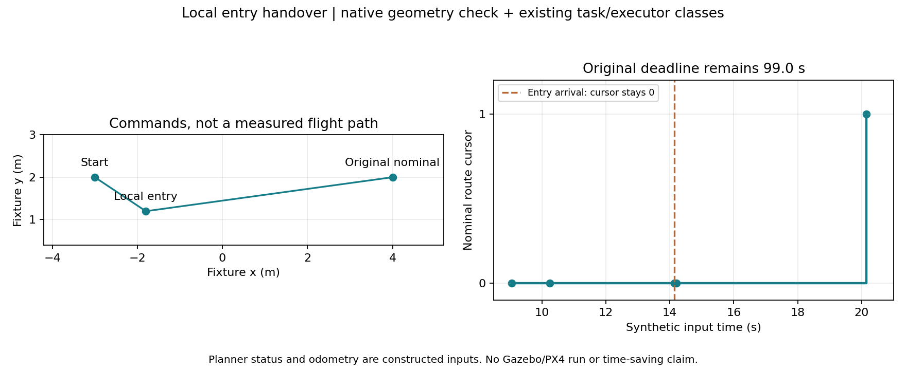

# 局部入口接入原任务链：默认关闭的执行原型

本文记录启动前的代码与离线验证。用户随后已明确授权真实SITL比较，按[独立对照计划](../local_entry_sitl_20260912/PLAN.md)执行；实跑结果另行记录，不把本文构造输入当成飞行证据。

2026-09-12，研究分支`feat/coverage-efficiency-research`，本轮开发基线`201c4b4`。已完成局部建议到Mission Manager/MissionRuntime及原Planner Bridge执行器的接入代码。**显式开启研究开关后，建议可以生成真正的任务层局部目标；默认仍关闭，本轮没有启动ROS节点、SITL或实机，也没有新的节时结论。**

本阶段只采用一个局部入口`entry`。到达该入口、规划失败或超时后，恢复原名义航点的调度；不把入口到达当作原航点完成，不自动执行建议中的`exit`，不跳过尚未完成的名义航点。原高权重选靶、释放许可、三槽、防重复投递与投后路线保持。

## 执行与回退

1. Mission Manager只在显式启用时订阅建议和最新观测状态，校验schema、mission/decision/frame、观测generation、地图/建议年龄、位姿漂移、搜索边界、高度与几何进展。建议中的`flight_authorized=false`仍保留；是否采用由任务层的研究配置决定。
2. 正常选靶/返航/超时调度先执行。有高权重目标时优先APPROACH，局部建议不占用投递事务。只有当前仍是匹配的无靶SEARCH/RESUME，才能建立新decision_seq并经原出口交给Planner Bridge。
3. 每个名义航点最多采用一次，每场默认最多四次；额度在中断、失败和重试后保留，避免重复插点。入口执行期间或额度已用时，建议节点停止为该航点做无效重复查询。
4. 单次入口最多12s，采用前要求原动作至少还剩15s，留3s恢复余量。局部终止后恢复原deadline，不能因插点重新获得90s。若回执到来时原deadline已经过期，则正常计一次名义失败并进入原重试/跳点逻辑。
5. 入口失败/超时在原deadline以内，不增加名义失败次数。入口和被替换原动作的迟到回执都不推进游标；只有当前名义动作的正常完成才推进。
6. 高权重投递中断会清除局部状态。投后恢复遵循原任务的正常租约规则，不把中断前的局部deadline带入投递事务；四次总额度及单航点额度仍保留。

原执行器仍负责目标接管、规划状态关联、真实里程计位置/速度和停留门槛。几何预检不是已知自由或动力学可达证明，任务层也不直接输出位置控制量。若规划器调整了入口位置，执行器可能在替代点报告到达；本原型额外记录入口XY偏差，超出0.35m标为`local_entry_adjusted_or_missed`，不会冒充到达了预期观察位置。

同一ROS时刻收到立即失败并恢复目标时，原执行器要求不同动作有不同身份时间戳。仅研究模式为相邻动作身份加最小1微秒次序，deadline仍按原始调度时间计算，不借此增加任务预算；默认关闭时保持原时间行为。

## 候选收益与配置

候选收益已改为**入口处的观察矩形代理**，不再把后续exit段的潜在视野计入本次收益。建议包增加schema=1、command/frame、`ENTRY_VIEW_PROXY`范围和`entry_gain_m2`；消费端拒绝旧格式或整段收益冒充入口收益。观察矩形仍需真实姿态、遮挡和检出标定，入口收益不等于召回或最终得分。

参数在`uav_mission/config/local_motion.yaml`，搜索边界从当前任务SearchPolicy读取。主要默认值：入口0.5–4m、横向偏移不超过1m、几何额外路程估计不超过1.5m、向名义目标进展至少0.3m、入口区域收益至少0.1m²；高度保持原目标，拒绝明显高度过渡。

`research_trial.launch`新增`local_motion_enabled:=true`；开启后自动带上建议节点及原地图预检。`local_adviser_enabled:=true`单独使用时仍只有旁路。两项都默认false，普通比赛入口不增加开关。Mission Manager在`/use_sim_time`不为true或start_mode不是full时拒绝启用局部执行。本轮只做静态展开，没有启动这些入口。

| 静态配置：建议/局部执行 | 节点数 | 任务层采用局部建议 |
|---|---:|---|
| false / false | 36 | 关闭 |
| true / false | 37 | 关闭，只记录建议 |
| false / true | 37 | 开启，同时自动启用建议 |
| true / true | 37 | 开启 |

[静态展开结果](static_launch.json)。规划参数、0.70m默认间距、原导航消息类型和验收Gate未修改；新增的入口动作不被统计成原覆盖航点或投后航点完成。

## 离线串接结果

[verify_flow.py](verify_flow.py)串接同一原生体素预检函数、实际LocalProposer、MissionRuntime和PlannerMotionExecutor类。构造的规划状态与里程计满足原执行器的到达/停留门槛，执行器自行生成终止事件，再交给任务层处理；没有直接给任务层伪造“入口成功”来代替这段执行器逻辑。

| 构造输入时刻 | 事件 | 名义游标 |
|---|---|---:|
| 9.05s | 原名义目标已派发 | 0 |
| 10.25s | 采用南侧局部入口 | 0 |
| 14.15s | 执行器确认入口到达，恢复原目标 | 0 |
| 14.20s | 原目标旧代次迟到状态被忽略 | 0 |
| 20.15s | 当前名义目标到达，生成下一个名义目标 | 1 |

原名义动作deadline为99.0s，恢复后仍为99.0s。完整建议、动作、状态和断言见[flow.json](flow.json)。

图中连线是构造的目标顺序，不是测得航迹。此流程未运行规划搜索/样条优化、PX4、Gazebo或视觉推理；不能据此声称树旁真实通行、三投率或耗时改善。

两套工作区实际构建通过，四个相关包共**391项独立testcase**通过：观测90、任务276、plan_manage 12、plan_env 13。新增测试覆盖入口成功/失败/超时、原deadline已过、同刻立即失败、旧回执、单航点/全场额度、高权重优先、投后恢复、并发建议、错代/陈旧输入、高度/边界及ROS消费端。详见[validation.json](validation.json)。

## 存储维护

用户本轮要求关注本地剩余空间并及时清理日志。实测宿主F盘约65GiB可用、已用94%，C盘约28GiB；WSL虚拟文件系统显示875GiB余量，不能当成宿主物理余量。

本轮清理8份可重建的基准比较NPZ，合计99,781,104字节（约95.16MiB），研究logs占用约973→878MiB。保留统计JSON、脚本、原PNG/点云样本和原始飞行日志。[删除清单](storage.json)。没有压缩VHDX，不把WSL逻辑释放量等同于宿主已回收空间。

原`check_sim_storage.sh`按日志目录和`SIM_STORAGE_GUARD_PATH=/mnt/f`检查20GiB下限，本轮只运行了这个无仿真预检并通过。后续每轮继续检查宿主盘，保持`SIM_NO_RECORD=1`、关闭全场视频/bag，沿用最多120份观测采样和1500行建议记录；完成报告后清理可重建中间结果。当前仍用于配对和失败复盘的原始记录保持完整。

本轮逻辑验证只生成小JSON和一张图，没有复制整轮日志或新增大型数组。

## 剩余工作

下一步实跑应先检查只读模式的接口可用率/排队开销，再以相同布局、间距、等待参数比较局部执行开关。需要观察入口实际到达位置、新增视觉观测、原规划等待与三投时间；增加停顿/绕行而收益不足时停用该候选。局部建议仍未经过在线验收，已有95组历史候选缺同刻SDF的限制继续保留，不能当成本版已验证的可达结果。

自动跳点、完整补扫段和投后就近重排尚未实现；本版只插入有限入口。正赛工作树`86e382d`与CURRENT交付`c369e6f8`未变，本轮仅同步研究分支，不打包、不部署。
