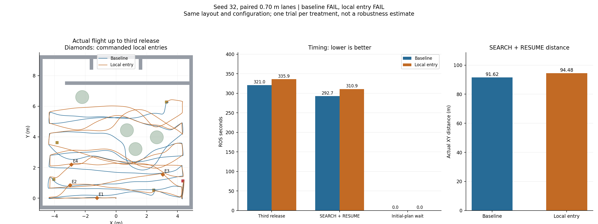
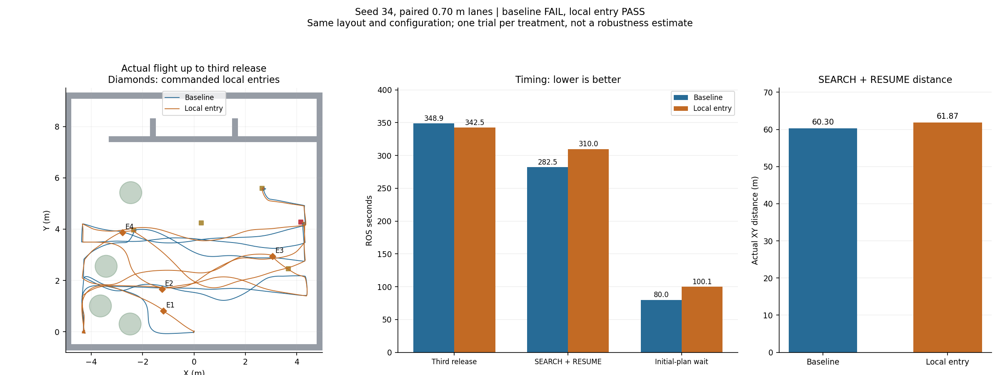
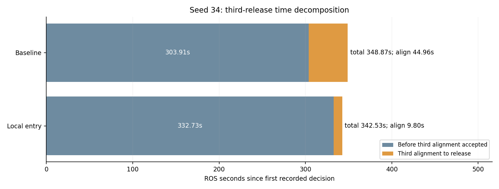
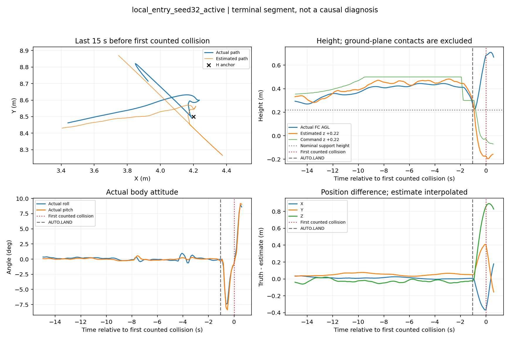
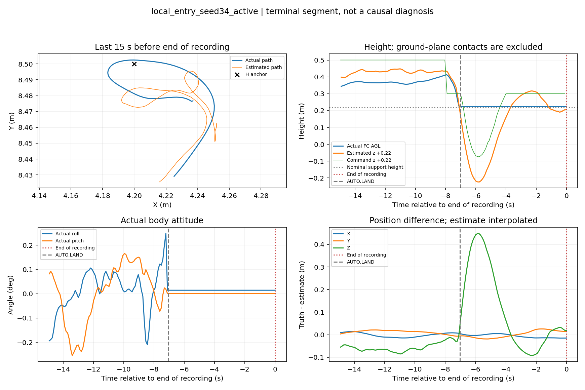

# 局部入口四轮SITL对照：执行链通过，搜索收益未成立

2026-09-12，研究分支`feat/coverage-efficiency-research`。用户明确授权后，完成seed32、seed34各一组关闭/开启局部入口的真实PX4/Gazebo对照。四轮飞行源码均为`31374fd`，任务执行逻辑为此前`4b47c34`；期间没有调参、换模型或改Gate。

**当前入口原型保持默认关闭，不进入正赛部署。** 两个布局的SEARCH/RESUME均更慢、航程更长；seed34三投总时间减少6.34秒，对应第三投精定位等待缩短，搜索本身增加27.48秒。执行机制得到实跑验证：共接纳8次入口，7次正常完成、1次被高权重目标中断，原航点恢复正确。整轮结果为1 PASS、3 FAIL，不能据此宣称稳定性或降落问题已经解决。

## 对照条件与范围

| 布局 | 航带 | 初始规划等待上限 | 基线 | 执行组 |
|---|---:|---:|---|---|
| seed32 | 0.70m | 0，原行为 | 建议开、局部执行关 | 建议开、局部执行开 |
| seed34 | 0.70m | 20s | 建议开、局部执行关 | 建议开、局部执行开 |

每对11份输入逐项一致：world、field、runtime、gate几何、观测配置、局部执行/建议/资源参数以及三份机架SDF。使用同一PT模型路径、原高度/速度、同一平地观测参考与记录参数；只改变`local_motion_enabled`。seed34沿用原全随机场的0.70m配置，未继承上一轮0.80m候选。每轮的实际命令、输入副本和源码版本保存在run内，汇总见[runs.json](runs.json)与[validation.json](validation.json)。

每轮经`SIM_RUN_AUTHORIZED=1 ... sim_run.sh`独占运行，全部完成统一收尾。前置零时钟启动诊断单独保留，详见[STARTUP.md](STARTUP.md)，不计入四轮成绩；没有用重跑PASS替换FAIL。每种处理仅一次、固定先基线后执行，既不能估计成功概率，也不能排除仿真时序/轨迹/视觉波动的影响。两组都带观察器和建议节点，本批没有“完全不带研究旁路”的新对照。

## 搜索与三投结果

三投时间从**第一条记录的任务指令**算到第三次成功mock释放回执。SEARCH/RESUME时间和路程按实际指令区间统计，遇终止或下一指令即截断；不是只看任务phase字符串，也不把投递精定位和投后路线并入搜索。它不是裁判计时或实机机构精度。

| 指标 | seed32 基线 | seed32 执行 | seed34 基线 | seed34 执行 |
|---|---:|---:|---:|---:|
| 三投时间，s | 320.982 | 335.897 | 348.870 | 342.529 |
| SEARCH/RESUME时间，s | 292.723 | 310.918 | 282.486 | 309.962 |
| SEARCH/RESUME实际XY航程，m | 91.615 | 94.478 | 60.297 | 61.867 |
| 初始规划超时次数 | 0 | 0 | 4 | 5 |
| 初始规划等待，s | 0 | 0 | 80.044 | 100.113 |
| 成功释放/恢复 | 3/3 | 3/3 | 3/3 | 3/3 |
| 释放类别顺序 | bridge→red_cross→panzer | 同基线 | panzer→red_cross→bridge | 同基线 |

seed32执行组三投增加14.915秒（4.6%），搜索增加18.195秒（6.2%），航程增加2.862米（3.1%）。seed34执行组搜索增加27.476秒（9.7%），航程增加1.570米（2.6%），初始规划等待增加20.069秒。两个布局均未表现出搜索效率改善。





图中线条为Gazebo实际航迹，菱形为任务坐标中的入口指令；树图形用于标示布局，不能当作完整三维净空。靶位与树位真值只用于报告绘图，没有输入建议或任务控制。

### seed34为什么三投反而稍快

| 第三投时间分解 | 基线 | 执行组 | 执行−基线 |
|---|---:|---:|---:|
| 首指令→精定位接管，s | 303.911 | 332.727 | +28.816 |
| 精定位接管→释放，s | 44.959 | 9.802 | −35.157 |
| 三投总时间，s | 348.870 | 342.529 | −6.341 |



执行组更晚进入第三投精定位，但随后等待较短。基线bridge精定位期间的节流日志有24条`stale_observation`、8条几何帧不匹配、7条稳定帧不足等拒绝；执行组分别为3、1、4条。这些是诊断日志条数，**不是逐帧拒绝率**。本批没有改释放条件，全部等待保留。一次配对不足以判定精定位变化是否稳定由局部路径带来，不能将总时间小幅下降直接归为搜索加速。

## 局部入口实际发生了什么

| 布局 | 入口decision_seq | 横向偏移，m | 结果 | 恢复原deadline |
|---|---|---|---|---|
| seed32 | 2 / 5 / 13 / 17 | 0 / 0.8 / 0.8 / 0.8 | 4次正常完成 | 4/4一致 |
| seed34 | 2 / 12 / 16 | 0.8 / 0 / 0.8 | 3次正常完成 | 3/3一致 |
| seed34 | 20 | 0.8 | panzer高权重中断 | 不适用；投后按原租约恢复 |

7次正常完成的入口，执行器所用**估计位置**XY偏差为0.024–0.075m；这不是Gazebo真值精度或实机定位精度。seed34的第4次入口由decision21接管投递，随后decision22恢复同一名义目标，搜索游标仍为9。没有把局部到达计成名义航点完成，也没有在高权重中断后丢掉该航点。两执行组均在4次额度耗尽后停止新增入口；四轮均保持单一Planner Bridge目标发布者、`unmatched_result_count=0`。

实现接通并不等于策略有效，本批暴露了三个具体问题：

1. **入口收益缺少充分的原航线对照。** seed32的第1次、seed34的第2次入口横向偏移为0，原航路前方的未观测区域仍能给出较高入口收益；目前没有充分扣除继续原轨迹本来就会获得的观测，也未准确计入到点减速、停留和恢复出轨迹的成本。
2. **局部几何通过不保证后续名义目标易到达。** seed34第1次入口18.937s完成，恢复动作随后触发一次额外20s初始规划超时。原先两条前部航带的4次等待也仍存在，累计约80→100s。预检只查短折线与原膨胀栅格，不能证明后续动力学轨迹可达。
3. **额度分配过早。** seed32在入口Y约0.02–2.19m时就用完4次，主要树群附近已没有入口额度，树旁重复绕行仍在。seed34前部树群虽获得入口尝试，边界附近仍有63条建议拒绝为`outside_search_bounds`；严格边界、实际位姿轻微越界和输入时序共同限制了可用建议。当前还不是针对重复绕行缺口按收益分配预算的策略。

完整建议、父/子指令、入口、结果和恢复关系见四份`*_metrics.json`中的`local_entries`；保留`ENTRY_VIEW_PROXY`、`known_free_proven=false`语义，不把入口矩形收益写成已知自由面积或检出保证。

## 观测估计与计算资源

| 项目 | 32基线 | 32执行 | 34基线 | 34执行 |
|---|---:|---:|---:|---:|
| 接受观测/状态tick | 871/1546 | 1165/1601 | 1077/1653 | 955/1675 |
| 其中地图新鲜 | 870 | 1165 | 1077 | 955 |
| 同步原始快照数 | 82 | 86 | 88 | 89 |
| 处理tick P95，ms | 264.83 | 208.36 | 255.47 | 244.24 |
| 三投前抽样观测估计并集，m² | 38.55 | 44.33 | 34.83 | 28.25 |
| 有效建议回复数 | 217 | 5 | 99 | 4 |
| 有效回复内预检P95，ms | 0.124 | 0.072 | 0.117 | 0.130 |
| 观察器累计CPU采样，单核% | 55.1 | 50.5 | 53.6 | 54.6 |
| 观察器采样时RSS，MiB | 181.3 | 176.0 | 176.0 | 178.6 |
| 观察器采样时HWM，MiB | 196.5 | 195.3 | 197.2 | 193.4 |

观测并集由约6 ROS秒一次保存的`SEEN_ESTIMATE`栅格在同一generation内取并集，统计至第三次释放；它可能漏掉快照之间出现又消失的状态，含投递期间观测，**不是全帧累计覆盖、目标召回或自由空间比例**。seed32增加而seed34减少，也未形成一致收益。逐轮并集图与时间序列见`*_sampled_union.png`、`*_supplement.json`。

处理P95只取实际重处理tick，排除没有`processing_ms`的冷却跳过记录；它不代表整个节点CPU成本。原生预检计算很小，但有效回复从创建到收录的ROS时间年龄P95约134–252ms，还包含异步接收/排队等环节，不能用预检内部微秒级计时替代端到端测量。执行组额度耗尽后主动停止无效查询，因此其有效回复数量较少，不代表服务成功率较差。

四轮观察器整节点约0.50–0.55核，高于此前0.25核待验收目标；建议节点采样约0.06–0.11核。0.15核软预算只覆盖所计重处理时段，发布、空闲期回调/接收等仍在预算之外；具体线程成本尚需剖析，不能只凭这些采样断言某个回调是主因。检查到的BLAS/OMP已设为单线程。

上述为**笔记本x86、完整SITL、限量研究记录开启**时的累计进程采样，HWM是采样时已达到的高水位，并非精确全程峰值；不是OrangePi实测。成功组仿真倍率约0.277，墙钟CPU节流与ROS时间新鲜度的关系也不能直接推广到实时板端。无记录的板端并发CPU、有效观测间隔、LIO/规划/RKNN时延仍待验收。

## 整轮Gate与末段问题

| 运行 | Gate | 投后点完成 | 两门按序 | 碰撞计数 | 首个失败阶段 |
|---|---|---:|---|---:|---|
| seed32基线 | FAIL，21/37 | 8/9 | 是 | 2 | H区接近、尚未发LAND；Wall_11，515.394s |
| seed32执行 | FAIL，28/37 | 9/9 | 是 | 2 | LAND；Wall_9，533.816s |
| seed34基线 | FAIL，28/37 | 9/9 | 是 | 1 | LAND；Wall_9，551.088s |
| seed34执行 | PASS，37/37 | 9/9 | 是 | 0 | 完成；Gate任务时间546.630s |

三个FAIL的主错误均只有`actual_collision`；其它未完成检查不能被当成多个独立故障。碰撞计数按接触监视器事件，短时分离再接触可能形成两个事件，不等于两次独立撞机。所有组均三投、三次恢复、无高度/边界违规；实际记录最高FC高度约1.68–1.73m。失败组的完整任务时间为空，不能用日志结束时间冒充完成时间。

seed32执行组在532.759s切入AUTO.LAND，随后接近标称支撑高度，再出现实际姿态/高度与定位估计的明显分离，之后碰到北墙。seed34基线也在LAND阶段碰北墙；seed34执行组最终`landed_state=1`、armed=false。图示能够定位时序，尚不能单独确定接触动力学、IMU/定位或控制环谁是根因。局部关闭时也会失败，单次执行组成功不能证明入口策略修复了降落。

成功的seed34执行组触地后也有约0.45m的瞬时Z估计差值，但实际位置和姿态已稳定在支撑面，随后正常完成。Z偏差本身不能单独作为撞机判据，也不能据此直接认定失败根因；需结合真值运动、接触和状态转换一起判断。

地面和H支撑面接触被现有监视器过滤，碰撞计数0不证明没有近地擦碰。高度图中实际FC高度按真值CSV的Z加机架偏移0.22m计算；估计/指令高度分别标示，不混作真实高度。本批失败不是“仅未解除武装”，不能用放宽disarm检查消除已发生的撞墙。





其它末段图：[seed32基线](local_entry_seed32_baseline_terminal.png)、[seed34基线](local_entry_seed34_baseline_terminal.png)。

## 逐轮航线、高度与阶段图

每图含冻结布局/名义航带/实际航迹、实际与估计/指令高度、观测面积估计及任务阶段；D1–D3标记成功释放位置附近的真值采样。

| 运行及原始目录 | 综合图 | 结构化数据 |
|---|---|---|
| `logs/local_entry_seed32_baseline_20260912_020632` | [航线/高度/阶段](local_entry_seed32_baseline_20260912_020632.png) | [metrics](local_entry_seed32_baseline_metrics.json) |
| `logs/local_entry_seed32_active_20260912_024451` | [航线/高度/阶段](local_entry_seed32_active_20260912_024451.png) | [metrics](local_entry_seed32_active_metrics.json) |
| `logs/local_entry_seed34_baseline_20260912_032219` | [航线/高度/阶段](local_entry_seed34_baseline_20260912_032219.png) | [metrics](local_entry_seed34_baseline_metrics.json) |
| `logs/local_entry_seed34_active_20260912_035944` | [航线/高度/阶段](local_entry_seed34_active_20260912_035944.png) | [metrics](local_entry_seed34_active_metrics.json) |

## 存储与复现

四轮均关闭全场录屏/bag，保留345份限量同步快照、CSV、事件、Gate、场景输入和PX4日志。四份ULog无损压缩，逐字节回读一致并通过gzip完整性读取后才移除未压缩副本；逻辑占用减少306,599,602字节，约292.40MiB。[压缩清单](storage.json)。之前清理的95.16MiB基准数组另记在[执行阶段存储记录](../local_entry_execution_20260912/storage.json)，没有重复计算。

没有压缩VHDX，也不把WSL逻辑释放量等同于宿主回收量。宿主余量、最终日志规模及可重建中间图清理记录见`storage.json`。原始ULog现位于各run的`px4/log/<日期>/*.ulg.gz`，需要解析时可解压到临时目录；保留的是完整原始字节，不是摘要。

报告脚本只读取既有数据，不启动ROS或仿真。在研究根目录和既有conda环境中复现：

```bash
source /home/xhj/miniconda3/etc/profile.d/conda.sh
conda activate rl_drone
OPENBLAS_NUM_THREADS=1 OMP_NUM_THREADS=1 python docs/verification/local_entry_sitl_20260912/analyze.py
OPENBLAS_NUM_THREADS=1 OMP_NUM_THREADS=1 python docs/verification/local_entry_sitl_20260912/supplement.py
OPENBLAS_NUM_THREADS=1 OMP_NUM_THREADS=1 python docs/verification/local_entry_sitl_20260912/pair_plot.py
```

`analyze.py`复用本目录`base_analysis.py`中的既有矩阵计时/绘图方法，补充入口交接、精定位日志和资源记录；`supplement.py`绘制抽样并集与末段，`pair_plot.py`生成配对及时间分解图。结果检查见[validation.json](validation.json)。启动前两套构建和391项独立测试已通过，详见[执行报告](../local_entry_execution_20260912/REPORT.md)；本批收尾只补入遗漏的`competition_key`进程名，不改变飞行算法，两个shell脚本语法检查通过。

## 后续决策

研究方向保留，当前入口策略暂停扩大实跑。下一步优先级只在[ROADMAP](../../../VISION_2026_ROADMAP.md)维护：先补“不插点继续原轨迹”的收益/成本对照，扣除已有航线能看到的区域以及到达/恢复成本；按真实重复绕行、缺口和可继续前进的条件触发入口，避免过早用完额度；同时剖析整节点CPU，再决定下一版同图对照。原链末段碰撞单列稳定性问题，不能用搜索收益替代其验收。

自动跳点、完整exit段、投后就近重排尚未实现。本批不改变0.70m默认航带、不扩大到额外seed，也未重打包或部署。正赛工作树保持干净的`86e382d`，CURRENT交付仍为driver2的`c369e6f8`；所有研究结果仅在研究分支维护。
