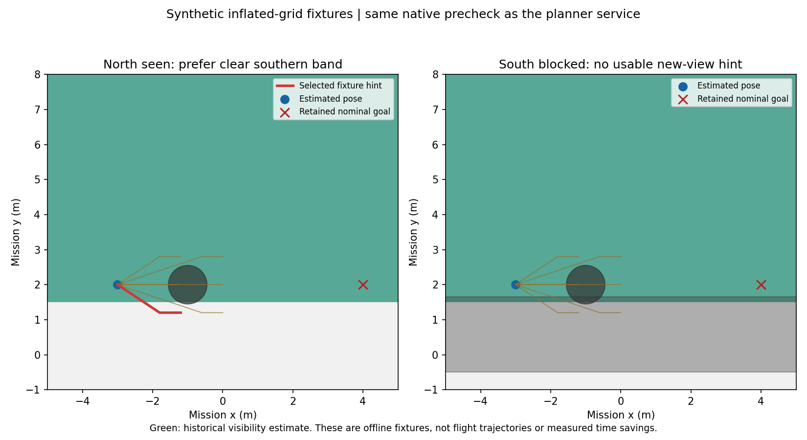
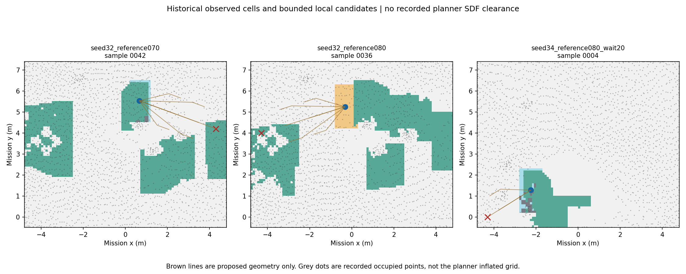

# 局部航段建议与原规划地图预检

后续已完成入口执行接线及[四轮真实SITL对照](../local_entry_sitl_20260912/REPORT.md)：执行机制可用，但两组搜索均更慢，当前原型继续默认关闭。以下保留本阶段只读建议的历史状态。

2026-09-12，研究分支`feat/coverage-efficiency-research`，开发基线`9d5ae12`。本轮把已有观测记忆接到局部航段生成和Fast-Planner原地图的只读预检，形成可启用的研究建议链。**目前输出的是候选建议，尚未改变飞机的目标、覆盖游标或恢复位置；没有新增飞行结果，也没有证明搜索节时。**

两个离线构造场景完成了实际功能串接：北侧已观测、南侧预检通过时选择南侧；南侧受阻时撤销推荐。这里调用的是与新服务相同的C++体素检查函数，输入为人为构造的膨胀栅格，不是飞行仿真。原三轮记录另有95个时刻能生成候选，但缺同刻规划器栅格，未将它们标成可达。

## 本轮改变了什么

R尚未接入任务决策入口。原Mission Manager→Planner Bridge→Fast-Planner链保持原有目标发布权，APPROACH、投递、返程、降落均不参加建议。

- 候选沿当前名义目标方向前进1.2/2.4m，并比较左、直、右三个偏移；局部观察段长0.6m，附近名义目标也保留为选项。实际每次最多7个候选，配置上限12、模块硬上限16；最多两条折线段/候选。保持原目标高度，拒绝明显高度过渡、接近完成及搜索边界以外的情形。
- 排序复用现有历史账本，用潜在新增观测面积除以移动/观察时间估计。20%收益切换门槛抑制同一任务中的小幅排名翻转；旧选项受阻时不会因迟滞继续保留。
- 当前观察区域采用可配置矩形代理，半宽0.45/0.40m，**未经过真实相机姿态/遮挡/检出标定**。候选收益不是保证可见面积，不授予搜索完成或跳点许可。
- 新服务`plan_manage/CheckLocalSegments`直接查询当前SDFMap膨胀占据缓冲，不复制地图，不另跑A*、轨迹优化或碰撞膨胀。记录对应点云更新时刻、更新窗、地图版本和规划器进程身份；空/失配点云、地图重置等使预检不可用。
- 原点云链未建立“已知自由”证据。返回`CLEAR_IN_INFLATED_MAP`仅表示折线在所查栅格内未碰到已知占据，`known_free_proven=false`、`requires_trajectory_validation=true`始终保留；它不等价于动力学可达、可执行样条或真实净空。
- 格子遍历覆盖穿越和擦到的体素，包括角点、起终点边界及沿栅格面运动的邻侧格子。最近更新窗按膨胀范围收缩；局部窗外、过长、陈旧或预算不足均不返回可用通路。
- 建议节点按同一快照时间、frame及几何匹配观测状态/栅格，验证当前任务、指令号、deadline、位姿年龄和查询后漂移。规划器重启或版本回退时要求新的观测记忆generation，旧回复不跨任务采用；这仍未解决所有上游定位/FreeDOM场景重置的联合epoch问题。

相关文件集中在`uav_coverage_memory/local_proposals.py`、`uav_mission/scripts/local_search_adviser.py`和`plan_env/local_segment_probe.h`，接口约定已同步到[INTERFACES](../../INTERFACES.md)。旧patrol_control源码、原任务状态机及默认航带间距未修改。

## 资源与失效处理

| 项目 | 默认范围 |
|---|---|
| 建议请求 | 墙钟最高1Hz；配置最多2Hz |
| RPC并发 | 最多1个；慢/挂起请求不创建替代线程或堆积队列 |
| 服务批量 | 最多32条线段 |
| 单段长度 | 最长4m，配置硬上限7m |
| 体素检查 | 每批最多4096次；3ms检查预算，最大可配5ms |
| 地图/建议时效 | 地图默认1s；结果默认0.5s；查询后位姿漂移不超过0.25m |
| 输入保留 | 各4份栅格/状态；栅格最多2万格，状态JSON最多64KiB |
| 记录 | 独立入口默认关闭；显式研究试验最多1500行JSONL，不覆盖旧文件 |

检查预算是协作式截止，不是整个服务回调的硬实时上限，ROS序列化及排队也要测量。服务在原规划器单线程回调队列中执行，在线是否影响出轨迹延迟尚未验证。建议客户端只保留一个daemon工作线程，挂起RPC不会产生无限线程，也不会阻止正常进程退出。记录写盘失败只停记录，诊断输出保留。

原任务在旁路异常、无建议、候选受阻时继续原行为。本轮没有实现“建议失败就跳过名义航点”，也没有把旧规划等待、seed31降落或seed33门后问题标成已修复。

## 两个原生检查夹具

绿色区域在夹具中设为已有可见估计；圆形及灰色带是人为给定的膨胀占据。左图选择南侧局部观察段；右图南侧受阻，直行也被挡，北侧没有足够新增观测收益，因此没有可用建议。红线是算法建议折线，不是飞行轨迹。

[候选、体素检查结果与选择结果](fixtures.json)可复核候选拒绝过程。选择器、原生预检与选择反馈在同一离线流程中运行，没有伪造服务通过回复；该夹具只证明逻辑串接，不代表真实树箱通行或节时。

## 历史数据复盘

复用三轮共252份同步观测状态，以及同轮已记录的MAVROS估计位姿和原任务指令。候选仅使用当时记录的输入和已知搜索边界；不使用实际靶位、树位真值帮助选路。

| 原运行 | SEARCH/RESUME样本 | 能生成局部候选 | 生成P95（本机离线） |
|---|---:|---:|---:|
| seed32 / 0.70m | 48 | 36 | 0.92ms |
| seed32 / 0.80m | 39 | 29 | 1.17ms |
| seed34 / 0.80m / 等待20s | 45 | 30 | 1.19ms |

132个搜索/恢复样本中，32组因位姿或名义目标超出严格配置的搜索矩形被拒绝、5组已接近名义目标，均保留原任务处理而不生成候选。这个限制也会拒绝边缘的轻微跟踪越界；本轮没有自动放宽边界。其它120份属于尚无指令或非搜索阶段。

耗时只计候选生成/观测收益查询，不含读盘、历史重建、ROS通信、原生服务或飞行。它说明本机计算量较小，不是OrangePi并发验收。

图中绿色是该时刻活动可见估计，历史账本另行参与排序；棕色为候选折线，灰点仅是记录的占据点。旧数据没有保存同刻的SDF膨胀栅格/更新窗，不能用这些灰点或理想几何假冒新服务结果。**95组候选全部标为`NOT_RECORDED`，没有被选为飞行目标。** 不能据此认定它们实际可达、减少了重飞或缩短了任务时间。

完整数据见[history.json](history.json)、[候选索引](candidate_index.json)，复现脚本为[replay.py](replay.py)。脚本不启动ROS或飞行仿真；两个夹具调用构建后的`local_segment_probe_cli`，该程序只参与测试、不安装到部署入口。

## 验证与使用边界

两套工作区实际构建通过。相关测试共**367项独立testcase**通过：观测包89、任务包253、plan_manage 12、plan_env 13，包含新增候选、过期/改令拒绝、消息配对、浮点分辨率、挂起请求、记录上限、规划器重启，以及体素边角/窗外/预算耗尽测试。[测试结果](test_results.json)。

研究入口静态展开：默认36个节点、没有局部建议节点且预检关闭；显式启用后37个节点，仅增加建议节点，预检在原规划器内部注册。[静态结果](static_launch.json)。这些检查没有启动节点。

在后续明确要求运行的研究试验中，现有`research_trial.launch`可设置`local_adviser_enabled:=true`；其余world、runtime、等待参数保持配对一致，并继续通过`sim_run.sh`。建议写入该run的`local_search_proposals.jsonl`。更换搜索范围需匹配`local_adviser_config`，更换规划器命名空间需同时匹配服务配置。普通比赛入口没有加载该节点或开启服务。

下一步先在线核验服务可用率、各类拒绝原因、查询耗时和原规划链等待，再将通过验证的建议经原任务/桥接链用于少量中间航段。自动补扫、跳点和投后就近恢复调度尚未实现；航带保持原值，便于单独归因记忆决策收益。

本轮新SITL次数为0、实机操作为0；正赛工作树仍为干净的`86e382d`，交付CURRENT仍为`c369e6f8`。仅同步研究分支，不打包或部署。
