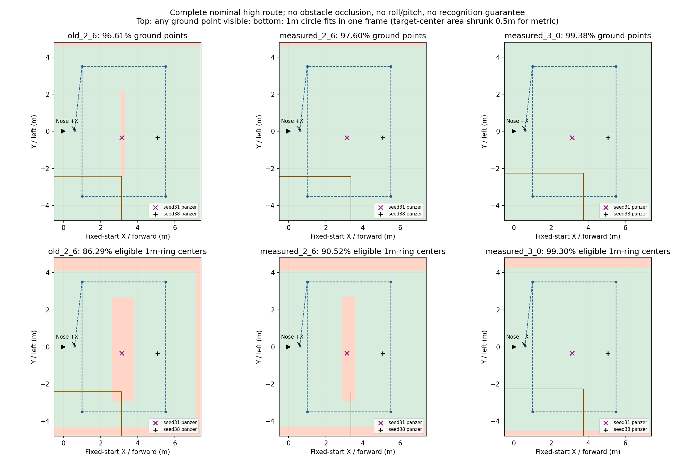
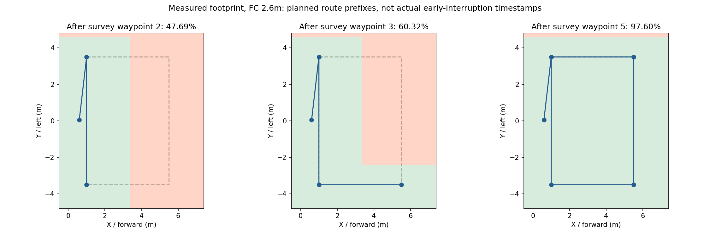

# 实测FOV下的当前高位覆盖复算（2026-09-27）

**实测长边变宽可补上2.6m航线中央的靶心盲缝，但不保证整圈靶完整入镜。** 当前完整高位环线的理想地面点覆盖由同口径96.61%变为97.60%；seed31装甲车靶心从名义盲缝进入视场，但在2.6m仍不能完整容纳直径1m圆环。seed38的装甲车本来就在完整路线视场内，不能把提前截断、误类别或低空复核问题全部归因于FOV。

本次只做离线几何分析与绘图，没有更改相机内参、任务航线、阈值或启动新的整场研究仿真。八组4×4专项保留原相机参数运行；这里计算的是整场研究航线，不是4×4专项。

## 输入与边界

- 用户实测：**飞控中心离地2m**时，地面长边3.6m、短边1.8m；继承相机低于FC 0.16m，因此镜头高度为1.84m。假设该尺寸对应水平相机、完整未裁切原图、平坦地面。
- 当前已验证研究参数来自 `docs/verification/panzer_location_repair_20260927/preflight_seed38.json`：低位进场(0.60,0.05)，在该点升至2.6m；然后(1,3.5)→(1,−3.5)→(5.5,−3.5)→(5.5,3.5)→(1,3.5)。起飞点到进场点不算作高位航段。
- 固定起飞系+X朝场内、+Y向机体初始左侧，机头保持+X。画面长边沿机体X，不是随着每段运动方向旋转。若机头随航向改变，则需重新按动态姿态投影。
- 分母是当前墙内搜索/目标边界 **X=[−0.5,7.4]、Y=[−4.8,4.8]，75.84㎡**，不是整个10×10场地，不包含走廊。也不能把7.9×9.6m分母直接叫作名义8.5×10m覆盖率。
- 原1280×720内参来自9月26日bag反推报告：fx=725.351、fy=723.340、主点(631.672,397.566)。新测量只给总宽高，未给光轴距四条边的距离；主结果暂沿用旧主点的相对位置，另算完全居中的敏感性结果。没有用这两个长度伪造一套新标定内参。
- 1cm网格单元中心判定，针孔平面视场沿每段直线扫掠取并集；无树遮挡、无倾斜、无绕障偏移，也不扣除障碍占地。绿色为理想可见、浅红为未覆盖。与旧文档约96.7%的微小差异来自精确fy与网格边界计算口径。

## 全环线结果

| 场景 | 单帧地面长×短 | 地面点覆盖 | 未覆盖面积 | 1m圆环完整入镜的可放置靶心覆盖 |
| --- | --- | ---: | ---: | ---: |
| 原内参，FC 2.6m | 4.306×2.429m | 96.61% | 2.57㎡ | 86.29% |
| 实测比例，FC 2.6m | 4.774×2.387m | 97.60% | 1.82㎡ | 90.52% |
| 实测比例，FC 3.0m | 5.557×2.778m | 99.38% | 0.47㎡ | 99.30% |

末列与地面点覆盖的分母不同：仅评价圆环不出搜索场地的可放置靶心范围，即边界四周内缩0.5m，共6.9×8.6m；要求至少有一帧完整包含直径1m圆形。它是精修视角的诊断指标，**不是YOLO召回率，也不是当前算法强制整张1m方板都可见**。旋转方板四角完整入镜要求可能更严格；圆环直径若不足1m则该诊断偏保守。

实测2.6m单帧约4.774×2.387m，两条沿Y的主航带相隔4.5m，长边方向已有约0.274m重叠，原约0.194m的中央靶心缺口因此闭合。剩余理想地面漏扫主要在+Y边界约23cm宽的条带。这一侧偏置依赖沿用的主点；若把视场假设为完全居中，2.6m为97.71%，缺口分布到±Y两边各约11cm。

3m时单帧约5.557×2.778m，沿用主点仍在+Y边缘留下约6cm条带；居中假设可到100%。因此当前测量支持“3m几何覆盖接近全覆盖”，不支持直接宣称实飞100%识别或无盲区。还需要考虑像素密度降低、姿态、树冠遮挡与规则边界。本轮没有据此升高实飞配置。

## 与seed31/38的关系

- seed31 panzer=(3.1268,−0.3424)：原2.6m名义直线环线靶心不可见；实测比例2.6m可见，但1m圆环仍不能完整入镜；到3m理想情况下可完整入镜。过去实际绕障/横滚可使它偶然进入视场，所以名义盲缝不是“历史一定从未识别”的证明。
- seed38 panzer=(5.0584,−0.3493)：原与新视场下，完整路线都能看到靶心且可容纳1m圆环。是否实际飞到对应航段、是否被树遮挡、是否产生可靠类别与支持证据，仍由日志判断；扩大FOV不能替代此前对误panzer提前中断的修复。
- seed38 bridge=(3.7772,−1.0829)：在新2.6m视场中，1m圆环完整入镜条件也改善。所有目标的几何判定保存在results.json，不输入在线策略。

## 提前中断不等于已覆盖全部

当前策略允许三类高权重线索满足支持条件后提前下到低空；其目标是尽早投递，不能把全路线覆盖率套给每次实际提前中断。

按当前路线前缀、新实测尺寸2.6m，抵达第2/3/5个高位航点时的理想累计点覆盖分别为 **47.69% / 60.32% / 97.60%**。这些是计划航点前缀，不是重跑了视觉或某次实际中断时间。实际绕障与航点跳过后的覆盖必须用当轮航迹和相机姿态另算。

## 后续取舍

目前先保留已有高位路线与中断支持要求。几何分析说明最值得关注的是：边缘窄带、中央目标只有局部可见时的类别质量，以及未走完右侧航段就提前下降。若后续修改策略，宜比较少量局部复核/补充观测的时间收益，不能只凭97.6%面积就跳过身份核验；也不必为了最后几个百分点默认遍历整套低空牛耕。

复现：激活rl_drone后运行本目录 `python coverage.py`。输入引用仓内参数和既有CameraInfo摘要，不依赖在线ROS或Gazebo。结果：[results.json](results.json)；测量前提与历史方法：[9月26日bag反推](../../deployment/flight_fov_20260926/REPORT.md)。
