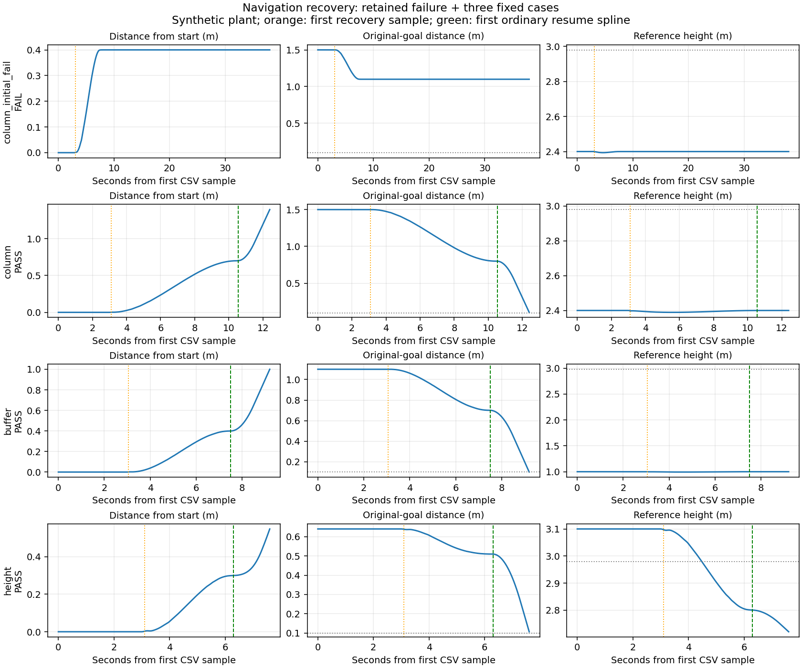

# 导航恢复候选（2026-10-08，独立高位工作树）

当前状态：生产接入、构建及定向离线检查完成；主代理运行的修复后 column、buffer、height 全部 PASS，均重新到达原目标、恢复后普通轨迹 1 条、释放计数 0，wrapper 清理 PASS。运行代码保持冻结，本次只完成报告与版本归档；按用户授权提交并推送同名高位分支，不同步 main/F 稳定整机，不部署板端。

最新用户范围：超高回入、额外普通膨胀退出、额外虚拟柱退出，随后继续原规划目标。
使用现有定位的新鲜数据，不把 FC reset/EV 生产者作为依赖；EV 预测观察冻结。
旧 attestation 接口仅保留离线对照，生产 `require_reference_attestation=false`。

已写入：恢复曲线/事务核心、实体必要净空/普通缓冲/虚拟柱来源层、Bridge 原动作期限上下文、
FSM 恢复执行、轨迹服务器排他转发、旧控制的有界超高命令放行。
新增小型 `navigation_recovery_msgs` 包避免旧控制与规划包互相依赖。
修改旧控制前已保存 `legacy_baseline/20261008/navigation_recovery/` 包快照、文件清单、SHA256。

默认关闭：各接收端 `navigation_recovery/enabled=false`，地图 `sdf_map/recovery_layers_enabled=false`。
恢复从当前实测位置、速度出发；完整连续三次曲线通过凸包细分检查实体必要净空及跟踪误差管道。
终点必须在当前合并地图中合法，并满足现有普通规划 ESDF 净空阈值及停止位置容差裕量；交接前还要检查实测位置。原目标、动作身份、deadline 不变，不增加释放/投递动作。
恢复不能豁免实体及必要机体净空；普通 BUFFER 仅指超出明确配置机体净空的额外膨胀。
正常合并占据图及 ESDF 不改变。

有限能力：入口速度 <=0.3 m/s，半径 <=0.8 m，事务 <=8 s，软件超高 <=0.25 m；
速度过高、必要机体净空不足、地图过期、未知/越界、没有可认证近邻连接时拒绝。
候选连接为单段三次曲线，不能保证绕复杂障碍的任意退出路径；不是所有超高都可自动恢复。
`map_revision` 在实际点云重建时递增，stamp 来自点云时间戳，frame 沿用配置的地图坐标系并检查 odom frame 一致性；输入点云应已在该坐标系。查询限于本轮重建内部，并扣除来源膨胀边缘。
这是沿用当前静态点云地图的局部覆盖假设，未新增射线可见性或独立覆盖生产者。
`coverage_verified` 来自实际有效重建版本，`observedFree` 使用本轮可查询范围；不是外部永久 false 门槛，也不是射线遮挡意义上的逐体素观测证明。

验证基线：10 月 6 日原复现已重跑，17 项 C++ 检查与 5 个健康/reset 案例通过。
最终修复版核心 31/31、实际生产地图方法 31 项、接收门控 9/9、旧控制 2/2、Bridge 契约 18/18、Bridge 原生产方法 4/4 PASS。三 case launch 离线展开均为 4 节点、175 参数。包依赖环已通过独立消息包解决。

## 生产接入位置

路径均相对 `patrol_uav_ws-patrol_planner/src/`：

| 位置 | 作用 |
| --- | --- |
| `Fast-Planner/fast_planner/plan_env/{include/plan_env/sdf_map.h,src/sdf_map.cpp}` | 额外来源层，区分 PHYSICAL、BUFFER、COLUMN 与不可豁免边界，正常占据/ESDF 保持原样。 |
| `Fast-Planner/fast_planner/plan_manage/include/plan_manage/navigation_recovery.h` | 有限恢复事务、连续曲线认证、普通规划交接条件、预算与原目标保持。 |
| `Fast-Planner/fast_planner/plan_manage/src/navigation_recovery.cpp`、`kino_replan_fsm.cpp` | 实际地图/里程计/所有权适配，FSM 触发、执行及恢复原规划。 |
| `Fast-Planner/fast_planner/plan_manage/src/traj_server.cpp` | 恢复许可校验及排他转发，抑制旧轨迹并处理撤销/失效。 |
| `navigation_recovery_msgs/` | 原目标上下文、短期恢复命令、两接收端共用许可门控。 |
| `patrol_control/{include/patrol_control/patrol_control.h,src/patrol_control.cpp}` | 旧控制最小接入，仅合法恢复许可可通过普通命令高度检查。 |
| `uav_mission/scripts/navigation_planner_bridge.py` | 可选发布原动作标识及原 deadline，接管类指令撤销，不刷新预算。 |

普通 BUFFER 仅指超过必要机体净空的额外部分。候选配置 XY 必要半径 0.39 m（0.55 m 正方形任意 yaw 的外接半径），上下各 0.20 m。fixture 固定 yaw=0，XY 单独使用 0.275 m，按 0.05 m 体素向上取整；buffer case 普通膨胀为 0.45 m。若实际普通膨胀小于必要机体净空，不存在可豁免的普通缓冲区。

定位年龄 <=0.25 s、地图年龄 <=0.5 s，跟踪误差管道 0.08 m，硬参考高度 0.05～3.50 m；默认每个原目标最多一次恢复尝试。最多筛选最近 128 个合格候选。合法起点的一般卡住仍走既有重规划逻辑。正值地图 virtual ceiling 仍不可豁免；本次 fixture 和已有 route-speed replay 使用 `virtual_ceil_height=-0.1`，高度由现有 reference-height 参数约束。

## 首轮失败及修复

保留失败目录：`logs/navigation_recovery_column_20261008_012437/`。
Gate 为 `FAIL / original_action_deadline`，最终 `(0.6,0,2.39985)`，`resumed_splines=0`；wrapper 清理 PASS。该轮不计通过。

首个失败点是恢复终点与普通规划接续标准不一致：原终点退出了占据区，但普通规划 `manager/clearance_threshold=0.20` 仍要求额外 ESDF 净空。实际生产地图方法复现 `x=0.6` 的 distance=0.10，普通规划从该点生成的两条曲线都在起点被拒绝。

修复后候选点在截取最近 128 点前即检查原普通占据和 ESDF 阈值；认证终点增加停止位置容差及体素离散裕量；交接前再次对实测位置执行原阈值检查。不降低现有 clearance，不改地图，不续期原 deadline。定向地图检查改选 `x=0.3`、distance=0.40，并覆盖停止容差、实际交接和预算不足拒绝。正常曲线仍需经过原完整验收，单独通过终点检查不宣称所有后续路径都可达。

修复构建日志：`/tmp/navigation_recovery_20261008/endpoint_fix_build.txt`，`fast_planner_node`、`traj_server`、`patrol_control`、`navigation_recovery_mock` 四目标 100% 成功；`git diff --check` 通过。

## 动态结果与范围

| case | run 目录 | 当前结论 |
| --- | --- | --- |
| column 首轮 | `logs/navigation_recovery_column_20261008_012437/` | FAIL，原 deadline 到期，未恢复普通轨迹；保留。 |
| column 修复后 | `logs/navigation_recovery_column_20261008_013239/` | PASS / recovered_and_reached_original_goal；resumed_splines=1，release_commands=0，wrapper 清理 PASS。 |
| buffer | `logs/navigation_recovery_buffer_20261008_013332/` | PASS / recovered_and_reached_original_goal；resumed_splines=1，release_commands=0，wrapper 清理 PASS。 |
| height | `logs/navigation_recovery_height_20261008_013439/` | PASS / recovered_and_reached_original_goal；resumed_splines=1，release_commands=0，wrapper 清理 PASS。 |

修复后 column Gate：原目标 `(-0.5,0,2.4)`，最终 `(-0.40409,0,2.39999)`，进入 0.10 m 判据；FSM 命令 652、server 命令 743、controller 命令计数 187。计数来源为各回调，各层异步采样，不能当成一一对应的命令数。

精简指标见 [metrics.json](results/metrics.json)，下表时间从 CSV 首个样本起算，含约 3 s 启动等待；普通轨迹接续为采样首次观察时刻，不代表精确恢复完成时间。末端误差取 Gate 最终位置，整段速度峰值含恢复后的普通规划阶段，不能与恢复 0.3 m/s 限速直接比较。

| case | CSV 时长 / s | 首次普通轨迹 / s | 最终原目标距离 / m | 采样高度范围 / m |
| --- | ---: | ---: | ---: | --- |
| column 首轮 FAIL | 37.993 | 无 | 1.10000 | 2.39359～2.40000 |
| column 修复后 | 12.400 | 10.550 | 0.09591 | 2.38917～2.40000 |
| buffer | 9.200 | 7.500 | 0.09975 | 0.99363～1.00000 |
| height | 7.600 | 6.300 | 0.09675 | 2.72021～3.10000 |



图中橙线为首次观察恢复命令，绿线为首次观察恢复后普通轨迹；灰线为 0.10 m 到达判据或 2.98 m 软件高度上限。通过已有 conda `rl_drone` 环境执行 `python docs/verification/navigation_recovery_20261008/summarize_results.py` 可从上述四轮原 CSV/Gate 重建唯一总览图及指标，不启动 ROS/仿真。

动态范围为实际生产 map→FSM→traj_server→patrol_control，加合成传感输入和有界运动模型；无 PX4/Gazebo 动力学、无硬件驱动。fixture 中原任务上下文由测试端发布，**没有 runtime Bridge**。Bridge 原生产方法测试使用真实 ROS 消息/时间类型，publisher/executor 为替身，覆盖原目标纳秒身份、原 deadline、重复发布不续期、默认关闭、HOLD/ABORT/ALIGN/LAND 撤销；不能将 fixture PASS 写成 runtime Bridge 集成通过。

地图测试复用 10 月 6 日方法抽取器，抽取当前生产地图源码，transport 使用隔离 stub；不是 ROS 回调实跑。核心 attestation/reset 测试仅为隔离旧实验接口，生产路径无需这些标志。

## 复现入口

只由主代理按当轮授权启动；每轮收尾后再启动下一轮。在 PowerShell 中运行：

```powershell
wsl -e bash -c 'cd /home/xhj/liftrace-worktrees/r2026-high-view-search && SIM_STORAGE_GUARD_PATH=/mnt/f SIM_RUN_AUTHORIZED=1 bash docs/verification/navigation_recovery_20261008/run_production_case.sh column'
wsl -e bash -c 'cd /home/xhj/liftrace-worktrees/r2026-high-view-search && SIM_STORAGE_GUARD_PATH=/mnt/f SIM_RUN_AUTHORIZED=1 bash docs/verification/navigation_recovery_20261008/run_production_case.sh buffer'
wsl -e bash -c 'cd /home/xhj/liftrace-worktrees/r2026-high-view-search && SIM_STORAGE_GUARD_PATH=/mnt/f SIM_RUN_AUTHORIZED=1 bash docs/verification/navigation_recovery_20261008/run_production_case.sh height'
```

存储 guard 指向 `/mnt/f`，主代理已确认 WSL VHDX 位于 F 盘。脚本固定 overlay：

```text
UAV_WS=/home/xhj/liftrace-worktrees/r2026-high-view-search/patrol_uav_ws-patrol_planner
VISION_WS=/home/xhj/liftrace-worktrees/r2026-high-view-search/vision_ws
SIM_NO_RECORD=1
SIM_REQUIRE_GATE=1
```

统一 `sim_run.sh` 产出 `run.log`、manifest、`production_recovery.csv`、`gate_status.json` 等。fixture 动作原期限 35 s，启动/执行墙钟上限 60 s；PASS 必须出现恢复执行、普通规划接续，并实际进入原目标 0.10 m 范围。无 ABORT 不等于通过。

离线入口：本目录 `run_tests.sh`、`run_map_tests.sh`、`run_gate_tests.sh`；不启动 ROS master。小结果在 `results/`；完整临时结果在 `/tmp/navigation_recovery_20261008/`。`sitl_recovery_candidate.launch` 是备用全链路候选开关入口，本轮未运行且不保证三类起点注入；`navigation_recovery_mock.launch` 是历史核心辅助入口，不作为生产动态验收。

推广边界：本次仅支持合成运动模型中的三类定向恢复，runtime Bridge、PX4/Gazebo 全链动态及真实点云覆盖仍未由本轮验收。EV 预测/观察冻结，生产不依赖 FC reset 权威或独立 EV producer。后续推广前必须在稳定 F 基线上选择性适配并复核；H 还包含未推广投影实验，不得整树迁移或将本轮结果归为稳定整机验收。默认关闭，不进入 main/F；子代理未启动任何仿真。
