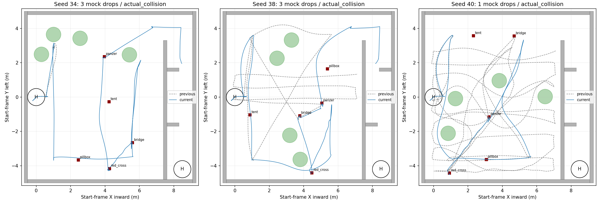
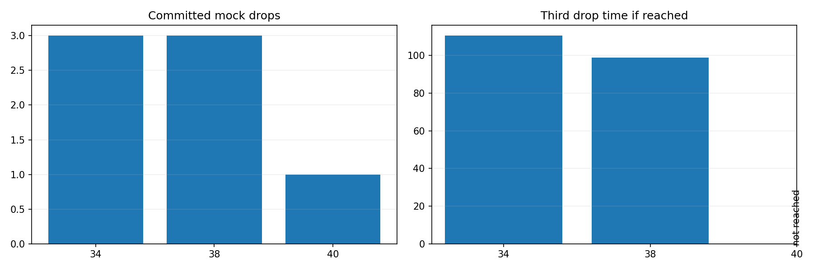

# 高位近墙降级三seed回归与归档（2026-09-23）

本轮按同一源码 `d97561c`、同一历史场地各跑一次seed34、38、40。**整场Gate为0/3 PASS**；模拟投递分别为3、3、1次。三轮都因仿真55cm工程碰撞盒的接触而终止，均未走完两门和H降落。之后修订的偏航包络和投后走廊膨胀切换仅编译/静态验证，遵照用户指示不再仿真；不能把它们记为动态通过。

归档代码在这三轮之后新增两项未动态验收的修订：`0d5d5cf`统一近墙对准的10°偏航预算；本次提交令搜索和投递阶段沿用0.10m水平点云膨胀，仅在首个投后走廊目标发布前请求0.30m，并使旧地图回执失效，等待下一次占据图和ESDF更新。等待超时会中止任务目标发布。板端入口未开启此切换；报告中的三段视频均为修订前运行，不能用于证明新修订有效。

导航权威源码对应`liftrace-controlwork`的`feat/high-view-liveness-20260919@76c1908`；集成研究分支只对该revision做明确同步，并由`fov_inner_repair.launch`选择启用。两边同名的地图、任务管理器及测试文件已逐字节对齐。

| seed | 上一批投递 | 本批投递 | 本批第三投任务时刻 | 首次接触（ROS时刻） | 首次接触对象 | 结论 |
| --- | ---: | ---: | ---: | ---: | --- | --- |
| 34 | 0 | 3 | 110.54s | 156.225s | `Wall_20_south` | 旧下降失败未复现；三投后走廊包络接触 |
| 38 | 2 | 3 | 98.95s | 147.255s | `Wall_20_south` | 近墙红十字按合法机体中心尝试并成功模拟投递；投后走廊接触 |
| 40 | 2 | 1 | 未达到 | 104.729s | `Wall_11` | 近墙对准前发生南墙包络接触，降级未有机会触发 |

三轮均复用历史world、树门和靶位；实际五类靶坐标与上一批对应seed误差小于0.1mm。`manifest.yaml`确认uav_mission和uav_vision均来自本研究工作树，包装器收尾均通过、最终无残留仿真进程。宿主墙钟不等于ROS任务时长，失败轮不能计算完赛时间收益。

## 走廊接触的直接原因

34/38都在第三投之后的同一南侧隔墙 `Wall_20_south` 接触。首个接触采样穿透只有约0.008/0.007mm，但触墙前设定的飞控中心到墙面的水平距离约0.178/0.167m，已经小于55cm盒体半宽0.275m；真值中心到墙面约0.275/0.272m。此处不是单凭微小接触深度推定路径危险，**设定点本身就没给整个盒体留够净空**。

与之前可通过走廊的版本对比，走廊航点与路线时序没有对应改动，但`navigation_horizontal_search_vcl06.launch`把`planner_obstacles_inflation`从0.30m改为0.10m，参数影响全阶段点云地图。Fast-Planner按点规划，地图膨胀代替机体半宽；10cm比27.5cm包络半宽还小，不能保障整盒不碰墙。两轮的接触因此与这个全局参数退化高度一致；单靠时间先后不能排除点云采样、局部重规划和跟踪误差等次要影响。此前7轮穿行走廊的经历也不能证明本版同样安全。已将研究入口改为：搜索/低空投递保留0.10m，首个投后航点发布前切至0.30m，并等待占据图及ESDF重建回执；**此项尚未仿真验收**。板端部署参数未更改。

## 能否从树上方飞越

目前**不能保证禁止整机越树**。地图实现试图从局部FreeDOM点云构造延伸到飞行上限的障碍柱，但只有达到点数和竖直跨度条件的局部观测才形成该柱。独立的离线几何复核按树及垫箱碰撞网格的保守水平凸包、55×55cm已膨胀工程盒和树顶以上完整轨迹计算：

| seed | 飞控中心正压树水平投影采样 | 整盒在树顶以上重叠采样 | 最大保守投影重叠 |
| --- | ---: | ---: | ---: |
| 34 | 0 | 155 | 约17.0cm |
| 38 | 0 | 33 | 约12.0cm |
| 40 | 0 | 197 | 约18.7cm |

因此不能描述为“飞控中心从树干正上方直飞”，但机体工程包络边缘确实扫过障碍物水平投影。这不是Gazebo树木实体碰撞，也不是裸机外形认证；在规则要求**整个无人机不得从障碍物上方飞过**的口径下，仍应作为未通过的独立约束处理。此前六轮报告中34/38已有38/1个保守重叠采样，问题并非新近凭空出现；本轮数量增多与水平膨胀缩小同向，但无法只凭三组轨迹把全部差异归因于单一参数。后续需要明确按机体外形而非仅飞控中心做全程树水平投影Gate，并让规划器使用同一禁飞几何；本轮未实施这项新策略。

## 近墙降级闭环的验收边界

38在红十字处记录一次`NEAR_WALL_BOUNDED_APPROACH`：目标中心Y=-4.567m，机体航点钳至Y=-4.451m，随后达到三次模拟投递。40也记录钳制，但旧控制当时使用瞬时近0°偏航计算包络，允许设定点Y≈-4.492m，真值中心到Y≈-4.522m后触`Wall_11`。修订已统一为导航使用的10°偏航预算；按用户要求未再飞。三轮都**未触发**`DELIVERY_POINT_UNREACHABLE`、`NEAR_WALL_TARGET_UNREACHABLE`或`LOWER_WEIGHT_HINT_SELECTED`，所以“投递不可达后改投次高靶”的代码闭环仅通过单元测试，未获得整场动态证据。不能把34/38的三投算作降级策略通过。

## 材料与复现

每轮保留双视角同步视频、真实/定位/控制航迹、速度、高度/姿态、阶段时间轴、独立树与机体投影结果、Gate和事件日志。视频的显示高度线为报告输入，不代替规则判定。

| seed | 视频 | 分段速度/航迹 | 高度/姿态 | 阶段时间轴 | 投影复核 |
| --- | --- | --- | --- | --- | --- |
| 34 | [双视角](../../../logs/nearwalldegrade_seed34_20260923_223711/presentation.mp4) | [图](34_rerun/flight_charts.png) | [图](34_rerun/height_tilt.png) | [图](34_rerun/phase_target_timeline.png) | [树](34_rerun/tree_projection.json) / [整盒](34_rerun/body_projection.json) |
| 38 | [双视角](../../../logs/nearwalldegrade_seed38_20260923_224806/presentation.mp4) | [图](38_rerun/flight_charts.png) | [图](38_rerun/height_tilt.png) | [图](38_rerun/phase_target_timeline.png) | [树](38_rerun/tree_projection.json) / [整盒](38_rerun/body_projection.json) |
| 40 | [双视角](../../../logs/nearwalldegrade_seed40_20260923_225855/presentation.mp4) | [图](40_rerun/flight_charts.png) | [图](40_rerun/height_tilt.png) | [图](40_rerun/phase_target_timeline.png) | [树](40_rerun/tree_projection.json) / [整盒](40_rerun/body_projection.json) |

[机器可读对照](comparison.json) · [全量指标](metrics.json) · [复现/分析脚本](analyze.py)。日志和视频留本机`logs/`不入Git。模拟投递ACK不证明机构物理释放，失败后的飞行片段不能计作完赛。

代码归档仅经过`plan_env`、`plan_manage`编译与`uav_mission`单元回归；没有新的整场仿真或板端试飞。近树整机包络越顶约束仍未落实，本修订只处理投后走廊膨胀退化。
