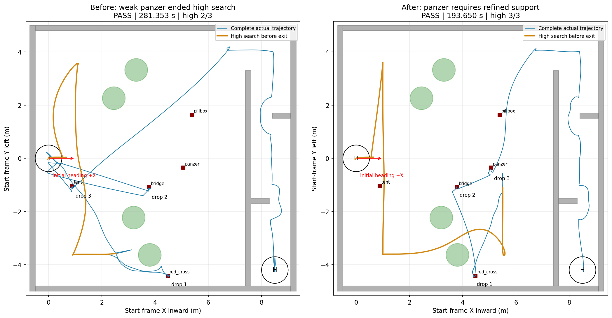
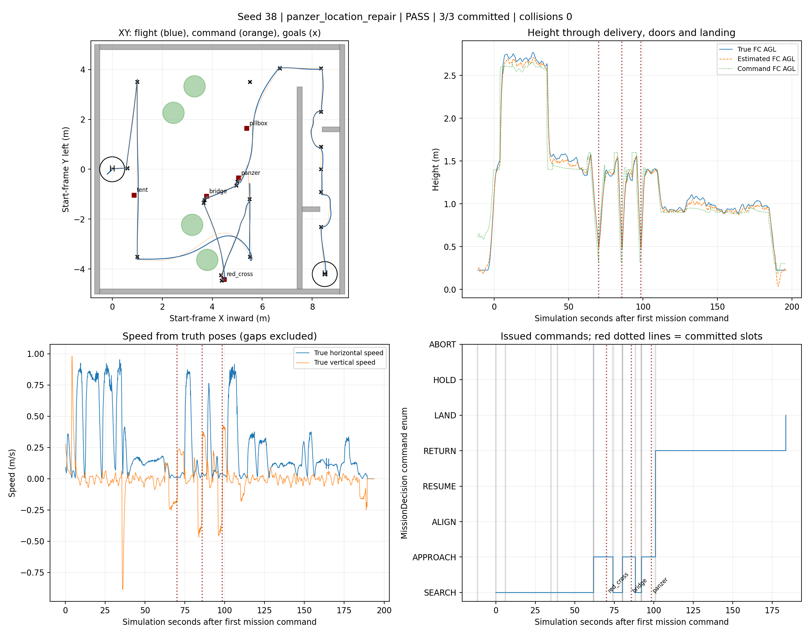
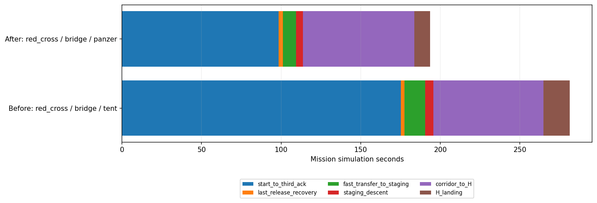

# Seed38：修正高位提前中断后，开柱完成三高权重与整场

2026-09-27。**本轮开启修正障碍柱、XY膨胀0.275m；红十字→bridge→panzer三投、两门、H降落全部PASS。任务用时193.650s，约3分14秒。**

[视频与全部图表](index.html) · [同布局对照数据](summary.json) · [实际运行参数与视频校验](artifact_validation.json) · [任务Gate](38_panzer_location_repair/gate_status.json)

## 1. 回答本次问题

seed38并非高位必然找不到真正panzer。上一轮在H附近的错误粗线索获两帧支持后，就将它计入三高权重，提前截断后续高位航段。本次错误粗线索仍出现，但不能触发提前退出；继续飞行后，真panzer附近形成精修视觉Hint，随后才结束高位。

**本次不是等低空复核失败后再遍历补救：已在高位结束之前取得真panzer线索。** 本轮没有错误H点返访、没有LOCAL_WALL_VERIFY、没有低权重降级，也没有LOW_COVERAGE牛耕补搜。需分清：上一轮也未启动全套牛耕，主要浪费在错误位置长途返访、重复复核及降级投tent；节时不能全部称为“省掉补搜”。

| 指标 | 修复前同布局开柱轮 | 本轮 |
|---|---:|---:|
| 整场任务Gate | PASS | PASS |
| 高权重完成 | 2/3，第三投tent | **3/3，第三投panzer** |
| 高位TOP3退出时刻 | 26.577s | 34.984s |
| 第三投ACK | 175.171s | 98.509s |
| 完赛时间 | 281.353s | 193.650s |
| 水平累计航程 | 56.56m | 46.15m |
| 首轨迹终端超时 | 1次bridge首访 | 0次 |
| 碰撞包络接触 | 0 | 0 |
| 搜索包络越界/高度违规 | 0/0 | 0/0 |
| 轨迹停滞恢复请求/预算耗尽 | 0/否 | 0/否 |
| 仿真收尾 | PASS | PASS，零残留 |

高位多用8.407s，第三投提前76.662s，完赛缩短**87.703s（31.17%）**。本轮只跑一次，没有替换失败结果或循环重试；这是同场景各一次的整套行为对照，不能推断所有seed稳定提高31%。

X朝场内，Y朝起飞机体左侧；红箭头为初始机头+X。橙线是高位退出前实际运动（包含入场/升高），蓝线为全程。绿色树圆仅示意位置，不是精确膨胀柱轮廓。

## 2. 实际开柱配置、版本与运行

运行参数`rosparams.yaml`确认：`horizontal_avoidance.enabled=true`、`column_middle_enabled=true`、中部带40%～60%、小组件最大凸包跨度1.6m、填实到实测支撑最大距离0.35m。仍保留真实三维障碍。

水平膨胀配置0.275m，上0.20m，下0.10m；SDF分辨率0.05m，`ceil(0.275/0.05)=6格`，有效水平膨胀约0.30m。55cm工程盒的27.5cm半宽不会自动再额外叠加一次。2.6m高位、1.4m低位、现有FOV、模型、分段速度、走廊与投递许可均保持对照口径。

- 实跑视觉/集成：`feat/high-view-search-research` / `dd01d8b09dcbd429f486ed8c1d6c90b8ee694a96`。
- 导航源：`feat/high-view-liveness-20260919` / `738066995cb0212c7503653227b33aca33e065a8`；任务文件逐个同步集成，NavigationMemory和SurveyPolicy来自同轮视觉配套。
- 地图：复用`history_31_40_20260920/seed_38`的冻结world、靶、树、门，不重新抽样。
- 本轮：`logs/panzer_location_repair_seed38_20260927_154743`。
- 对照：`logs/balanced_columns_seed38_20260927_142607`，飞行代码视觉`74ec4bd`、导航`d71b8fe`。
- 离线验证：193项任务/规划/释放回归＋89项高位组件测试，共282项通过；两工作区增量编译通过；XML参数预检通过。
- 代码已经推送视觉origin研究分支、导航fork及导航origin的对应研究分支。本轮不部署到实机。

## 3. 修复的具体边界

### 高位粗线索与提前退出分开

单帧置信度≥0.60、有效投影仍可记入粗导航线索。`interrupt_refined_classes: [panzer]`默认要求panzer升级为现有精修视觉Hint，才计入提前TOP3；其它类别仍可使用两个独立图像的粗支持。精修Hint由既有catalog证据窗口形成，不是一帧类别框，也不等于低空投递许可。

没有合格panzer时继续剩余高位航线；完整路线结束仍可带部分/粗线索回访，不无限等待。此策略没有把所有高位检测门槛改成严格投递门槛，也没有新开一套FSM。

### 位置复核失败不等于整类目标不可达

完成低空观察仍没有正式候选时，只退休该类别在该位置的旧线索。旧catalog重发、同位置弱框不会使其复活；退休之后的新鲜精修证据允许恢复，同类其它位置仍可用。记录受容量、任务epoch和TTL约束。

近墙局部复核耗尽本身不再禁用整类或自动投次低权重。已经取得正式候选并进入APPROACH、随后发生规划/对准不可达的原降级路径保留；释放开始后的不确定性处理、槽位事务和释放证据均未放宽。移动航段失败仍有原有有界延期机制，不把“没有到达观察点”虚构成目标不存在。

本轮上游修复已阻止错误返访，因此**位置级退休分支没有在实跑中被触发**；旧帧重发、同类其它位置、低空新证据恢复与正式APPROACH降级的正确性，本次由离线回归覆盖。不能宣称本轮实跑覆盖了所有兜底。

## 4. 真panzer形成与重访时序

- 任务约7.03s：H附近仍出现panzer粗线索，继续记忆但不允许据此提前结束。
- 任务34.984s：三高权重形成可用退出依据；真panzer选用点(4.959, -0.640)，source为`vision`。该点距真panzer约30.8cm；上一轮选错位置的距离约5.159m。
- 随即从当时所在的已检查局部下降柱回降，再按已有栅格成本/实际三维规划进行重访。本轮粗网格未给出完整巡回下降方案，沿用既有`DESCENT_COLUMN_WITHOUT_FULL_TOUR`分支，没有关闭实际三维规划检查，也不声称数学全局最短。
- 真panzer在低位重捕后仍走原有接近、精修对准、模拟释放和恢复流程，没有凭高位坐标直接释放。

| 低位正式重捕 | 任务时刻 | 融合坐标到真靶距离 |
|---|---:|---:|
| red_cross | 61.961s | 18.57cm |
| bridge | 80.236s | 17.32cm |
| panzer | 92.139s | 15.97cm |

| 模拟释放ACK | 任务时刻 | ACK时FC中心到真靶距离 |
|---|---:|---:|
| red_cross | 70.168s | 6.71cm |
| bridge | 85.817s | 1.09cm |
| panzer | 98.509s | 12.18cm |

高位点取提前退出事件的固定快照，低位点取第一次正式重捕；不使用任务结束时已被低位改写的`top_hints`冒充高位精度。原始`hint_delta`也可能相对最近更新点，只作在线关联量。FC误差不是槽位补偿后的投递误差，更不是包裹落点精度。

## 5. 节时来源

| 阶段 | 上一轮/s | 本轮/s | 节省/s（负值为增加） |
|---|---:|---:|---:|
| 开始至第三投ACK | 175.171 | 98.509 | +76.662 |
| 最后一投恢复 | 2.319 | 2.591 | -0.272 |
| 转场至入廊准备点 | 12.991 | 8.321 | +4.670 |
| 入廊前下降 | 5.231 | 4.373 | +0.858 |
| 走廊至H接近完成 | 69.145 | 69.943 | -0.798 |
| H降落事务 | 16.496 | 9.913 | +6.583 |

主要收益在三投前：错位panzer返访与复核消失，也没有复现上一轮bridge首访12s规划超时。两者都是本轮实际差异，但不能将后者单独证明为本补丁必然修复的规划问题。

走廊至H由约69.15s变为69.94s，基本持平；没有对走廊新增提速。近边重访慢档累计由96.63s降至35.09s，主要是航段缩短，不是提高该档速度。当前实测运动样本中位数：近边重访0.139m/s、入廊转场0.793m/s、走廊开放段0.294m/s、门段0.113m/s。

时间从第一条任务指令开始计算，Gate为193.650s；不包含此前准备时间。该任务段在笔记本墙钟约12.57分钟，实时系数约0.257。也不能把模拟ACK等同于实机机构每投10s预算已经完整实测兑现。

## 6. 几何与验收口径

Gate全部通过，实际包络接触0、搜索越界0、限高违规0。最大观测FC离地约2.769m；走廊内FC最大约1.106m、工程包络顶部最大约1.287m。

离线按保守“整棵树＋底座的水平凸投影”检查，FC中心位于树投影内的高位采样为0；但**55cm旋转包络在整盒高于树顶时有35个插值采样与该保守投影相交，最大分离轴重叠约18.3cm，位于南侧树0附近**。这不是实体碰撞深度，也不能写成“全树冠投影零越过”。

当前开柱采用用户已选定的中部树冠口径，允许经过下部外缘上方并保留三维避撞；上述保守全树投影检查比这一口径更宽。当前PASS只代表所列任务/碰撞/边界/高度验收，不能代替更严格的整机全树投影禁越保证。原始逐树结果见`38_panzer_location_repair/tree_projection.json`与`body_projection.json`。

## 7. 视频、图表与后续

俯视、低位跟随和1920×1080合成录像均完整解码通过。合成片长205.7s，按源ROS时钟配对，含准备段；原始相机MP4固定帧率，丢采样时会压缩时长，不能用它判断完赛时间。视频文件留在本机run目录，网页用相对路径打开；没有上传大视频到Git。

页面包含完整实际/命令/目标航迹、分阶段路线、3D路线、高度与倾角、水平/垂直速度、投递时序、停滞监督、降落估计，以及本次前后对照和释放中心误差。航迹和合成画面已抽查。

本轮证明“多飞少量高位航段取得真panzer，再直接低位三投”在seed38优于上一轮错误提前退出。模型仍会产生H附近的误分类；若误分类连精修几何也满足，仍可能成为强错误线索。本轮不据此宣布所有seed彻底可靠。后续优先复用已有图像/日志分析这种强误识别和投后起点规划，保持现有小范围修复，不追加未授权仿真。

复现分析顺序：`process_results.py` → `compare_results.py` → `verify_artifacts.py`。合成器默认拒绝覆盖同名视频，再导出需另选输出文件。所有三投均为SITL模拟投递；本次没有实机动作。
