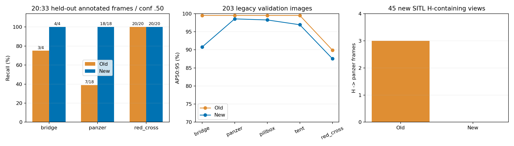
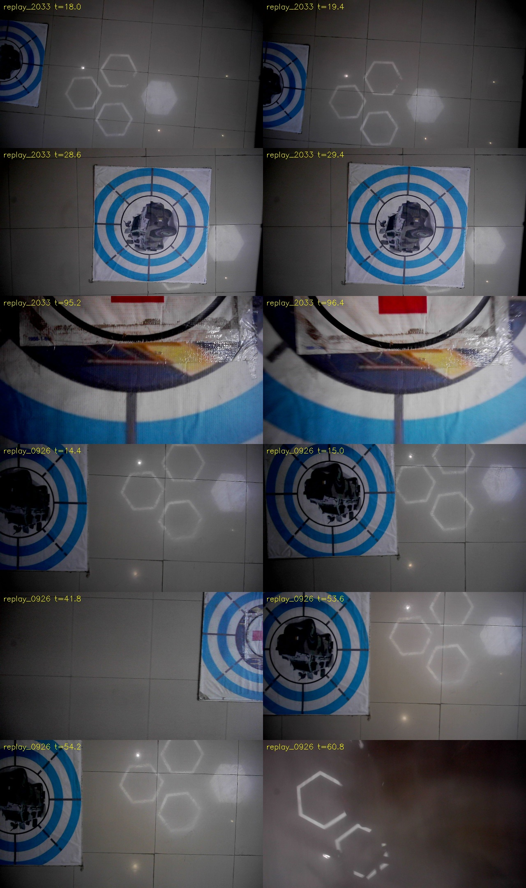
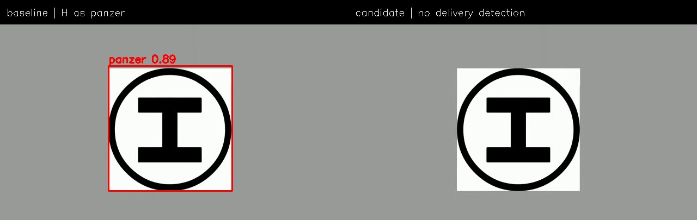

# 五分类强化模型、bag对照与六组专项报告

2026-09-28。**装甲车检测有明显改善；新模型已完成接线和RKNN导出，尚未板端NPU实测。六组SITL为4 PASS、2 INCOMPLETE，不能宣称整机已全部通过。**

## 数据、训练和严格可比部分

完整来源/命令见[训练说明](../../planning/panzer_five_class_20260928/README.md)。YOLO11n、640输入，从071x合并标准集六类基线转五类，去tank；保留五类输出权重，增加实拍难例、对比度/曝光/gamma/阴影增强和H负样本，30轮。

20:33包整轮未进训练，选出61帧并检查标注。相同0.50阈值、IoU0.50：

| 类别 | 标注实例 | 旧正确检出 | 新正确检出 | 旧/新额外误检框 |
|---|---:|---:|---:|---:|
| bridge |4|3|4|1/0|
| panzer |18|7|18|0/0|
| red_cross |20|20|20|3/0|

panzer召回38.9%→100%，提升61.1个百分点；阈值0.70时旧6/18、新18/18。203张旧验证图五类在0.50阈值均全部命中。pillbox/tent没有本次实拍独立实例，只能说明旧验证集未退化，不能声称已验证这两类在新光照下的泛化。

留出航次仍在相同场地、使用同款靶标；不少边缘截断帧未纳入精确召回统计。数据包含模板传播框及人工拼图复核，并非完整独立人工逐帧标注。测试集小，100%不是现场上限保证。

## 三份完整bag图像回放

视频在[index.html](index.html)，均按源图像时间抽取5fps，以1×编码；两模型严格使用同一帧。导航、圆环精修、候选确认、Servo不会因离线画框被“重演成功”。

| 包 | 与训练关系 | 时长 | panzer阳性帧（旧→新，0.50） |
|---|---|---:|---:|
| 9/27 20:33 |未参与训练|155.4s|66→222|
| 9/27 19:41 |训练来源，诊断用途|189.4s|2→43|
| 9/26 19:12 |未参与训练，前一天|101.6s|8→54|

这些是阳性帧数，**不是召回或confirmed数量**。旧与新红十字阳性帧也存在减少：20:33在0.60为227→208，9/26为138→124。对旧有新无的抽样画面检查，12例中9例是地砖反光/非红十字画面，另3例为真实但严重截断的红十字。不能把全部减少解释为纠错，也不能只数框就判定退化；边缘截断能力仍要继续补数据。完整视频也保留低分跨类框，未宣称混淆全部根治。

## H误识别

六组在线记录未见起飞H附近形成有效panzer地图线索。降落阶段的YOLO可能被模式门控关闭，因此额外从录像选45张含H的真实仿真画面，不受在线门控影响，对同图独立运行旧/新检测器：

- H→panzer：旧3帧、新0帧；其中旧框置信度曾达0.891。
- H→任一检测类别：旧10帧（含7帧已取消tank）、新0帧。模型取消tank导致的收益与panzer纠错分开看。
- 2张低位多投画面左边还露出真红十字，两模型均检出；人工看过拼图后把这些框排除，未把真靶算H误检。
- H检查使用人工查看过的中心H区域及框中心判别，不是通用自动真值标注器；全部为仿真印刷图案，实机光照、畸变、运动模糊尚待现场H验证。

## 六组同链SITL

使用本机板端试飞分支及其现场负载档案：静态TF、虚拟顶棚关闭、水平0.25m/上0.20m/下0.10m、0.5m/s、默认模拟投递。只换检测模型接线，没有调整飞行速度、位姿阈值、投递允许条件或任务去重。与9/27旧0.275m轮次的任务时长不是纯模型A/B；本报告不据此宣称完赛节时。

| 专项 | 原始Gate | 模拟投递 | 任务ROS秒 |
|---|---|---:|---:|
| visual_interrupt | PASS | 1/1 | 29.48 |
| high_view | INCOMPLETE | 3/3 | 119.39 |
| landing | INCOMPLETE | 0/0 | 30.24 |
| low_multi | PASS | 2/2 | 43.48 |
| high_priority | PASS | 3/3 | 101.30 |
| memory_only | PASS | 0/0 | 50.81 |

任务秒从任务启动服务被接受计，不包含前置起飞。完整轨迹/高度/速度与下视、视觉叠加、俯视、多画面录像见[六组入口](../../../../r2026-board-vision-tests/docs/verification/model_five_class_20260928/index.html)。视频受记录丢帧影响，播放长度不能直接当完赛用时。

两个INCOMPLETE的首个未满足环节：

1. **high_view：** 先完成一圈、三类记忆、逐点复核并三投。117.560s发LAND，118.600s本地降落交接；131.030s `probe pose discontinuity` 触发 `board_pose_exception:ValueError`、ABORT。没有记录障碍接触。最终真值Z约0.223m而估计Z约0.785m，后段位置也偏离交接点；应分开查落地估计变化、飞控落地状态与高位runtime尾段的位姿检查。不能因三投就把整轮改为PASS，也不能直接归咎于检测器。
2. **landing：** H几何检测有输出，完成前往H、扫描爬升与下降，落地真值XY约(1.970,-0.177)，距H中心约0.18m；结束时任务仍是LAND而不是COMPLETE。当前Gate在判落地后3秒停止，尚未收到任务终态；保留INCOMPLETE，不改验收门槛掩盖交接问题。需后续核查终态反馈与观察窗口，不能直接写成“H识别失败”。

## 接入、回退和剩余事项

PT/ONNX/RK3588 FP16均已导出；ONNX[1,9,8400]，五类表red_cross=4。RKNN模拟器panzer示例0.918，与ONNX框边差约0.39像素；原始低分输出存在更大数值差，不能将这一例推广成全数据NPU等效。端侧吞吐、实际设备驱动版本和实飞仍未验收。

所有下游正式ROS检测消息用`class_name`，不是把旧输出ID5硬当红十字；本次同步五类metadata/入口/错误输出形状拒绝，打包要求显式配套metadata。旧权重与六类metadata继续保留，回退必须成对选择。模型大文件另包交付，不入Git。

**模型不能替代事务去重修复。** 接近中改类与预约类不同、真桥梁先投使别处弱bridge假设失去调度机会，仍见[DEDUP.md](../../planning/panzer_five_class_20260928/DEDUP.md)。本轮没有默默重构导航去重，也不将检测提升写成这两处逻辑已修复。下一轮优先做物理位置级未验证状态和释放前类一致性，再补截断靶/真实H/新场地光照验证。

远端阅读：[视觉仓板端专项报告](https://github.com/Qinling-Melon-Farmers/liftrace-visionwork/blob/feat/board-deployment-flight-20260920/docs/verification/model_five_class_20260928/REPORT.md)。index.html内跨工作树视频链接只在本机有效；录像未放入Git。
