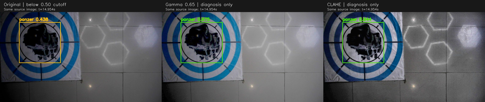
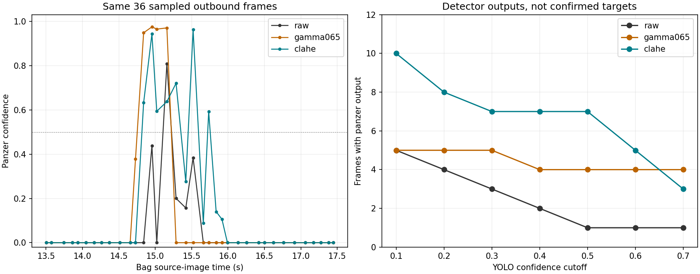

# YOLO门槛、实拍外观适应与五类输出（2026-09-26）

本次针对19:12试飞包继续离线检查。**原始YOLO门槛为0.50；降低门槛能找回少量框，但光照/对比度与图案朝向适应更值得优先处理。** 高位粗记忆已可利用单次可靠类别投影，不能把低空三次正式确认门槛误认为高位必须满足的条件。

[之前的完整链回放和视频](REPORT.md) · [阈值与外观统计](threshold_metrics.json) · [训练集现状](training_inventory.json)

## 1. 当前到底有几层门槛

| 层级 | 当前值 | 能获得什么 |
|---|---|---|
| PT/RKNN粗检测器 | conf_threshold=0.50；输入640 | 输出类别框；本身不是地图目标或投递许可 |
| 高位粗记忆 | 类别≥0.60，1张不同源图像即可；无需圆环 | SURVEY阶段、有效高度/位姿/TF/场地范围下，可形成独立导航重访线索 |
| 低位标准靶正式确认 | 类别≥0.60、几何≥0.70、3次合格观察 | 新鲜且地图/关联等条件合格后，才可供任务层接近 |
| 低位红十字正式确认 | 类别≥0.80、几何≥0.70、3次合格观察 | 同上 |
| 释放 | 当前目标/槽位、靶心精修、新鲜度、稳定帧、释放互锁 | 仍由原严格投递链判断，本次没有放宽 |

研究full_strategy将搜索模式的相邻合格检测间隔放宽至1.0秒，重复帧不累计，进入对准模式恢复严格证据处理；不代表允许一秒陈旧数据释放。

标准靶精修目前取类别侧geometry_confidence与圆环质量的较小值。粗检测器把类别置信度也填入geometry_confidence，因此正式低空标准确认实际上还受约0.70的类别下限约束；只降低原始YOLO的0.50，并不会自动变成CONFIRMED。RKNN IoU=0.45是重叠框抑制门槛，不是类别置信度。

高位还检查源图像年龄≤0.5秒、TF年龄≤0.1秒、当前高度/位姿和有效地图坐标等。粗坐标的0.45m不确定度是策略预算，未由本次低空包标定。具体见[接口约定](../../planning/coarse_search_20260926/CONTRACT.md)。

## 2. 本次实际做了什么、得到了什么

沿用原模型merged_standard best.pt，在rl_drone中对原YOLO的822个源图像时间戳精确取图，以conf=0.05重新推理，再统计不同门槛。图像匹配误差0，不增加采样频率。

在首次经过13.5–17.5秒的36张图，以及返程50.5–53.5秒的24张图上，另外比较Gamma提亮、CLAHE局部对比度和90/180/270度旋转。它们只是离线诊断输入，未改相机、外参、线上预处理或飞机动作。置信度探测是PT模型结果，不能当作RKNN的新实测结果。

| 输入/门槛 | 去程检出panzer的帧数（36张） | 返程检出帧数（24张） |
|---|---:|---:|
| 原图，≥0.50 | 1 | 10 |
| 原图，≥0.40 | 2 | 11 |
| 原图，≥0.30 | 3 | 11 |
| Gamma=0.65提亮，≥0.50 | 4 | 11 |
| CLAHE，≥0.50 | 7 | 19 |
| 旋转180°，≥0.50 | 7 | 18 |

这些是检测输出帧数，**不是召回率、正式确认次数或投递成功率**；这里没有全包人工真值，不能给出总体误报率。

原图新增的两个≥0.30低分框分别出现在14.954s（0.438）和15.520s（0.384）；连同15.160s的0.809可有三次类别输出，但前两张仍不满足原低位确认的类别/几何要求。

同一张14.954s图像，原始置信度0.438→Gamma 0.975→CLAHE 0.944。已查看全部11张去程Gamma/CLAHE的≥0.50输出，新增框落在装甲车图案上。框按源图像实际1280×720尺寸缩放绘制；未把检测框中心当成实物靶心。

[所有去程新增框](outbound_probe_boxes.jpg)

这支持“模型对亮度/局部对比度和朝向敏感”的判断；并不能只凭一次Gamma实验把根因归结为照度。阴影、反光、曝光、尺度及纹理分布都会改变模型输入。旋转90/270度还会改变letterbox形状，不能单独作为纯旋转消融；180度形状不变，仍有检出变化。

固定提亮并非总是更好：返程51.764s原图panzer=0.737，Gamma版未达到0.05输出；52.073s原图0.814，Gamma仅0.265。因此不直接全程开启固定Gamma，也不把这组局部计数解释成泛化已经改善。

## 3. 高位先搜、低位重访会不会更好

对于“一次可靠识别，但路过太快没凑够低空确认”的情况，**策略上更合适**：

1. 在高位SURVEY保存类别及粗地图位置；本包这类0.81的单帧质量若发生在高位且投影条件合格，可形成重访线索，无需同时圆环成立。
2. 低位按粗坐标接近，把目标移入更完整、较居中的视野，获得新的类别与几何观察。
3. 在对准阶段用靶心与槽位补偿控制，严格检查释放证据。旧的高位框不能直接充当释放证据。

收益来自“有目的地再观察”，不等于飞高后识别必然更好。高位视场更大，但图案像素更少；若高位连一次合格类别投影都没有，记忆策略无法凭空补目标。本包低空约1m，不是2.6m/3m高位实飞验收。

适合后续的最小动作优化是复用重捕阶段，在目标接近视野中心时给予有限0.5–1.0秒观察机会，必要时只做一次局部换视角。计入既有重访预算，不新加一套无界搜索状态机。当前仅建议，未改导航行为或速度。

若研究“一个可靠类别+后续同位置圆环”的时间关联，也应只先用于导航确认线索，约束ID、空间漂移、类冲突与时效；不能用持续圆环替代对当前投递类别的验证。

## 4. 当前模型训练并非完全没做光照或旋转

读取现用权重旁的args.yaml：

- YOLO11n，640输入，100轮上限、patience=20、batch=16。
- HSV增强h=0.015、s=0.7、v=0.4；已有亮度增强。
- 在线degrees=0、perspective=0、flipud=0，fliplr=0.5，scale=0.5，mosaic=1。
- 训练数据另含240张官方旋转图，四个标准类各60张。故不能说“从未学过旋转”；平面素材旋转不等于真实阴影/反光/模糊/斜视覆盖。
- 本机现存训练集1163张、验证232张，标签均有对应文件；训练panzer实例309（其中官方旋转60），验证55。旧dataset_manifest中train_labels=923已过时，实际为1163；未改动原始资产。
- 无独立test split；历史清单仍要求核查跨视频相邻帧泄漏。本次包已用于选诊断方法，后续不能再当完全未见过的泛化测试集。

## 5. 优化模型的执行顺序

**优先五类轻量模型的实拍微调，保持RKNN/NPU部署路线。**

1. 数据：按飞行/场地/日期保留独立划分，选取暗部、明亮、局部阴影、地砖反光、运动模糊、边缘截断、不同朝向/高度的实际图像；从本包抽取漏检前后代表帧作为难例并人工标注。加入亮斑、反光环、无靶地面等负样本。不要只把单个视频邻帧大量复制后随机拆分。
2. 标注：类别框围住中心类别图案，几何靶心独立处理；标准蓝环与35cm红十字分别采样。检查旧数据的框口径，不让同一类有时框整张1m纸、有时只框中心。
3. 训练：保持小模型与640契约，先做轻量微调；与“同数据、不增加新增强”的基线配对。建议试验degrees=180、适量透视与缩放、亮暗Gamma/曝光、局部阴影、轻微运动模糊；颜色抖动应保留红十字/蓝环的真实色义，不无限加大hsv。
4. 增强参数起点仅供实验：hsv_h=0.01、hsv_s=0.4、hsv_v=0.45、degrees=180、translate=0.1、scale=0.4、perspective=0.0002、mosaic=0.25、close_mosaic=10；Gamma/局部阴影/运动模糊需通过兼容现有版本的离线增强或显式变换实现，并抽图检查。不要假定分类任务的auto_augment/erasing选项在detect任务中自动起同样作用。
5. 验收：分光照/高度统计正确类别观察时间窗、0.5/0.6/0.7各门槛命中、错误高位记忆数、低空确认耗时及每帧时延；再导出RKNN做同图对比，检查边界分数、类别ID和NPU耗时。只有在独立飞行片段上也改善，才更新部署模型。

官方建议也是扩充真实光照/角度/背景多样性，而不是仅调一个置信度；HSV和旋转增强含义参考[Ultralytics增强说明](https://docs.ultralytics.com/guides/yolo-data-augmentation/)与[训练建议](https://docs.ultralytics.com/guides/model-training-tips/)。这些是方法依据，本项目的参数和计数来自本机文件/此次回放。

本轮完成了诊断与配置改动，**没有训练或替换新权重**，不将旧权重的输入增强诊断称为“模型泛化已改善”。

## 6. tank本次如何移除、如何避免编号错误

已修改当前研究分支的PT、RKNN检测器及Phase D/交接/回放入口，默认class_profile=r2026，在生成检测消息时过滤tank与未知类。纯tank帧仍发布完成标记和空检测，融合节点可正常完成该源，不增加等待。RKNN不再为r2026加载独立tank旧模型。历史回归可显式class_profile=full。

**旧权重仍是六类：0 bridge、1 panzer、2 pillbox、3 tent、4 tank、5 red_cross。** 本次不删除metadata第4行或把红十字擅自改成4；这是按类别名过滤输出，不是已训练五类网络，也不会据此宣称NPU统一模型更快。

下一版五类训练应复制数据到新目录，映射0→0、1→1、2→2、3→3、5→4，移除tank框；含其他有效类的图保留对应框，纯tank图可作为经过检查的负样本。重新训练并同步更新PT/RKNN及metadata后，才使用连续五类编号。不要原地改旧数据或旧权重metadata。

本次全包原始PT诊断在60.517s、60.643s还输出过tank（0.924/0.884）；r2026过滤会删除这类退休类别输出，不会将它强制重命名为panzer。

验证：7项新后端消息/类别过滤测试、6项既有模型契约测试通过；Python语法、launch XML及git diff检查通过。没有修改导航策略、投递门槛、相机外参或速度；没有启动仿真或实机。改动位于现有高位研究feature，试飞组维护的远端“板载代码”与实际板上运行版本未被覆盖。

## 7. 复现

- 工具：[threshold_probe.py](threshold_probe.py)。
- extract子命令用已source Noetic和本工程消息包的ROS Python；传入--bag与--output。按原始target_detector时间戳精确提取压缩图，不需要roscore。
- infer子命令用rl_drone，传入--model、--output；默认conf=0.05、imgsz=640、device=0。
- [render_threshold_probe.py](render_threshold_probe.py)读取本轮输出，生成外观对比图与曲线。
- 完整诊断JSON位于logs/panzer_threshold_probe/probe.json；822张临时图片可从bag重新提取，图表核对后已清理（67,186,436字节）；原始bag、现用权重、前轮完整视频保留。
