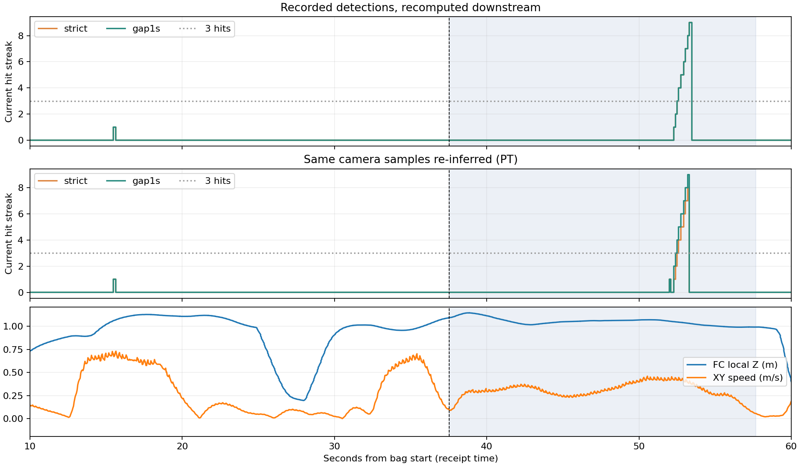
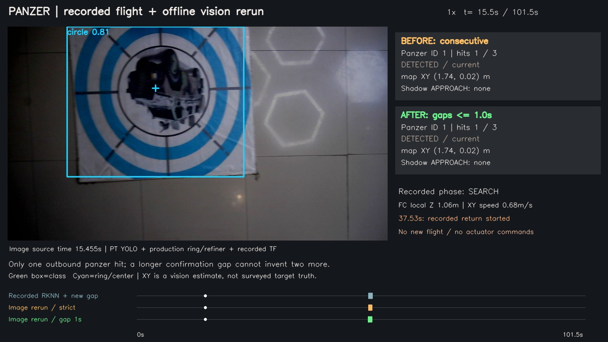
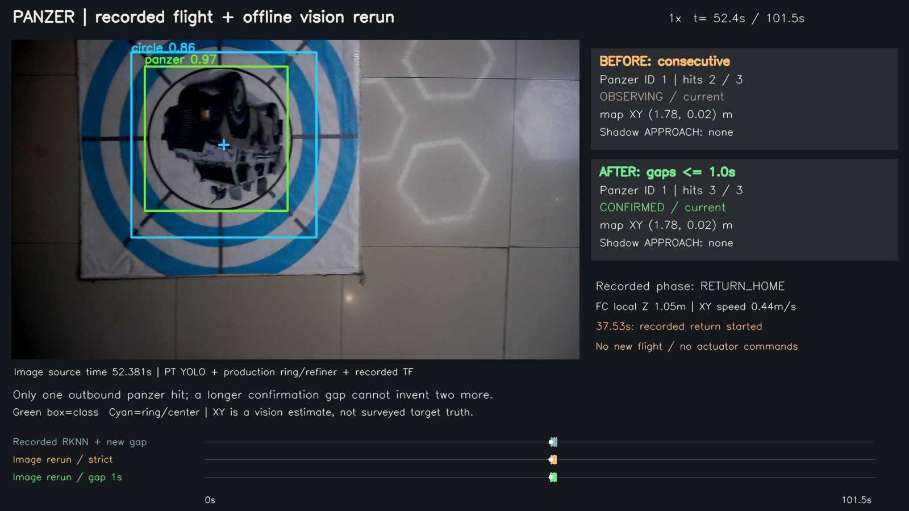

# Panzer确认与接近判定回放（2026-09-26）

**结论：首次去程仍不能确认，也不会产生 panzer 的 APPROACH。** 延长相邻有效检测的允许间隔，有利于“多次检测中间夹着漏帧”；这份包去程只有一次 panzer 类别检出，单纯放宽间隔不能变出另外两次。

[完整1倍速对照视频](../../../logs/panzer_replay_video/panzer_comparison.mp4) · [本地播放页](index.html) · [指标](metrics.json) · [本轮搜索接口与配置](../../planning/coarse_search_20260926/CONTRACT.md)

## 本次实际执行

源包：板端试飞产物中的 flight_debug_2026-09-26-19-12-21_0.bag，101.46秒、2965幅下视相机图像。

1. 保留当晚 RKNN/圆环/红十字检测结果及其到达时序，重跑现有融合、精修、CameraInfo/TF地图投影、候选记忆，对照逐帧连续确认与1.0秒允许间隔。
2. 在 rl_drone 环境，使用 merged_standard 的 PT 源模型，按原 YOLO 的822个源图像时刻重新推理；全部822张与原图像时间戳精确匹配，最大误差0毫秒。圆环和红十字由当前生产C++节点重新计算。然后重跑相同的后处理和两版记忆。
3. 使用当前 MissionCore 做不发布动作的单次决策检查：保留当时任务阶段、已有槽位状态、红十字已投递事实及当前位姿，检查候选是否通过准入、是否会选择 APPROACH。
4. 只启动三个视觉检测器及文件回放器，未启动 Gazebo、PX4、MAVROS、任务执行器、舵机。运行沿用统一目录与收尾包装器，结束后ROS相关进程零残留。

## 结果

下表为回放计算的 bag 到达时刻；图像本身比检测结果早约0.2–0.4秒。

| 输入 | 逐帧连续：panzer首次CONFIRMED | 允许1秒间隔：首次CONFIRMED | 去程确认 | panzer接近建议 |
|---|---:|---:|---|---|
| 原始RKNN检测，重算后处理 | 52.495s | 52.495s | 两版均无 | 两版均无 |
| 同图像重新PT推理及几何 | 52.495s | 52.397s | 两版均无 | 两版均无 |

当晚 bag 直接记录的首次确认约52.528秒，与本地重算约33毫秒差异属于回调/定时器调度口径；应比较同一重算输入下的两版，不把33毫秒算成算法收益。

新PT输入下，允许漏帧约提前0.098秒。此收益不能套用到当晚RKNN结果：返程第一张 panzer 的类别分数，RKNN约0.657、PT约0.737；原融合精修逻辑又用类别侧 geometry_confidence 与圆环质量取较小值，低于0.70的一张不能进入当前低空确认。PT与RKNN的边界差别改变了可累计的帧数。

红十字首次确认/搜索中断建议均约18.943秒，未因本次时间间隔修改提前。

## 首次经过为什么没救回来

- 去程唯一 panzer 源图像是15.160秒，结果于15.472秒到达。RKNN置信度约0.811，重新PT约0.809；两路均有有效圆环关联和地图投影。
- 这说明该次有效观察没有被“YOLO和圆环不同步”拦下。关键缺口是附近其他YOLO取帧没有继续输出 panzer 类别。
- 13.5–17.5秒重新检查的类别输出亦未发现 panzer 被连续标成另一种标准靶；主要是没有检出。仅凭这些结果不能区分尺度、运动模糊、姿态与模型训练覆盖各自的贡献。
- 1秒窗口结束后仍只有一次命中，正确行为是继续保留历史ID/位置、但不发出确认或投递准许。
- 返程约52.4秒能够确认时，任务已在37.530秒转 RETURN_HOME。现有任务规则不会在此阶段新建搜索中断，所以没有APPROACH，原因已不在视觉准入。

## 与高位粗搜索的关系

本包是约1米local Z的低空测试，**不包含2.6米高位搜索**。新增高位粗线索可在SURVEY高位阶段凭一次可信类别框记忆重访位置，但不会把低空这次单帧直接变成正式CONFIRMED。不能用这个包宣称高位策略实飞通过。

本轮仍保留严格投递链：低空新鲜候选→APPROACH/ALIGN→靶心和槽位对准→稳定证据→释放许可。没有将粗线索写进正式候选/释放话题。

## 下一步适合做什么

优先设计“首次可信类别+坐标后，短时减速/驻留补看或局部回看”，用有限观察时间取得新的类别与几何证据。也可研究保留一次可靠类别身份，在同一地图位置持续跟踪圆环来积累几何，但必须限制身份时效和空间漂移、防止相邻靶串联。本轮未加入这些新行为。

如果只是把确认次数降到1，会直接绕过目前的跨帧类别确认；对准精修只能解决中心偏差，不能独立证明类别正确，因此没有采用。

## 回放限制和产物

- 视频为1600×900、10fps、101.50秒、H.264，完整解码通过；保持原101.46秒飞行时长，非快放。约30MB，适合单独发送。
- 左侧框与圆环按源图像时间戳对齐；右侧候选和单次决策按结果到达时间显示，所以允许出现“画面已检出、右侧还在等待”的真实处理延迟。
- 重新推理使用笔记本PT而非香橙派RKNN，三检测器同步等待每幅图处理完毕，保留原YOLO采样间隔。可用于算法对照，不能替代板端实时调度/性能验收。
- 相机轨迹固定为当晚录制轨迹。右侧 Shadow APPROACH 只表示该时刻在录制阶段下的决策建议，不表示实际飞机已执行；一旦真实飞行因新策略分叉，后续轨迹需要另行实飞/仿真验证。
- 单次决策以 bag 起点作为预算起点；真实任务约更早5秒启动，本轮距强制返航预算仍有数百秒余量，此偏移不影响是否接近的结论。未回放机构动作。
- 视觉后处理接收录制TF树和地面Z=-0.22；不凭画面重新猜外参。点坐标为估计值，没有外部测量真值。

运行目录：logs/panzer_bag_reinfer_20260926_223208。
中间结果：logs/panzer_recorded_recomputed.json、logs/panzer_reinferred_recomputed.json。
导出视频：logs/panzer_replay_video/panzer_comparison.mp4。

## 后续：阈值扫描、光照/朝向诊断与tank输出移除

“去程只有一次有效检出”指原始0.50门槛；进一步低阈值扫描表明存在少量被过滤的低分框。同一36张去程图，在0.30下检出3帧，Gamma提亮/CLAHE在0.50下分别4/7帧；这是PT离线检测计数，不是CONFIRMED或飞行收益。[详细结果与五类模型方案](MODEL_GENERALIZATION.md)。前文链路回放及视频保留其原始输入设置和结论。
