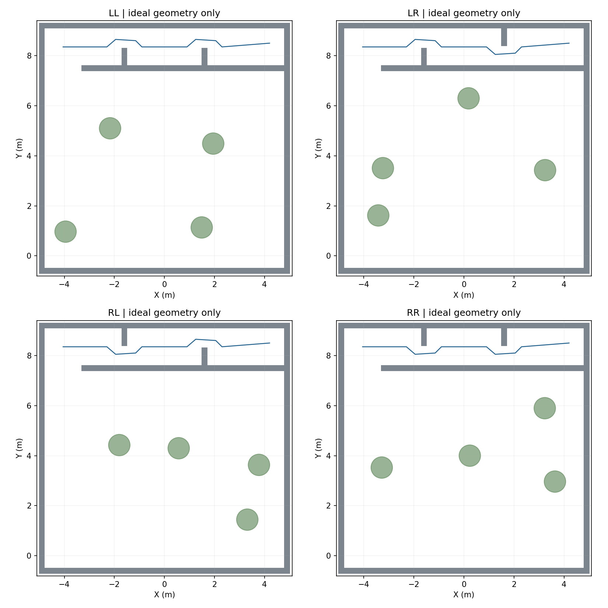

# R64 随机场景生成与验收边界

两门各只有左/右两种位置，净宽严格0.80m，走廊净宽1.50m；沿穿越方向+X，左侧指+Y。LL/LR/RL/RR四组合均已生成，树与垫高箱整体独立随机，目标仍由独立`field_seed`生成。



已完成：500环境seed的确定性/间距回归；四组合在0.30m水平膨胀下的理想几何A*可达；四套实验使命参数逐字相同，门真值只进入私有Gate配置；默认及四种变体ROS launch静态展开通过。**尚未运行随机门/树箱SITL**，几何可达不等于传感器建图与实际轨迹能通过。

生成器在轻量仓`r2026_scene.py`和`tools/export_r2026_scene.py`，不依赖ROS，可输入当前完整世界模板：

```bash
python tools/export_r2026_scene.py \
  --template-world /path/to/integrated/vision_ws/src/uav_vision_eval/models/r2026_horizontal_field/field.world \
  --field-config /path/to/integrated/patrol_uav_ws-patrol_planner/src/uav_mission/config/coverage_r2026_horizontal.yaml \
  --runtime-config /path/to/integrated/patrol_uav_ws-patrol_planner/src/uav_mission/config/vcl06_full_low_corridor_runtime.yaml \
  --output /path/to/scenario --scene-seed 31 --door-pattern RL
```

输出field.world、field_config.yaml、gate_geometry.yaml、experimental_runtime.yaml、scene.json。可单独指定door_seed、obstacle_seed；scene_seed=0保留标称树箱和LR门布局。盒体/树高沿用R64模板假设，不趁随机化修改飞机或通口尺寸。

整机入口已开放world、field_config、gate_geometry_config参数，默认仍为已成功的固定场景。`gate_geometry.yaml`只加载到`/navigation_vcl06_assertion`。实验runtime把墙前/墙后引导点设在固定走廊中线，四组合完全相同，具体绕行交给感知地图和原规划器；**它不是已验证的默认航路，也没有按门真值直接编排通关路线**。

默认成功路线保持原值；随机场景下一阶段需要验证未知门感知/规划、树箱阻断端点、目标近墙净空和降落。生成器保留起飞区/走廊入口基本净空，物理合法性与任务可完成性分开评估。静态墙AABB用于布设避碰，不把场景真值发送到飞行目标入口。

本批旧seed5/7/8有靶板压墙，原始数据没有重写。矩阵后墙AABB排除修复经1000目标seed测试，且seed11的记录坐标保持一致；后续所有新布设应使用修复版，并在开始前检查实体相交。
