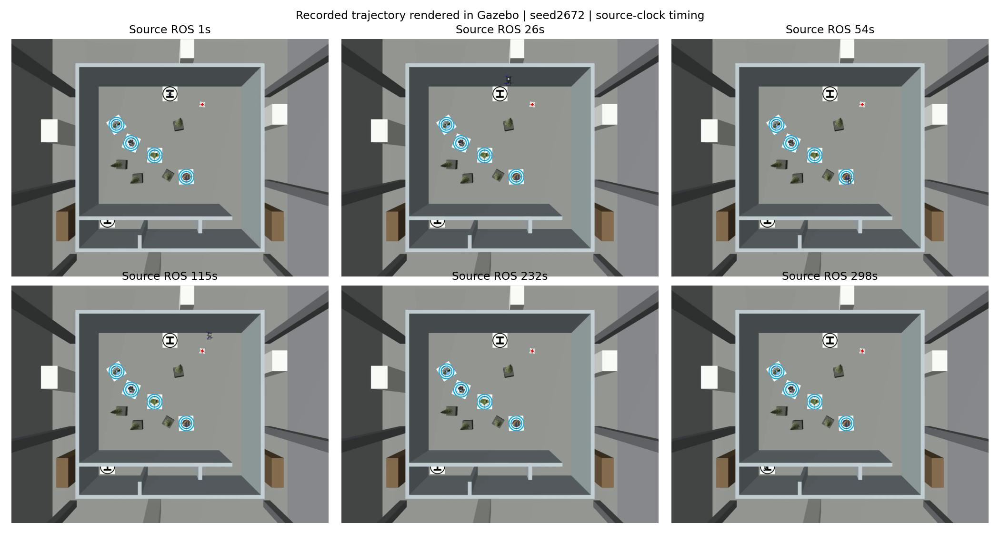
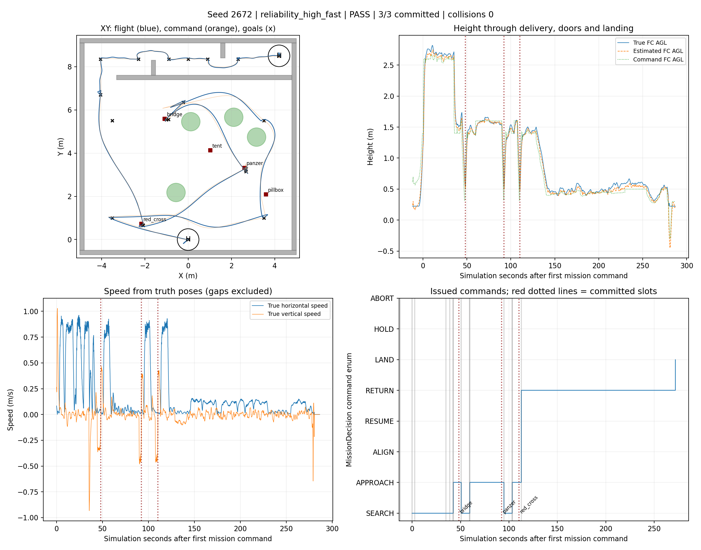
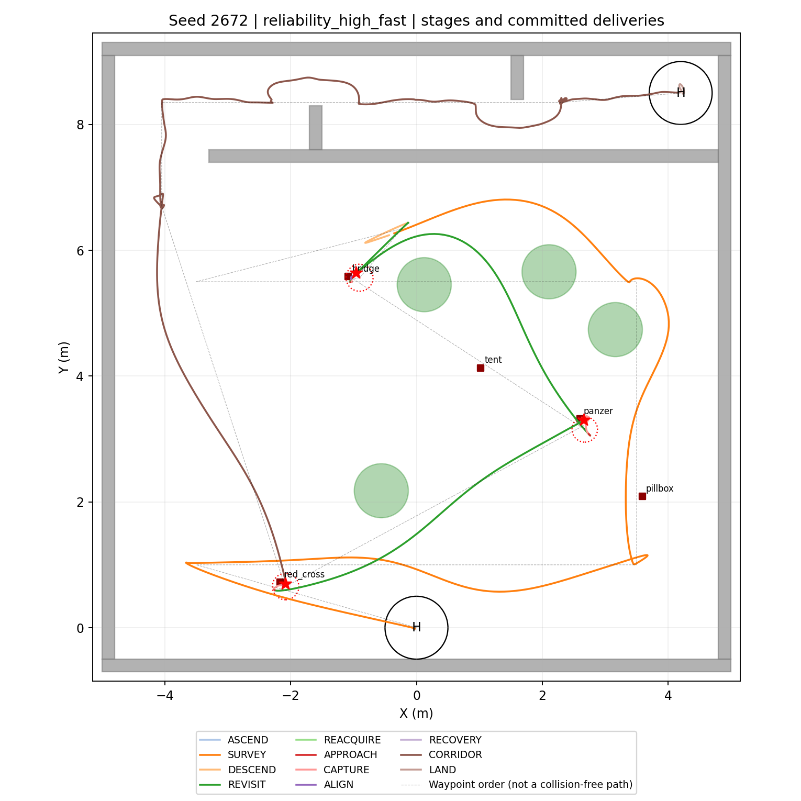
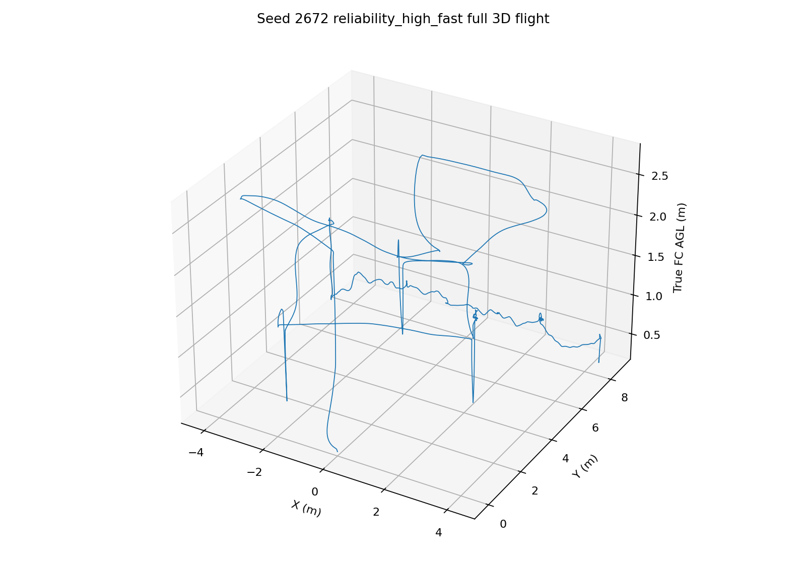
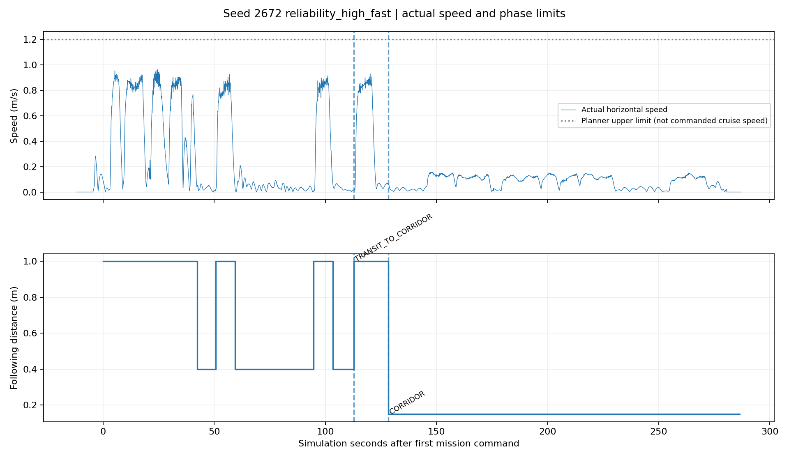
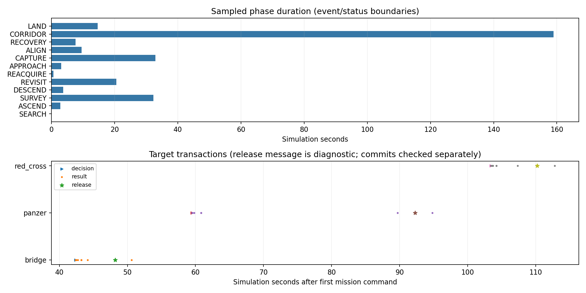
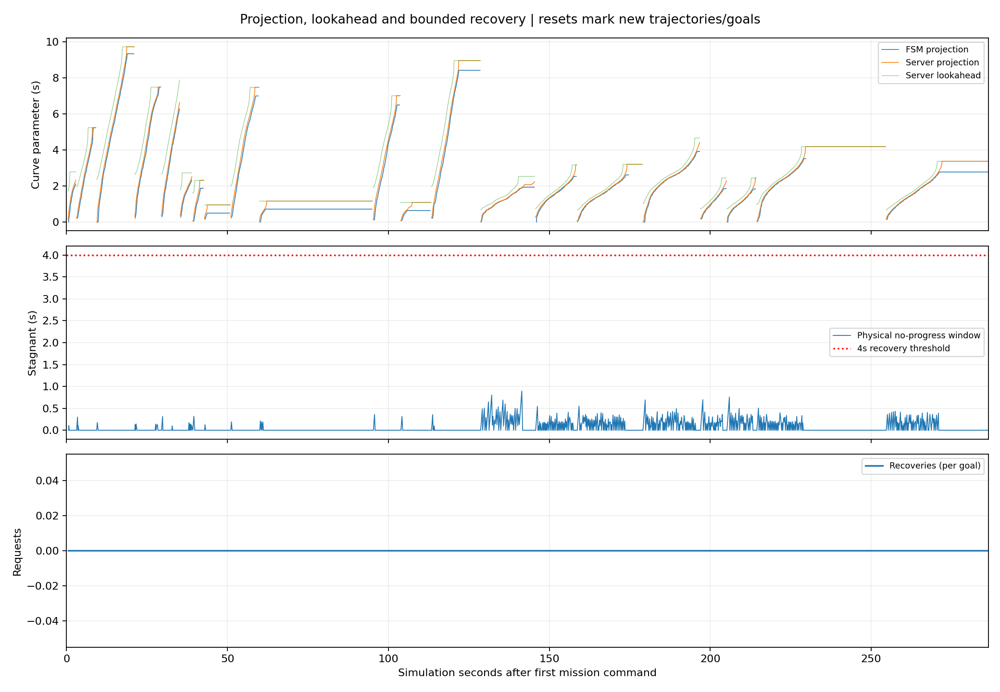
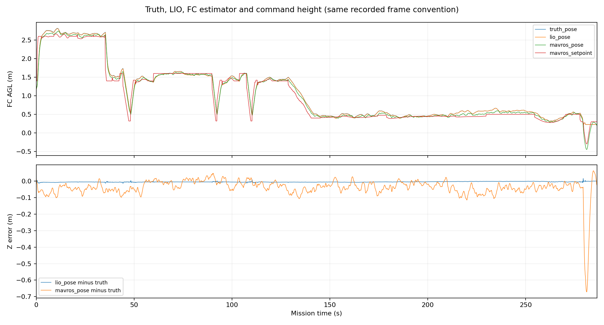

# seed2672 高位快速搜索整场验证与修复报告

2026-09-19。**一轮新随机飞行，Gate PASS；三投、两门、H视觉降落完成，用时286.456s（4分46.46秒），0碰撞、0越界、0限高违规。**

[图表与视频总览](index.html) · [完整俯视回放视频](<../../../logs/reliability_seed2672_render_replay_20260919_182252/overview_replay_timed.mp4>) · [原始飞行run](<../../../logs/reliability_seed2672_20260919_175901>) · [实施说明](../../planning/reliability_speed_review_20260919/IMPLEMENTATION.md)

## 1. 范围与来源

- 用户授权导航/视觉整机开发，完成后随机选一个seed跑高位快速整场。本轮从41–9999一次抽取2672，独立抽到门型LR，door_seed3672、obstacle_seed4672；树、靶随机。选择先于场景评估，未换seed，未重跑飞行。
- 飞行集成源：`feat/high-view-search-research@cc47bab`；导航修复源：`liftrace-controlwork:feat/high-view-liveness-20260919@dc18320`。导航先实现，再按文件清单同步。
- 录制修正单独源：导航`b368e6d`、整机`25719fd`，只增加相机选择与渲染回放，未改本轮已完成飞行数据。轻量fork当前几何预筛在`a66be61`。
- 全高度障碍柱保留；巡航高位2.6m、低位1.4m，规划上限1.2m/s；走廊前视0.15m与0.7m工程限高保持原值。前视单位是米，不是m/s。55cm为已膨胀工程包络，未重复加10cm。
- 笔记本SITL结果；不等于OrangePi算力、实机识别精度或正赛部署验收。未合并main、未更新机载部署包。

## 2. 修复了什么

**找到并复现了seed36的一种确定性停滞机制。** 原实际traj20样条的0.15m前视已到参数2.72s，但投影只查下一段1s。即使无噪声位置跟随收敛到前视点，投影仍为0，距终点1.369m。现在两端按局部弧长选取投影范围，受当前前视约束、至多0.4m，不按墙钟强推或跳到远端。冻结实际26控制点回归：旧实现FAIL，新实现到终点3cm内PASS；见[curve_before](curve_before.txt)、[curve_after](curve_after.txt)。这不是复飞seed36，也不证明所有历史停滞只有同一原因。

此外实现了目标级4s/4cm无进展监测、最多两次恢复、保留原deadline、预算耗尽明确失败；对准/投递/降落不按静止误判。新轨迹携带源目标身份，错目标/旧generation不能解除保持。双端诊断记录首次状态变化及10Hz心跳。

近墙高位线索先去内侧可见点，原目标身份和坐标记忆不改；低位新鲜候选通过独立准入后才APPROACH。近墙复访/接近可切0.20m前视。包络姿态预算与3cm跟踪余量显式分开。本seed未触发近墙档或候选边界拒绝，**近墙改动目前只有离线回归，仍需历史38/40实跑**。

## 3. 完整链条结果

时间以首条任务命令为零点；视频还包含起飞前等待，不能直接把播放器时长当完赛时间。

| 项目 | 本轮结果 |
|---|---:|
| 高位三类齐备并中断 | 34.934s |
| 三投全部提交 | 110.216s |
| 完成全部任务 | 286.456s |
| 投递事务 | bridge → panzer → red_cross，3释放/3提交 |
| 投后路线 | 9/9；入口 + Wall_20 + Wall_22（实际两扇门） |
| 碰撞 / 越界 / 限高违规 | 0 / 0 / 0 |
| 水平累计飞行距离 | 56.147m |
| 真值最高飞控AGL | 2.816m |
| 视觉H锚点误差 | 0.0537m（视觉锚点，不冒称物理投放误差） |
| 有界无进展恢复请求 | 0 |
| 有效运动窗口最长未推进 | 0.895s，未达4s阈值 |
| 清理 | 飞行、纯渲染回放均零残留 |

第二门所在第8段用时15.649s，初次trajectory_ready在0.178s后出现，没有此前90s停推。树正上方离线复核保留原方法：四树均无机心越顶穿入，已膨胀55cm盒对树/垫箱保守凸包投影在juniper_Tree_2边缘有2个插值样本重叠，最小分离轴间距为-0.00774m（约7.7mm）。按用户已确认的鲁棒包络口径单列这一余量事实；它不是机心越顶或裸机碰撞的直接证明，包络附加检查也不能写成完全通过。详见[机心投影](tree_projection.json)、[包络投影](body_projection.json)，均为本仿真模型的离线测量。

## 4. 速度与仍在消耗的时间

| 运动阶段 | 移动样本P50 | P95 |
|---|---:|---:|
| 高位SURVEY | 0.814m/s | 0.910m/s |
| 低位REVISIT | 0.759m/s | 0.876m/s |
| 最后一投后快速入口转场 | 0.643m/s | 0.881m/s |
| 真正低速走廊档 | 0.115m/s | 0.144m/s |

移动样本阈值0.03m/s；高位/复访按任务阶段统计，后两行按生效速度档统计，避免把快速入口转场混进走廊P95。

第三投至完成还用176.240s，占全程61.52%。低速走廊档143.414s，仍是主要时间成本。存在两个明确等待点：

1. 第9个H前航点：初次规划成功前24.783s、30次FAILED_ATTEMPT，整段42.054s。这是**尚未生成可执行轨迹**的等待，本轮投影停推修复不覆盖它；不能说已经消除了所有停滞。第一门第5段也有5次失败、4.496s后才ready。
2. panzer的完整APPROACH事务35.320s；bridge为8.265s，red_cross为9.440s。总体CAPTURE阶段32.892s，应细查捕获/对准等待原因，不能直接提高航速代替。

本轮无同布局旧版本或传统搜索对照，因此**不给出整场节时百分比，也不据不同seed均值宣布最优方案**。去年规划3m/s仍只是历史配置，不是实测速度；原速度调研继续有效。

## 5. 高度口径复核

全任务FC估计Z相对真值P95绝对差0.0888m，最大0.6711m；最大差发生ROS293.409s，真值FC AGL仅0.225m，处在接近落地支撑高度的末段；PX4着地状态在295.576s确认，298.376s解除武装。不能把这一极值直接描述为高空0.67m漂移。

真值AGL大于0.35m的区间，最大绝对差0.1145m；LIO全程P95约0.0069m。本轮高度Gate通过，但之前seed33在更高处出现的FC/LIO分离仍需要单独复核。未修改高度来源或抬高Gate阈值。

## 6. 视频与图表

原7m直播俯视相机被5.5m顶板遮住，原文件未作为有效视频交付。现提供**本轮真值位置/姿态驱动的Gazebo纯渲染回放**：同一冻结场景和靶位，只移动无碰撞/传感器/飞控插件的视觉机体，复用R64 `camera_video_recorder.py`。它不是第二轮飞行，不能用于产生新的Gate结论。

专用相机近裁剪3.1m跳过顶板可视面，保留所有原场地碰撞几何。视频H.264、1280×960、10fps、299.2s，覆盖来源ROS0.355–299.380s。按图像时间戳恢复时间轴；246帧为前帧保持，原相机最大间隔0.587s，未插造新的运动。[视频检查](video_validation.json)含覆盖区间、解码及抽帧记录。

## 7. 验证与下一步

312项整机任务包回归、65项高位库回归、18条C++ gtest用例通过。catkin汇总显示36（含容器计数），实际叶级用例见[cpp_tests.json](cpp_tests.json)。导航隔离仓最初全包测试缺视觉/旧控制夹具，在完整集成仓得到通过；一处旧测试的固定manager节点查找也已修正。

后续优先级统一在[VISION_2026_ROADMAP](../../../VISION_2026_ROADMAP.md)维护：先对36和38/40等历史失败布局做针对性验证；处理初次规划反复和高度一致性；解释panzer捕获等待；再分段试验走廊速度。轻量fork可消费本轮实际姿态/线索时间线，继续校准几何预测，不能取代整机闭环验收。本轮不再追加飞行。

[冻结输入](case.json) · [抽签记录](selection.json) · [完整指标](metrics.json) · [逐段详情](detail.json) · [Gate原始内容](2672_reliability_high_fast/gate_status.json)
