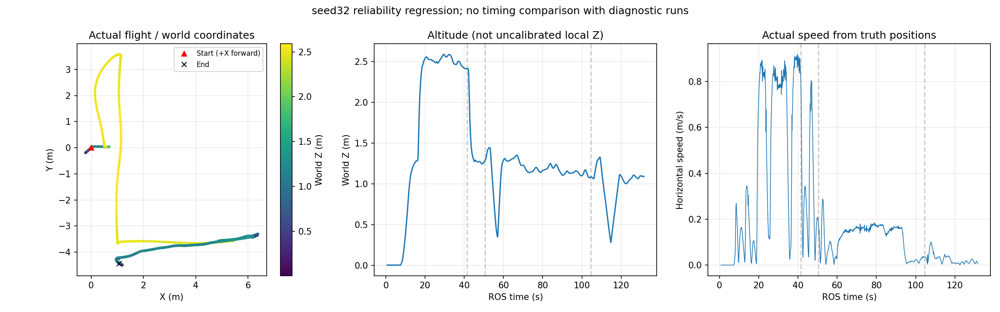

# 9月20日13点后改动复核与仿真验收

## 范围与结论边界

按提交时间与实际差异复核，不根据Git作者名推断具体操作者。导航权威工作树为high-view-liveness-20260919，整机研究为r2026-high-view-search，部署集成为r2026-board-vision-tests。未新建分支、未修改main或实机运行状态。

| 提交 | 范围 | 判断 |
| --- | --- | --- |
| 1328dd7 | 十轮可靠性分析 | 分类有价值；计划不等于已实现，需要保留动态验收缺口 |
| 151eeba | 导航FSM、首轨迹期限、低空进场与A* | 各措施职责不同，不是简单重复；起飞机制和真实恢复仍需实跑 |
| f68f1c0 | 整机集成与launch启用 | 已核对导航改动的20个代码/测试/配置文件，与当前导航权威工作树逐文件一致 |
| b1e67dc | 板端集成及配置生成器 | 同上20个文件一致；低空进场点随实测起点平移、保持模拟投递；不能据此宣称板端二进制已更新 |
| 06b4d27及随后诊断参数 | 启动墙钟、录像与检测设备选项 | 默认保持原行为，但仅用于诊断，不能代替定位模型路径问题 |
| 752659d、b1847fc | 板端地图异常分析 | 为分析文档，不修改飞行行为；与23点新增试飞资产的结论需按各轮分别解读 |

今天先前的5f0d2ca/c743dd3/759ed8b已修正目标序号0拒绝、保持通知被过早消耗、同动作重发绕过首轨迹期限、A*时间字段未初始化。此次以包含这些修正的当前版本验收，不将其混称为昨晚原版通过。

## 修正是否合理、有无冗余

- SERVER保持监控消费明确的轨迹服务器状态；物理无进展监控观测实际位移。两者共用目标级恢复预算，保留有理由。仍需注意有抖动但未进保持的情况，4cm位移判据不是沿路线的有效进展证明。
- 全阶段12秒首轨迹期限解决RETURN_HOME等不受旧search-only期限约束的问题，但不会创造可行路线。目标占据与走廊布局恢复不能据此宣布解决。
- 低空进场再升高改变了实际航线。它能避开边界处直接垂直扩展，但固定进场点不是对任意地图均可达的保证；仍由规划器检查，不允许占据起点穿出。
- A*目标方向原语保留速度和占据检查，增加一类合法首层候选；拒绝统计有助区分同体素和碰撞。它不是历史重试失败根因已经确定的证明。
- staging、SERVER监控、首轨迹超时不应继续叠加无差别计时器。区域级失败预算、LAND状态交接及实飞有轨迹无推进问题仍是独立缺口。

## 仿真入口问题：为何此前能跑、昨晚不能

历史matrix.py显式设置GAZEBO_MODEL_PATH为当前视觉模型目录及simulation_assets/models。统一sim_run.sh此前仅默认加入PX4模型目录；当单轮入口没有矩阵环境补偿时，iris_mid360_start_fov引用的r2026_iris_dynamics与r2026_mid360_mounted无法解析。

本轮首次诊断运行review_seed32_20260921_20260921_140422中，读取Gazebo进程实际环境确认缺这两项模型所在目录，Gazebo日志停在访问models.gazebosim.org。世界文件自身可解析，不等于其后spawn的嵌套机架可解析。已终止该未起飞轮；即时收尾曾报rosmaster/rosout残留，随后精确进程检查确认全部退出。

修正统一入口，将所选VISION_WS/src/uav_vision_eval/models加入模型搜索路径，不复制资产或从其他工作树取模型。研究91bab20、部署9683c1b已提交。这个缺陷早于昨晚导航补丁存在，不能错误归因于昨晚FSM修改。此前“冷缓存/GPU导致启动慢”证据不足；延长墙钟、CPU/软件渲染不是此问题的修复。

## 验证记录

- HighViewProbe 17项、PlannerMotionExecutor 39项、ServerHoldMonitor 5项、MotionWatchdog 5项通过。
- 板端配置/事务8项通过；最初测试入口漏设uav_high_view/ROS Python路径造成导入错误，补齐环境后通过，不把入口导入错误记成产品逻辑缺陷。
- 导航20个变更文件在研究/部署两份集成中无差异。
- sim_run.sh shell语法检查通过。
- 当前动态轮review_seed32_models_fixed_20260921_140919恢复默认GPU检测与渲染；只关闭汇报录像并放宽宿主启动墙钟，任务ROS时间限制保持不变。未进行速度基准比较。

## 动态结果：起飞通过，整场未通过

seed32本轮完成高位搜索、下降、panzer和red_cross两投，第三点bridge复访首轨迹失败，最终Gate为FAIL/manager_failed。包装器收尾及随后精确进程复查均确认零残留，没有再次重跑相同故障。

| 验收项 | 结果 |
| --- | --- |
| 模型解析及任务启动 | 正常；不再等待在线模型库 |
| 低空进场首轨迹 | 约0.854s，从首次规划状态到READY |
| 进场点升高首轨迹 | 约0.157s；ascent_verified=true |
| 三高权重线索 | 41.408s前已累计形成，并中断高位策略 |
| 模拟投递 | 2次成功提交、2次恢复成功 |
| 第三目标复访 | 119.016s开始，131.044s失败，约12.028s |
| 物理碰撞/高度/搜索包络Gate | 本轮均为0违规 |
| SERVER保持与物理停滞恢复 | 未触发，不能计为动态覆盖 |
| 全流程验收 | FAIL，走廊和降落未进入 |

失败时A*反复报告start_occ=1、goal_occ=0，重试2187候选、accepted=0，主要被碰撞检查拒绝。LIO在交接附近Y=-4.40566m，之后约-4.418至-4.437m；固定搜索区域下界为-4.4m。SDFMap::getInflateOccupancy在区域外直接返回1，独立于原始点云。因此至少人工搜索区域就已足以将该起点判占据，不能简单说成真实障碍堵住飞机。

视觉边界策略允许中心到约-4.4514m，red_cross接近请求Y=-4.45131m；而规划限制为-4.4m。投递与后续规划拥有不同的合法区域，恢复只满足原投递事务的高度/位置条件，不保证交回规划时处于其自由区域。这个缺口不由12秒期限修复；期限本轮只是正确结束等待。

后续应统一投递许可、规划搜索区和恢复交接的几何契约，近边目标投后需要回到经检查的可规划位置再提交RECOVERY成功。禁止直接关闭禁止进入走廊的限制、缩膨胀或豁免占据起点。当前未仓促改动这段跨模块飞行动作，也未将提前FAIL当成问题根治。

[完整结果](result.json) · [交接位姿](handoff_positions.json) · [源码对比](source_comparison.json)

图中为Gazebo模型真值坐标，不用视频时长推算完赛时间；此轮未完赛。动态运行使用模型路径修复后的版本，后续只修改测试夹具，不影响本轮飞行二进制。

## 额外发现：A*测试夹具初始化缺失

离线实跑7项自包含A*测试时，ClearNearbyGoal和BlockedConnectorStillFindsHorizontalDetour失败。测试绕过initMap，却未初始化search_region_enabled_及bounds，造成不确定的人工边界。已在测试夹具显式初始化，并增加空体素但起点位于人工区域外的拒绝回归。重编译后8项全部通过；两项依赖外部FrozenR54点云的测试明确排除，不把空返算PASS。

该修复只针对测试，生产initMap会读取区域参数；不能把测试夹具缺陷包装成seed32/34运行时根因。全部已执行有效测试共82项通过（17+39+5+5+8+8），但整场动态仍FAIL。

## 历史十轮的问题清单

原Gate通过4/10：33、35、36、39。31是走廊首轨迹目标占据及约90秒等待；32/34是首条高位起飞动作根节点无后继；37是LAND位姿跳变；38是大量局部失败后触发保守搜索包络；40是反复规划/换点后被2700秒墙钟截尾。成功轮仍有优化异常，39有保守树投影小重叠，不能等同真实碰撞。

历史32/34缺少拒绝分类，无法唯一归因。零初始加速度导致同体素能解释首次搜索，但不能解释完整加速度格重试也失败。潜在约束包括人工区域、膨胀墙、限高和起点状态；不应将候选推断写成既定根因。本轮同时使用低空进场和方向原语，所以只能证明组合方案在seed32越过历史失败点，不能分离每项因果，更未覆盖seed34。
