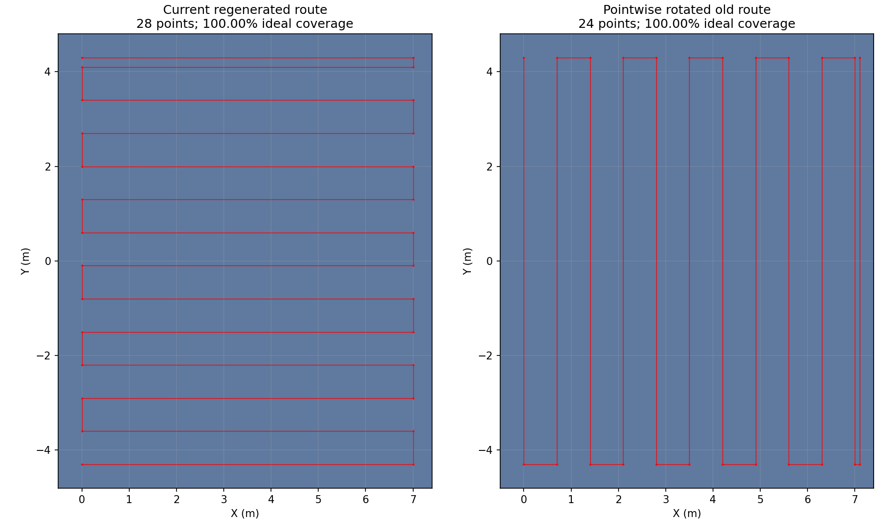

# 坐标旋转与低空牛耕覆盖核查

单纯改变坐标表达并对世界、位姿、航点、朝向和传感器变换进行一致变换，理想几何行为应等价。本次历史版本不是仅旋转：还调整过相机安装/FOV、初始机头朝向、外墙高度、走廊高度/控制参数及搜索边界。

## 当前低空路线仍有理想全覆盖

当前SearchPolicy沿X往返、沿Y按0.7m间隔排航带；范围X=[0,7.0]、Y=[-4.3,4.3]，28点，直线名义长度约106.6m。飞控中心1.4m、相机下偏0.16m，按当前CameraInfo针孔估计地面视场约2.188×1.231m。

完整执行名义路线，在墙内验收区域X=[-0.5,7.4]、Y=[-4.8,4.8]的1cm栅格估计覆盖100%。这不包含畸变/遮挡、姿态、绕障、跳点和目标完整入镜条件，不代表实际检测召回100%。CoverageRoute.coverage_ratio是航点游标比例，跳点也会推进，不能当真实地面覆盖率。

## 牛耕序列没有保持逐点旋转等价

旧模板范围X=[-4.3,4.3]、Y=[0,7.1]，0.7m间隔，24点。逐点应用新X=旧Y、新Y=-旧X后，得到沿新Y飞、沿新X排航带的路线，名义长度约110.3m；当前却由固定“沿X飞”的生成器重新生成28点。因此走法、转弯位置及遇树先后顺序改变了，不能将新问题简单归因于换坐标。

图中两条路线都按当前相机方向计算，理想面积都达到100%，并不意味着阻塞风险、实飞耗时或识别效果相同。旧逐点旋转路线的末列X=7.1还越过当前规划中心硬界约7.0814，不能直接复制旧点表上机。

## 导引点核对与后续口径

本次对seed34旧runtime模板的9个走廊点逐点检查，当前XY等于旋转后的旧XY；Z有明确的走廊高度调整。高位5点也按新轴排列，低空进场点是后来新增的动作，不属于纯旋转。

应将航点、搜索扫掠轴、门穿越方向、相机世界视场和边界作为一套版本化场景配置。今后若测试“只有坐标旋转”，必须锁定逐点变换后的航点及全部约束；若重新生成路线，则单列为策略变化。当前未自动切换扫掠方向或修改导引点，因为需要同时适配现有安全边界，而不是机械复刻旧7.1m端点。

数据见[result.json](result.json)。这是离线几何核查，本轮未启动仿真。

扩展核查：31–40十套场景runtime模板的走廊9点XY均通过逐点旋转比较，见[corridor_checks.json](corridor_checks.json)。这项检查不宣称高度/限速等其他参数等价。
