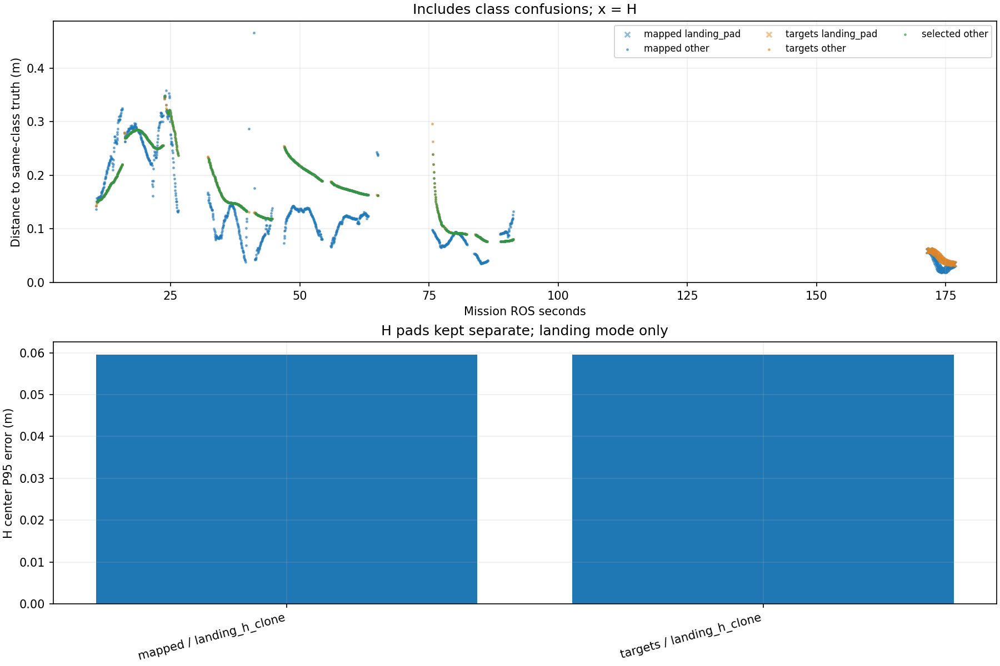

# Recorded target-center comparison

Phase-specific interpretation: [frozen SURVEY, interrupt and low reacquisition comparison](stages/PHASE_REPORT.md). The full-mission statistics below are not initial-high or low-only values.

Scope: 31_rectangle_baseline
Gate: PASS. Historical comparison only; changed model/inflation/ceiling/H size.

Run: /home/xhj/liftrace-worktrees/r2026-high-view-search/logs/route_speed_rectangle_baseline_seed31_20261004_223346
World: /home/xhj/liftrace-worktrees/r2026-high-view-search/docs/verification/route_speed_20261004/rectangle_baseline_seed31/field.world
Coordinate transform: FLU world XY equals mission XY; local Z ground=-0.22, only XY distances compared

Distances below are to same-class truth; inspect the class/instance table before interpreting localization.

| Scope | Stream | Class | Truth instance | N | Median/m | P95/m | RMSE/m | Max/m |
|---|---|---|---|---:|---:|---:|---:|---:|
| unique_valid_mission | hint_bbox | bridge | random_bridge | 17 | 0.3368 | 0.4765 | 0.3590 | 0.4868 |
| unique_valid_mission | hint_bbox | panzer | random_panzer | 3 | 0.4392 | 0.4527 | 0.4369 | 0.4542 |
| unique_valid_mission | hint_bbox | red_cross | random_red_cross | 11 | 0.3624 | 0.3981 | 0.3676 | 0.4100 |
| unique_valid_mission | hint_bbox | tent | random_tent | 5 | 0.1532 | 0.1664 | 0.1550 | 0.1667 |
| unique_valid_mission | hint_vision | bridge | random_bridge | 61 | 0.2726 | 0.2840 | 0.2692 | 0.2842 |
| unique_valid_mission | hint_vision | panzer | random_panzer | 1 | 0.1820 | 0.1820 | 0.1820 | 0.1820 |
| unique_valid_mission | hint_vision | red_cross | random_red_cross | 3 | 0.1380 | 0.1406 | 0.1381 | 0.1408 |
| unique_valid_mission | hint_vision | tent | random_tent | 39 | 0.1728 | 0.2055 | 0.1756 | 0.2105 |
| unique_valid_mission | mapped | bridge | random_bridge | 440 | 0.1324 | 0.2919 | 0.1836 | 0.3170 |
| unique_valid_mission | mapped | landing_pad | landing_h_clone | 92 | 0.0309 | 0.0595 | 0.0388 | 0.0605 |
| unique_valid_mission | mapped | panzer | random_panzer | 258 | 0.1150 | 0.3104 | 0.1480 | 0.4656 |
| unique_valid_mission | mapped | red_cross | random_red_cross | 235 | 0.0822 | 0.1108 | 0.0906 | 0.3492 |
| unique_valid_mission | mapped | tent | random_tent | 99 | 0.2181 | 0.3139 | 0.2284 | 0.3245 |
| unique_valid_mission | selected | bridge | random_bridge | 424 | 0.2134 | 0.2829 | 0.2232 | 0.2846 |
| unique_valid_mission | selected | panzer | random_panzer | 239 | 0.1486 | 0.3146 | 0.1866 | 0.3222 |
| unique_valid_mission | selected | red_cross | random_red_cross | 200 | 0.0910 | 0.1597 | 0.1048 | 0.3466 |
| unique_valid_mission | selected | tent | random_tent | 96 | 0.1787 | 0.2148 | 0.1805 | 0.2199 |
| unique_valid_mission | targets | bridge | random_bridge | 436 | 0.2134 | 0.2829 | 0.2231 | 0.2846 |
| unique_valid_mission | targets | landing_pad | landing_h_clone | 91 | 0.0449 | 0.0596 | 0.0474 | 0.0598 |
| unique_valid_mission | targets | panzer | random_panzer | 254 | 0.1486 | 0.3154 | 0.1868 | 0.3312 |
| unique_valid_mission | targets | red_cross | random_red_cross | 216 | 0.0912 | 0.1793 | 0.1114 | 0.3466 |
| unique_valid_mission | targets | tent | random_tent | 98 | 0.1778 | 0.2147 | 0.1799 | 0.2199 |
| fresh_unique_mission | hint_bbox | bridge | random_bridge | 17 | 0.3368 | 0.4765 | 0.3590 | 0.4868 |
| fresh_unique_mission | hint_bbox | panzer | random_panzer | 3 | 0.4392 | 0.4527 | 0.4369 | 0.4542 |
| fresh_unique_mission | hint_bbox | red_cross | random_red_cross | 11 | 0.3624 | 0.3981 | 0.3676 | 0.4100 |
| fresh_unique_mission | hint_bbox | tent | random_tent | 5 | 0.1532 | 0.1664 | 0.1550 | 0.1667 |
| fresh_unique_mission | hint_vision | bridge | random_bridge | 61 | 0.2726 | 0.2840 | 0.2692 | 0.2842 |
| fresh_unique_mission | hint_vision | panzer | random_panzer | 1 | 0.1820 | 0.1820 | 0.1820 | 0.1820 |
| fresh_unique_mission | hint_vision | red_cross | random_red_cross | 3 | 0.1380 | 0.1406 | 0.1381 | 0.1408 |
| fresh_unique_mission | hint_vision | tent | random_tent | 39 | 0.1728 | 0.2055 | 0.1756 | 0.2105 |
| fresh_unique_mission | mapped | bridge | random_bridge | 440 | 0.1324 | 0.2919 | 0.1836 | 0.3170 |
| fresh_unique_mission | mapped | landing_pad | landing_h_clone | 92 | 0.0309 | 0.0595 | 0.0388 | 0.0605 |
| fresh_unique_mission | mapped | panzer | random_panzer | 258 | 0.1150 | 0.3104 | 0.1480 | 0.4656 |
| fresh_unique_mission | mapped | red_cross | random_red_cross | 235 | 0.0822 | 0.1108 | 0.0906 | 0.3492 |
| fresh_unique_mission | mapped | tent | random_tent | 99 | 0.2181 | 0.3139 | 0.2284 | 0.3245 |
| fresh_unique_mission | selected | bridge | random_bridge | 424 | 0.2134 | 0.2829 | 0.2232 | 0.2846 |
| fresh_unique_mission | selected | panzer | random_panzer | 239 | 0.1486 | 0.3146 | 0.1866 | 0.3222 |
| fresh_unique_mission | selected | red_cross | random_red_cross | 200 | 0.0910 | 0.1597 | 0.1048 | 0.3466 |
| fresh_unique_mission | selected | tent | random_tent | 96 | 0.1787 | 0.2148 | 0.1805 | 0.2199 |
| fresh_unique_mission | targets | bridge | random_bridge | 436 | 0.2134 | 0.2829 | 0.2231 | 0.2846 |
| fresh_unique_mission | targets | landing_pad | landing_h_clone | 91 | 0.0449 | 0.0596 | 0.0474 | 0.0598 |
| fresh_unique_mission | targets | panzer | random_panzer | 254 | 0.1486 | 0.3154 | 0.1868 | 0.3312 |
| fresh_unique_mission | targets | red_cross | random_red_cross | 216 | 0.0912 | 0.1793 | 0.1114 | 0.3466 |
| fresh_unique_mission | targets | tent | random_tent | 98 | 0.1778 | 0.2147 | 0.1799 | 0.2199 |
| fresh_nearest_class_agrees | hint_bbox | bridge | random_bridge | 17 | 0.3368 | 0.4765 | 0.3590 | 0.4868 |
| fresh_nearest_class_agrees | hint_bbox | panzer | random_panzer | 3 | 0.4392 | 0.4527 | 0.4369 | 0.4542 |
| fresh_nearest_class_agrees | hint_bbox | red_cross | random_red_cross | 11 | 0.3624 | 0.3981 | 0.3676 | 0.4100 |
| fresh_nearest_class_agrees | hint_bbox | tent | random_tent | 5 | 0.1532 | 0.1664 | 0.1550 | 0.1667 |
| fresh_nearest_class_agrees | hint_vision | bridge | random_bridge | 61 | 0.2726 | 0.2840 | 0.2692 | 0.2842 |
| fresh_nearest_class_agrees | hint_vision | panzer | random_panzer | 1 | 0.1820 | 0.1820 | 0.1820 | 0.1820 |
| fresh_nearest_class_agrees | hint_vision | red_cross | random_red_cross | 3 | 0.1380 | 0.1406 | 0.1381 | 0.1408 |
| fresh_nearest_class_agrees | hint_vision | tent | random_tent | 39 | 0.1728 | 0.2055 | 0.1756 | 0.2105 |
| fresh_nearest_class_agrees | mapped | bridge | random_bridge | 440 | 0.1324 | 0.2919 | 0.1836 | 0.3170 |
| fresh_nearest_class_agrees | mapped | landing_pad | landing_h_clone | 92 | 0.0309 | 0.0595 | 0.0388 | 0.0605 |
| fresh_nearest_class_agrees | mapped | panzer | random_panzer | 258 | 0.1150 | 0.3104 | 0.1480 | 0.4656 |
| fresh_nearest_class_agrees | mapped | red_cross | random_red_cross | 235 | 0.0822 | 0.1108 | 0.0906 | 0.3492 |
| fresh_nearest_class_agrees | mapped | tent | random_tent | 99 | 0.2181 | 0.3139 | 0.2284 | 0.3245 |
| fresh_nearest_class_agrees | selected | bridge | random_bridge | 424 | 0.2134 | 0.2829 | 0.2232 | 0.2846 |
| fresh_nearest_class_agrees | selected | panzer | random_panzer | 239 | 0.1486 | 0.3146 | 0.1866 | 0.3222 |
| fresh_nearest_class_agrees | selected | red_cross | random_red_cross | 200 | 0.0910 | 0.1597 | 0.1048 | 0.3466 |
| fresh_nearest_class_agrees | selected | tent | random_tent | 96 | 0.1787 | 0.2148 | 0.1805 | 0.2199 |
| fresh_nearest_class_agrees | targets | bridge | random_bridge | 436 | 0.2134 | 0.2829 | 0.2231 | 0.2846 |
| fresh_nearest_class_agrees | targets | landing_pad | landing_h_clone | 91 | 0.0449 | 0.0596 | 0.0474 | 0.0598 |
| fresh_nearest_class_agrees | targets | panzer | random_panzer | 254 | 0.1486 | 0.3154 | 0.1868 | 0.3312 |
| fresh_nearest_class_agrees | targets | red_cross | random_red_cross | 216 | 0.0912 | 0.1793 | 0.1114 | 0.3466 |
| fresh_nearest_class_agrees | targets | tent | random_tent | 98 | 0.1778 | 0.2147 | 0.1799 | 0.2199 |
| fresh_H_landing_mode | mapped | landing_pad | landing_h_clone | 92 | 0.0309 | 0.0595 | 0.0388 | 0.0605 |
| fresh_H_landing_mode | targets | landing_pad | landing_h_clone | 91 | 0.0449 | 0.0596 | 0.0474 | 0.0598 |

## Nearest any-class instance versus predicted class

Fresh unique mapped/targets/selected; all unique mission hints. A large same-class distance can be a class error.

| Stream | Predicted | Nearest class | Nearest instance | N | Median nearest/m | Median same-class/m | Suspected confusion N |
|---|---|---|---|---:|---:|---:|---:|
| hint_bbox | bridge | bridge | random_bridge | 17 | 0.3368 | 0.3368 | 0 |
| hint_bbox | panzer | panzer | random_panzer | 3 | 0.4392 | 0.4392 | 0 |
| hint_bbox | red_cross | red_cross | random_red_cross | 11 | 0.3624 | 0.3624 | 0 |
| hint_bbox | tent | tent | random_tent | 5 | 0.1532 | 0.1532 | 0 |
| hint_vision | bridge | bridge | random_bridge | 61 | 0.2726 | 0.2726 | 0 |
| hint_vision | panzer | panzer | random_panzer | 1 | 0.1820 | 0.1820 | 0 |
| hint_vision | red_cross | red_cross | random_red_cross | 3 | 0.1380 | 0.1380 | 0 |
| hint_vision | tent | tent | random_tent | 39 | 0.1728 | 0.1728 | 0 |
| mapped | bridge | bridge | random_bridge | 440 | 0.1324 | 0.1324 | 0 |
| mapped | landing_pad | landing_pad | landing_h_clone | 92 | 0.0309 | 0.0309 | 0 |
| mapped | panzer | panzer | random_panzer | 258 | 0.1150 | 0.1150 | 0 |
| mapped | red_cross | red_cross | random_red_cross | 235 | 0.0822 | 0.0822 | 0 |
| mapped | tent | tent | random_tent | 99 | 0.2181 | 0.2181 | 0 |
| selected | bridge | bridge | random_bridge | 424 | 0.2134 | 0.2134 | 0 |
| selected | panzer | panzer | random_panzer | 239 | 0.1486 | 0.1486 | 0 |
| selected | red_cross | red_cross | random_red_cross | 200 | 0.0910 | 0.0910 | 0 |
| selected | tent | tent | random_tent | 96 | 0.1787 | 0.1787 | 0 |
| targets | bridge | bridge | random_bridge | 436 | 0.2134 | 0.2134 | 0 |
| targets | landing_pad | landing_pad | landing_h_clone | 91 | 0.0449 | 0.0449 | 0 |
| targets | panzer | panzer | random_panzer | 254 | 0.1486 | 0.1486 | 0 |
| targets | red_cross | red_cross | random_red_cross | 216 | 0.0912 | 0.0912 | 0 |
| targets | tent | tent | random_tent | 98 | 0.1778 | 0.1778 | 0 |

Missing bag topics: []

No rows is missing evidence, not zero error.

- Offline recorded map centers, not parcel impacts or physical release accuracy.
- Association is nearest same-class truth; not an independent instance recall evaluation.
- Same-class distance is not localization-only error: a wrong class may be near a different true instance.
- Nearest-any-instance association is diagnostic, not independently verified object identity.
- Suspected category confusion requires a different nearest class within the stated radius and a same-vs-any distance margin.
- Hint streams are reconstructed from high_view_full_events navigation_support, with explicitly supplied mission frame and projection plane.
- H start and landing pads are separate truth instances; a class/position error can change nearest association.
- World-to-evaluation transform is explicitly supplied, not estimated from the detections.
- Reported error is XY only. H dimensions do not change its center; no Z/size accuracy claim.
- Valid but old candidate publications are separate from fresh unique observations.
- TF lookup reuses bag_replay.TransformTree (latest past sample, max dynamic age 0.5s, no interpolation).
- Raw duplicates and invalid samples remain in CSV; errors aggregate only inside the mission interval.
- H branch-complete counters only show recorded pipeline completion, not proof of a detected H contour; raw detector output was not in this lightweight bag.

All samples including invalid, stale and duplicate publications: center_samples.csv.
Machine-readable provenance, truth and counts: center_summary.json.
