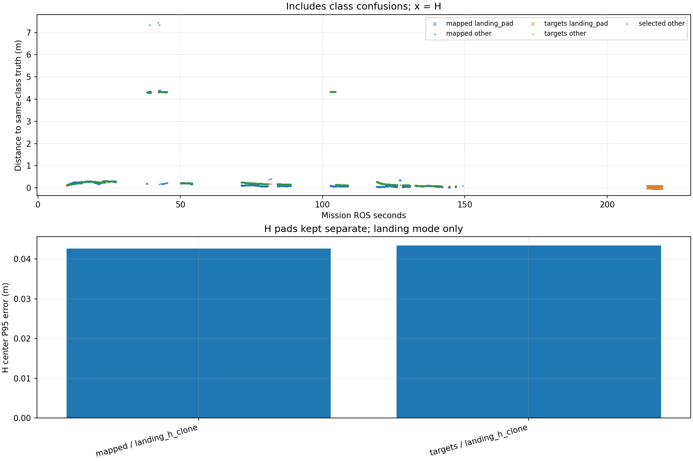

# Recorded target-center comparison

Phase-specific interpretation: [frozen SURVEY, interrupt and low reacquisition comparison](stages/PHASE_REPORT.md). The full-mission statistics below are not initial-high or low-only values.

Scope: 31_rectangle
Gate: FAIL. Same-source route/speed matrix; see main report for paired comparisons and failures.

Run: /home/xhj/liftrace-worktrees/r2026-high-view-search/logs/route_speed_rectangle_seed31_20261004_224908
World: /home/xhj/liftrace-worktrees/r2026-high-view-search/docs/verification/route_speed_20261004/rectangle_seed31/field.world
Coordinate transform: FLU world XY equals mission XY; local Z ground=-0.22, only XY distances compared

Distances below are to same-class truth; inspect the class/instance table before interpreting localization.

| Scope | Stream | Class | Truth instance | N | Median/m | P95/m | RMSE/m | Max/m |
|---|---|---|---|---:|---:|---:|---:|---:|
| unique_valid_mission | hint_bbox | bridge | random_bridge | 21 | 0.3115 | 7.4213 | 2.8184 | 7.5115 |
| unique_valid_mission | hint_bbox | panzer | random_panzer | 20 | 4.2892 | 4.3266 | 3.6003 | 4.3289 |
| unique_valid_mission | hint_bbox | pillbox | random_pillbox | 11 | 0.1769 | 0.2085 | 0.1836 | 0.2134 |
| unique_valid_mission | hint_bbox | tent | random_tent | 8 | 0.1465 | 0.1522 | 0.1435 | 0.1530 |
| unique_valid_mission | hint_vision | bridge | random_bridge | 67 | 0.2721 | 0.2889 | 0.2692 | 0.2891 |
| unique_valid_mission | hint_vision | panzer | random_panzer | 48 | 2.3085 | 4.3256 | 3.0604 | 4.3258 |
| unique_valid_mission | hint_vision | pillbox | random_pillbox | 1 | 0.1476 | 0.1476 | 0.1476 | 0.1476 |
| unique_valid_mission | hint_vision | tent | random_tent | 58 | 0.2038 | 0.2204 | 0.1934 | 0.2205 |
| unique_valid_mission | mapped | bridge | random_bridge | 420 | 0.1230 | 0.3046 | 0.6496 | 7.4406 |
| unique_valid_mission | mapped | landing_pad | landing_h_clone | 92 | 0.0308 | 0.0426 | 0.0321 | 0.0441 |
| unique_valid_mission | mapped | panzer | random_panzer | 326 | 0.0803 | 4.3369 | 2.0217 | 4.3975 |
| unique_valid_mission | mapped | pillbox | random_pillbox | 125 | 0.0805 | 0.1889 | 0.0989 | 0.2229 |
| unique_valid_mission | mapped | red_cross | random_red_cross | 195 | 0.0853 | 0.1023 | 0.0820 | 0.1170 |
| unique_valid_mission | mapped | tent | random_tent | 182 | 0.2225 | 0.2648 | 0.2215 | 0.2826 |
| unique_valid_mission | selected | bridge | random_bridge | 402 | 0.2198 | 0.2881 | 0.2267 | 0.2898 |
| unique_valid_mission | selected | panzer | random_panzer | 324 | 0.2266 | 4.3333 | 2.2212 | 4.3374 |
| unique_valid_mission | selected | pillbox | random_pillbox | 78 | 0.1292 | 0.1477 | 0.1317 | 0.1950 |
| unique_valid_mission | selected | red_cross | random_red_cross | 124 | 0.0911 | 0.1020 | 0.0910 | 0.1124 |
| unique_valid_mission | selected | tent | random_tent | 177 | 0.2135 | 0.2205 | 0.2008 | 0.2206 |
| unique_valid_mission | targets | bridge | random_bridge | 415 | 0.2187 | 0.2880 | 0.2262 | 0.2898 |
| unique_valid_mission | targets | landing_pad | landing_h_clone | 92 | 0.0354 | 0.0434 | 0.0366 | 0.0441 |
| unique_valid_mission | targets | panzer | random_panzer | 340 | 0.2266 | 4.3330 | 2.2187 | 4.3374 |
| unique_valid_mission | targets | pillbox | random_pillbox | 80 | 0.1297 | 0.1493 | 0.1335 | 0.1950 |
| unique_valid_mission | targets | red_cross | random_red_cross | 140 | 0.0911 | 0.1028 | 0.0909 | 0.1124 |
| unique_valid_mission | targets | tent | random_tent | 181 | 0.2135 | 0.2205 | 0.2003 | 0.2206 |
| fresh_unique_mission | hint_bbox | bridge | random_bridge | 21 | 0.3115 | 7.4213 | 2.8184 | 7.5115 |
| fresh_unique_mission | hint_bbox | panzer | random_panzer | 20 | 4.2892 | 4.3266 | 3.6003 | 4.3289 |
| fresh_unique_mission | hint_bbox | pillbox | random_pillbox | 11 | 0.1769 | 0.2085 | 0.1836 | 0.2134 |
| fresh_unique_mission | hint_bbox | tent | random_tent | 8 | 0.1465 | 0.1522 | 0.1435 | 0.1530 |
| fresh_unique_mission | hint_vision | bridge | random_bridge | 67 | 0.2721 | 0.2889 | 0.2692 | 0.2891 |
| fresh_unique_mission | hint_vision | panzer | random_panzer | 48 | 2.3085 | 4.3256 | 3.0604 | 4.3258 |
| fresh_unique_mission | hint_vision | pillbox | random_pillbox | 1 | 0.1476 | 0.1476 | 0.1476 | 0.1476 |
| fresh_unique_mission | hint_vision | tent | random_tent | 58 | 0.2038 | 0.2204 | 0.1934 | 0.2205 |
| fresh_unique_mission | mapped | bridge | random_bridge | 420 | 0.1230 | 0.3046 | 0.6496 | 7.4406 |
| fresh_unique_mission | mapped | landing_pad | landing_h_clone | 92 | 0.0308 | 0.0426 | 0.0321 | 0.0441 |
| fresh_unique_mission | mapped | panzer | random_panzer | 326 | 0.0803 | 4.3369 | 2.0217 | 4.3975 |
| fresh_unique_mission | mapped | pillbox | random_pillbox | 125 | 0.0805 | 0.1889 | 0.0989 | 0.2229 |
| fresh_unique_mission | mapped | red_cross | random_red_cross | 195 | 0.0853 | 0.1023 | 0.0820 | 0.1170 |
| fresh_unique_mission | mapped | tent | random_tent | 182 | 0.2225 | 0.2648 | 0.2215 | 0.2826 |
| fresh_unique_mission | selected | bridge | random_bridge | 402 | 0.2198 | 0.2881 | 0.2267 | 0.2898 |
| fresh_unique_mission | selected | panzer | random_panzer | 324 | 0.2266 | 4.3333 | 2.2212 | 4.3374 |
| fresh_unique_mission | selected | pillbox | random_pillbox | 78 | 0.1292 | 0.1477 | 0.1317 | 0.1950 |
| fresh_unique_mission | selected | red_cross | random_red_cross | 124 | 0.0911 | 0.1020 | 0.0910 | 0.1124 |
| fresh_unique_mission | selected | tent | random_tent | 177 | 0.2135 | 0.2205 | 0.2008 | 0.2206 |
| fresh_unique_mission | targets | bridge | random_bridge | 415 | 0.2187 | 0.2880 | 0.2262 | 0.2898 |
| fresh_unique_mission | targets | landing_pad | landing_h_clone | 92 | 0.0354 | 0.0434 | 0.0366 | 0.0441 |
| fresh_unique_mission | targets | panzer | random_panzer | 340 | 0.2266 | 4.3330 | 2.2187 | 4.3374 |
| fresh_unique_mission | targets | pillbox | random_pillbox | 80 | 0.1297 | 0.1493 | 0.1335 | 0.1950 |
| fresh_unique_mission | targets | red_cross | random_red_cross | 140 | 0.0911 | 0.1028 | 0.0909 | 0.1124 |
| fresh_unique_mission | targets | tent | random_tent | 181 | 0.2135 | 0.2205 | 0.2003 | 0.2206 |
| fresh_nearest_class_agrees | hint_bbox | bridge | random_bridge | 18 | 0.3006 | 0.4398 | 0.3340 | 0.4541 |
| fresh_nearest_class_agrees | hint_bbox | panzer | random_panzer | 6 | 0.3565 | 0.4141 | 0.3585 | 0.4239 |
| fresh_nearest_class_agrees | hint_bbox | pillbox | random_pillbox | 11 | 0.1769 | 0.2085 | 0.1836 | 0.2134 |
| fresh_nearest_class_agrees | hint_bbox | tent | random_tent | 8 | 0.1465 | 0.1522 | 0.1435 | 0.1530 |
| fresh_nearest_class_agrees | hint_vision | bridge | random_bridge | 67 | 0.2721 | 0.2889 | 0.2692 | 0.2891 |
| fresh_nearest_class_agrees | hint_vision | panzer | random_panzer | 24 | 0.2958 | 0.3093 | 0.2950 | 0.3117 |
| fresh_nearest_class_agrees | hint_vision | pillbox | random_pillbox | 1 | 0.1476 | 0.1476 | 0.1476 | 0.1476 |
| fresh_nearest_class_agrees | hint_vision | tent | random_tent | 58 | 0.2038 | 0.2204 | 0.1934 | 0.2205 |
| fresh_nearest_class_agrees | mapped | bridge | random_bridge | 417 | 0.1229 | 0.3037 | 0.1828 | 0.4055 |
| fresh_nearest_class_agrees | mapped | landing_pad | landing_h_clone | 92 | 0.0308 | 0.0426 | 0.0321 | 0.0441 |
| fresh_nearest_class_agrees | mapped | panzer | random_panzer | 255 | 0.0639 | 0.3013 | 0.1571 | 0.3567 |
| fresh_nearest_class_agrees | mapped | pillbox | random_pillbox | 125 | 0.0805 | 0.1889 | 0.0989 | 0.2229 |
| fresh_nearest_class_agrees | mapped | red_cross | random_red_cross | 195 | 0.0853 | 0.1023 | 0.0820 | 0.1170 |
| fresh_nearest_class_agrees | mapped | tent | random_tent | 182 | 0.2225 | 0.2648 | 0.2215 | 0.2826 |
| fresh_nearest_class_agrees | selected | bridge | random_bridge | 402 | 0.2198 | 0.2881 | 0.2267 | 0.2898 |
| fresh_nearest_class_agrees | selected | panzer | random_panzer | 239 | 0.1629 | 0.2966 | 0.2056 | 0.3174 |
| fresh_nearest_class_agrees | selected | pillbox | random_pillbox | 78 | 0.1292 | 0.1477 | 0.1317 | 0.1950 |
| fresh_nearest_class_agrees | selected | red_cross | random_red_cross | 124 | 0.0911 | 0.1020 | 0.0910 | 0.1124 |
| fresh_nearest_class_agrees | selected | tent | random_tent | 177 | 0.2135 | 0.2205 | 0.2008 | 0.2206 |
| fresh_nearest_class_agrees | targets | bridge | random_bridge | 415 | 0.2187 | 0.2880 | 0.2262 | 0.2898 |
| fresh_nearest_class_agrees | targets | landing_pad | landing_h_clone | 92 | 0.0354 | 0.0434 | 0.0366 | 0.0441 |
| fresh_nearest_class_agrees | targets | panzer | random_panzer | 251 | 0.1629 | 0.2976 | 0.2059 | 0.3385 |
| fresh_nearest_class_agrees | targets | pillbox | random_pillbox | 80 | 0.1297 | 0.1493 | 0.1335 | 0.1950 |
| fresh_nearest_class_agrees | targets | red_cross | random_red_cross | 140 | 0.0911 | 0.1028 | 0.0909 | 0.1124 |
| fresh_nearest_class_agrees | targets | tent | random_tent | 181 | 0.2135 | 0.2205 | 0.2003 | 0.2206 |
| fresh_H_landing_mode | mapped | landing_pad | landing_h_clone | 92 | 0.0308 | 0.0426 | 0.0321 | 0.0441 |
| fresh_H_landing_mode | targets | landing_pad | landing_h_clone | 92 | 0.0354 | 0.0434 | 0.0366 | 0.0441 |

## Nearest any-class instance versus predicted class

Fresh unique mapped/targets/selected; all unique mission hints. A large same-class distance can be a class error.

| Stream | Predicted | Nearest class | Nearest instance | N | Median nearest/m | Median same-class/m | Suspected confusion N |
|---|---|---|---|---:|---:|---:|---:|
| hint_bbox | bridge | bridge | random_bridge | 18 | 0.3006 | 0.3006 | 0 |
| hint_bbox | bridge | pillbox | random_pillbox | 3 | 0.0842 | 7.4213 | 3 |
| hint_bbox | panzer | panzer | random_panzer | 6 | 0.3565 | 0.3565 | 0 |
| hint_bbox | panzer | pillbox | random_pillbox | 14 | 0.1936 | 4.3024 | 14 |
| hint_bbox | pillbox | pillbox | random_pillbox | 11 | 0.1769 | 0.1769 | 0 |
| hint_bbox | tent | tent | random_tent | 8 | 0.1465 | 0.1465 | 0 |
| hint_vision | bridge | bridge | random_bridge | 67 | 0.2721 | 0.2721 | 0 |
| hint_vision | panzer | panzer | random_panzer | 24 | 0.2958 | 0.2958 | 0 |
| hint_vision | panzer | pillbox | random_pillbox | 24 | 0.2000 | 4.3226 | 24 |
| hint_vision | pillbox | pillbox | random_pillbox | 1 | 0.1476 | 0.1476 | 0 |
| hint_vision | tent | tent | random_tent | 58 | 0.2038 | 0.2038 | 0 |
| mapped | bridge | bridge | random_bridge | 417 | 0.1229 | 0.1229 | 0 |
| mapped | bridge | pillbox | random_pillbox | 3 | 0.1924 | 7.3480 | 3 |
| mapped | landing_pad | landing_pad | landing_h_clone | 92 | 0.0308 | 0.0308 | 0 |
| mapped | panzer | panzer | random_panzer | 255 | 0.0639 | 0.0639 | 0 |
| mapped | panzer | pillbox | random_pillbox | 71 | 0.1984 | 4.3196 | 71 |
| mapped | pillbox | pillbox | random_pillbox | 125 | 0.0805 | 0.0805 | 0 |
| mapped | red_cross | red_cross | random_red_cross | 195 | 0.0853 | 0.0853 | 0 |
| mapped | tent | tent | random_tent | 182 | 0.2225 | 0.2225 | 0 |
| selected | bridge | bridge | random_bridge | 402 | 0.2198 | 0.2198 | 0 |
| selected | panzer | panzer | random_panzer | 239 | 0.1629 | 0.1629 | 0 |
| selected | panzer | pillbox | random_pillbox | 85 | 0.1962 | 4.3253 | 85 |
| selected | pillbox | pillbox | random_pillbox | 78 | 0.1292 | 0.1292 | 0 |
| selected | red_cross | red_cross | random_red_cross | 124 | 0.0911 | 0.0911 | 0 |
| selected | tent | tent | random_tent | 177 | 0.2135 | 0.2135 | 0 |
| targets | bridge | bridge | random_bridge | 415 | 0.2187 | 0.2187 | 0 |
| targets | landing_pad | landing_pad | landing_h_clone | 92 | 0.0354 | 0.0354 | 0 |
| targets | panzer | panzer | random_panzer | 251 | 0.1629 | 0.1629 | 0 |
| targets | panzer | pillbox | random_pillbox | 89 | 0.1962 | 4.3251 | 89 |
| targets | pillbox | pillbox | random_pillbox | 80 | 0.1297 | 0.1297 | 0 |
| targets | red_cross | red_cross | random_red_cross | 140 | 0.0911 | 0.0911 | 0 |
| targets | tent | tent | random_tent | 181 | 0.2135 | 0.2135 | 0 |

Missing bag topics: []

No rows is missing evidence, not zero error.

- Offline recorded map centers, not parcel impacts or physical release accuracy.
- Association is nearest same-class truth; not an independent instance recall evaluation.
- Same-class distance is not localization-only error: a wrong class may be near a different true instance.
- Nearest-any-instance association is diagnostic, not independently verified object identity.
- Suspected category confusion requires a different nearest class within the stated radius and a same-vs-any distance margin.
- Hint streams are reconstructed from high_view_full_events navigation_support, with explicitly supplied mission frame and projection plane.
- H start and landing pads are separate truth instances; a class/position error can change nearest association.
- World-to-evaluation transform is explicitly supplied, not estimated from the detections.
- Reported error is XY only. H dimensions do not change its center; no Z/size accuracy claim.
- Valid but old candidate publications are separate from fresh unique observations.
- TF lookup reuses bag_replay.TransformTree (latest past sample, max dynamic age 0.5s, no interpolation).
- Raw duplicates and invalid samples remain in CSV; errors aggregate only inside the mission interval.
- H branch-complete counters only show recorded pipeline completion, not proof of a detected H contour; raw detector output was not in this lightweight bag.

All samples including invalid, stale and duplicate publications: center_samples.csv.
Machine-readable provenance, truth and counts: center_summary.json.
