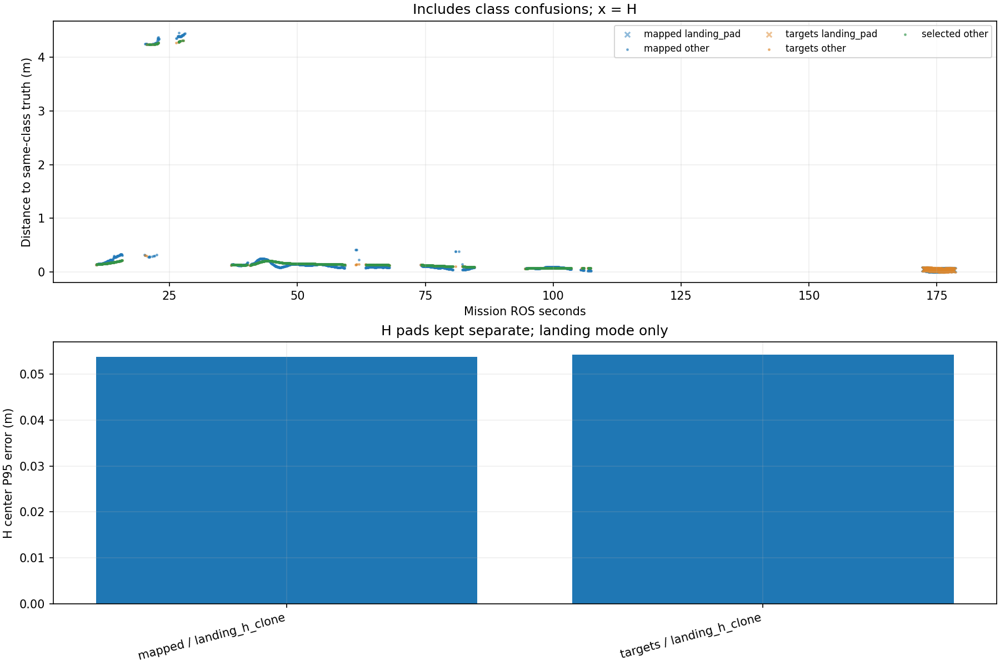

# Recorded target-center comparison

Phase-specific interpretation: [frozen SURVEY, interrupt and low reacquisition comparison](stages/PHASE_REPORT.md). The full-mission statistics below are not initial-high or low-only values.

Scope: 31_snake2
Gate: FAIL. Same-source route/speed matrix; see main report for paired comparisons and failures.

Run: /home/xhj/liftrace-worktrees/r2026-high-view-search/logs/route_speed_snake2_seed31_20261004_231619
World: /home/xhj/liftrace-worktrees/r2026-high-view-search/docs/verification/route_speed_20261004/snake2_seed31/field.world
Coordinate transform: FLU world XY equals mission XY; local Z ground=-0.22, only XY distances compared

Distances below are to same-class truth; inspect the class/instance table before interpreting localization.

| Scope | Stream | Class | Truth instance | N | Median/m | P95/m | RMSE/m | Max/m |
|---|---|---|---|---:|---:|---:|---:|---:|
| unique_valid_mission | hint_bbox | bridge | random_bridge | 7 | 0.1027 | 5.2905 | 2.8382 | 7.5047 |
| unique_valid_mission | hint_bbox | panzer | random_panzer | 74 | 0.3069 | 4.2580 | 1.3404 | 4.2646 |
| unique_valid_mission | hint_bbox | pillbox | random_pillbox | 10 | 0.2683 | 0.3161 | 0.2772 | 0.3310 |
| unique_valid_mission | hint_bbox | red_cross | random_red_cross | 18 | 0.2588 | 0.2683 | 0.2593 | 0.2711 |
| unique_valid_mission | hint_bbox | tent | random_tent | 6 | 0.1596 | 0.1678 | 0.1596 | 0.1696 |
| unique_valid_mission | hint_vision | bridge | random_bridge | 21 | 0.1530 | 0.1878 | 0.1582 | 0.1906 |
| unique_valid_mission | hint_vision | panzer | random_panzer | 42 | 0.1342 | 4.2916 | 2.7079 | 4.2994 |
| unique_valid_mission | hint_vision | red_cross | random_red_cross | 2 | 0.0673 | 0.0673 | 0.0673 | 0.0673 |
| unique_valid_mission | hint_vision | tent | random_tent | 40 | 0.1612 | 0.1997 | 0.1664 | 0.2049 |
| unique_valid_mission | mapped | bridge | random_bridge | 453 | 0.1242 | 0.2399 | 0.1397 | 0.4167 |
| unique_valid_mission | mapped | landing_pad | landing_h_clone | 112 | 0.0364 | 0.0538 | 0.0375 | 0.0563 |
| unique_valid_mission | mapped | panzer | random_panzer | 300 | 0.1021 | 4.3919 | 1.9854 | 4.4542 |
| unique_valid_mission | mapped | pillbox | random_pillbox | 11 | 0.2888 | 0.3172 | 0.2938 | 0.3173 |
| unique_valid_mission | mapped | red_cross | random_red_cross | 206 | 0.0709 | 0.0944 | 0.0725 | 0.0965 |
| unique_valid_mission | mapped | tent | random_tent | 94 | 0.2068 | 0.3227 | 0.2295 | 0.3314 |
| unique_valid_mission | selected | bridge | random_bridge | 438 | 0.1500 | 0.2033 | 0.1573 | 0.2068 |
| unique_valid_mission | selected | panzer | random_panzer | 250 | 0.1224 | 4.2575 | 1.5052 | 4.3094 |
| unique_valid_mission | selected | red_cross | random_red_cross | 187 | 0.0699 | 0.0761 | 0.0712 | 0.0761 |
| unique_valid_mission | selected | tent | random_tent | 92 | 0.1662 | 0.2103 | 0.1718 | 0.2155 |
| unique_valid_mission | targets | bridge | random_bridge | 450 | 0.1497 | 0.2031 | 0.1569 | 0.2068 |
| unique_valid_mission | targets | landing_pad | landing_h_clone | 111 | 0.0362 | 0.0542 | 0.0408 | 0.0557 |
| unique_valid_mission | targets | panzer | random_panzer | 263 | 0.1221 | 4.2637 | 1.5144 | 4.3094 |
| unique_valid_mission | targets | pillbox | random_pillbox | 2 | 0.3011 | 0.3059 | 0.3011 | 0.3064 |
| unique_valid_mission | targets | red_cross | random_red_cross | 197 | 0.0702 | 0.0761 | 0.0712 | 0.0761 |
| unique_valid_mission | targets | tent | random_tent | 94 | 0.1653 | 0.2102 | 0.1711 | 0.2155 |
| fresh_unique_mission | hint_bbox | bridge | random_bridge | 7 | 0.1027 | 5.2905 | 2.8382 | 7.5047 |
| fresh_unique_mission | hint_bbox | panzer | random_panzer | 74 | 0.3069 | 4.2580 | 1.3404 | 4.2646 |
| fresh_unique_mission | hint_bbox | pillbox | random_pillbox | 10 | 0.2683 | 0.3161 | 0.2772 | 0.3310 |
| fresh_unique_mission | hint_bbox | red_cross | random_red_cross | 18 | 0.2588 | 0.2683 | 0.2593 | 0.2711 |
| fresh_unique_mission | hint_bbox | tent | random_tent | 6 | 0.1596 | 0.1678 | 0.1596 | 0.1696 |
| fresh_unique_mission | hint_vision | bridge | random_bridge | 21 | 0.1530 | 0.1878 | 0.1582 | 0.1906 |
| fresh_unique_mission | hint_vision | panzer | random_panzer | 42 | 0.1342 | 4.2916 | 2.7079 | 4.2994 |
| fresh_unique_mission | hint_vision | red_cross | random_red_cross | 2 | 0.0673 | 0.0673 | 0.0673 | 0.0673 |
| fresh_unique_mission | hint_vision | tent | random_tent | 40 | 0.1612 | 0.1997 | 0.1664 | 0.2049 |
| fresh_unique_mission | mapped | bridge | random_bridge | 453 | 0.1242 | 0.2399 | 0.1397 | 0.4167 |
| fresh_unique_mission | mapped | landing_pad | landing_h_clone | 112 | 0.0364 | 0.0538 | 0.0375 | 0.0563 |
| fresh_unique_mission | mapped | panzer | random_panzer | 300 | 0.1021 | 4.3919 | 1.9854 | 4.4542 |
| fresh_unique_mission | mapped | pillbox | random_pillbox | 11 | 0.2888 | 0.3172 | 0.2938 | 0.3173 |
| fresh_unique_mission | mapped | red_cross | random_red_cross | 206 | 0.0709 | 0.0944 | 0.0725 | 0.0965 |
| fresh_unique_mission | mapped | tent | random_tent | 94 | 0.2068 | 0.3227 | 0.2295 | 0.3314 |
| fresh_unique_mission | selected | bridge | random_bridge | 438 | 0.1500 | 0.2033 | 0.1573 | 0.2068 |
| fresh_unique_mission | selected | panzer | random_panzer | 250 | 0.1224 | 4.2575 | 1.5052 | 4.3094 |
| fresh_unique_mission | selected | red_cross | random_red_cross | 187 | 0.0699 | 0.0761 | 0.0712 | 0.0761 |
| fresh_unique_mission | selected | tent | random_tent | 92 | 0.1662 | 0.2103 | 0.1718 | 0.2155 |
| fresh_unique_mission | targets | bridge | random_bridge | 450 | 0.1497 | 0.2031 | 0.1569 | 0.2068 |
| fresh_unique_mission | targets | landing_pad | landing_h_clone | 111 | 0.0362 | 0.0542 | 0.0408 | 0.0557 |
| fresh_unique_mission | targets | panzer | random_panzer | 263 | 0.1221 | 4.2637 | 1.5144 | 4.3094 |
| fresh_unique_mission | targets | pillbox | random_pillbox | 2 | 0.3011 | 0.3059 | 0.3011 | 0.3064 |
| fresh_unique_mission | targets | red_cross | random_red_cross | 197 | 0.0702 | 0.0761 | 0.0712 | 0.0761 |
| fresh_unique_mission | targets | tent | random_tent | 94 | 0.1653 | 0.2102 | 0.1711 | 0.2155 |
| fresh_nearest_class_agrees | hint_bbox | bridge | random_bridge | 6 | 0.1018 | 0.1224 | 0.1060 | 0.1238 |
| fresh_nearest_class_agrees | hint_bbox | panzer | random_panzer | 67 | 0.2949 | 0.4424 | 0.2996 | 0.5143 |
| fresh_nearest_class_agrees | hint_bbox | pillbox | random_pillbox | 10 | 0.2683 | 0.3161 | 0.2772 | 0.3310 |
| fresh_nearest_class_agrees | hint_bbox | red_cross | random_red_cross | 18 | 0.2588 | 0.2683 | 0.2593 | 0.2711 |
| fresh_nearest_class_agrees | hint_bbox | tent | random_tent | 6 | 0.1596 | 0.1678 | 0.1596 | 0.1696 |
| fresh_nearest_class_agrees | hint_vision | bridge | random_bridge | 21 | 0.1530 | 0.1878 | 0.1582 | 0.1906 |
| fresh_nearest_class_agrees | hint_vision | panzer | random_panzer | 25 | 0.1316 | 0.1345 | 0.1313 | 0.1347 |
| fresh_nearest_class_agrees | hint_vision | red_cross | random_red_cross | 2 | 0.0673 | 0.0673 | 0.0673 | 0.0673 |
| fresh_nearest_class_agrees | hint_vision | tent | random_tent | 40 | 0.1612 | 0.1997 | 0.1664 | 0.2049 |
| fresh_nearest_class_agrees | mapped | bridge | random_bridge | 453 | 0.1242 | 0.2399 | 0.1397 | 0.4167 |
| fresh_nearest_class_agrees | mapped | landing_pad | landing_h_clone | 112 | 0.0364 | 0.0538 | 0.0375 | 0.0563 |
| fresh_nearest_class_agrees | mapped | panzer | random_panzer | 237 | 0.0914 | 0.1401 | 0.1065 | 0.3864 |
| fresh_nearest_class_agrees | mapped | pillbox | random_pillbox | 11 | 0.2888 | 0.3172 | 0.2938 | 0.3173 |
| fresh_nearest_class_agrees | mapped | red_cross | random_red_cross | 206 | 0.0709 | 0.0944 | 0.0725 | 0.0965 |
| fresh_nearest_class_agrees | mapped | tent | random_tent | 94 | 0.2068 | 0.3227 | 0.2295 | 0.3314 |
| fresh_nearest_class_agrees | selected | bridge | random_bridge | 438 | 0.1500 | 0.2033 | 0.1573 | 0.2068 |
| fresh_nearest_class_agrees | selected | panzer | random_panzer | 219 | 0.1186 | 0.1351 | 0.1171 | 0.1361 |
| fresh_nearest_class_agrees | selected | red_cross | random_red_cross | 187 | 0.0699 | 0.0761 | 0.0712 | 0.0761 |
| fresh_nearest_class_agrees | selected | tent | random_tent | 92 | 0.1662 | 0.2103 | 0.1718 | 0.2155 |
| fresh_nearest_class_agrees | targets | bridge | random_bridge | 450 | 0.1497 | 0.2031 | 0.1569 | 0.2068 |
| fresh_nearest_class_agrees | targets | landing_pad | landing_h_clone | 111 | 0.0362 | 0.0542 | 0.0408 | 0.0557 |
| fresh_nearest_class_agrees | targets | panzer | random_panzer | 230 | 0.1182 | 0.1351 | 0.1170 | 0.1361 |
| fresh_nearest_class_agrees | targets | pillbox | random_pillbox | 2 | 0.3011 | 0.3059 | 0.3011 | 0.3064 |
| fresh_nearest_class_agrees | targets | red_cross | random_red_cross | 197 | 0.0702 | 0.0761 | 0.0712 | 0.0761 |
| fresh_nearest_class_agrees | targets | tent | random_tent | 94 | 0.1653 | 0.2102 | 0.1711 | 0.2155 |
| fresh_H_landing_mode | mapped | landing_pad | landing_h_clone | 112 | 0.0364 | 0.0538 | 0.0375 | 0.0563 |
| fresh_H_landing_mode | targets | landing_pad | landing_h_clone | 111 | 0.0362 | 0.0542 | 0.0408 | 0.0557 |

## Nearest any-class instance versus predicted class

Fresh unique mapped/targets/selected; all unique mission hints. A large same-class distance can be a class error.

| Stream | Predicted | Nearest class | Nearest instance | N | Median nearest/m | Median same-class/m | Suspected confusion N |
|---|---|---|---|---:|---:|---:|---:|
| hint_bbox | bridge | bridge | random_bridge | 6 | 0.1018 | 0.1018 | 0 |
| hint_bbox | bridge | pillbox | random_pillbox | 1 | 0.0620 | 7.5047 | 1 |
| hint_bbox | panzer | panzer | random_panzer | 67 | 0.2949 | 0.2949 | 0 |
| hint_bbox | panzer | pillbox | random_pillbox | 7 | 0.2702 | 4.2597 | 7 |
| hint_bbox | pillbox | pillbox | random_pillbox | 10 | 0.2683 | 0.2683 | 0 |
| hint_bbox | red_cross | red_cross | random_red_cross | 18 | 0.2588 | 0.2588 | 0 |
| hint_bbox | tent | tent | random_tent | 6 | 0.1596 | 0.1596 | 0 |
| hint_vision | bridge | bridge | random_bridge | 21 | 0.1530 | 0.1530 | 0 |
| hint_vision | panzer | panzer | random_panzer | 25 | 0.1316 | 0.1316 | 0 |
| hint_vision | panzer | pillbox | random_pillbox | 17 | 0.2871 | 4.2429 | 17 |
| hint_vision | red_cross | red_cross | random_red_cross | 2 | 0.0673 | 0.0673 | 0 |
| hint_vision | tent | tent | random_tent | 40 | 0.1612 | 0.1612 | 0 |
| mapped | bridge | bridge | random_bridge | 453 | 0.1242 | 0.1242 | 0 |
| mapped | landing_pad | landing_pad | landing_h_clone | 112 | 0.0364 | 0.0364 | 0 |
| mapped | panzer | panzer | random_panzer | 237 | 0.0914 | 0.0914 | 0 |
| mapped | panzer | pillbox | random_pillbox | 63 | 0.2789 | 4.3461 | 63 |
| mapped | pillbox | pillbox | random_pillbox | 11 | 0.2888 | 0.2888 | 0 |
| mapped | red_cross | red_cross | random_red_cross | 206 | 0.0709 | 0.0709 | 0 |
| mapped | tent | tent | random_tent | 94 | 0.2068 | 0.2068 | 0 |
| selected | bridge | bridge | random_bridge | 438 | 0.1500 | 0.1500 | 0 |
| selected | panzer | panzer | random_panzer | 219 | 0.1186 | 0.1186 | 0 |
| selected | panzer | pillbox | random_pillbox | 31 | 0.2873 | 4.2508 | 31 |
| selected | red_cross | red_cross | random_red_cross | 187 | 0.0699 | 0.0699 | 0 |
| selected | tent | tent | random_tent | 92 | 0.1662 | 0.1662 | 0 |
| targets | bridge | bridge | random_bridge | 450 | 0.1497 | 0.1497 | 0 |
| targets | landing_pad | landing_pad | landing_h_clone | 111 | 0.0362 | 0.0362 | 0 |
| targets | panzer | panzer | random_panzer | 230 | 0.1182 | 0.1182 | 0 |
| targets | panzer | pillbox | random_pillbox | 33 | 0.2860 | 4.2521 | 33 |
| targets | pillbox | pillbox | random_pillbox | 2 | 0.3011 | 0.3011 | 0 |
| targets | red_cross | red_cross | random_red_cross | 197 | 0.0702 | 0.0702 | 0 |
| targets | tent | tent | random_tent | 94 | 0.1653 | 0.1653 | 0 |

Missing bag topics: []

No rows is missing evidence, not zero error.

- Offline recorded map centers, not parcel impacts or physical release accuracy.
- Association is nearest same-class truth; not an independent instance recall evaluation.
- Same-class distance is not localization-only error: a wrong class may be near a different true instance.
- Nearest-any-instance association is diagnostic, not independently verified object identity.
- Suspected category confusion requires a different nearest class within the stated radius and a same-vs-any distance margin.
- Hint streams are reconstructed from high_view_full_events navigation_support, with explicitly supplied mission frame and projection plane.
- H start and landing pads are separate truth instances; a class/position error can change nearest association.
- World-to-evaluation transform is explicitly supplied, not estimated from the detections.
- Reported error is XY only. H dimensions do not change its center; no Z/size accuracy claim.
- Valid but old candidate publications are separate from fresh unique observations.
- TF lookup reuses bag_replay.TransformTree (latest past sample, max dynamic age 0.5s, no interpolation).
- Raw duplicates and invalid samples remain in CSV; errors aggregate only inside the mission interval.
- H branch-complete counters only show recorded pipeline completion, not proof of a detected H contour; raw detector output was not in this lightweight bag.

All samples including invalid, stale and duplicate publications: center_samples.csv.
Machine-readable provenance, truth and counts: center_summary.json.
