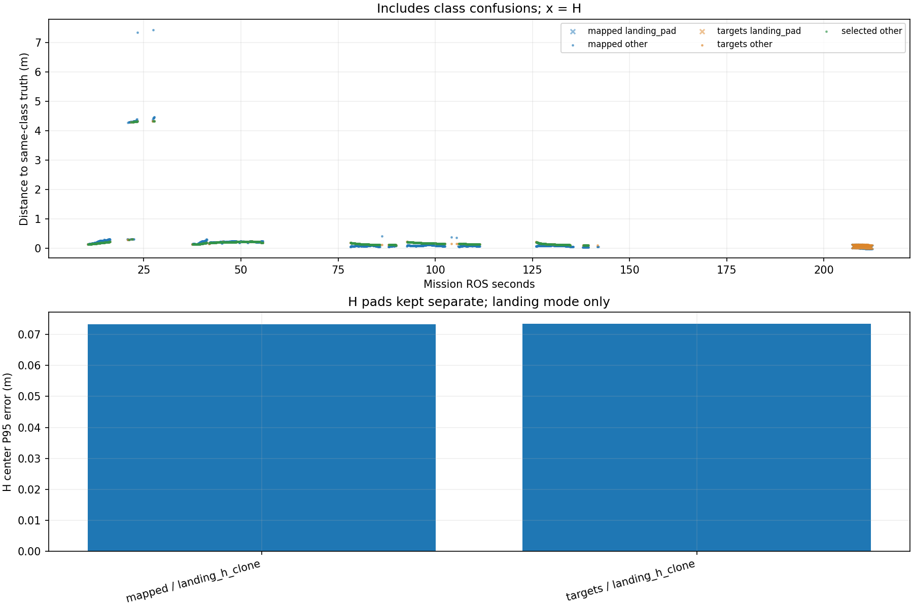

# Recorded target-center comparison

Phase-specific interpretation: [frozen SURVEY, interrupt and low reacquisition comparison](stages/PHASE_REPORT.md). The full-mission statistics below are not initial-high or low-only values.

Scope: 31_snake3
Gate: PASS. Same-source route/speed matrix; see main report for paired comparisons and failures.

Run: /home/xhj/liftrace-worktrees/r2026-high-view-search/logs/route_speed_snake3_seed31_20261004_235752
World: /home/xhj/liftrace-worktrees/r2026-high-view-search/docs/verification/route_speed_20261004/snake3_seed31/field.world
Coordinate transform: FLU world XY equals mission XY; local Z ground=-0.22, only XY distances compared

Distances below are to same-class truth; inspect the class/instance table before interpreting localization.

| Scope | Stream | Class | Truth instance | N | Median/m | P95/m | RMSE/m | Max/m |
|---|---|---|---|---:|---:|---:|---:|---:|
| unique_valid_mission | hint_bbox | bridge | random_bridge | 13 | 0.1591 | 7.5082 | 5.0817 | 7.5300 |
| unique_valid_mission | hint_bbox | panzer | random_panzer | 55 | 0.3968 | 4.3237 | 2.5505 | 4.3337 |
| unique_valid_mission | hint_bbox | pillbox | random_pillbox | 23 | 0.2788 | 0.3039 | 0.2348 | 0.3240 |
| unique_valid_mission | hint_bbox | red_cross | random_red_cross | 10 | 0.2273 | 0.2325 | 0.2267 | 0.2334 |
| unique_valid_mission | hint_bbox | tent | random_tent | 8 | 0.1570 | 0.1630 | 0.1556 | 0.1641 |
| unique_valid_mission | hint_vision | bridge | random_bridge | 80 | 0.2048 | 0.2156 | 0.2038 | 0.2159 |
| unique_valid_mission | hint_vision | panzer | random_panzer | 34 | 0.1428 | 4.2988 | 1.2855 | 4.3047 |
| unique_valid_mission | hint_vision | red_cross | random_red_cross | 19 | 0.2281 | 0.2292 | 0.2204 | 0.2292 |
| unique_valid_mission | hint_vision | tent | random_tent | 44 | 0.1678 | 0.2039 | 0.1706 | 0.2079 |
| unique_valid_mission | mapped | bridge | random_bridge | 489 | 0.1003 | 0.2349 | 0.4960 | 7.4220 |
| unique_valid_mission | mapped | landing_pad | landing_h_clone | 82 | 0.0559 | 0.0733 | 0.0559 | 0.0741 |
| unique_valid_mission | mapped | panzer | random_panzer | 301 | 0.0854 | 4.3177 | 1.5445 | 4.4606 |
| unique_valid_mission | mapped | pillbox | random_pillbox | 16 | 0.3054 | 0.3142 | 0.3046 | 0.3143 |
| unique_valid_mission | mapped | red_cross | random_red_cross | 272 | 0.0873 | 0.2281 | 0.1191 | 0.2365 |
| unique_valid_mission | mapped | tent | random_tent | 111 | 0.2282 | 0.2997 | 0.2277 | 0.3102 |
| unique_valid_mission | selected | bridge | random_bridge | 471 | 0.1856 | 0.2153 | 0.1823 | 0.2160 |
| unique_valid_mission | selected | panzer | random_panzer | 265 | 0.1389 | 4.3003 | 1.1612 | 4.3316 |
| unique_valid_mission | selected | pillbox | random_pillbox | 4 | 0.3002 | 0.3029 | 0.3002 | 0.3031 |
| unique_valid_mission | selected | red_cross | random_red_cross | 212 | 0.1306 | 0.2290 | 0.1542 | 0.2306 |
| unique_valid_mission | selected | tent | random_tent | 107 | 0.1724 | 0.2124 | 0.1748 | 0.2166 |
| unique_valid_mission | targets | bridge | random_bridge | 484 | 0.1840 | 0.2152 | 0.1819 | 0.2160 |
| unique_valid_mission | targets | landing_pad | landing_h_clone | 81 | 0.0648 | 0.0735 | 0.0645 | 0.0737 |
| unique_valid_mission | targets | panzer | random_panzer | 280 | 0.1389 | 4.3020 | 1.1875 | 4.3316 |
| unique_valid_mission | targets | pillbox | random_pillbox | 6 | 0.2988 | 0.3028 | 0.2997 | 0.3031 |
| unique_valid_mission | targets | red_cross | random_red_cross | 226 | 0.1306 | 0.2291 | 0.1546 | 0.2306 |
| unique_valid_mission | targets | tent | random_tent | 111 | 0.1724 | 0.2140 | 0.1749 | 0.2167 |
| fresh_unique_mission | hint_bbox | bridge | random_bridge | 13 | 0.1591 | 7.5082 | 5.0817 | 7.5300 |
| fresh_unique_mission | hint_bbox | panzer | random_panzer | 55 | 0.3968 | 4.3237 | 2.5505 | 4.3337 |
| fresh_unique_mission | hint_bbox | pillbox | random_pillbox | 23 | 0.2788 | 0.3039 | 0.2348 | 0.3240 |
| fresh_unique_mission | hint_bbox | red_cross | random_red_cross | 10 | 0.2273 | 0.2325 | 0.2267 | 0.2334 |
| fresh_unique_mission | hint_bbox | tent | random_tent | 8 | 0.1570 | 0.1630 | 0.1556 | 0.1641 |
| fresh_unique_mission | hint_vision | bridge | random_bridge | 80 | 0.2048 | 0.2156 | 0.2038 | 0.2159 |
| fresh_unique_mission | hint_vision | panzer | random_panzer | 34 | 0.1428 | 4.2988 | 1.2855 | 4.3047 |
| fresh_unique_mission | hint_vision | red_cross | random_red_cross | 19 | 0.2281 | 0.2292 | 0.2204 | 0.2292 |
| fresh_unique_mission | hint_vision | tent | random_tent | 44 | 0.1678 | 0.2039 | 0.1706 | 0.2079 |
| fresh_unique_mission | mapped | bridge | random_bridge | 489 | 0.1003 | 0.2349 | 0.4960 | 7.4220 |
| fresh_unique_mission | mapped | landing_pad | landing_h_clone | 82 | 0.0559 | 0.0733 | 0.0559 | 0.0741 |
| fresh_unique_mission | mapped | panzer | random_panzer | 301 | 0.0854 | 4.3177 | 1.5445 | 4.4606 |
| fresh_unique_mission | mapped | pillbox | random_pillbox | 16 | 0.3054 | 0.3142 | 0.3046 | 0.3143 |
| fresh_unique_mission | mapped | red_cross | random_red_cross | 272 | 0.0873 | 0.2281 | 0.1191 | 0.2365 |
| fresh_unique_mission | mapped | tent | random_tent | 111 | 0.2282 | 0.2997 | 0.2277 | 0.3102 |
| fresh_unique_mission | selected | bridge | random_bridge | 471 | 0.1856 | 0.2153 | 0.1823 | 0.2160 |
| fresh_unique_mission | selected | panzer | random_panzer | 265 | 0.1389 | 4.3003 | 1.1612 | 4.3316 |
| fresh_unique_mission | selected | pillbox | random_pillbox | 4 | 0.3002 | 0.3029 | 0.3002 | 0.3031 |
| fresh_unique_mission | selected | red_cross | random_red_cross | 212 | 0.1306 | 0.2290 | 0.1542 | 0.2306 |
| fresh_unique_mission | selected | tent | random_tent | 107 | 0.1724 | 0.2124 | 0.1748 | 0.2166 |
| fresh_unique_mission | targets | bridge | random_bridge | 484 | 0.1840 | 0.2152 | 0.1819 | 0.2160 |
| fresh_unique_mission | targets | landing_pad | landing_h_clone | 81 | 0.0648 | 0.0735 | 0.0645 | 0.0737 |
| fresh_unique_mission | targets | panzer | random_panzer | 280 | 0.1389 | 4.3020 | 1.1875 | 4.3316 |
| fresh_unique_mission | targets | pillbox | random_pillbox | 6 | 0.2988 | 0.3028 | 0.2997 | 0.3031 |
| fresh_unique_mission | targets | red_cross | random_red_cross | 226 | 0.1306 | 0.2291 | 0.1546 | 0.2306 |
| fresh_unique_mission | targets | tent | random_tent | 111 | 0.1724 | 0.2140 | 0.1749 | 0.2167 |
| fresh_nearest_class_agrees | hint_bbox | bridge | random_bridge | 7 | 0.1048 | 0.1529 | 0.1192 | 0.1591 |
| fresh_nearest_class_agrees | hint_bbox | panzer | random_panzer | 36 | 0.3629 | 0.4562 | 0.3459 | 0.5043 |
| fresh_nearest_class_agrees | hint_bbox | pillbox | random_pillbox | 23 | 0.2788 | 0.3039 | 0.2348 | 0.3240 |
| fresh_nearest_class_agrees | hint_bbox | red_cross | random_red_cross | 10 | 0.2273 | 0.2325 | 0.2267 | 0.2334 |
| fresh_nearest_class_agrees | hint_bbox | tent | random_tent | 8 | 0.1570 | 0.1630 | 0.1556 | 0.1641 |
| fresh_nearest_class_agrees | hint_vision | bridge | random_bridge | 80 | 0.2048 | 0.2156 | 0.2038 | 0.2159 |
| fresh_nearest_class_agrees | hint_vision | panzer | random_panzer | 31 | 0.1408 | 0.1722 | 0.1489 | 0.1870 |
| fresh_nearest_class_agrees | hint_vision | red_cross | random_red_cross | 19 | 0.2281 | 0.2292 | 0.2204 | 0.2292 |
| fresh_nearest_class_agrees | hint_vision | tent | random_tent | 44 | 0.1678 | 0.2039 | 0.1706 | 0.2079 |
| fresh_nearest_class_agrees | mapped | bridge | random_bridge | 487 | 0.0996 | 0.2341 | 0.1534 | 0.3712 |
| fresh_nearest_class_agrees | mapped | landing_pad | landing_h_clone | 82 | 0.0559 | 0.0733 | 0.0559 | 0.0741 |
| fresh_nearest_class_agrees | mapped | panzer | random_panzer | 263 | 0.0816 | 0.2458 | 0.1317 | 0.4128 |
| fresh_nearest_class_agrees | mapped | pillbox | random_pillbox | 16 | 0.3054 | 0.3142 | 0.3046 | 0.3143 |
| fresh_nearest_class_agrees | mapped | red_cross | random_red_cross | 272 | 0.0873 | 0.2281 | 0.1191 | 0.2365 |
| fresh_nearest_class_agrees | mapped | tent | random_tent | 111 | 0.2282 | 0.2997 | 0.2277 | 0.3102 |
| fresh_nearest_class_agrees | selected | bridge | random_bridge | 471 | 0.1856 | 0.2153 | 0.1823 | 0.2160 |
| fresh_nearest_class_agrees | selected | panzer | random_panzer | 246 | 0.1379 | 0.1801 | 0.1413 | 0.1897 |
| fresh_nearest_class_agrees | selected | pillbox | random_pillbox | 4 | 0.3002 | 0.3029 | 0.3002 | 0.3031 |
| fresh_nearest_class_agrees | selected | red_cross | random_red_cross | 212 | 0.1306 | 0.2290 | 0.1542 | 0.2306 |
| fresh_nearest_class_agrees | selected | tent | random_tent | 107 | 0.1724 | 0.2124 | 0.1748 | 0.2166 |
| fresh_nearest_class_agrees | targets | bridge | random_bridge | 484 | 0.1840 | 0.2152 | 0.1819 | 0.2160 |
| fresh_nearest_class_agrees | targets | landing_pad | landing_h_clone | 81 | 0.0648 | 0.0735 | 0.0645 | 0.0737 |
| fresh_nearest_class_agrees | targets | panzer | random_panzer | 259 | 0.1376 | 0.1828 | 0.1415 | 0.1897 |
| fresh_nearest_class_agrees | targets | pillbox | random_pillbox | 6 | 0.2988 | 0.3028 | 0.2997 | 0.3031 |
| fresh_nearest_class_agrees | targets | red_cross | random_red_cross | 226 | 0.1306 | 0.2291 | 0.1546 | 0.2306 |
| fresh_nearest_class_agrees | targets | tent | random_tent | 111 | 0.1724 | 0.2140 | 0.1749 | 0.2167 |
| fresh_H_landing_mode | mapped | landing_pad | landing_h_clone | 82 | 0.0559 | 0.0733 | 0.0559 | 0.0741 |
| fresh_H_landing_mode | targets | landing_pad | landing_h_clone | 81 | 0.0648 | 0.0735 | 0.0645 | 0.0737 |

## Nearest any-class instance versus predicted class

Fresh unique mapped/targets/selected; all unique mission hints. A large same-class distance can be a class error.

| Stream | Predicted | Nearest class | Nearest instance | N | Median nearest/m | Median same-class/m | Suspected confusion N |
|---|---|---|---|---:|---:|---:|---:|
| hint_bbox | bridge | bridge | random_bridge | 7 | 0.1048 | 0.1048 | 0 |
| hint_bbox | bridge | pillbox | random_pillbox | 6 | 0.1238 | 7.4896 | 6 |
| hint_bbox | panzer | panzer | random_panzer | 36 | 0.3629 | 0.3629 | 0 |
| hint_bbox | panzer | pillbox | random_pillbox | 19 | 0.2934 | 4.3153 | 19 |
| hint_bbox | pillbox | pillbox | random_pillbox | 23 | 0.2788 | 0.2788 | 0 |
| hint_bbox | red_cross | red_cross | random_red_cross | 10 | 0.2273 | 0.2273 | 0 |
| hint_bbox | tent | tent | random_tent | 8 | 0.1570 | 0.1570 | 0 |
| hint_vision | bridge | bridge | random_bridge | 80 | 0.2048 | 0.2048 | 0 |
| hint_vision | panzer | panzer | random_panzer | 31 | 0.1408 | 0.1408 | 0 |
| hint_vision | panzer | pillbox | random_pillbox | 3 | 0.3035 | 4.3011 | 3 |
| hint_vision | red_cross | red_cross | random_red_cross | 19 | 0.2281 | 0.2281 | 0 |
| hint_vision | tent | tent | random_tent | 44 | 0.1678 | 0.1678 | 0 |
| mapped | bridge | bridge | random_bridge | 487 | 0.0996 | 0.0996 | 0 |
| mapped | bridge | pillbox | random_pillbox | 2 | 0.2021 | 7.3776 | 2 |
| mapped | landing_pad | landing_pad | landing_h_clone | 82 | 0.0559 | 0.0559 | 0 |
| mapped | panzer | panzer | random_panzer | 263 | 0.0816 | 0.0816 | 0 |
| mapped | panzer | pillbox | random_pillbox | 38 | 0.3021 | 4.3173 | 38 |
| mapped | pillbox | pillbox | random_pillbox | 16 | 0.3054 | 0.3054 | 0 |
| mapped | red_cross | red_cross | random_red_cross | 272 | 0.0873 | 0.0873 | 0 |
| mapped | tent | tent | random_tent | 111 | 0.2282 | 0.2282 | 0 |
| selected | bridge | bridge | random_bridge | 471 | 0.1856 | 0.1856 | 0 |
| selected | panzer | panzer | random_panzer | 246 | 0.1379 | 0.1379 | 0 |
| selected | panzer | pillbox | random_pillbox | 19 | 0.3035 | 4.3048 | 19 |
| selected | pillbox | pillbox | random_pillbox | 4 | 0.3002 | 0.3002 | 0 |
| selected | red_cross | red_cross | random_red_cross | 212 | 0.1306 | 0.1306 | 0 |
| selected | tent | tent | random_tent | 107 | 0.1724 | 0.1724 | 0 |
| targets | bridge | bridge | random_bridge | 484 | 0.1840 | 0.1840 | 0 |
| targets | landing_pad | landing_pad | landing_h_clone | 81 | 0.0648 | 0.0648 | 0 |
| targets | panzer | panzer | random_panzer | 259 | 0.1376 | 0.1376 | 0 |
| targets | panzer | pillbox | random_pillbox | 21 | 0.3034 | 4.3057 | 21 |
| targets | pillbox | pillbox | random_pillbox | 6 | 0.2988 | 0.2988 | 0 |
| targets | red_cross | red_cross | random_red_cross | 226 | 0.1306 | 0.1306 | 0 |
| targets | tent | tent | random_tent | 111 | 0.1724 | 0.1724 | 0 |

Missing bag topics: []

No rows is missing evidence, not zero error.

- Offline recorded map centers, not parcel impacts or physical release accuracy.
- Association is nearest same-class truth; not an independent instance recall evaluation.
- Same-class distance is not localization-only error: a wrong class may be near a different true instance.
- Nearest-any-instance association is diagnostic, not independently verified object identity.
- Suspected category confusion requires a different nearest class within the stated radius and a same-vs-any distance margin.
- Hint streams are reconstructed from high_view_full_events navigation_support, with explicitly supplied mission frame and projection plane.
- H start and landing pads are separate truth instances; a class/position error can change nearest association.
- World-to-evaluation transform is explicitly supplied, not estimated from the detections.
- Reported error is XY only. H dimensions do not change its center; no Z/size accuracy claim.
- Valid but old candidate publications are separate from fresh unique observations.
- TF lookup reuses bag_replay.TransformTree (latest past sample, max dynamic age 0.5s, no interpolation).
- Raw duplicates and invalid samples remain in CSV; errors aggregate only inside the mission interval.
- H branch-complete counters only show recorded pipeline completion, not proof of a detected H contour; raw detector output was not in this lightweight bag.

All samples including invalid, stale and duplicate publications: center_samples.csv.
Machine-readable provenance, truth and counts: center_summary.json.
