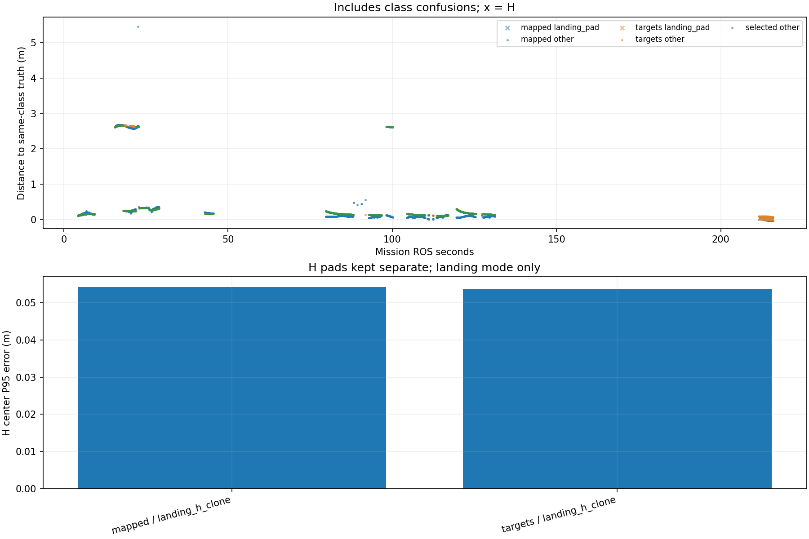

# Recorded target-center comparison

Phase-specific interpretation: [frozen SURVEY, interrupt and low reacquisition comparison](stages/PHASE_REPORT.md). The full-mission statistics below are not initial-high or low-only values.

Scope: 38_rectangle_baseline
Gate: PASS. Same-source route/speed matrix; see main report for paired comparisons and failures.

Run: /home/xhj/liftrace-worktrees/r2026-high-view-search/logs/route_speed_rectangle_baseline_seed38_20261005_001117
World: /home/xhj/liftrace-worktrees/r2026-high-view-search/docs/verification/route_speed_20261004/rectangle_baseline_seed38/field.world
Coordinate transform: FLU world XY equals mission XY; local Z ground=-0.22, only XY distances compared

Distances below are to same-class truth; inspect the class/instance table before interpreting localization.

| Scope | Stream | Class | Truth instance | N | Median/m | P95/m | RMSE/m | Max/m |
|---|---|---|---|---:|---:|---:|---:|---:|
| unique_valid_mission | hint_bbox | bridge | random_bridge | 14 | 0.3467 | 2.1579 | 1.4670 | 5.3427 |
| unique_valid_mission | hint_bbox | panzer | random_panzer | 27 | 0.4088 | 2.6743 | 1.8441 | 2.7133 |
| unique_valid_mission | hint_bbox | pillbox | random_pillbox | 3 | 0.2071 | 0.2695 | 0.2267 | 0.2765 |
| unique_valid_mission | hint_bbox | red_cross | random_red_cross | 4 | 0.1717 | 0.1726 | 0.1716 | 0.1727 |
| unique_valid_mission | hint_bbox | tent | random_tent | 9 | 0.3975 | 0.4599 | 0.3980 | 0.4676 |
| unique_valid_mission | hint_vision | bridge | random_bridge | 23 | 0.2794 | 0.3006 | 0.2805 | 0.3037 |
| unique_valid_mission | hint_vision | panzer | random_panzer | 72 | 2.6291 | 2.6610 | 2.0033 | 2.6614 |
| unique_valid_mission | hint_vision | red_cross | random_red_cross | 45 | 0.1625 | 0.1658 | 0.1584 | 0.1661 |
| unique_valid_mission | hint_vision | tent | random_tent | 22 | 0.3290 | 0.3307 | 0.3292 | 0.3311 |
| unique_valid_mission | mapped | bridge | random_bridge | 251 | 0.1000 | 0.3553 | 0.3855 | 5.4581 |
| unique_valid_mission | mapped | landing_pad | landing_h_clone | 71 | 0.0340 | 0.0542 | 0.0370 | 0.0546 |
| unique_valid_mission | mapped | panzer | random_panzer | 463 | 0.1129 | 2.6709 | 1.4470 | 2.6806 |
| unique_valid_mission | mapped | pillbox | random_pillbox | 42 | 0.1024 | 0.1276 | 0.1071 | 0.2197 |
| unique_valid_mission | mapped | red_cross | random_red_cross | 345 | 0.1153 | 0.1986 | 0.1312 | 0.2390 |
| unique_valid_mission | mapped | tent | random_tent | 64 | 0.3294 | 0.3401 | 0.3287 | 0.3579 |
| unique_valid_mission | selected | bridge | random_bridge | 237 | 0.1867 | 0.3008 | 0.2153 | 0.3126 |
| unique_valid_mission | selected | panzer | random_panzer | 390 | 0.1888 | 2.6483 | 1.2252 | 2.6619 |
| unique_valid_mission | selected | red_cross | random_red_cross | 289 | 0.1365 | 0.1661 | 0.1405 | 0.1669 |
| unique_valid_mission | selected | tent | random_tent | 58 | 0.3292 | 0.3307 | 0.3291 | 0.3319 |
| unique_valid_mission | targets | bridge | random_bridge | 249 | 0.1867 | 0.3024 | 0.2156 | 0.3126 |
| unique_valid_mission | targets | landing_pad | landing_h_clone | 71 | 0.0475 | 0.0536 | 0.0465 | 0.0537 |
| unique_valid_mission | targets | panzer | random_panzer | 443 | 0.2066 | 2.6565 | 1.3977 | 2.6620 |
| unique_valid_mission | targets | red_cross | random_red_cross | 305 | 0.1361 | 0.1660 | 0.1401 | 0.1669 |
| unique_valid_mission | targets | tent | random_tent | 60 | 0.3293 | 0.3319 | 0.3296 | 0.3470 |
| fresh_unique_mission | hint_bbox | bridge | random_bridge | 14 | 0.3467 | 2.1579 | 1.4670 | 5.3427 |
| fresh_unique_mission | hint_bbox | panzer | random_panzer | 27 | 0.4088 | 2.6743 | 1.8441 | 2.7133 |
| fresh_unique_mission | hint_bbox | pillbox | random_pillbox | 3 | 0.2071 | 0.2695 | 0.2267 | 0.2765 |
| fresh_unique_mission | hint_bbox | red_cross | random_red_cross | 4 | 0.1717 | 0.1726 | 0.1716 | 0.1727 |
| fresh_unique_mission | hint_bbox | tent | random_tent | 9 | 0.3975 | 0.4599 | 0.3980 | 0.4676 |
| fresh_unique_mission | hint_vision | bridge | random_bridge | 23 | 0.2794 | 0.3006 | 0.2805 | 0.3037 |
| fresh_unique_mission | hint_vision | panzer | random_panzer | 72 | 2.6291 | 2.6610 | 2.0033 | 2.6614 |
| fresh_unique_mission | hint_vision | red_cross | random_red_cross | 45 | 0.1625 | 0.1658 | 0.1584 | 0.1661 |
| fresh_unique_mission | hint_vision | tent | random_tent | 22 | 0.3290 | 0.3307 | 0.3292 | 0.3311 |
| fresh_unique_mission | mapped | bridge | random_bridge | 251 | 0.1000 | 0.3553 | 0.3855 | 5.4581 |
| fresh_unique_mission | mapped | landing_pad | landing_h_clone | 71 | 0.0340 | 0.0542 | 0.0370 | 0.0546 |
| fresh_unique_mission | mapped | panzer | random_panzer | 463 | 0.1129 | 2.6709 | 1.4470 | 2.6806 |
| fresh_unique_mission | mapped | pillbox | random_pillbox | 42 | 0.1024 | 0.1276 | 0.1071 | 0.2197 |
| fresh_unique_mission | mapped | red_cross | random_red_cross | 345 | 0.1153 | 0.1986 | 0.1312 | 0.2390 |
| fresh_unique_mission | mapped | tent | random_tent | 64 | 0.3294 | 0.3401 | 0.3287 | 0.3579 |
| fresh_unique_mission | selected | bridge | random_bridge | 237 | 0.1867 | 0.3008 | 0.2153 | 0.3126 |
| fresh_unique_mission | selected | panzer | random_panzer | 390 | 0.1888 | 2.6483 | 1.2252 | 2.6619 |
| fresh_unique_mission | selected | red_cross | random_red_cross | 289 | 0.1365 | 0.1661 | 0.1405 | 0.1669 |
| fresh_unique_mission | selected | tent | random_tent | 58 | 0.3292 | 0.3307 | 0.3291 | 0.3319 |
| fresh_unique_mission | targets | bridge | random_bridge | 249 | 0.1867 | 0.3024 | 0.2156 | 0.3126 |
| fresh_unique_mission | targets | landing_pad | landing_h_clone | 71 | 0.0475 | 0.0536 | 0.0465 | 0.0537 |
| fresh_unique_mission | targets | panzer | random_panzer | 443 | 0.2066 | 2.6565 | 1.3977 | 2.6620 |
| fresh_unique_mission | targets | red_cross | random_red_cross | 305 | 0.1361 | 0.1660 | 0.1401 | 0.1669 |
| fresh_unique_mission | targets | tent | random_tent | 60 | 0.3293 | 0.3319 | 0.3296 | 0.3470 |
| fresh_nearest_class_agrees | hint_bbox | bridge | random_bridge | 13 | 0.3395 | 0.4320 | 0.3491 | 0.4429 |
| fresh_nearest_class_agrees | hint_bbox | panzer | random_panzer | 14 | 0.2562 | 0.4052 | 0.2993 | 0.4088 |
| fresh_nearest_class_agrees | hint_bbox | pillbox | random_pillbox | 3 | 0.2071 | 0.2695 | 0.2267 | 0.2765 |
| fresh_nearest_class_agrees | hint_bbox | red_cross | random_red_cross | 4 | 0.1717 | 0.1726 | 0.1716 | 0.1727 |
| fresh_nearest_class_agrees | hint_bbox | tent | random_tent | 9 | 0.3975 | 0.4599 | 0.3980 | 0.4676 |
| fresh_nearest_class_agrees | hint_vision | bridge | random_bridge | 23 | 0.2794 | 0.3006 | 0.2805 | 0.3037 |
| fresh_nearest_class_agrees | hint_vision | panzer | random_panzer | 31 | 0.2428 | 0.2524 | 0.2418 | 0.2527 |
| fresh_nearest_class_agrees | hint_vision | red_cross | random_red_cross | 45 | 0.1625 | 0.1658 | 0.1584 | 0.1661 |
| fresh_nearest_class_agrees | hint_vision | tent | random_tent | 22 | 0.3290 | 0.3307 | 0.3292 | 0.3311 |
| fresh_nearest_class_agrees | mapped | bridge | random_bridge | 250 | 0.0997 | 0.3545 | 0.1733 | 0.3702 |
| fresh_nearest_class_agrees | mapped | landing_pad | landing_h_clone | 71 | 0.0340 | 0.0542 | 0.0370 | 0.0546 |
| fresh_nearest_class_agrees | mapped | panzer | random_panzer | 324 | 0.0909 | 0.2749 | 0.1568 | 0.5621 |
| fresh_nearest_class_agrees | mapped | pillbox | random_pillbox | 42 | 0.1024 | 0.1276 | 0.1071 | 0.2197 |
| fresh_nearest_class_agrees | mapped | red_cross | random_red_cross | 345 | 0.1153 | 0.1986 | 0.1312 | 0.2390 |
| fresh_nearest_class_agrees | mapped | tent | random_tent | 64 | 0.3294 | 0.3401 | 0.3287 | 0.3579 |
| fresh_nearest_class_agrees | selected | bridge | random_bridge | 237 | 0.1867 | 0.3008 | 0.2153 | 0.3126 |
| fresh_nearest_class_agrees | selected | panzer | random_panzer | 307 | 0.1621 | 0.2495 | 0.1831 | 0.2529 |
| fresh_nearest_class_agrees | selected | red_cross | random_red_cross | 289 | 0.1365 | 0.1661 | 0.1405 | 0.1669 |
| fresh_nearest_class_agrees | selected | tent | random_tent | 58 | 0.3292 | 0.3307 | 0.3291 | 0.3319 |
| fresh_nearest_class_agrees | targets | bridge | random_bridge | 249 | 0.1867 | 0.3024 | 0.2156 | 0.3126 |
| fresh_nearest_class_agrees | targets | landing_pad | landing_h_clone | 71 | 0.0475 | 0.0536 | 0.0465 | 0.0537 |
| fresh_nearest_class_agrees | targets | panzer | random_panzer | 320 | 0.1619 | 0.2500 | 0.1830 | 0.2537 |
| fresh_nearest_class_agrees | targets | red_cross | random_red_cross | 305 | 0.1361 | 0.1660 | 0.1401 | 0.1669 |
| fresh_nearest_class_agrees | targets | tent | random_tent | 60 | 0.3293 | 0.3319 | 0.3296 | 0.3470 |
| fresh_H_landing_mode | mapped | landing_pad | landing_h_clone | 71 | 0.0340 | 0.0542 | 0.0370 | 0.0546 |
| fresh_H_landing_mode | targets | landing_pad | landing_h_clone | 71 | 0.0475 | 0.0536 | 0.0465 | 0.0537 |

## Nearest any-class instance versus predicted class

Fresh unique mapped/targets/selected; all unique mission hints. A large same-class distance can be a class error.

| Stream | Predicted | Nearest class | Nearest instance | N | Median nearest/m | Median same-class/m | Suspected confusion N |
|---|---|---|---|---:|---:|---:|---:|
| hint_bbox | bridge | bridge | random_bridge | 13 | 0.3395 | 0.3395 | 0 |
| hint_bbox | bridge | pillbox | random_pillbox | 1 | 0.2505 | 5.3427 | 1 |
| hint_bbox | panzer | panzer | random_panzer | 14 | 0.2562 | 0.2562 | 0 |
| hint_bbox | panzer | pillbox | random_pillbox | 13 | 0.2222 | 2.6284 | 13 |
| hint_bbox | pillbox | pillbox | random_pillbox | 3 | 0.2071 | 0.2071 | 0 |
| hint_bbox | red_cross | red_cross | random_red_cross | 4 | 0.1717 | 0.1717 | 0 |
| hint_bbox | tent | tent | random_tent | 9 | 0.3975 | 0.3975 | 0 |
| hint_vision | bridge | bridge | random_bridge | 23 | 0.2794 | 0.2794 | 0 |
| hint_vision | panzer | panzer | random_panzer | 31 | 0.2428 | 0.2428 | 0 |
| hint_vision | panzer | pillbox | random_pillbox | 41 | 0.2470 | 2.6488 | 41 |
| hint_vision | red_cross | red_cross | random_red_cross | 45 | 0.1625 | 0.1625 | 0 |
| hint_vision | tent | tent | random_tent | 22 | 0.3290 | 0.3290 | 0 |
| mapped | bridge | bridge | random_bridge | 250 | 0.0997 | 0.0997 | 0 |
| mapped | bridge | pillbox | random_pillbox | 1 | 0.3406 | 5.4581 | 1 |
| mapped | landing_pad | landing_pad | landing_h_clone | 71 | 0.0340 | 0.0340 | 0 |
| mapped | panzer | panzer | random_panzer | 324 | 0.0909 | 0.0909 | 0 |
| mapped | panzer | pillbox | random_pillbox | 139 | 0.2557 | 2.6310 | 139 |
| mapped | pillbox | pillbox | random_pillbox | 42 | 0.1024 | 0.1024 | 0 |
| mapped | red_cross | red_cross | random_red_cross | 345 | 0.1153 | 0.1153 | 0 |
| mapped | tent | tent | random_tent | 64 | 0.3294 | 0.3294 | 0 |
| selected | bridge | bridge | random_bridge | 237 | 0.1867 | 0.1867 | 0 |
| selected | panzer | panzer | random_panzer | 307 | 0.1621 | 0.1621 | 0 |
| selected | panzer | pillbox | random_pillbox | 83 | 0.2419 | 2.6262 | 83 |
| selected | red_cross | red_cross | random_red_cross | 289 | 0.1365 | 0.1365 | 0 |
| selected | tent | tent | random_tent | 58 | 0.3292 | 0.3292 | 0 |
| targets | bridge | bridge | random_bridge | 249 | 0.1867 | 0.1867 | 0 |
| targets | landing_pad | landing_pad | landing_h_clone | 71 | 0.0475 | 0.0475 | 0 |
| targets | panzer | panzer | random_panzer | 320 | 0.1619 | 0.1619 | 0 |
| targets | panzer | pillbox | random_pillbox | 123 | 0.2447 | 2.6297 | 123 |
| targets | red_cross | red_cross | random_red_cross | 305 | 0.1361 | 0.1361 | 0 |
| targets | tent | tent | random_tent | 60 | 0.3293 | 0.3293 | 0 |

Missing bag topics: []

No rows is missing evidence, not zero error.

- Offline recorded map centers, not parcel impacts or physical release accuracy.
- Association is nearest same-class truth; not an independent instance recall evaluation.
- Same-class distance is not localization-only error: a wrong class may be near a different true instance.
- Nearest-any-instance association is diagnostic, not independently verified object identity.
- Suspected category confusion requires a different nearest class within the stated radius and a same-vs-any distance margin.
- Hint streams are reconstructed from high_view_full_events navigation_support, with explicitly supplied mission frame and projection plane.
- H start and landing pads are separate truth instances; a class/position error can change nearest association.
- World-to-evaluation transform is explicitly supplied, not estimated from the detections.
- Reported error is XY only. H dimensions do not change its center; no Z/size accuracy claim.
- Valid but old candidate publications are separate from fresh unique observations.
- TF lookup reuses bag_replay.TransformTree (latest past sample, max dynamic age 0.5s, no interpolation).
- Raw duplicates and invalid samples remain in CSV; errors aggregate only inside the mission interval.
- H branch-complete counters only show recorded pipeline completion, not proof of a detected H contour; raw detector output was not in this lightweight bag.

All samples including invalid, stale and duplicate publications: center_samples.csv.
Machine-readable provenance, truth and counts: center_summary.json.
