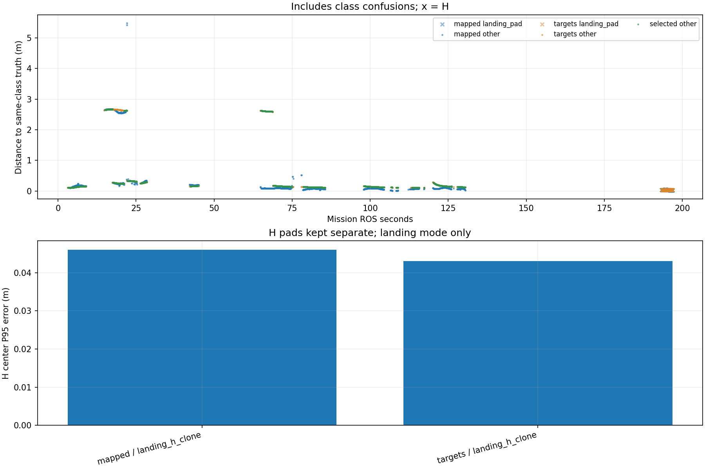

# Recorded target-center comparison

Phase-specific interpretation: [frozen SURVEY, interrupt and low reacquisition comparison](stages/PHASE_REPORT.md). The full-mission statistics below are not initial-high or low-only values.

Scope: 38_rectangle
Gate: FAIL. Same-source route/speed matrix; see main report for paired comparisons and failures.

Run: /home/xhj/liftrace-worktrees/r2026-high-view-search/logs/route_speed_rectangle_seed38_20261005_002556
World: /home/xhj/liftrace-worktrees/r2026-high-view-search/docs/verification/route_speed_20261004/rectangle_seed38/field.world
Coordinate transform: FLU world XY equals mission XY; local Z ground=-0.22, only XY distances compared

Distances below are to same-class truth; inspect the class/instance table before interpreting localization.

| Scope | Stream | Class | Truth instance | N | Median/m | P95/m | RMSE/m | Max/m |
|---|---|---|---|---:|---:|---:|---:|---:|
| unique_valid_mission | hint_bbox | bridge | random_bridge | 26 | 0.2508 | 5.3700 | 1.8398 | 5.3948 |
| unique_valid_mission | hint_bbox | panzer | random_panzer | 28 | 0.4518 | 2.7227 | 1.8394 | 2.7716 |
| unique_valid_mission | hint_bbox | pillbox | random_pillbox | 2 | 0.2204 | 0.2695 | 0.2271 | 0.2750 |
| unique_valid_mission | hint_bbox | red_cross | random_red_cross | 4 | 0.1704 | 0.1713 | 0.1698 | 0.1714 |
| unique_valid_mission | hint_bbox | tent | random_tent | 8 | 0.3910 | 0.4517 | 0.3945 | 0.4649 |
| unique_valid_mission | hint_vision | bridge | random_bridge | 17 | 0.2638 | 0.2846 | 0.2640 | 0.2871 |
| unique_valid_mission | hint_vision | panzer | random_panzer | 78 | 2.6369 | 2.6660 | 2.1072 | 2.6663 |
| unique_valid_mission | hint_vision | red_cross | random_red_cross | 44 | 0.1537 | 0.1646 | 0.1516 | 0.1654 |
| unique_valid_mission | hint_vision | tent | random_tent | 25 | 0.3324 | 0.3349 | 0.3303 | 0.3351 |
| unique_valid_mission | mapped | bridge | random_bridge | 217 | 0.0897 | 0.3335 | 0.5455 | 5.4765 |
| unique_valid_mission | mapped | landing_pad | landing_h_clone | 67 | 0.0397 | 0.0460 | 0.0377 | 0.0464 |
| unique_valid_mission | mapped | panzer | random_panzer | 214 | 2.5629 | 2.6723 | 2.1091 | 2.6800 |
| unique_valid_mission | mapped | pillbox | random_pillbox | 344 | 0.0844 | 0.1140 | 0.1046 | 0.5219 |
| unique_valid_mission | mapped | red_cross | random_red_cross | 371 | 0.0897 | 0.2012 | 0.1289 | 0.2457 |
| unique_valid_mission | mapped | tent | random_tent | 65 | 0.3259 | 0.3427 | 0.3131 | 0.3924 |
| unique_valid_mission | selected | bridge | random_bridge | 202 | 0.1687 | 0.2851 | 0.1988 | 0.2969 |
| unique_valid_mission | selected | panzer | random_panzer | 198 | 2.5980 | 2.6645 | 2.0821 | 2.6667 |
| unique_valid_mission | selected | pillbox | random_pillbox | 255 | 0.1384 | 0.1731 | 0.1431 | 0.1789 |
| unique_valid_mission | selected | red_cross | random_red_cross | 308 | 0.1363 | 0.1635 | 0.1376 | 0.1666 |
| unique_valid_mission | selected | tent | random_tent | 59 | 0.3291 | 0.3353 | 0.3279 | 0.3361 |
| unique_valid_mission | targets | bridge | random_bridge | 213 | 0.1690 | 0.2871 | 0.1991 | 0.2969 |
| unique_valid_mission | targets | landing_pad | landing_h_clone | 66 | 0.0409 | 0.0430 | 0.0408 | 0.0431 |
| unique_valid_mission | targets | panzer | random_panzer | 253 | 2.6079 | 2.6661 | 2.2050 | 2.6671 |
| unique_valid_mission | targets | pillbox | random_pillbox | 264 | 0.1392 | 0.1729 | 0.1430 | 0.1789 |
| unique_valid_mission | targets | red_cross | random_red_cross | 326 | 0.1356 | 0.1636 | 0.1373 | 0.1666 |
| unique_valid_mission | targets | tent | random_tent | 61 | 0.3292 | 0.3356 | 0.3283 | 0.3437 |
| fresh_unique_mission | hint_bbox | bridge | random_bridge | 26 | 0.2508 | 5.3700 | 1.8398 | 5.3948 |
| fresh_unique_mission | hint_bbox | panzer | random_panzer | 28 | 0.4518 | 2.7227 | 1.8394 | 2.7716 |
| fresh_unique_mission | hint_bbox | pillbox | random_pillbox | 2 | 0.2204 | 0.2695 | 0.2271 | 0.2750 |
| fresh_unique_mission | hint_bbox | red_cross | random_red_cross | 4 | 0.1704 | 0.1713 | 0.1698 | 0.1714 |
| fresh_unique_mission | hint_bbox | tent | random_tent | 8 | 0.3910 | 0.4517 | 0.3945 | 0.4649 |
| fresh_unique_mission | hint_vision | bridge | random_bridge | 17 | 0.2638 | 0.2846 | 0.2640 | 0.2871 |
| fresh_unique_mission | hint_vision | panzer | random_panzer | 78 | 2.6369 | 2.6660 | 2.1072 | 2.6663 |
| fresh_unique_mission | hint_vision | red_cross | random_red_cross | 44 | 0.1537 | 0.1646 | 0.1516 | 0.1654 |
| fresh_unique_mission | hint_vision | tent | random_tent | 25 | 0.3324 | 0.3349 | 0.3303 | 0.3351 |
| fresh_unique_mission | mapped | bridge | random_bridge | 217 | 0.0897 | 0.3335 | 0.5455 | 5.4765 |
| fresh_unique_mission | mapped | landing_pad | landing_h_clone | 67 | 0.0397 | 0.0460 | 0.0377 | 0.0464 |
| fresh_unique_mission | mapped | panzer | random_panzer | 214 | 2.5629 | 2.6723 | 2.1091 | 2.6800 |
| fresh_unique_mission | mapped | pillbox | random_pillbox | 344 | 0.0844 | 0.1140 | 0.1046 | 0.5219 |
| fresh_unique_mission | mapped | red_cross | random_red_cross | 371 | 0.0897 | 0.2012 | 0.1289 | 0.2457 |
| fresh_unique_mission | mapped | tent | random_tent | 65 | 0.3259 | 0.3427 | 0.3131 | 0.3924 |
| fresh_unique_mission | selected | bridge | random_bridge | 202 | 0.1687 | 0.2851 | 0.1988 | 0.2969 |
| fresh_unique_mission | selected | panzer | random_panzer | 198 | 2.5980 | 2.6645 | 2.0821 | 2.6667 |
| fresh_unique_mission | selected | pillbox | random_pillbox | 255 | 0.1384 | 0.1731 | 0.1431 | 0.1789 |
| fresh_unique_mission | selected | red_cross | random_red_cross | 308 | 0.1363 | 0.1635 | 0.1376 | 0.1666 |
| fresh_unique_mission | selected | tent | random_tent | 59 | 0.3291 | 0.3353 | 0.3279 | 0.3361 |
| fresh_unique_mission | targets | bridge | random_bridge | 213 | 0.1690 | 0.2871 | 0.1991 | 0.2969 |
| fresh_unique_mission | targets | landing_pad | landing_h_clone | 66 | 0.0409 | 0.0430 | 0.0408 | 0.0431 |
| fresh_unique_mission | targets | panzer | random_panzer | 253 | 2.6079 | 2.6661 | 2.2050 | 2.6671 |
| fresh_unique_mission | targets | pillbox | random_pillbox | 264 | 0.1392 | 0.1729 | 0.1430 | 0.1789 |
| fresh_unique_mission | targets | red_cross | random_red_cross | 326 | 0.1356 | 0.1636 | 0.1373 | 0.1666 |
| fresh_unique_mission | targets | tent | random_tent | 61 | 0.3292 | 0.3356 | 0.3283 | 0.3437 |
| fresh_nearest_class_agrees | hint_bbox | bridge | random_bridge | 23 | 0.2492 | 0.2825 | 0.2509 | 0.3102 |
| fresh_nearest_class_agrees | hint_bbox | panzer | random_panzer | 15 | 0.2886 | 0.4464 | 0.3368 | 0.4654 |
| fresh_nearest_class_agrees | hint_bbox | pillbox | random_pillbox | 2 | 0.2204 | 0.2695 | 0.2271 | 0.2750 |
| fresh_nearest_class_agrees | hint_bbox | red_cross | random_red_cross | 4 | 0.1704 | 0.1713 | 0.1698 | 0.1714 |
| fresh_nearest_class_agrees | hint_bbox | tent | random_tent | 8 | 0.3910 | 0.4517 | 0.3945 | 0.4649 |
| fresh_nearest_class_agrees | hint_vision | bridge | random_bridge | 17 | 0.2638 | 0.2846 | 0.2640 | 0.2871 |
| fresh_nearest_class_agrees | hint_vision | panzer | random_panzer | 29 | 0.2557 | 0.2769 | 0.2573 | 0.2784 |
| fresh_nearest_class_agrees | hint_vision | red_cross | random_red_cross | 44 | 0.1537 | 0.1646 | 0.1516 | 0.1654 |
| fresh_nearest_class_agrees | hint_vision | tent | random_tent | 25 | 0.3324 | 0.3349 | 0.3303 | 0.3351 |
| fresh_nearest_class_agrees | mapped | bridge | random_bridge | 215 | 0.0887 | 0.3267 | 0.1561 | 0.3443 |
| fresh_nearest_class_agrees | mapped | landing_pad | landing_h_clone | 67 | 0.0397 | 0.0460 | 0.0377 | 0.0464 |
| fresh_nearest_class_agrees | mapped | panzer | random_panzer | 76 | 0.2499 | 0.2755 | 0.2477 | 0.2820 |
| fresh_nearest_class_agrees | mapped | pillbox | random_pillbox | 344 | 0.0844 | 0.1140 | 0.1046 | 0.5219 |
| fresh_nearest_class_agrees | mapped | red_cross | random_red_cross | 371 | 0.0897 | 0.2012 | 0.1289 | 0.2457 |
| fresh_nearest_class_agrees | mapped | tent | random_tent | 65 | 0.3259 | 0.3427 | 0.3131 | 0.3924 |
| fresh_nearest_class_agrees | selected | bridge | random_bridge | 202 | 0.1687 | 0.2851 | 0.1988 | 0.2969 |
| fresh_nearest_class_agrees | selected | panzer | random_panzer | 74 | 0.2522 | 0.2774 | 0.2550 | 0.2808 |
| fresh_nearest_class_agrees | selected | pillbox | random_pillbox | 255 | 0.1384 | 0.1731 | 0.1431 | 0.1789 |
| fresh_nearest_class_agrees | selected | red_cross | random_red_cross | 308 | 0.1363 | 0.1635 | 0.1376 | 0.1666 |
| fresh_nearest_class_agrees | selected | tent | random_tent | 59 | 0.3291 | 0.3353 | 0.3279 | 0.3361 |
| fresh_nearest_class_agrees | targets | bridge | random_bridge | 213 | 0.1690 | 0.2871 | 0.1991 | 0.2969 |
| fresh_nearest_class_agrees | targets | landing_pad | landing_h_clone | 66 | 0.0409 | 0.0430 | 0.0408 | 0.0431 |
| fresh_nearest_class_agrees | targets | panzer | random_panzer | 76 | 0.2529 | 0.2793 | 0.2557 | 0.2820 |
| fresh_nearest_class_agrees | targets | pillbox | random_pillbox | 264 | 0.1392 | 0.1729 | 0.1430 | 0.1789 |
| fresh_nearest_class_agrees | targets | red_cross | random_red_cross | 326 | 0.1356 | 0.1636 | 0.1373 | 0.1666 |
| fresh_nearest_class_agrees | targets | tent | random_tent | 61 | 0.3292 | 0.3356 | 0.3283 | 0.3437 |
| fresh_H_landing_mode | mapped | landing_pad | landing_h_clone | 67 | 0.0397 | 0.0460 | 0.0377 | 0.0464 |
| fresh_H_landing_mode | targets | landing_pad | landing_h_clone | 66 | 0.0409 | 0.0430 | 0.0408 | 0.0431 |

## Nearest any-class instance versus predicted class

Fresh unique mapped/targets/selected; all unique mission hints. A large same-class distance can be a class error.

| Stream | Predicted | Nearest class | Nearest instance | N | Median nearest/m | Median same-class/m | Suspected confusion N |
|---|---|---|---|---:|---:|---:|---:|
| hint_bbox | bridge | bridge | random_bridge | 23 | 0.2492 | 0.2492 | 0 |
| hint_bbox | bridge | pillbox | random_pillbox | 3 | 0.2488 | 5.3803 | 3 |
| hint_bbox | panzer | panzer | random_panzer | 15 | 0.2886 | 0.2886 | 0 |
| hint_bbox | panzer | pillbox | random_pillbox | 13 | 0.2498 | 2.6562 | 13 |
| hint_bbox | pillbox | pillbox | random_pillbox | 2 | 0.2204 | 0.2204 | 0 |
| hint_bbox | red_cross | red_cross | random_red_cross | 4 | 0.1704 | 0.1704 | 0 |
| hint_bbox | tent | tent | random_tent | 8 | 0.3910 | 0.3910 | 0 |
| hint_vision | bridge | bridge | random_bridge | 17 | 0.2638 | 0.2638 | 0 |
| hint_vision | panzer | panzer | random_panzer | 29 | 0.2557 | 0.2557 | 0 |
| hint_vision | panzer | pillbox | random_pillbox | 49 | 0.2576 | 2.6563 | 49 |
| hint_vision | red_cross | red_cross | random_red_cross | 44 | 0.1537 | 0.1537 | 0 |
| hint_vision | tent | tent | random_tent | 25 | 0.3324 | 0.3324 | 0 |
| mapped | bridge | bridge | random_bridge | 215 | 0.0887 | 0.0887 | 0 |
| mapped | bridge | pillbox | random_pillbox | 2 | 0.3094 | 5.4468 | 2 |
| mapped | landing_pad | landing_pad | landing_h_clone | 67 | 0.0397 | 0.0397 | 0 |
| mapped | panzer | panzer | random_panzer | 76 | 0.2499 | 0.2499 | 0 |
| mapped | panzer | pillbox | random_pillbox | 138 | 0.2592 | 2.6413 | 138 |
| mapped | pillbox | pillbox | random_pillbox | 344 | 0.0844 | 0.0844 | 0 |
| mapped | red_cross | red_cross | random_red_cross | 371 | 0.0897 | 0.0897 | 0 |
| mapped | tent | tent | random_tent | 65 | 0.3259 | 0.3259 | 0 |
| selected | bridge | bridge | random_bridge | 202 | 0.1687 | 0.1687 | 0 |
| selected | panzer | panzer | random_panzer | 74 | 0.2522 | 0.2522 | 0 |
| selected | panzer | pillbox | random_pillbox | 124 | 0.2343 | 2.6160 | 124 |
| selected | pillbox | pillbox | random_pillbox | 255 | 0.1384 | 0.1384 | 0 |
| selected | red_cross | red_cross | random_red_cross | 308 | 0.1363 | 0.1363 | 0 |
| selected | tent | tent | random_tent | 59 | 0.3291 | 0.3291 | 0 |
| targets | bridge | bridge | random_bridge | 213 | 0.1690 | 0.1690 | 0 |
| targets | landing_pad | landing_pad | landing_h_clone | 66 | 0.0409 | 0.0409 | 0 |
| targets | panzer | panzer | random_panzer | 76 | 0.2529 | 0.2529 | 0 |
| targets | panzer | pillbox | random_pillbox | 177 | 0.2487 | 2.6264 | 177 |
| targets | pillbox | pillbox | random_pillbox | 264 | 0.1392 | 0.1392 | 0 |
| targets | red_cross | red_cross | random_red_cross | 326 | 0.1356 | 0.1356 | 0 |
| targets | tent | tent | random_tent | 61 | 0.3292 | 0.3292 | 0 |

Missing bag topics: []

No rows is missing evidence, not zero error.

- Offline recorded map centers, not parcel impacts or physical release accuracy.
- Association is nearest same-class truth; not an independent instance recall evaluation.
- Same-class distance is not localization-only error: a wrong class may be near a different true instance.
- Nearest-any-instance association is diagnostic, not independently verified object identity.
- Suspected category confusion requires a different nearest class within the stated radius and a same-vs-any distance margin.
- Hint streams are reconstructed from high_view_full_events navigation_support, with explicitly supplied mission frame and projection plane.
- H start and landing pads are separate truth instances; a class/position error can change nearest association.
- World-to-evaluation transform is explicitly supplied, not estimated from the detections.
- Reported error is XY only. H dimensions do not change its center; no Z/size accuracy claim.
- Valid but old candidate publications are separate from fresh unique observations.
- TF lookup reuses bag_replay.TransformTree (latest past sample, max dynamic age 0.5s, no interpolation).
- Raw duplicates and invalid samples remain in CSV; errors aggregate only inside the mission interval.
- H branch-complete counters only show recorded pipeline completion, not proof of a detected H contour; raw detector output was not in this lightweight bag.

All samples including invalid, stale and duplicate publications: center_samples.csv.
Machine-readable provenance, truth and counts: center_summary.json.
