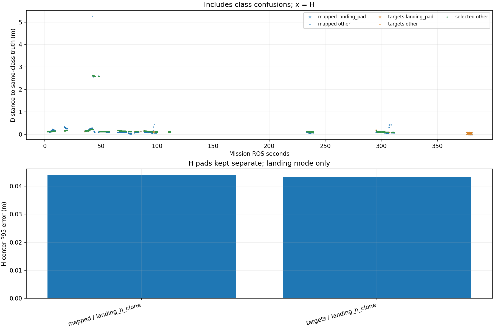

# Recorded target-center comparison

Phase-specific interpretation: [frozen SURVEY, interrupt and low reacquisition comparison](stages/PHASE_REPORT.md). The full-mission statistics below are not initial-high or low-only values.

Scope: 38_snake2
Gate: FAIL. Same-source route/speed matrix; see main report for paired comparisons and failures.

Run: /home/xhj/liftrace-worktrees/r2026-high-view-search/logs/route_speed_snake2_seed38_20261005_004057
World: /home/xhj/liftrace-worktrees/r2026-high-view-search/docs/verification/route_speed_20261004/snake2_seed38/field.world
Coordinate transform: FLU world XY equals mission XY; local Z ground=-0.22, only XY distances compared

Distances below are to same-class truth; inspect the class/instance table before interpreting localization.

| Scope | Stream | Class | Truth instance | N | Median/m | P95/m | RMSE/m | Max/m |
|---|---|---|---|---:|---:|---:|---:|---:|
| unique_valid_mission | hint_bbox | bridge | random_bridge | 10 | 0.1244 | 5.2159 | 2.3340 | 5.2436 |
| unique_valid_mission | hint_bbox | panzer | random_panzer | 4 | 2.6086 | 2.6234 | 2.6115 | 2.6252 |
| unique_valid_mission | hint_bbox | red_cross | random_red_cross | 3 | 0.1578 | 0.1602 | 0.1583 | 0.1605 |
| unique_valid_mission | hint_bbox | tent | random_tent | 9 | 0.1529 | 0.2014 | 0.1664 | 0.2072 |
| unique_valid_mission | hint_vision | bridge | random_bridge | 26 | 0.1542 | 0.1570 | 0.1538 | 0.1577 |
| unique_valid_mission | hint_vision | pillbox | random_pillbox | 1 | 0.1258 | 0.1258 | 0.1258 | 0.1258 |
| unique_valid_mission | hint_vision | red_cross | random_red_cross | 44 | 0.1487 | 0.1735 | 0.1498 | 0.1759 |
| unique_valid_mission | hint_vision | tent | random_tent | 27 | 0.2069 | 0.2245 | 0.2028 | 0.2253 |
| unique_valid_mission | mapped | bridge | random_bridge | 301 | 0.0967 | 0.1690 | 0.3246 | 5.2615 |
| unique_valid_mission | mapped | landing_pad | landing_h_clone | 65 | 0.0374 | 0.0439 | 0.0379 | 0.0442 |
| unique_valid_mission | mapped | panzer | random_panzer | 313 | 0.0934 | 2.5872 | 0.9318 | 2.6242 |
| unique_valid_mission | mapped | pillbox | random_pillbox | 191 | 0.1175 | 0.1252 | 0.1149 | 0.1512 |
| unique_valid_mission | mapped | red_cross | random_red_cross | 547 | 0.0910 | 0.2756 | 0.1376 | 0.3278 |
| unique_valid_mission | mapped | tent | random_tent | 67 | 0.2396 | 0.2540 | 0.2313 | 0.2916 |
| unique_valid_mission | selected | bridge | random_bridge | 280 | 0.1255 | 0.1579 | 0.1318 | 0.1608 |
| unique_valid_mission | selected | panzer | random_panzer | 297 | 0.1050 | 2.5996 | 0.9474 | 2.6218 |
| unique_valid_mission | selected | pillbox | random_pillbox | 169 | 0.1226 | 0.1263 | 0.1226 | 0.1269 |
| unique_valid_mission | selected | red_cross | random_red_cross | 462 | 0.1315 | 0.1723 | 0.1369 | 0.1791 |
| unique_valid_mission | selected | tent | random_tent | 63 | 0.2127 | 0.2265 | 0.2068 | 0.2273 |
| unique_valid_mission | targets | bridge | random_bridge | 296 | 0.1249 | 0.1581 | 0.1314 | 0.1608 |
| unique_valid_mission | targets | landing_pad | landing_h_clone | 65 | 0.0418 | 0.0434 | 0.0412 | 0.0434 |
| unique_valid_mission | targets | panzer | random_panzer | 318 | 0.1050 | 2.6018 | 0.9837 | 2.6232 |
| unique_valid_mission | targets | pillbox | random_pillbox | 169 | 0.1226 | 0.1263 | 0.1226 | 0.1269 |
| unique_valid_mission | targets | red_cross | random_red_cross | 477 | 0.1316 | 0.1727 | 0.1370 | 0.1791 |
| unique_valid_mission | targets | tent | random_tent | 65 | 0.2116 | 0.2265 | 0.2054 | 0.2273 |
| fresh_unique_mission | hint_bbox | bridge | random_bridge | 10 | 0.1244 | 5.2159 | 2.3340 | 5.2436 |
| fresh_unique_mission | hint_bbox | panzer | random_panzer | 4 | 2.6086 | 2.6234 | 2.6115 | 2.6252 |
| fresh_unique_mission | hint_bbox | red_cross | random_red_cross | 3 | 0.1578 | 0.1602 | 0.1583 | 0.1605 |
| fresh_unique_mission | hint_bbox | tent | random_tent | 9 | 0.1529 | 0.2014 | 0.1664 | 0.2072 |
| fresh_unique_mission | hint_vision | bridge | random_bridge | 26 | 0.1542 | 0.1570 | 0.1538 | 0.1577 |
| fresh_unique_mission | hint_vision | pillbox | random_pillbox | 1 | 0.1258 | 0.1258 | 0.1258 | 0.1258 |
| fresh_unique_mission | hint_vision | red_cross | random_red_cross | 44 | 0.1487 | 0.1735 | 0.1498 | 0.1759 |
| fresh_unique_mission | hint_vision | tent | random_tent | 27 | 0.2069 | 0.2245 | 0.2028 | 0.2253 |
| fresh_unique_mission | mapped | bridge | random_bridge | 301 | 0.0967 | 0.1690 | 0.3246 | 5.2615 |
| fresh_unique_mission | mapped | landing_pad | landing_h_clone | 65 | 0.0374 | 0.0439 | 0.0379 | 0.0442 |
| fresh_unique_mission | mapped | panzer | random_panzer | 313 | 0.0934 | 2.5872 | 0.9318 | 2.6242 |
| fresh_unique_mission | mapped | pillbox | random_pillbox | 191 | 0.1175 | 0.1252 | 0.1149 | 0.1512 |
| fresh_unique_mission | mapped | red_cross | random_red_cross | 547 | 0.0910 | 0.2756 | 0.1376 | 0.3278 |
| fresh_unique_mission | mapped | tent | random_tent | 67 | 0.2396 | 0.2540 | 0.2313 | 0.2916 |
| fresh_unique_mission | selected | bridge | random_bridge | 280 | 0.1255 | 0.1579 | 0.1318 | 0.1608 |
| fresh_unique_mission | selected | panzer | random_panzer | 297 | 0.1050 | 2.5996 | 0.9474 | 2.6218 |
| fresh_unique_mission | selected | pillbox | random_pillbox | 169 | 0.1226 | 0.1263 | 0.1226 | 0.1269 |
| fresh_unique_mission | selected | red_cross | random_red_cross | 462 | 0.1315 | 0.1723 | 0.1369 | 0.1791 |
| fresh_unique_mission | selected | tent | random_tent | 63 | 0.2127 | 0.2265 | 0.2068 | 0.2273 |
| fresh_unique_mission | targets | bridge | random_bridge | 296 | 0.1249 | 0.1581 | 0.1314 | 0.1608 |
| fresh_unique_mission | targets | landing_pad | landing_h_clone | 65 | 0.0418 | 0.0434 | 0.0412 | 0.0434 |
| fresh_unique_mission | targets | panzer | random_panzer | 318 | 0.1050 | 2.6018 | 0.9837 | 2.6232 |
| fresh_unique_mission | targets | pillbox | random_pillbox | 169 | 0.1226 | 0.1263 | 0.1226 | 0.1269 |
| fresh_unique_mission | targets | red_cross | random_red_cross | 477 | 0.1316 | 0.1727 | 0.1370 | 0.1791 |
| fresh_unique_mission | targets | tent | random_tent | 65 | 0.2116 | 0.2265 | 0.2054 | 0.2273 |
| fresh_nearest_class_agrees | hint_bbox | bridge | random_bridge | 8 | 0.1188 | 0.1483 | 0.1255 | 0.1539 |
| fresh_nearest_class_agrees | hint_bbox | red_cross | random_red_cross | 3 | 0.1578 | 0.1602 | 0.1583 | 0.1605 |
| fresh_nearest_class_agrees | hint_bbox | tent | random_tent | 9 | 0.1529 | 0.2014 | 0.1664 | 0.2072 |
| fresh_nearest_class_agrees | hint_vision | bridge | random_bridge | 26 | 0.1542 | 0.1570 | 0.1538 | 0.1577 |
| fresh_nearest_class_agrees | hint_vision | pillbox | random_pillbox | 1 | 0.1258 | 0.1258 | 0.1258 | 0.1258 |
| fresh_nearest_class_agrees | hint_vision | red_cross | random_red_cross | 44 | 0.1487 | 0.1735 | 0.1498 | 0.1759 |
| fresh_nearest_class_agrees | hint_vision | tent | random_tent | 27 | 0.2069 | 0.2245 | 0.2028 | 0.2253 |
| fresh_nearest_class_agrees | mapped | bridge | random_bridge | 300 | 0.0966 | 0.1686 | 0.1158 | 0.4469 |
| fresh_nearest_class_agrees | mapped | landing_pad | landing_h_clone | 65 | 0.0374 | 0.0439 | 0.0379 | 0.0442 |
| fresh_nearest_class_agrees | mapped | panzer | random_panzer | 273 | 0.0907 | 0.1236 | 0.1080 | 0.4297 |
| fresh_nearest_class_agrees | mapped | pillbox | random_pillbox | 191 | 0.1175 | 0.1252 | 0.1149 | 0.1512 |
| fresh_nearest_class_agrees | mapped | red_cross | random_red_cross | 547 | 0.0910 | 0.2756 | 0.1376 | 0.3278 |
| fresh_nearest_class_agrees | mapped | tent | random_tent | 67 | 0.2396 | 0.2540 | 0.2313 | 0.2916 |
| fresh_nearest_class_agrees | selected | bridge | random_bridge | 280 | 0.1255 | 0.1579 | 0.1318 | 0.1608 |
| fresh_nearest_class_agrees | selected | panzer | random_panzer | 258 | 0.1040 | 0.1329 | 0.1071 | 0.2188 |
| fresh_nearest_class_agrees | selected | pillbox | random_pillbox | 169 | 0.1226 | 0.1263 | 0.1226 | 0.1269 |
| fresh_nearest_class_agrees | selected | red_cross | random_red_cross | 462 | 0.1315 | 0.1723 | 0.1369 | 0.1791 |
| fresh_nearest_class_agrees | selected | tent | random_tent | 63 | 0.2127 | 0.2265 | 0.2068 | 0.2273 |
| fresh_nearest_class_agrees | targets | bridge | random_bridge | 296 | 0.1249 | 0.1581 | 0.1314 | 0.1608 |
| fresh_nearest_class_agrees | targets | landing_pad | landing_h_clone | 65 | 0.0418 | 0.0434 | 0.0412 | 0.0434 |
| fresh_nearest_class_agrees | targets | panzer | random_panzer | 273 | 0.1039 | 0.1412 | 0.1088 | 0.2318 |
| fresh_nearest_class_agrees | targets | pillbox | random_pillbox | 169 | 0.1226 | 0.1263 | 0.1226 | 0.1269 |
| fresh_nearest_class_agrees | targets | red_cross | random_red_cross | 477 | 0.1316 | 0.1727 | 0.1370 | 0.1791 |
| fresh_nearest_class_agrees | targets | tent | random_tent | 65 | 0.2116 | 0.2265 | 0.2054 | 0.2273 |
| fresh_H_landing_mode | mapped | landing_pad | landing_h_clone | 65 | 0.0374 | 0.0439 | 0.0379 | 0.0442 |
| fresh_H_landing_mode | targets | landing_pad | landing_h_clone | 65 | 0.0418 | 0.0434 | 0.0412 | 0.0434 |

## Nearest any-class instance versus predicted class

Fresh unique mapped/targets/selected; all unique mission hints. A large same-class distance can be a class error.

| Stream | Predicted | Nearest class | Nearest instance | N | Median nearest/m | Median same-class/m | Suspected confusion N |
|---|---|---|---|---:|---:|---:|---:|
| hint_bbox | bridge | bridge | random_bridge | 8 | 0.1188 | 0.1188 | 0 |
| hint_bbox | bridge | pillbox | random_pillbox | 2 | 0.0941 | 5.2129 | 2 |
| hint_bbox | panzer | pillbox | random_pillbox | 4 | 0.0949 | 2.6086 | 4 |
| hint_bbox | red_cross | red_cross | random_red_cross | 3 | 0.1578 | 0.1578 | 0 |
| hint_bbox | tent | tent | random_tent | 9 | 0.1529 | 0.1529 | 0 |
| hint_vision | bridge | bridge | random_bridge | 26 | 0.1542 | 0.1542 | 0 |
| hint_vision | pillbox | pillbox | random_pillbox | 1 | 0.1258 | 0.1258 | 0 |
| hint_vision | red_cross | red_cross | random_red_cross | 44 | 0.1487 | 0.1487 | 0 |
| hint_vision | tent | tent | random_tent | 27 | 0.2069 | 0.2069 | 0 |
| mapped | bridge | bridge | random_bridge | 300 | 0.0966 | 0.0966 | 0 |
| mapped | bridge | pillbox | random_pillbox | 1 | 0.1253 | 5.2615 | 1 |
| mapped | landing_pad | landing_pad | landing_h_clone | 65 | 0.0374 | 0.0374 | 0 |
| mapped | panzer | panzer | random_panzer | 273 | 0.0907 | 0.0907 | 0 |
| mapped | panzer | pillbox | random_pillbox | 40 | 0.1478 | 2.5843 | 40 |
| mapped | pillbox | pillbox | random_pillbox | 191 | 0.1175 | 0.1175 | 0 |
| mapped | red_cross | red_cross | random_red_cross | 547 | 0.0910 | 0.0910 | 0 |
| mapped | tent | tent | random_tent | 67 | 0.2396 | 0.2396 | 0 |
| selected | bridge | bridge | random_bridge | 280 | 0.1255 | 0.1255 | 0 |
| selected | panzer | panzer | random_panzer | 258 | 0.1040 | 0.1040 | 0 |
| selected | panzer | pillbox | random_pillbox | 39 | 0.1442 | 2.5956 | 39 |
| selected | pillbox | pillbox | random_pillbox | 169 | 0.1226 | 0.1226 | 0 |
| selected | red_cross | red_cross | random_red_cross | 462 | 0.1315 | 0.1315 | 0 |
| selected | tent | tent | random_tent | 63 | 0.2127 | 0.2127 | 0 |
| targets | bridge | bridge | random_bridge | 296 | 0.1249 | 0.1249 | 0 |
| targets | landing_pad | landing_pad | landing_h_clone | 65 | 0.0418 | 0.0418 | 0 |
| targets | panzer | panzer | random_panzer | 273 | 0.1039 | 0.1039 | 0 |
| targets | panzer | pillbox | random_pillbox | 45 | 0.1425 | 2.5966 | 45 |
| targets | pillbox | pillbox | random_pillbox | 169 | 0.1226 | 0.1226 | 0 |
| targets | red_cross | red_cross | random_red_cross | 477 | 0.1316 | 0.1316 | 0 |
| targets | tent | tent | random_tent | 65 | 0.2116 | 0.2116 | 0 |

Missing bag topics: []

No rows is missing evidence, not zero error.

- Offline recorded map centers, not parcel impacts or physical release accuracy.
- Association is nearest same-class truth; not an independent instance recall evaluation.
- Same-class distance is not localization-only error: a wrong class may be near a different true instance.
- Nearest-any-instance association is diagnostic, not independently verified object identity.
- Suspected category confusion requires a different nearest class within the stated radius and a same-vs-any distance margin.
- Hint streams are reconstructed from high_view_full_events navigation_support, with explicitly supplied mission frame and projection plane.
- H start and landing pads are separate truth instances; a class/position error can change nearest association.
- World-to-evaluation transform is explicitly supplied, not estimated from the detections.
- Reported error is XY only. H dimensions do not change its center; no Z/size accuracy claim.
- Valid but old candidate publications are separate from fresh unique observations.
- TF lookup reuses bag_replay.TransformTree (latest past sample, max dynamic age 0.5s, no interpolation).
- Raw duplicates and invalid samples remain in CSV; errors aggregate only inside the mission interval.
- H branch-complete counters only show recorded pipeline completion, not proof of a detected H contour; raw detector output was not in this lightweight bag.

All samples including invalid, stale and duplicate publications: center_samples.csv.
Machine-readable provenance, truth and counts: center_summary.json.
