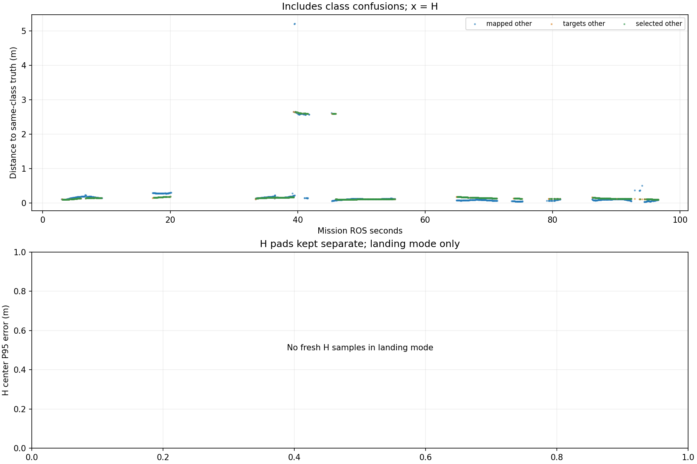

# Recorded target-center comparison

Phase-specific interpretation: [frozen SURVEY, interrupt and low reacquisition comparison](stages/PHASE_REPORT.md). The full-mission statistics below are not initial-high or low-only values.

Scope: 38_snake3
Gate: FAIL. Same-source route/speed matrix; see main report for paired comparisons and failures.

Run: /home/xhj/liftrace-worktrees/r2026-high-view-search/logs/route_speed_snake3_seed38_20261005_010738
World: /home/xhj/liftrace-worktrees/r2026-high-view-search/docs/verification/route_speed_20261004/snake3_seed38/field.world
Coordinate transform: FLU world XY equals mission XY; local Z ground=-0.22, only XY distances compared

Distances below are to same-class truth; inspect the class/instance table before interpreting localization.

| Scope | Stream | Class | Truth instance | N | Median/m | P95/m | RMSE/m | Max/m |
|---|---|---|---|---:|---:|---:|---:|---:|
| unique_valid_mission | hint_bbox | bridge | random_bridge | 11 | 0.1364 | 5.1592 | 2.6867 | 5.1682 |
| unique_valid_mission | hint_bbox | panzer | random_panzer | 2 | 2.6453 | 2.6596 | 2.6454 | 2.6612 |
| unique_valid_mission | hint_bbox | red_cross | random_red_cross | 4 | 0.1708 | 0.1737 | 0.1714 | 0.1741 |
| unique_valid_mission | hint_bbox | tent | random_tent | 8 | 0.1300 | 0.1515 | 0.1322 | 0.1540 |
| unique_valid_mission | hint_vision | bridge | random_bridge | 25 | 0.1517 | 0.1639 | 0.1519 | 0.1653 |
| unique_valid_mission | hint_vision | pillbox | random_pillbox | 2 | 0.1070 | 0.1070 | 0.1070 | 0.1070 |
| unique_valid_mission | hint_vision | red_cross | random_red_cross | 42 | 0.1560 | 0.1830 | 0.1587 | 0.1859 |
| unique_valid_mission | hint_vision | tent | random_tent | 22 | 0.1633 | 0.1683 | 0.1636 | 0.1696 |
| unique_valid_mission | mapped | bridge | random_bridge | 229 | 0.1095 | 0.1987 | 0.5046 | 5.2102 |
| unique_valid_mission | mapped | panzer | random_panzer | 37 | 2.5936 | 2.6469 | 2.5992 | 2.6481 |
| unique_valid_mission | mapped | pillbox | random_pillbox | 195 | 0.1211 | 0.1350 | 0.1193 | 0.1554 |
| unique_valid_mission | mapped | red_cross | random_red_cross | 356 | 0.1049 | 0.2911 | 0.1612 | 0.3049 |
| unique_valid_mission | mapped | tent | random_tent | 63 | 0.1682 | 0.2131 | 0.1790 | 0.2894 |
| unique_valid_mission | selected | bridge | random_bridge | 210 | 0.1356 | 0.1649 | 0.1388 | 0.1700 |
| unique_valid_mission | selected | panzer | random_panzer | 35 | 2.6033 | 2.6412 | 2.6079 | 2.6464 |
| unique_valid_mission | selected | pillbox | random_pillbox | 175 | 0.1143 | 0.1171 | 0.1130 | 0.1174 |
| unique_valid_mission | selected | red_cross | random_red_cross | 281 | 0.1522 | 0.1844 | 0.1518 | 0.1910 |
| unique_valid_mission | selected | tent | random_tent | 56 | 0.1637 | 0.1744 | 0.1656 | 0.1761 |
| unique_valid_mission | targets | bridge | random_bridge | 224 | 0.1347 | 0.1654 | 0.1383 | 0.1700 |
| unique_valid_mission | targets | panzer | random_panzer | 39 | 2.6033 | 2.6460 | 2.6091 | 2.6468 |
| unique_valid_mission | targets | pillbox | random_pillbox | 175 | 0.1143 | 0.1171 | 0.1130 | 0.1174 |
| unique_valid_mission | targets | red_cross | random_red_cross | 293 | 0.1522 | 0.1849 | 0.1517 | 0.1910 |
| unique_valid_mission | targets | tent | random_tent | 59 | 0.1635 | 0.1743 | 0.1651 | 0.1761 |
| fresh_unique_mission | hint_bbox | bridge | random_bridge | 11 | 0.1364 | 5.1592 | 2.6867 | 5.1682 |
| fresh_unique_mission | hint_bbox | panzer | random_panzer | 2 | 2.6453 | 2.6596 | 2.6454 | 2.6612 |
| fresh_unique_mission | hint_bbox | red_cross | random_red_cross | 4 | 0.1708 | 0.1737 | 0.1714 | 0.1741 |
| fresh_unique_mission | hint_bbox | tent | random_tent | 8 | 0.1300 | 0.1515 | 0.1322 | 0.1540 |
| fresh_unique_mission | hint_vision | bridge | random_bridge | 25 | 0.1517 | 0.1639 | 0.1519 | 0.1653 |
| fresh_unique_mission | hint_vision | pillbox | random_pillbox | 2 | 0.1070 | 0.1070 | 0.1070 | 0.1070 |
| fresh_unique_mission | hint_vision | red_cross | random_red_cross | 42 | 0.1560 | 0.1830 | 0.1587 | 0.1859 |
| fresh_unique_mission | hint_vision | tent | random_tent | 22 | 0.1633 | 0.1683 | 0.1636 | 0.1696 |
| fresh_unique_mission | mapped | bridge | random_bridge | 229 | 0.1095 | 0.1987 | 0.5046 | 5.2102 |
| fresh_unique_mission | mapped | panzer | random_panzer | 37 | 2.5936 | 2.6469 | 2.5992 | 2.6481 |
| fresh_unique_mission | mapped | pillbox | random_pillbox | 195 | 0.1211 | 0.1350 | 0.1193 | 0.1554 |
| fresh_unique_mission | mapped | red_cross | random_red_cross | 356 | 0.1049 | 0.2911 | 0.1612 | 0.3049 |
| fresh_unique_mission | mapped | tent | random_tent | 63 | 0.1682 | 0.2131 | 0.1790 | 0.2894 |
| fresh_unique_mission | selected | bridge | random_bridge | 210 | 0.1356 | 0.1649 | 0.1388 | 0.1700 |
| fresh_unique_mission | selected | panzer | random_panzer | 35 | 2.6033 | 2.6412 | 2.6079 | 2.6464 |
| fresh_unique_mission | selected | pillbox | random_pillbox | 175 | 0.1143 | 0.1171 | 0.1130 | 0.1174 |
| fresh_unique_mission | selected | red_cross | random_red_cross | 281 | 0.1522 | 0.1844 | 0.1518 | 0.1910 |
| fresh_unique_mission | selected | tent | random_tent | 56 | 0.1637 | 0.1744 | 0.1656 | 0.1761 |
| fresh_unique_mission | targets | bridge | random_bridge | 224 | 0.1347 | 0.1654 | 0.1383 | 0.1700 |
| fresh_unique_mission | targets | panzer | random_panzer | 39 | 2.6033 | 2.6460 | 2.6091 | 2.6468 |
| fresh_unique_mission | targets | pillbox | random_pillbox | 175 | 0.1143 | 0.1171 | 0.1130 | 0.1174 |
| fresh_unique_mission | targets | red_cross | random_red_cross | 293 | 0.1522 | 0.1849 | 0.1517 | 0.1910 |
| fresh_unique_mission | targets | tent | random_tent | 59 | 0.1635 | 0.1743 | 0.1651 | 0.1761 |
| fresh_nearest_class_agrees | hint_bbox | bridge | random_bridge | 8 | 0.1311 | 0.1507 | 0.1326 | 0.1557 |
| fresh_nearest_class_agrees | hint_bbox | red_cross | random_red_cross | 4 | 0.1708 | 0.1737 | 0.1714 | 0.1741 |
| fresh_nearest_class_agrees | hint_bbox | tent | random_tent | 8 | 0.1300 | 0.1515 | 0.1322 | 0.1540 |
| fresh_nearest_class_agrees | hint_vision | bridge | random_bridge | 25 | 0.1517 | 0.1639 | 0.1519 | 0.1653 |
| fresh_nearest_class_agrees | hint_vision | pillbox | random_pillbox | 2 | 0.1070 | 0.1070 | 0.1070 | 0.1070 |
| fresh_nearest_class_agrees | hint_vision | red_cross | random_red_cross | 42 | 0.1560 | 0.1830 | 0.1587 | 0.1859 |
| fresh_nearest_class_agrees | hint_vision | tent | random_tent | 22 | 0.1633 | 0.1683 | 0.1636 | 0.1696 |
| fresh_nearest_class_agrees | mapped | bridge | random_bridge | 227 | 0.1094 | 0.1962 | 0.1348 | 0.5123 |
| fresh_nearest_class_agrees | mapped | pillbox | random_pillbox | 195 | 0.1211 | 0.1350 | 0.1193 | 0.1554 |
| fresh_nearest_class_agrees | mapped | red_cross | random_red_cross | 356 | 0.1049 | 0.2911 | 0.1612 | 0.3049 |
| fresh_nearest_class_agrees | mapped | tent | random_tent | 63 | 0.1682 | 0.2131 | 0.1790 | 0.2894 |
| fresh_nearest_class_agrees | selected | bridge | random_bridge | 210 | 0.1356 | 0.1649 | 0.1388 | 0.1700 |
| fresh_nearest_class_agrees | selected | pillbox | random_pillbox | 175 | 0.1143 | 0.1171 | 0.1130 | 0.1174 |
| fresh_nearest_class_agrees | selected | red_cross | random_red_cross | 281 | 0.1522 | 0.1844 | 0.1518 | 0.1910 |
| fresh_nearest_class_agrees | selected | tent | random_tent | 56 | 0.1637 | 0.1744 | 0.1656 | 0.1761 |
| fresh_nearest_class_agrees | targets | bridge | random_bridge | 224 | 0.1347 | 0.1654 | 0.1383 | 0.1700 |
| fresh_nearest_class_agrees | targets | pillbox | random_pillbox | 175 | 0.1143 | 0.1171 | 0.1130 | 0.1174 |
| fresh_nearest_class_agrees | targets | red_cross | random_red_cross | 293 | 0.1522 | 0.1849 | 0.1517 | 0.1910 |
| fresh_nearest_class_agrees | targets | tent | random_tent | 59 | 0.1635 | 0.1743 | 0.1651 | 0.1761 |

## Nearest any-class instance versus predicted class

Fresh unique mapped/targets/selected; all unique mission hints. A large same-class distance can be a class error.

| Stream | Predicted | Nearest class | Nearest instance | N | Median nearest/m | Median same-class/m | Suspected confusion N |
|---|---|---|---|---:|---:|---:|---:|
| hint_bbox | bridge | bridge | random_bridge | 8 | 0.1311 | 0.1311 | 0 |
| hint_bbox | bridge | pillbox | random_pillbox | 3 | 0.0925 | 5.1501 | 3 |
| hint_bbox | panzer | pillbox | random_pillbox | 2 | 0.0995 | 2.6453 | 2 |
| hint_bbox | red_cross | red_cross | random_red_cross | 4 | 0.1708 | 0.1708 | 0 |
| hint_bbox | tent | tent | random_tent | 8 | 0.1300 | 0.1300 | 0 |
| hint_vision | bridge | bridge | random_bridge | 25 | 0.1517 | 0.1517 | 0 |
| hint_vision | pillbox | pillbox | random_pillbox | 2 | 0.1070 | 0.1070 | 0 |
| hint_vision | red_cross | red_cross | random_red_cross | 42 | 0.1560 | 0.1560 | 0 |
| hint_vision | tent | tent | random_tent | 22 | 0.1633 | 0.1633 | 0 |
| mapped | bridge | bridge | random_bridge | 227 | 0.1094 | 0.1094 | 0 |
| mapped | bridge | pillbox | random_pillbox | 2 | 0.1051 | 5.2056 | 2 |
| mapped | panzer | pillbox | random_pillbox | 37 | 0.1331 | 2.5936 | 37 |
| mapped | pillbox | pillbox | random_pillbox | 195 | 0.1211 | 0.1211 | 0 |
| mapped | red_cross | red_cross | random_red_cross | 356 | 0.1049 | 0.1049 | 0 |
| mapped | tent | tent | random_tent | 63 | 0.1682 | 0.1682 | 0 |
| selected | bridge | bridge | random_bridge | 210 | 0.1356 | 0.1356 | 0 |
| selected | panzer | pillbox | random_pillbox | 35 | 0.1224 | 2.6033 | 35 |
| selected | pillbox | pillbox | random_pillbox | 175 | 0.1143 | 0.1143 | 0 |
| selected | red_cross | red_cross | random_red_cross | 281 | 0.1522 | 0.1522 | 0 |
| selected | tent | tent | random_tent | 56 | 0.1637 | 0.1637 | 0 |
| targets | bridge | bridge | random_bridge | 224 | 0.1347 | 0.1347 | 0 |
| targets | panzer | pillbox | random_pillbox | 39 | 0.1224 | 2.6033 | 39 |
| targets | pillbox | pillbox | random_pillbox | 175 | 0.1143 | 0.1143 | 0 |
| targets | red_cross | red_cross | random_red_cross | 293 | 0.1522 | 0.1522 | 0 |
| targets | tent | tent | random_tent | 59 | 0.1635 | 0.1635 | 0 |

Missing bag topics: []

No rows is missing evidence, not zero error.

- Offline recorded map centers, not parcel impacts or physical release accuracy.
- Association is nearest same-class truth; not an independent instance recall evaluation.
- Same-class distance is not localization-only error: a wrong class may be near a different true instance.
- Nearest-any-instance association is diagnostic, not independently verified object identity.
- Suspected category confusion requires a different nearest class within the stated radius and a same-vs-any distance margin.
- Hint streams are reconstructed from high_view_full_events navigation_support, with explicitly supplied mission frame and projection plane.
- H start and landing pads are separate truth instances; a class/position error can change nearest association.
- World-to-evaluation transform is explicitly supplied, not estimated from the detections.
- Reported error is XY only. H dimensions do not change its center; no Z/size accuracy claim.
- Valid but old candidate publications are separate from fresh unique observations.
- TF lookup reuses bag_replay.TransformTree (latest past sample, max dynamic age 0.5s, no interpolation).
- Raw duplicates and invalid samples remain in CSV; errors aggregate only inside the mission interval.
- H branch-complete counters only show recorded pipeline completion, not proof of a detected H contour; raw detector output was not in this lightweight bag.

All samples including invalid, stale and duplicate publications: center_samples.csv.
Machine-readable provenance, truth and counts: center_summary.json.
